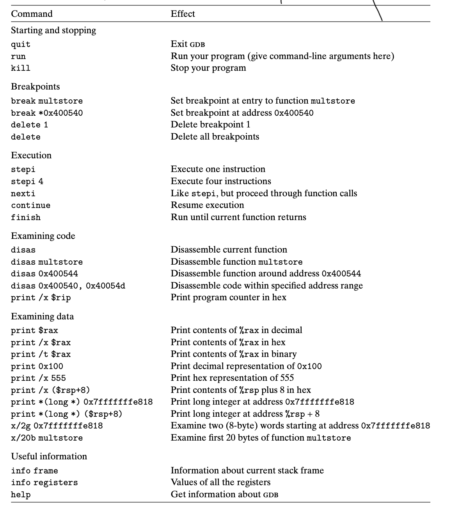

online url

https://shell-storm.org/x86doc/index.html


​	

# 使用GDB


如果你想在不使用 VSCode 的情况下使用 GDB 来调试 C 程序，你可以直接在命令行中使用 GDB。以下是一个基本的步骤指南：

### 1. 安装 GDB

确保你的系统中安装了 GDB。在大多数 Linux 发行版中，你可以通过包管理器安装它。例如，在 Ubuntu 中，可以使用以下命令：

```
sudo apt-get install gdb
```

### 2. 编译你的 C 程序

使用 `-g` 选项编译你的 C 程序以包含调试信息。例如，如果你的源文件是 `example.c`：

```
gcc -g example.c -o example
```

这将产生一个名为 `example` 的可执行文件。

### 3. 启动 GDB

用你的程序启动 GDB：

```
gdb ./example
```

### 4. 设置断点

在你想要程序暂停的代码行设置断点。假设你想在第 10 行暂停：

```
break 10
```

或者，你可以按函数名设置断点：

```
break myFunction
```

### 5. 开始调试

运行你的程序：

```
run
```

当程序执行到断点时会暂停。

### 6. 检查变量

当程序暂停时，你可以查看和修改变量。例如，查看名为 `myVariable` 的变量：

```
print myVariable
```

### 7. 控制执行

- 使用 `next` （或简写 `n`）执行下一行代码（不进入函数）。
- 使用 `step` （或简写 `s`）进入函数中。
- 使用 `continue` （或简写 `c`）继续执行，直到遇到下一个断点。

### 8. 查看和操作调用栈

使用 `backtrace` （或简写 `bt`）查看当前的调用栈。你还可以通过 `frame` 命令来切换不同的栈帧。

### 9. 退出 GDB

使用 `quit` 或简写 `q` 来退出 GDB。

### 额外的 GDB 功能

GDB 还有很多高级功能，比如条件断点、查看内存、查看汇编代码等。你可以通过阅读 GDB 的官方文档或在命令行输入 `help` 来了解这些功能。

记得，调试是一个逐步解决问题的过程，不同的程序和问题可能需要不同的调试方法。


# 命令们

vscode中所有前面都要加上-exec 执行

### 基本控制命令

- `run [args...]`: 运行程序，可带参数。
- `continue` (或 `c`): 从当前位置继续执行程序。
- `next` (或 `n`): 执行下一行代码，不进入函数内部。
- `step` (或 `s`): 执行下一行代码，如果是函数则进入函数内部。
- `finish`: 运行直到当前函数完成。
- `quit` (或 `q`): 退出 GDB。

### 断点相关命令

- `break [location]` (或 `b`): 在指定位置设置断点，位置可以是行号、函数名等。
- `info breakpoints`: 显示所有断点信息。
- `delete breakpoints [number]`: 删除指定编号的断点。
- `enable breakpoints [number]`: 启用指定编号的断点。
- `disable breakpoints [number]`: 禁用指定编号的断点。

### 查看和修改数据

- `print [expression]` (或 `p`): 显示表达式的值。
- `set variable [varname] = [value]`: 设置变量的值。
- `display [expression]`: 自动显示表达式的值。
- `undisplay [expression]`: 停止自动显示表达式的值。
- `watch [expression]`: 当表达式的值发生变化时中断执行。

### 调用栈操作

- `backtrace` (或 `bt`): 显示当前的调用栈。
- `frame [number]`: 切换到指定的栈帧。

### 检查内存

- `x/[n][format][unit] [address]`: 从指定内存地址开始检查内存内容。`n` 是要检查的单元数，`format` 是显示格式（如 `x` 表示十六进制），`unit` 是单元大小（如 `b` 表示字节）。

### 线程操作

- `info threads`: 显示所有线程。
- `thread [number]`: 切换到指定编号的线程。

### 其他有用命令

- `list [function/line]`: 显示源代码。可以指定函数名或行号。
- `info [class] [object]`: 提供有关程序的各种信息，如 `info locals` 显示局部变量。
- `set args [args...]`: 设置程序的运行参数。
- `help [command]`: 显示命令的帮助信息。


# 以为16进值显示变量

在 GDB 中以十六进制格式显示某个变量的值，可以使用 `print` 命令，并结合格式化输出。格式化输出允许你指定变量值的显示方式，包括十六进制格式。

假设你有一个变量名为 `myVariable`，你可以使用以下命令以十六进制格式显示它的值：

```bash

print /x myVariable


vscode 中 print/x中间不能有空格
-exec print/x myVariable
```

在这里，`/x` 是指定格式的修饰符，表示以十六进制格式输出。同样的，你还可以使用其他修饰符，例如：

- `/d`：十进制
- `/u`：无符号十进制
- `/o`：八进制
- `/t`：二进制
- `/a`：地址
- `/c`：字符
- `/f`：浮点数

因此，通过调整 `/x` 之后的修饰符，你可以控制 GDB 输出变量值的格式。


## 查看汇编代码

-exec disassemble

or

-exec dis


## breakpoint

Commands for operating on breakpoints (see 'help b' for shorthand.)

Syntax: breakpoint <subcommand> [<command-options>]

The following subcommands are supported:

      clear   -- Delete or disable breakpoints matching the specified source file and line.
      command -- Commands for adding, removing and listing LLDB commands executed when a breakpoint is hit.
      delete  -- Delete the specified breakpoint(s).  If no breakpoints are specified, delete them all.
      disable -- Disable the specified breakpoint(s) without deleting them.  If none are specified, disable all breakpoints.
      enable  -- Enable the specified disabled breakpoint(s). If no breakpoints are specified, enable all of them.
      list    -- List some or all breakpoints at configurable levels of detail.
      modify  -- Modify the options on a breakpoint or set of breakpoints in the executable.  If no breakpoint is specified, acts on the
                 last created breakpoint.  With the exception of -e, -d and -i, passing an empty argument clears the modification.
      name    -- Commands to manage breakpoint names
      read    -- Read and set the breakpoints previously saved to a file with "breakpoint write".
      set     -- Sets a breakpoint or set of breakpoints in the executable.
      write   -- Write the breakpoints listed to a file that can be read in with "breakpoint read".  If given no arguments, writes all
                 breakpoints.


## 其他

run:直接运行完

list i:显示第i行

lldb main

breakpoint set -f <文件名>:<行号>


# 通用寄存器

这些寄存器是x86和x86-64汇编语言中的通用寄存器和一些特殊用途的寄存器，它们在程序执行过程中用于不同的目的。以下是它们的主要作用：

通用寄存器：
1. `rax`：累加器寄存器，用于存储函数返回值、算术运算的结果等。
2. `rbx`：基址寄存器，通常用于存储内存地址或作为通用寄存器。
3. `rcx`：计数寄存器，通常用于循环计数或其他计数操作。
4. `rdx`：数据寄存器，通常用于存储运算的临时数据。
5. `rsi`：源索引寄存器，通常用于数据传输。
6. `rdi`：目标索引寄存器，通常用于数据传输。
7. `rbp`：基址指针寄存器，用于建立函数调用堆栈帧。
8. `rsp`：堆栈指针寄存器，用于跟踪当前堆栈的顶部位置。

特殊用途寄存器：
1. `eflags`：标志寄存器，用于存储和管理条件码（例如，标志位如零标志、进位标志等），控制程序的条件分支和状态。
2. `cs`：代码段寄存器，用于存储代码段的选择子，用于指向代码段描述符的位置。
3. `ss`：堆栈段寄存器，用于存储堆栈段的选择子，用于指向堆栈段描述符的位置。
4. `ds`、`es`、`fs`、`gs`：数据段寄存器，用于存储数据段的选择子，用于指向数据段描述符的位置。

这些寄存器在汇编语言中用于执行各种操作，包括数据传输、算术和逻辑运算、函数调用和返回、条件分支等。不同的寄存器有不同的用途和约定，汇编程序员需要了解如何正确使用它们来实现所需的功能。此外，标志寄存器 `eflags` 用于存储和处理条件标志，控制程序的条件性操作，例如分支和循环。

# GDB调试实际例子

调试前需要添加-g 调试信息


#### 开始调试

```
gdb file
```


#### 查看code

```
list	 				 ; 会一直往下看 重新开始 list 1
list lineNumber;
l			 				 ;


```

#### 设置断点

```
break 10
```


#### 显示汇编语言

```bash
disas
```


```bash
 list:
 列出指定的函数或行。
如果没有参数，则在前一个列表之后或周围再列出十行。
"list - "列出前一个十行列表前的十行。
一个参数指定一行，该行周围会列出十行。
两个参数（中间用逗号隔开）指定要列出的起始行和终止行。
可以通过以下方式指定线条：
LINENUM，列出当前文件中该行的相关内容、
FILE:LINENUM，以列出该文件中的该行、
FUNCTION，列出该函数的开头部分、
FILE:FUNCTION，以区分同名静态函数。
*ADDRESS，列出包含该地址的行。
如果有两个参数，其中一个为空，则代表距离
另一个参数。
认情况下，如果只给出一个位置，则显示十行。
可以使用 "设置列表大小 "更改该值，当前值为 可使用 "show listsize "显示。
```


#### info

```bash
info line ;			显示当前行

```


```
info address -- Describe where symbol SYM is stored.
info all-registers -- List of all registers and their contents, for selected stack frame.
info args -- All argument variables of current stack frame or those matching REGEXPs.
info auto-load -- Print current status of auto-loaded files.
info auxv -- Display the inferior's auxiliary vector.
info bookmarks -- Status of user-settable bookmarks.
info breakpoints, info b -- Status of specified breakpoints (all user-settable breakpoints if no argument).
info checkpoints -- IDs of currently known checkpoints.
info classes -- All Objective-C classes, or those matching REGEXP.
info common -- Print out the values contained in a Fortran COMMON block.
info connections -- Target connections in use.
info copying -- Conditions for redistributing copies of GDB.
info dcache -- Print information on the dcache performance.
info display -- Expressions to display when program stops, with code numbers.
info exceptions -- List all Ada exception names.
info extensions -- All filename extensions associated with a source language.
info files -- Names of targets and files being debugged.
info float -- Print the status of the floating point unit.
info frame, info f -- All about the selected stack frame.
info frame-filter -- List all registered Python frame-filters.
info functions -- All function names or those matching REGEXPs.
info guile, info gu -- Prefix command for Guile info displays.
info inferiors -- Print a list of inferiors being managed.
info line -- Core addresses of the code for a source line.
info locals -- All local variables of current stack frame or those matching REGEXPs.
info macro -- Show the definition of MACRO, and it's source location.
info macros -- Show the definitions of all macros at LINESPEC, or the current source location.
info mem -- Memory region attributes.
info module -- Print information about modules.
info modules -- All module names, or those matching REGEXP.
info os -- Show OS data ARG.
info pretty-printer -- GDB command to list all registered pretty-printers.
info probes -- Show available static probes.
```


```bash
info address -- 描述 SYM 符号的存储位置。
info all-registers -- 选定堆栈帧的所有寄存器及其内容列表。
info args -- 当前堆栈帧的所有参数变量或与 REGEXP 匹配的参数变量。
info auto-load -- 打印自动加载文件的当前状态。
info auxv -- 显示下级的辅助向量。
info bookmarks -- 用户可设置书签的状态。
info breakpoints, info b -- 指定断点的状态（如果没有参数，则显示所有用户可设置的断点）。
info checkpoints -- 当前已知检查点的 ID。
info classes -- 所有 Objective-C 类，或与 REGEXP 匹配的类。
info common -- 打印出 Fortran COMMON 块中包含的值。
info connections -- 正在使用的目标连接。
info copying -- 重新分发 GDB 副本的条件。
info dcache -- 打印关于缓存性能的信息。
info display -- 程序停止时要显示的表达式，以及代码编号。
info exceptionions -- 列出所有 Ada 异常名称。
info extensions -- 与源语言相关的所有文件名扩展名。
info files -- 正在调试的目标和文件名。
info float -- 打印浮点运算单元的状态。
info frame, info f -- 所选堆栈帧的所有信息。
info frame-filter -- 列出所有注册的 Python 框架过滤器。
info functions -- 所有函数名或与 REGEXP 匹配的函数名。
info guile, info gu -- Guile 信息显示的前缀命令。
info inferiors -- 打印正在管理的下级列表。
info line -- 源代码行的核心地址。
info locals -- 当前堆栈帧的所有局部变量或与 REGEXP 匹配的局部变量。
info macro -- 显示 MACRO 的定义及其源代码位置。
info macros -- 显示在 LINESPEC 或当前源位置的所有宏的定义。
info mem -- 内存区域属性。
info module -- 打印模块信息。
info modules -- 所有模块名称，或与 REGEXP 匹配的模块名称。
info os -- 显示操作系统数据 ARG。


```


```asm
   0x0000555555555167 <+0>:	endbr64
   0x000055555555516b <+4>:	push   %rbp											;rbp入栈 当前函数的基地址堆栈顶部
   0x000055555555516c <+5>:	mov    %rsp,%rbp								;%rsp 的当前值复制到基址指针寄存器 %rbp
   0x000055555555516f <+8>:	sub    $0x10,%rsp           		;%rsp 的值减去 0x10（16个字节）。
   0x0000555555555173 <+12>:	movl   $0x4,-0xc(%rbp)				;0x4 移动到相对于基址指针 %rbp 的偏移地址 -0xc 处的位置。
=> 0x000055555555517a <+19>:	movl   $0x37,-0x8(%rbp)				;0x37 移动到相对于基址指针 %rbp 的偏移地址 -0x8 处的位置。
   0x0000555555555181 <+26>:	mov    -0x8(%rbp),%edx				;将相对于基址指针 %rbp 的偏移地址 -0x8 处的值加载到寄存器 %edx 中。
   0x0000555555555184 <+29>:	mov    -0xc(%rbp),%eax				;%rbp 的偏移地址 -0xc 处的值加载到32位通用寄存器 %eax 中。
   0x0000555555555187 <+32>:	mov    %edx,%esi							;寄存器 %edx 的值复制到寄存器 %esi 中。 add 函数参数
   0x0000555555555189 <+34>:	mov    %eax,%edi							;寄存器 %eax 的值复制到寄存器 %edi 中。	add函数参数
   0x000055555555518b <+36>:	call   0x555555555149 <add>		;调用一个名为 add 的函数，其地址被硬编码为 0x555555555149。
   0x0000555555555190 <+41>:	mov    %eax,-0x4(%rbp)      	;函数的返回值放到  %rbp 的偏移地址 -0x4 处的位置。

   0x0000555555555193 <+44>:	mov    -0x4(%rbp),%eax
   0x0000555555555196 <+47>:	mov    %eax,%esi							  ;传递参数
   0x0000555555555198 <+49>:	lea    0xe65(%rip),%rax        # 0x555555556004 计算指针的位置 rip+偏移量0xe65 赋值给rax
   0x000055555555519f <+56>:	mov    %rax,%rdi								;printf format "c= %d"
   0x00005555555551a2 <+59>:	mov    $0x0,%eax
   0x00005555555551a7 <+64>:	call   0x555555555050 <printf@plt>
   0x00005555555551ac <+69>:	lea    0xe59(%rip),%rax        # 0x55555555600c
   0x00005555555551b3 <+76>:	mov    %rax,%rdi
   0x00005555555551b6 <+79>:	mov    $0x0,%eax
   0x00005555555551bb <+84>:	call   0x555555555050 <printf@plt>
```


```asm
=> 0x0000555555555149 <+0>:	endbr64
   0x000055555555514d <+4>:	push   %rbp
   0x000055555555514e <+5>:	mov    %rsp,%rbp
   0x0000555555555151 <+8>:	mov    %edi,-0x14(%rbp)
   0x0000555555555154 <+11>:	mov    %esi,-0x18(%rbp)
   0x0000555555555157 <+14>:	mov    -0x14(%rbp),%edx
   0x000055555555515a <+17>:	mov    -0x18(%rbp),%eax
   0x000055555555515d <+20>:	add    %edx,%eax
   0x000055555555515f <+22>:	mov    %eax,-0x4(%rbp)
   0x0000555555555162 <+25>:	mov    -0x4(%rbp),%eax
   0x0000555555555165 <+28>:	pop    %rbp
   0x0000555555555166 <+29>:	ret                         //pop rip 下一个代码执行的指针
```

a

```asm
rax            0x4                 4
rbx            0x0                 0
rcx            0x555555557dc0      93824992247232
rdx            0x37                55
rsi            0x37                55
rdi            0x4                 4
rbp            0x7fffffffe160      0x7fffffffe160
rsp            0x7fffffffe150      0x7fffffffe150
r8             0x7ffff7e1af10      140737352150800
r9             0x7ffff7fc9040      140737353912384
r10            0x7ffff7fc3908      140737353890056
r11            0x7ffff7fde660      140737353999968
r12            0x7fffffffe278      140737488347768
r13            0x555555555167      93824992235879
r14            0x555555557dc0      93824992247232
r15            0x7ffff7ffd040      140737354125376
rip            0x55555555518b      0x55555555518b <main+36>
eflags         0x206               [ PF IF ]
cs             0x33                51
ss             0x2b                43
ds             0x0                 0
es             0x0                 0
fs             0x0                 0
gs             0x0                 0
```

```asm
 call函数之前
 rax            0x4                 4
rbx            0x0                 0
rcx            0x555555557dc0      93824992247232
rdx            0x37                55
rsi            0x37                55
rdi            0x4                 4
rbp            0x7fffffffe160      0x7fffffffe160
rsp            0x7fffffffe150      0x7fffffffe150
r8             0x7ffff7e1af10      140737352150800
r9             0x7ffff7fc9040      140737353912384
r10            0x7ffff7fc3908      140737353890056
r11            0x7ffff7fde660      140737353999968
r12            0x7fffffffe278      140737488347768
r13            0x555555555167      93824992235879
r14            0x555555557dc0      93824992247232
r15            0x7ffff7ffd040      140737354125376
rip            0x55555555518b      0x55555555518b <main+36>
eflags         0x206               [ PF IF ]
cs             0x33                51
ss             0x2b                43
ds             0x0                 0
es             0x0                 0
fs             0x0                 0


```


