# 网络层：数据平面


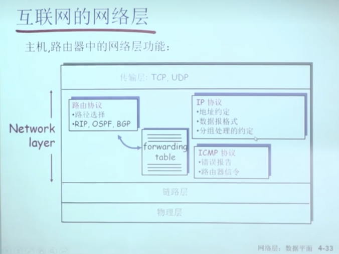


traceRoute的工作原理是，发送一个数据包，然后设置数据包的TTL 为1 第一次路由器收到了，会TTL-1 然后向源主机发送一个ICMP

的数据包,告诉数据包在哪里被丢弃

ping ：形成一个ICMP的分组，向目标主机发送，如果对象运行了ICMP的协议，回回应一个ICMP的response，主机就知道对方是活跃的

ICMP:主要作用是报告一个错误，


## 	路由器的组成

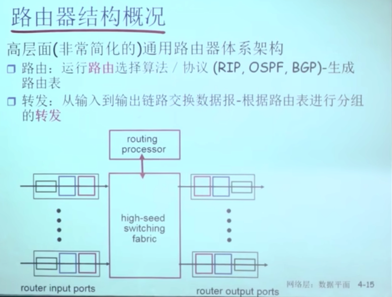


从输入转入输出，通过交换机（路由协议的实体/软件），处理器算出来的路由表给所有输入端的网络实体

**转发：**收到一个数据，接封装，然后根据陆游选择协议，在封装，在响应的网络里面发出去，传统的方式是通过Ip的形式

**路由：**从源头规划到目的的功能 叫路由

转发是数据平面的功能

路由器是控制平面的功能

## **数据平面两种方式：**

**1.传统方式** 

​	对到来的数据匹配路由表，然后对数据进行转发，路由表怎么来：算出来的 

**2.SDN方式（网络操作系统控制出来的）**

​	对到来的分组，做多个字断做多种方式的匹配，匹配完可以做多个动作 修改字断，或者修改数据，或者多个端口发出去，或者丢弃

​	网络操作系统通过南向接口，交给分组设备，分组设备装载上去，然后对到来的数据做响应的动作


**控制平面算路由表，然后数据平面（或路由器）的IP协议根据 路由表进行转发**		


 **延迟差：**

打出多组数据包，之间的延迟差，第一个10ms延迟 第二个100ms延迟 ，延迟差别90ms

**链路端口:物理层:**

​	电路信号(电信号)转换成数字信号(10111133 ) 转完成之后交给数据链路层

**数据链路层：**

​	判断帧头和帧尾，检查有没有出错， 目标mac和网卡的mac 是不是一样的，然后决定要不要收，收完之后把数据部分(Ip的分组)取出来，交给网络层实体，网络实体在链路当中排队，排到对头，按照路由表，找到合适的端口 把它发出去

​	如果是发出去 就加帧头和帧尾


  

**Version：版本号**

```
4个比特，ipv4 是0b0100
```

**head len:**以为4个字节为基数

```
固定的头部20个字节 + 选项的长度 
Ip的头部是20个字节，所以 headlen 最少是5，如果有opotion 会大于5
```
**type of server:**

```
分组的类型，现在不用，设计的时候，路由器对高优先级的分组做处理，现在不用，因为宽带都包月
```
**length:**
```
数据报的总长度
```
**identidier:**

```
标识字段(16位)唯一地标识主机发送的每一份数据报。通常每发送一份报文它的值就会加1。
```

​	**Flags:** 标志位

```
分片/重组使用
```

**Fragmented Offset:**

```
片的偏移量
```


有些网络的最大MTU(最大 传输单元)  max translation unit 不一样，比如FDDi最大可以传输4000个字节，但是以太网最大传输1500字节，所以要在路由器中切片，传送到下一个路由器 或者 目标主机中 在组合起来是，


**Time To Live：ttl**

```
每过一个路由器减1，
等于0的时候，丢弃掉 路由器丢弃后会告诉源主机 ICMP的错误报告
```

**Upper layer/Protocol**

```
标记本层的协议交给什么协议，tcp or udp，就是一个标识，就像传输层给进程一样，标识是端口
```

**header checksum**

```
头部的校验和 数据部分不检验 
```

**source address**

```
源ip
```
**destionnation address**

```
源ip
```

**opotion**

```
有一种option ，会把经过的节点的ip 附加到option 选项，这样目标会知道所有经过的ip
```


```c++
#include <linux/ip.h>
struct iphdr {
    #if defined(__LITTLE_ENDIAN_BITFIELD)
         __u8    ihl:4,version:4;
    #elif defined (__BIG_ENDIAN_BITFIELD)
         __u8    version:4,ihl:4;
    #else
    #error “Please fix <asm/byteorder.h>”
    #endif
         __u8    tos;
         __be16 -tot_len;
         __be16 -id;
         __be16 -frag_off;
         __u8    ttl;
         __u8    protocol;
         __be16 -check;
         __be32 -saddr;
         __be32 -daddr;
};

```


**iphdr->version：**

​			版本(4位)，目前的协议版本号是4,因此IP有时也称作IPv4。
**iphdr->ihl：**

​			首部长度(4位):首部长度指的是IP层头部占32 bit字的数目(也就是IP层头部包含多少个4字节 — 32位),包括任何选项。由于它是一个			4比特字段, 因此首部最长为60个字节。普通IP数据报(没有任何选择项)字段的值是5 <==> 5 * 32 / 8 = 5 * 4 = 20 Bytes。
**iphdr->tos(type of servers)：**

​				服务类型字段(8位): 服务类型(TOS)字段包括一个3 bit的优先权子字段(现在已被忽略)，4 bit的TOS子字段和1 bit未用位但必须置					0。4 bit的TOS子字段分别代表:最小时延、最大吞吐量、最高可靠性和最小费用。4 bit中只能设置其中1 bit。如果所有4 bit均					为0,那么就意味着是一般服务。
**iphdr->tot_len：**

​	总长度字段(16位)是指整个IP数据报的长度,以字节为单位。利用首部长度字段和总长度字段,就可以知道 IP数据报中数据内容的起始位置和长度。由于该字段长16比特,所以IP数据报最长可达65535字节总长度字段是IP首部中必要的内容,因为一些数据链路(如以太网)需要填充一些数据以达到最小长度。尽管以太网的最小帧长为46字节,但是IP数据可能会更短。如果没有总长度字段,那么IP层就不知道46字节中有多少是IP数据报的内容。
**iphdr->id：**

​				标识字段(16位)唯一地标识主机发送的每一份数据报。通常每发送一份报文它的值就会加1。
**iphdr->frag_off (16位)**：

​						frag_off域的低13位 — 分段偏移(Fragment offset)域指明了该分段在当前数据报中的什么位置上。除了一个数据报的最后一个分段以外，其他所有的分段(分片)必须是8字节的倍数。这是8字节是基本分段单位。由于该域有13个位，所以，每个数据报最多有8192个分段。因此，最大的数据报长度为65,536字节，比 iphdr->tot_len域还要大1。
**iphdr->frag_off的高3位：**(1) 比特0是保留的，必须为0；(2) 比特1是“更多分片”(MF — More Fragment)标志。除了最后一片外，其他每个组成数据报的片都要把该比特置1。(3) 比特2是“不分片”(DF — Don’t Fragment)标志,如果将这一比特置1，IP将不对数据报进行分片,这时如果有需要进行分片的数据报到来，会丢弃此数据报并发送一个ICMP差错报文给起始端。

**iphdr->ttl：**

​				TTL(time-to-live) — 8位，生存时间字段设置了数据报可以经过的最多路由器数。它指定了数据报的生存时间。TTL的初始值由源主机设置(通常为32或64),一旦经过一个处理它的路由器,它的值就减去1。当该字段的值为0时,数据报就被丢弃,并发送ICMP报文通知源主机。TTL(Time to live)域是一个用于限制分组生存期的计数器。这里的计数时间单位为秒，因此最大的生存期为255秒。在每一跳上该计数器必须被递减，而且，当数据报在一台路由器上排队时间较长时，该计数器必须被多倍递减。在实践中，它只是跳计数器，当它递减到0的时候，分组被丢弃，路由器给源主机发送一个警告分组。此项特性可以避免数据报长时间地逗留在网络中，有时候当路由表被破坏之后，这种事情是有可能发生的。
**iphdr->protocol**：

​					协议字段(8位): 根据它可以识别是哪个协议向IP传送数据。当网络层组装完成一个完整的数据报之后，它需要知道该如何对它进行处理。协议(Protocol)域指明了该将它交给哪个传输进程。TCP是一种可能，但是UDP或者其他的协议也是可能的。
**iphdr->check：**

​			首部检验和字段(16位)是根据IP首部计算的检验和码。它不对首部后面的数据进行计算。 ICMP、IGMP、UDP和TCP在它们各自的首部中均含有同时覆盖首部和数据检验和码。为了计算一份数据报的IP检验和,首先把检验和字段置为0。然后,对首部中每个16 bit进行二进制反码求和(整个首部看成是由一串16 bit的字组成),结果存在检验和字段中。当收到一份IP数据报后,同样对首部中每个16 bit进行二进制反码的求和。由于接收方在计算过程中包含了发送方存在首部中的检验和,因此,如果首部在传输过程中没有发生任何差错,那么接收方计算的结果应该为全1。如果结果不是全1(即检验和错误),那么IP就丢弃收到的数据报。但是不生成差错报文,由上层去发现丢失的数据报并进行重传。
**iphdr->saddr：**

​		32位源IP地址
**iphdr->daddr：**

​		32位目的IP地址


MTU：传输最大字节

#  IP分片

  

有些网络的最大MTU(最大 传输单元)  max translation unit 不一样，比如FDDi最大可以传输4000个字节，但是以太网最大传输1500字节，所以要在路由器中切片，传送到目标主机中 在组合起来是，不会在路由器重组，要不然路由器的负担很重


目标主机收到任何一个分组，定时器到时之后，缺了某个分组，会全部扔掉，没用了

最后一个分组**Flags** 为0，为1的时候，说明还有

offset 基数是8个字节


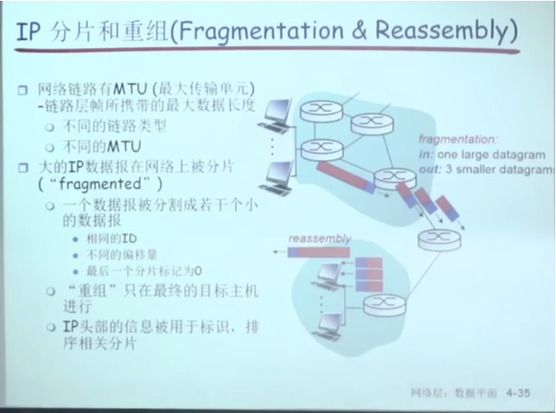


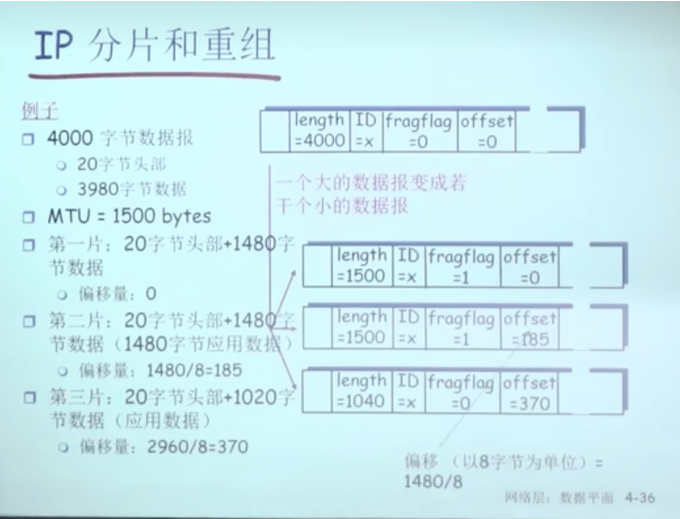


# IP编址:引论

**Ip 是标识一个设备 或者主机，网络某个点的标识**

路由器最少有两个网络，要不然路由器没有办法在各个物理网络之间做分组转发

主机有可能有很多地址，插了多个网卡，配了多个Ip，在一个物理网卡虚拟出很多个Ip地址

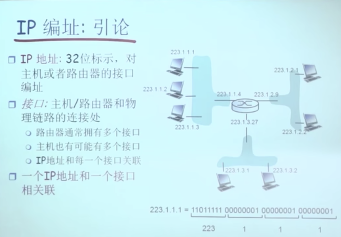


## 子网 subnet

**子网需要具备两个条件**

1.这些ip的前缀是一样的。

2.子网的收 发 不需要借助路由器(不需要找路径)，只需要交换机


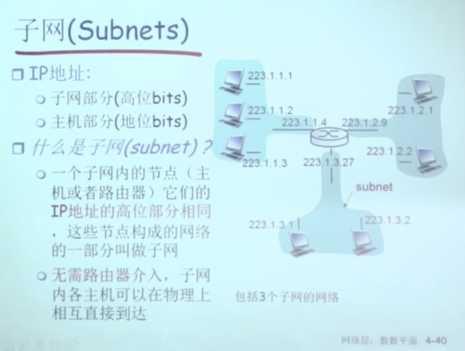


**6个子网，不知道怎么算出来的**

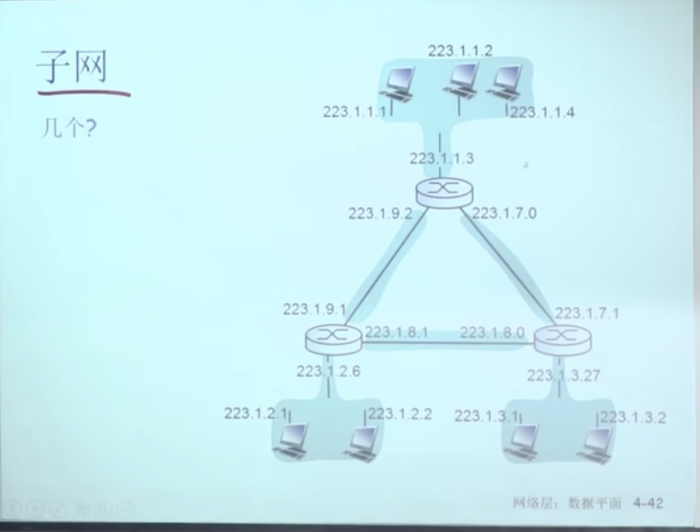


ip地址的分类

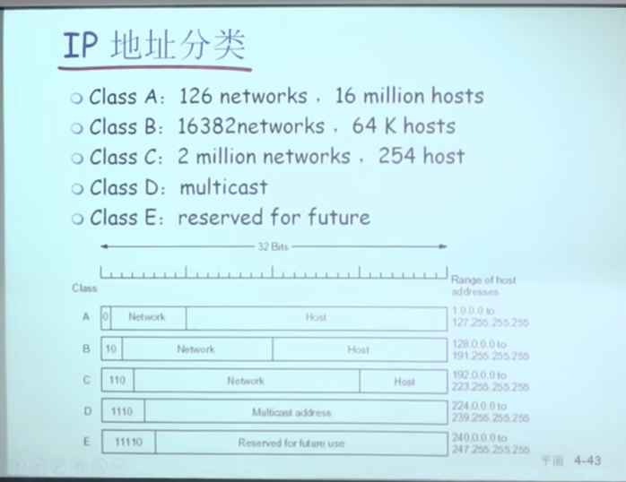


##### ABC类地址为单播地址：

**A类地址** 最高地址为0 （第一个字节为0 -127）

​	第一个字节为网络号码，并且第一个字节的第一个位为0，网络号的7个位不能未全0 或者全1，其他3个字节24个字节为主机号

​	A类的地址的个数为：  2^7 - 2（因为不能为全0 或者全1） A类地址有 126个网络，2^24 -2个主机

**B类地址** 最高位为10	（第一个字节为128-191）

​	最高位为10 后面的14个字节为网络号 再后面的14个字节为主机号

​	2^14 -2 个网络号，2^16 -2个主机主机号

**C类地址** 最高位为110			（第一个字节为192-223）

​	最高位为110，前面3个字节代表网络号，最后一个字节代表主机号

​	一共有 2^22 -2 个网络号，2^8 -2个主机号	254个主机号


##### D类为主播地址：

**D类地址** 最高位为1110		多播地址（第一个字节为224-239）

**E类地址** 最高位为11110  还没使用预留的		（第一个字节为240-247）


单播  我到你

广播 我到所有（在局域网内部）


**路由的时候，是以子网为单位向外面散播子网可达信息的 最后一条是由交换机完成的**


**A B  C类地址做路由表的时候 很方便，**

**A类地址只要比较第一个字节**

**B类地址 只要比较前面2个字节**

**C类地址 比较前面三个字节**


‘


## 特殊IP

子网 全为0   本网络  192.168.1.45/24 ,,,,,,,前3个字节 为， 0.0.0.24 本网络

子网 和 本主机全为 0.0.0.0													本网络的本主机 		(b) 


A类地址的特殊地址:10.0.0.0  to 10.255.255.255  掩码为 255.0.0.0

B类地址的特殊特殊地址:172.16.0.0  to 172.16.255.255 掩码为 255.255.0.0

C类地址的特殊地址


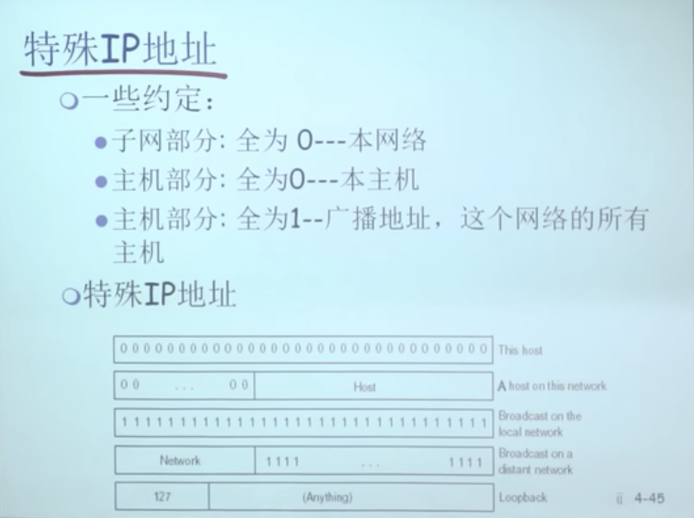


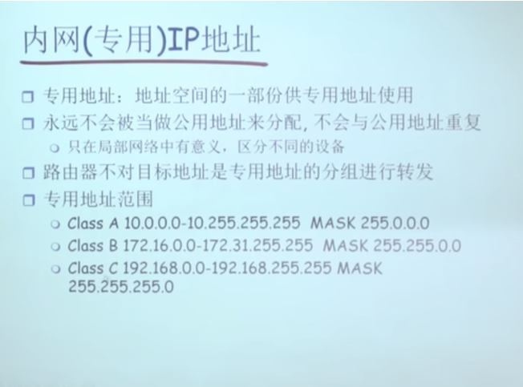

   

**地址编码：** 

ip地址分为网络号和主机号

192.168.59.3/24  	一个IP本来有32位 减去前面的24位   前24位当作网络号，最后8位当主机号


路由器看到Ip的时候。

如果是A类地址,	只比较第一个字节，第一个字节是网络号   0 -126

如果是B类地址，只比较前二个字节，前两个字节是网络号 128-191

如果是C类地址，只比较前三个个字节，前三个字节是网络号  192-223


## 特殊约定

**回环地址** `127.0.0.1`   0b111_1111  127开始的地址，不会经过路由器，会用网卡返回主机(内核的IP栈规定)

**A类地址:**10.0.0.0 - 10.255.255.255  				**掩码:**255.0.0.0

**B类地址:**172.16.0.0 -172.31.255.255 				**掩码:**255.255.0.0

**C类地址:**192.168.0.0 - 192.168.255.255 		**掩码:**255.255.255.0


如果一个IP地址以私有IP地址范围**（如192.168.x.x、10.x.x.x、172.16.x.x 到 172.31.x.x）**开头，并且具有与特定内部网络对应的子网掩码，通常可以将其视为属于内网。这是因为这些私有IP地址范围是为内部网络和局域网使用而保留的，不在全球互联网上全局路由。这些IP地址通常不会被用于公共互联网上的设备。

特殊IP地址范围（如192.168.x.x、10.x.x.x、172.16.x.x 到 172.31.x.x）通常是用于内部网络和局域网的私有IP地址范围。在内部网络中使用这些IP地址时，确实需要提前设置相关的网络段或子网掩码。

以下是配置这些私有IP地址的一般步骤：

1. **选择IP地址段**: 确定要在内部网络中使用的IP地址段。例如，您可以选择在192.168.1.0 到 192.168.1.255 范围内使用IP地址。这个范围中的IP地址将被分配给内部设备。
2. **配置子网掩码**: 为了将IP地址划分成子网，您需要配置适当的子网掩码。子网掩码确定了哪些位用于网络标识，哪些位用于主机标识。例如，如果您选择使用255.255.255.0的子网掩码，那么前24位用于网络标识，后8位用于主机标识。
3. **分配IP地址**: 将内部设备配置为使用所选IP地址段和子网掩码。每个设备都应分配一个唯一的IP地址，以便在内部网络中进行通信。
4. **路由设置**: 如果您有多个子网，您需要配置路由器以允许子网之间的通信。路由器应该了解每个子网的存在并知道如何正确地路由数据包。 
5. **网络安全**: 在内部网络中设置适当的网络安全措施，以确保只有授权的设备可以访问网络资源。
6. **DNS设置**: 配置DNS服务器或使用公共DNS服务器，以便内部设备可以解析域名并访问互联网。

这些是一般情况下配置私有IP地址范围的步骤。网络管理员通常负责执行这些配置任务，以确保内部网络的顺畅运行。提前设置相关的网络段和子网掩码是确保网络设备可以正确通信的关键步骤。


## 如何找网络号

**来了一个Ip如何找网络号:**

- ip和子网掩码做与运算


**当路由器收到192.168.50.3/24 说明子网掩饰码为255.255.255.0**

然后与子网掩码做与运算

```
192.168.50.3      (11000000.10101000.00110010.00000011)
AND
255.255.255.0     (11111111.11111111.11111111.00000000)
------------------------------------------------------
192.168.50.0      (11000000.10101000.00110010.00000000)

```

得出结果是192.168.50.0

网段是 192.168.50. 主机号是0 


## 转发表和转发算法


| 目标子网/Destination | 子网掩码/mask | 下一跳 | 接口 |
| -------------------- | ------------- | ------ | ---- |
| 192.168.50.0         | 255.255.255.0 | IPx    | Lan1 |
|                      |               |        |      |
|                      |               |        |      |

**( IP add ) & (MASK ) = 目标子网**

192.168.50.5  & 255.255.255.0 = 192.168.50.0  在路由表中


路由器收到我的Ip之后，比如192.168.50.66 先和子网掩码（255.255.255.0）做与运算 得到192.168.50.0 

说明路由器中有相应的子网，说明为路由器的局域网


当我向一个目标ip发请求的时候，路由器会查看 自己的路由表

**1.如果目标在本地的网络中** (同一个网段)

​		比如Ip 192.268.50.4 向 192.268.50.666,路由器会路由表中 会与掩码255.255.255.0 做与运算得到网络号

192.268.50.0 该网段在陆游表中，路由器直接把请求给局域网的该设备

这意味着目标IP地址属于与路由器直接连接的本地网络，也就是在同一个子网中。在这种情况下，路由器将直接将数据包传递到目标设备，因为它们在同一个局域网中，无需经过路由。

**2.如果目标在已经知道的子网中 **(同一个网络中的不同网段)

比如Ip 192.268.50.4 向 192.268.50.666,路由器会路由表中 会与掩码255.255.255.0 做与运算得到网络号
192.268.50.0 该网段在陆游表中，路由器直接把请求给局域网的该设备

这说明目标IP地址位于路由器已知的子网之一中，但不一定与路由器直接连接。路由器将使用已知的路由信息将数据包传送到正确的子网，并且可能需要经过多跳路由。

**3.目标不在路由表中**： (外部的IP)
如果目标IP地址没有匹配的路由表项，路由器将尝试将请求发送到默认网关或下一跳路由器。默认网关通常用于处理不属于本地网络或已知子网的目标。这表示目标IP地址不属于已知的局域网或已知的子网。在这种情况下，路由器可能会采取默认路由（如果配置了默认网关），或者如果没有默认路由，则可能会将数据包丢弃或发送目标不可达的错误消息，指示目标不在局域网内。

**4.路由器不具备路由该请求的能力**：(没联网)

如果路由器没有适当的路由信息来处理请求，或者如果请求的目标不可达，路由器可能会将请求丢弃或发送一个错误消息给发送方。这表示路由器不具备路由特定请求的能力，可能是因为网络配置问题或路由器不具备到达目标的路由信息。在这种情况下，路由器可能会将数据包丢弃或发送错误消息，指示路由不可用。


## 默认网关

当目标Ip本局域网匹配不到想要的表项的时候，会把数据从默认网关发出去

192.168.50.3 向8.8.8.8 发请求的时候。8.8.8.8 在陆游表中找不打子网，就说明非本局域网，就把数据传给默认网关。应该ISP设置的吧


## 如何获取一个IP

一个设备如何获取一个Ip地址，管理管理员配置好

需要配置四个信息

ip 子网 默认网关 LocNameServer


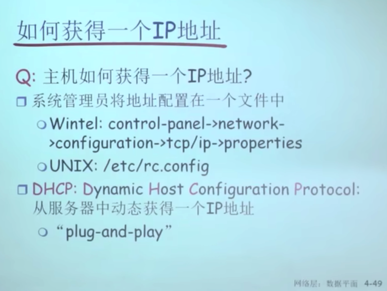


## DHCP协议 从DHCP自动获得


DHCP 运行在Udp 67 号端口,会有Ip池 192.168.2.2 to  192.168.2.254

DHCP的服务器是68端口 客户端是67端口

1. **IP地址**：DHCP服务器会分配一个可用的IP地址给您的设备，以便设备可以在局域网中进行通信。
2. **子网掩码**：子网掩码确定了局域网中哪些IP地址位于同一子网内。它通常与分配的IP地址一起提供。
3. **网关地址**：网关地址是用于将数据包路由到其他网络或互联网的路由器的IP地址。它允许您的设备与其他网络通信。
4. **DNS服务器地址**：DNS服务器地址用于将域名解析为IP地址。它允许您通过域名访问互联网上的资源。


在局域网广播 地址为255.255.255.255 


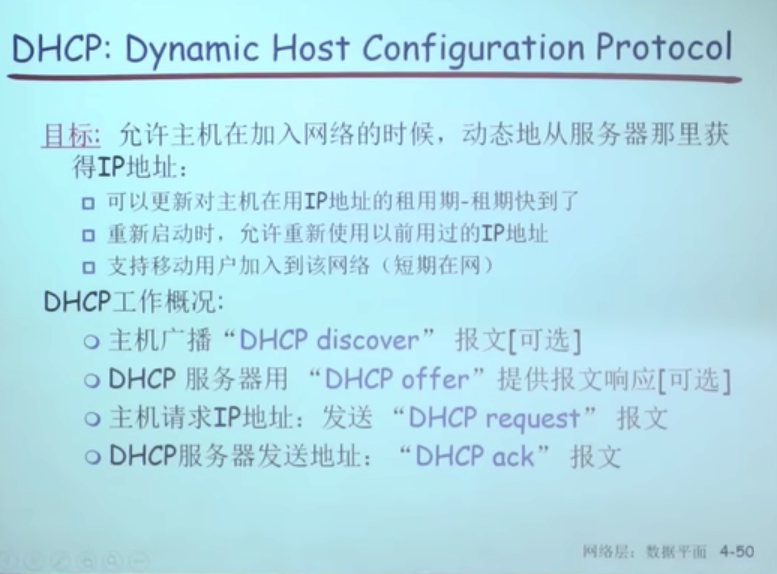


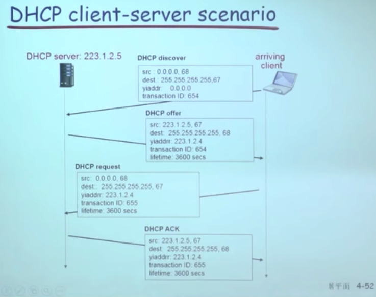


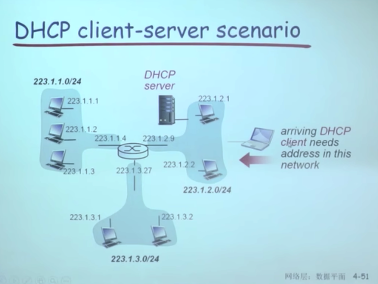


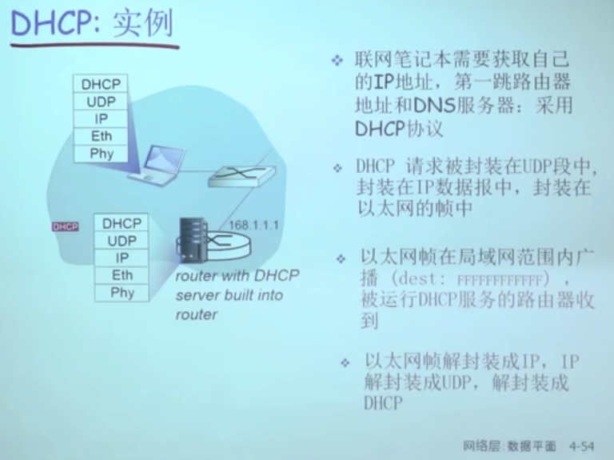

```c
#include <stdio.h>
#include <stdlib.h>
#include <string.h>
#include <unistd.h>
#include <sys/socket.h>
#include <netinet/in.h>
#include <arpa/inet.h>

#define DHCP_SERVER_PORT 67
#define DHCP_CLIENT_PORT 68
#define DHCP_MESSAGE_SIZE 548 // DHCP消息的最大长度

int main() {
    int sockfd;
    struct sockaddr_in server_addr;
    char dhcp_message[DHCP_MESSAGE_SIZE];

    // 创建UDP套接字
    if ((sockfd = socket(AF_INET, SOCK_DGRAM, 0)) < 0) {
        perror("Socket creation failed");
        exit(EXIT_FAILURE);
    }

    // 设置广播选项 要设置socket 属性
    int broadcast = 1;
    if (setsockopt(sockfd, SOL_SOCKET, SO_BROADCAST, &broadcast, sizeof(broadcast)) < 0) {
        perror("Set socket option failed");
        exit(EXIT_FAILURE);
    }

    // 初始化服务器地址
    memset(&server_addr, 0, sizeof(server_addr));
    server_addr.sin_family = AF_INET;
    server_addr.sin_port = htons(DHCP_SERVER_PORT);
  																									//在局域网广播 地址为255.255.255.255 
    server_addr.sin_addr.s_addr = INADDR_BROADCAST; // 广播地址
  
  

    // 构建DHCP请求消息
    memset(dhcp_message, 0, sizeof(dhcp_message));
    // 添加DHCP请求内容到dhcp_message，具体内容需要根据DHCP协议来构建

    // 发送DHCP请求
    if (sendto(sockfd, dhcp_message, sizeof(dhcp_message), 0, (struct sockaddr *)&server_addr, sizeof(server_addr)) < 0) {
        perror("Sendto failed");
        exit(EXIT_FAILURE);
    }

    printf("DHCP request sent.\n");

    close(sockfd);

    return 0;
}

```


**是不是我用255.255.255.255的地址 还是会被路由器取掩码 获取网络号**

是的，当您使用IP地址255.255.255.255时，路由器仍然会根据子网掩码来确定网络号。IP地址255.255.255.255是广播地址，用于向特定网络中的所有设备发送广播消息。

然而，子网掩码会确定哪些设备属于同一网络。如果一个设备的IP地址与广播地址相同，但子网掩码不匹配，那么路由器仍然会将其视为不同的网络。

例如，假设路由器的IP地址是192.168.1.1，子网掩码是255.255.255.0。如果您向IP地址192.168.2.255（广播地址）发送广播消息，路由器会根据子网掩码来判断这个IP地址不在同一个网络上，因此不会传播广播消息到192.168.2.255所在的网络。

子网掩码的作用是将IP地址分成不同的网络段，它决定了哪些IP地址在同一网络上，哪些不在。广播地址通常是用来向同一网络中的所有设备发送消息，但仍受到子网掩码的限制。

**路由器收到的数据包 源地址和目标地址 都会先用掩码操作吗**

对于路由器收到的数据包，通常会执行与子网掩码的操作，以确定数据包的源地址和目标地址所属的网络。

1. **源地址匹配**：路由器会将数据包的源地址与其子网掩码进行AND操作，以确定数据包来自哪个子网。这是为了确定数据包是否来自本地网络。
2. **目标地址匹配**：路由器会将数据包的目标地址与其子网掩码进行AND操作，以确定数据包的目标地址属于哪个子网。这是为了确定数据包是否需要在本地网络内交付，还是需要进行路由。

根据匹配的结果，路由器可以执行以下操作：

- 如果源地址匹配本地网络并且目标地址匹配本地网络，则数据包可能只需要在本地网络内交付，而不需要进行路由。
- 如果源地址匹配本地网络，但目标地址不匹配本地网络，则数据包可能需要进行路由，以便传送到其他网络。
- 如果源地址不匹配本地网络，路由器通常会将数据包路由到正确的网络。

子网掩码的作用是将IP地址划分为不同的网络段，并帮助路由器确定数据包应该如何处理，包括是否需要路由以及如何路由。这有助于路由器正确地将数据包发送到目标网络或设备。

  

**如果 源地址与掩码 AND操作之后，路由表中有子网网段，然后就用主机号查找arp表是吗**

是的，当路由器收到数据包后，首先会将源地址与子网掩码进行AND操作，以确定数据包的源子网。然后，路由器会查找其路由表，以确定如何处理数据包，即将其传递到目标网络或设备。

一旦路由器确定了数据包的目标网络，它会查找ARP表（地址解析协议表）来找到目标网络中的设备的MAC地址。ARP表包含了IP地址到MAC地址的映射信息，以便路由器能够将数据包正确发送到目标设备。

路由器会根据目标IP地址查找ARP表，以获取与目标IP地址对应的目标设备的MAC地址。一旦找到了目标设备的MAC地址，路由器就可以构建数据包并将其发送到目标设备，以便进行最终的交付。

总之，路由器在处理数据包时，会执行源地址与掩码的AND操作，查找路由表来确定下一跳路由器或目标网络，然后查找ARP表来获取目标设备的MAC地址，以便进行正确的数据包传递。这些步骤有助于确保数据包正确到达目标设备。


**一种掩码 就是一个网段吧**

是的，掩码通常用来定义一个网络段。子网掩码是一个32位的二进制数，用于与IP地址进行按位与运算，以确定IP地址属于哪个网络段。掩码中的1位表示网络位，0位表示主机位。通过改变子网掩码中1和0的分布，可以划分不同大小的网络段。不同的子网掩码将IP地址分成不同的网络和主机部分，从而形成不同的网络段。


## 机构如何获取Ip

大机构:20位网络号/12位主机好  

有9个机构


分配Ip的机构

ICANN 管理Ip地址和域名 :看需求和手续

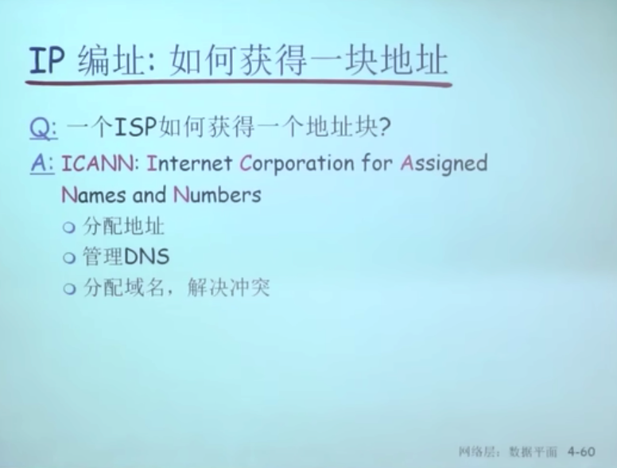


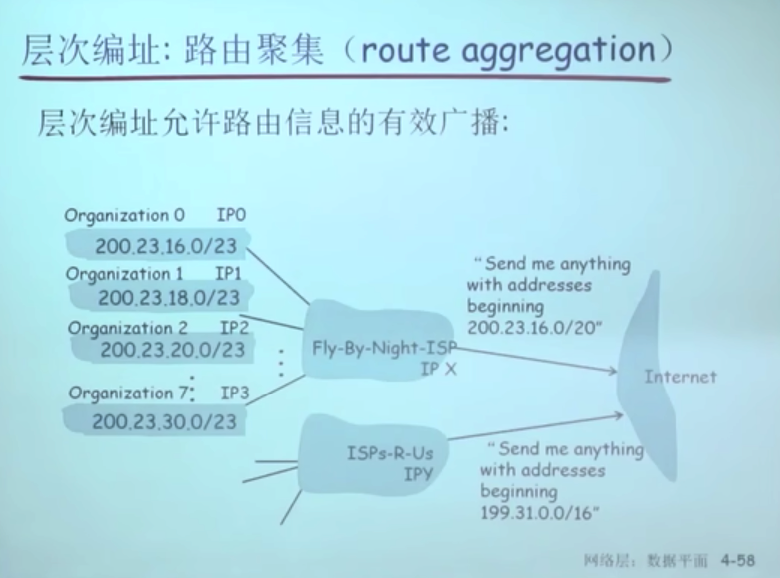


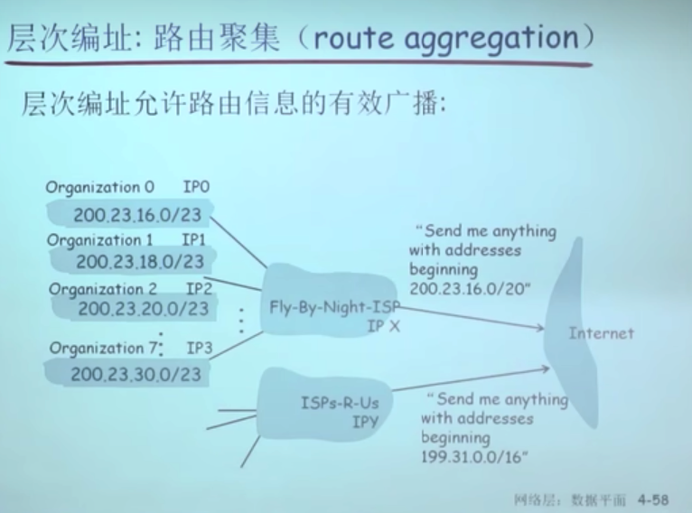


## 内网地址 NAT

**Network Add Translation**


**内网地址不能在互联网中路由，出去的时候，全部 换成有效的公网地址，从而可以回转回来**

**数据包发出去的时候 内网Ip和端口 换成公网地址和相应的端口  (并且把映射关系记录下来)**

**数据包回来的时候 公网地址 和端口 换成内网地址 和响应的端口(按照之前的映射关系)**


NAT违反了端到端的信息 端口在TCP/UDP层 在传输层 **‼️并且checksum 会变 需要路由器重新计算**

网络层修改了上一层的端口信息，让分组在传送的过程中得到一些改变


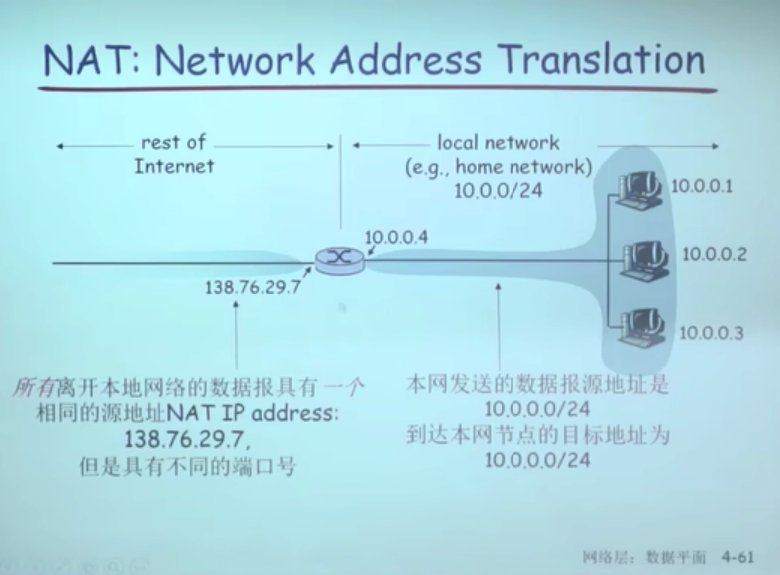

**应该就属于 路由器中的端口转发，固定端口 （UPNP/IGD 协议）**

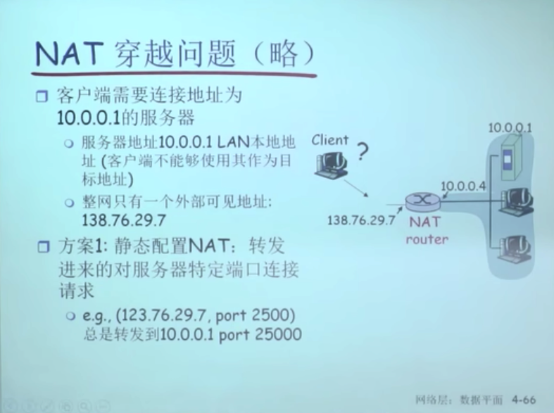


# IPV6

分组太大会ICMP会


# IPV6结构


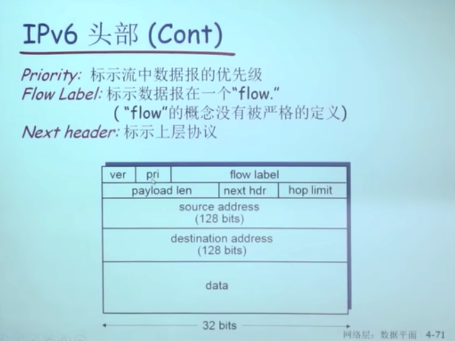


1. **版本（Version）：** IPv6头部的第一个字段是4位的版本字段，表示协议版本号，其值为6。
2. **流量标签（Traffic Class）：** 8位的流量标签字段用于标识数据包的优先级和服务质量要求。
3. **流量类（Flow Label）：** 20位的流量类字段用于标识数据流的特性，如多播、任播等。
4. **有效载荷长度（Payload Length）：** 16位的有效载荷长度字段指示了IPv6头部之后的有效载荷（通常是上层协议的数据部分）的长度。
5. **下一个头部（Next Header）：** 8位的下一个头部字段用于标识紧随IPv6头部的下一个头部类型，类似于IPv4中的协议字段TCP/UDP。
6. **跳数限制（Hop Limit）：** 8位的跳数限制字段类似于IPv4中的TTL字段，用于限制数据包在网络中传播的跳数。
7. **源地址（Source Address）：** 128位的源IPv6地址字段，表示数据包的源地址。
8. **目标地址（Destination Address）：** 128位的目标IPv6地址字段，表示数据包的目标地址。

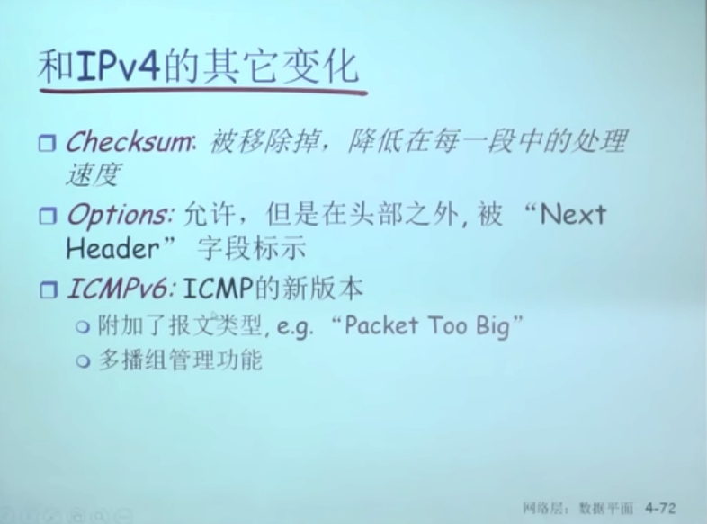


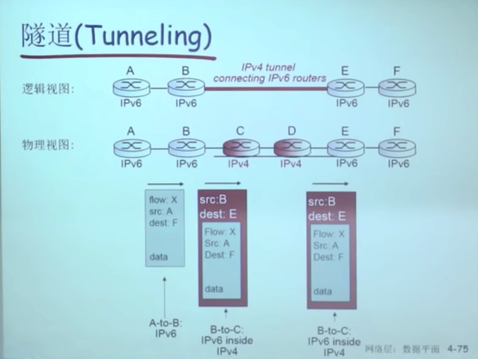

示范代码

```c
#include <stdio.h>
#include <stdlib.h>
#include <string.h>
#include <unistd.h>
#include <arpa/inet.h>
#include <sys/types.h>
#include <sys/socket.h>

int main() {
    int sockfd;
    struct sockaddr_in6 server_addr;
    char server_ip[] = "2001:0db8:85a3:0000:0000:8a2e:0370:7334"; // 示例IPv6地址
    int server_port = 80; // 示例端口号

    // 创建IPv6套接字
    sockfd = socket(AF_INET6, SOCK_STREAM, 0);
    if (sockfd == -1) {
        perror("socket");
        exit(EXIT_FAILURE);
    }

    // 初始化服务器地址结构
    memset(&server_addr, 0, sizeof(server_addr));
    server_addr.sin6_family = AF_INET6;
    server_addr.sin6_port = htons(server_port);
    inet_pton(AF_INET6, server_ip, &server_addr.sin6_addr);

    // 建立连接
    if (connect(sockfd, (struct sockaddr*)&server_addr, sizeof(server_addr)) == -1) {
        perror("connect");
        close(sockfd);
        exit(EXIT_FAILURE);
    }

    // 发送数据
    const char* request = "GET / HTTP/1.1\r\nHost: [your_server]\r\n\r\n"; // 修改为实际请求内容
    if (send(sockfd, request, strlen(request), 0) == -1) {
        perror("send");
        close(sockfd);
        exit(EXIT_FAILURE);
    }

    // 接收和处理服务器的响应
    char buffer[1024];
    ssize_t bytes_received;
    while ((bytes_received = recv(sockfd, buffer, sizeof(buffer), 0)) > 0) {
        // 处理接收到的数据，这里简化为打印到控制台
        fwrite(buffer, 1, bytes_received, stdout);
    }

    // 检查接收错误
    if (bytes_received == -1) {
        perror("recv");
    }

    // 关闭套接字
    close(sockfd);

    return 0;
}

```

