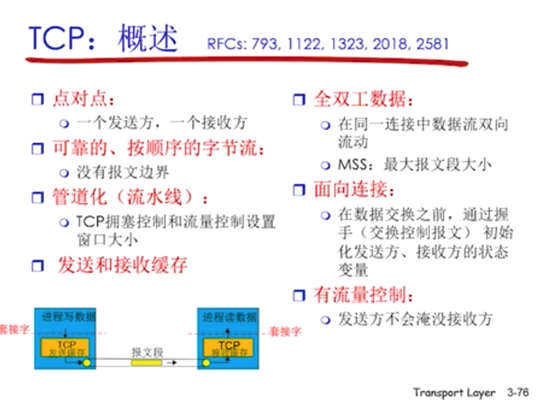
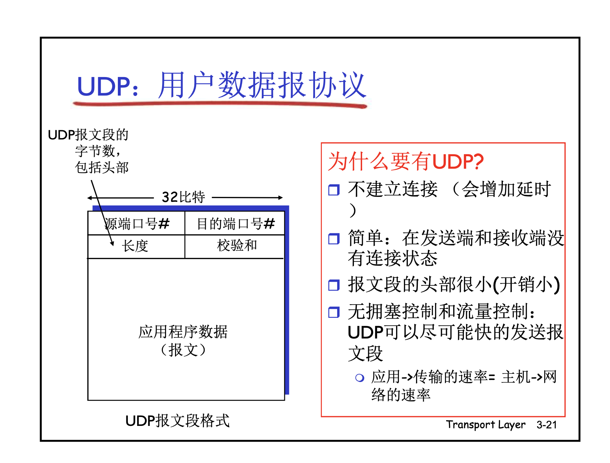
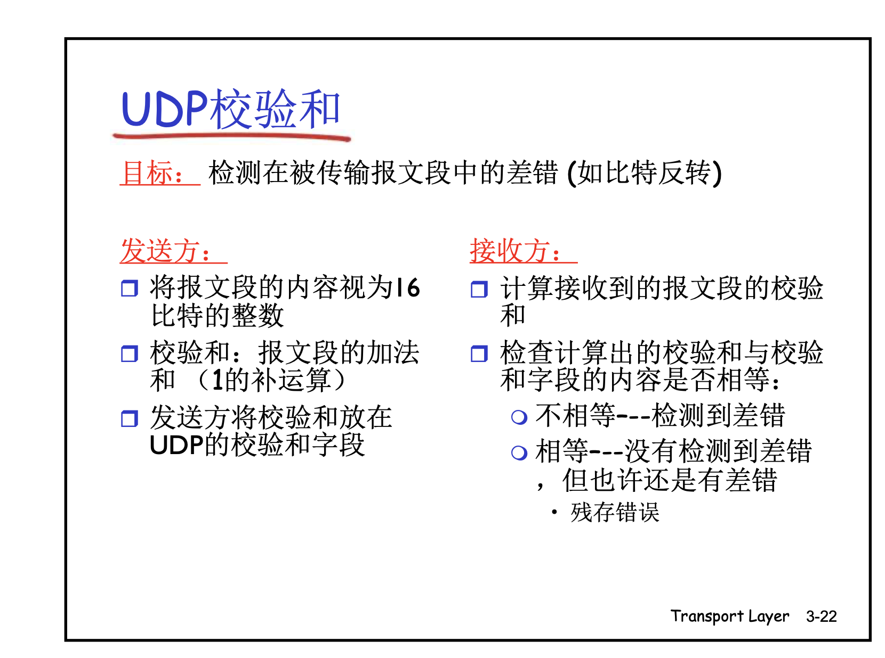
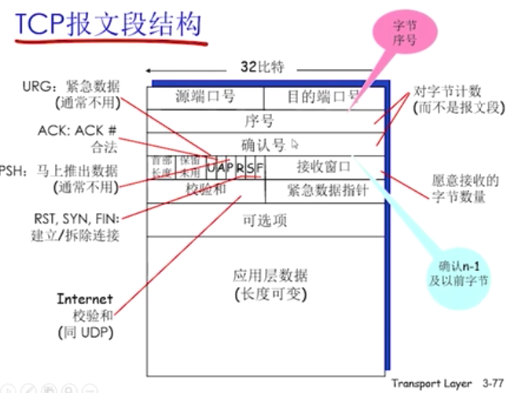
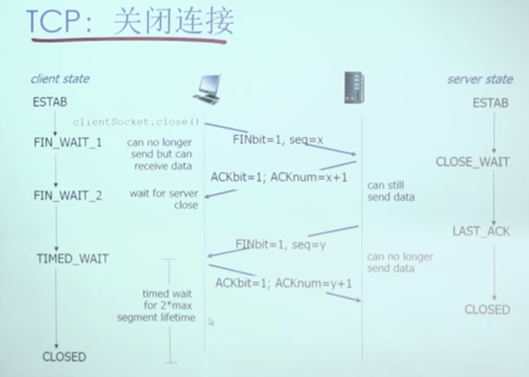

# 传输层

传输层 是操作系统提供的功能 

传输层的功能:

-	多路复用/解复用 
-	可靠数据传输
-	流量控制
-	拥塞控制

如果从应用层拿到的报文比较长，会分成段, 形成本层的数据，对方的传输层拿到数据后，会去除 头部，只要数据

IP 提供的服务 是不可靠的，靠传输层 加强


为:TCP 提供的服务

- 段结构 

- 可靠数据传输 

- 流量控制 

- 连接管理


😊 可靠的、保序的传输: TCP

- 多路复用、解复用
- 拥塞控制
- 流量控制
- 建立连接

😊  不可靠、不保序的传输:UDP

- 多路复用、解复用
- 没有为尽力而为的IP服务添加更 多的其它额外服


### TCP 概述




## 端口号

端口号区分进程

socket记录进程


## UDP 应用层要往传输层交的数据

1. 数据本身

2. socket （绑定自己的端口和Ip）
3. 对方Ip和对方的端口

UDP的socket 只是绑定了自己的ip和端口，

UDP的接收端根据端口 找到响应的socket 然后找到进程


## UDP的数据报






把数据分成16比特，然后以此累加，有进位的放在后面,最后的值取反，该工作由操作系统，或者网卡来操作


## TCP的数据报

​    

原主机 TCP层的工作： 

等待应用层的数据（data），计算好的ckecksum，封装成package ，并且留一个副本，交给下一层，并且等待目标主机的响应，响应位ACK（发送的数据可以使用）。如果响应位NAK（对方收到的数据没有通过校验），再把副本给目标发送一遍 


有问题 ack 或者 NAK 出错 ， 需要加一个序号


流水线的方式：2.0

元主机 		-》 数据包0		目标数据  返回ack0  OK

元主机 		-》 数据包1		目标数据 返回ack0	-〉说明数据包1没有收到还是谢谢上一个数据包


超时重传机制 : 3.0

元主机 有可能发送1的时候，在路上被路由器丢掉了，所以要引起一个新的机制，设置1个时间（一个来回多一点的时间 或者用正太分布+2个标准差 计算时间），如果对方没有响应，就再发一次。目标主机收到了两个一样的，也没关系，丢掉一个就可以了


不可以不停的发送数据，中间的路由器会受不了，会在中途丢弃包

流水线协议:会退N部协议

根据发送缓冲区(内存中的一个区域) 选择不同的协议，发送方发送完毕之后把数据放缓冲区，以便于检错重发，超时 重新发送

如果原主机 sw=1 ，目标主机 rw=1 	S-W 协议 	stop and wait 	   协议

如果Sw>1			目标主机rw=1	接收放只能顺序接收		GBN协议 	go balck n			 协议    

如果Sw>1			目标主机rw >1	接收放只能乱序列接收（可以累计确认）		SR协议	selective repeat	选择性重发		   协议


发送窗口，是发送缓冲区的一个范围，子集，发送缓冲区的一个范围 ，已经发送出去，但是没有得到对方确认的一些数据 

发送窗口 <=发送缓冲区


以太网最大传输是1500字节 数据部分

MSS是最大字节 

MSS +TCP头部 +IP的头部

TCP最大1460


## TCP 的结构



​		

结构

```
原端口/16字节 目标端口/16字节
序号：
	序号 [Stream index: 1276]					握手的时候约定好 各自不同的偏移量										（该次TCP的应用层数据 在所有应该传递数据的偏移量）
确认号：
	确认号 。有可能是序号的开始 ，确认1 说明1已经收到，希望传达2
	确认好 555 说明554之前的已经收到了，希望从555开始传递给我，并且ACK的为要set为1 才有效 
	

首部长度：
	首部的总长度 之后就是数据部分了
	
接口窗口：
	等于某个值的话 说明可以接受这个大小的数据

校验和：
	和udp的作用是一样的，检查数据在传递过程
紧急指针：
	一般不用
可选项：
	一般呢不用

```

#### TCP发送的数据包 的结构

TCP（传输控制协议）是一种面向连接的协议，用于在计算机之间可靠地传输数据。TCP数据包的结构通常包括以下部分：

1. 源端口号（Source Port）：这是发送端计算机的端口号，用于标识发送数据的进程或应用程序。
2. 目标端口号（Destination Port）：这是接收端计算机的端口号，用于指示接收数据的进程或应用程序。
3. 序列号（Sequence Number）：这是TCP数据流中的字节序列号，用于对数据包进行排序和重组。它用于确保数据包按正确的顺序到达，并检测丢失的数据包。
4. 确认号（Acknowledgment Number）：这是接收端发送给发送端的确认号，表示已成功接收并准备好接收的下一个字节的序列号。确认号用于实现可靠性。
5. 数据偏移（Data Offset）：这个字段指示TCP头部的长度，以字节为单位。它通常占4位，因此TCP头部的长度为4个32位字。（整个发送数据数据的偏移量）
6. 控制标志（Control Flags）：TCP头部包含一些控制标志，用于指示数据包的特性。一些常见的标志包括：
   - SYN（同步）：用于建立连接。
   - ACK（确认）：用于确认已经收到的数据。
   - PSH（推送）：表示接收端应尽快将数据交给应用层。
   - FIN（结束）：表示发送端已经完成数据发送。
   - RST（复位）：表示连接重置。
7. 窗口大小（Window Size）：这个字段指示发送端可以接收的数据量，以字节为单位。它用于流量控制，确保发送端不会发送太多数据，导致接收端不堪重负。
8. 校验和（Checksum）：用于检测数据包在传输过程中是否发生了错误。TCP使用校验和来验证数据的完整性。
9. 紧急指针（Urgent Pointer）：当URG标志设置时，这个字段指示紧急数据的位置。通常情况下，它用于通知接收端处理紧急数据。
10. 选项（Options）：TCP头部可以包含一些可选的选项，例如最大段大小（Maximum Segment Size，MSS）等。
11. 数据（Data）：这是实际传输的数据，可以是应用层的有效载荷。
12. TCP头部的长度可以根据选项的存在而变化，但通常情况下，它的长度为20个字节（不包括选项），在有选项的情况下可能更长。这种TCP数据包结构确保了数据在传输过程中的可靠性和有序性。

#### TCP 接收端返回什么数据

当一台计算机成功接收到一个TCP数据包后，通常会向发送端返回一个确认（ACK）数据包，该确认数据包会包含以下信息：

1. 确认号（Acknowledgment Number）：这个字段的值将设置为已成功接收的数据的下一个字节的序列号。这表示接收端期望接收的下一个数据的序列号。
2. 窗口大小（Window Size）：接收端通常会指示其当前的可用接收窗口大小，以告知发送端可以继续发送多少数据，以便进行流量控制。
3. 控制标志（Control Flags）：通常，ACK标志会设置为指示这是一个确认数据包。
4. 可选字段：有时候，确认数据包可能包含其他可选字段，但这取决于具体的TCP实现和配置。

在标准情况下，确认数据包不会包含数据长度字段，也不会加1。它主要用于确认接收并指示下一个期望接收的数据的序列号。数据长度通常不会在确认数据包中明确指定，而是根据已经接收的数据的序列号和当前期望的序列号来计算。

如果您有特定的用例或网络环境，需要特殊的确认数据包结构，那么这可能取决于您的网络配置和应用程序需求，但一般情况下，TCP的确认数据包不包含数据长度字段加1。


## TCP 控制流量


通过接收方有一个接收窗口 resiver window，表示能接受的字节大小，发送方知道接收方可以接受多少

接收缓冲区 如果整个缓冲区有4096 已经缓冲了2000个字节，这个时候接收窗口要 设置为4098 -2000个字节，表示自己最多只能接受这么多


###  TCP建立连接 三次握手的的细节

让双方知道已经建立连接，

初始化自身的资源和一些变量

并且告诉对方自己的初始序号，而且分别要对方确认


1. 客户端请求握手

   ```
   SYN位为1 		请求连接 ，									SYN
   seq=x 		 要从x字节开始传   				 :sequence number
   ```

2. 服务器回复

   ```
	SYN位为1				 确认连接 							SYN
   seq=y 			 		要从y字节开始传				 :sequence number
   ACK number=x+1  服务器已经确认x+1字节  	acknowledgment number   
   ACK位为1			 ；确认位									确认
   ```

3. 客户端确认

	   ```
	ACK number=y+1	；确认服务器传过来的 初始序号  确认自己的
   ACK 位为1					；确认位
   ```
   

 

### TCP关闭连接 四次挥手


1. 客户端请求关闭

   ```
   FIN为 1
   seq  = x 序列当前为x
   ```

2. 服务器回复

   ```
   ACK num=x+1
   ACK 位为1
   ```

3. 服务器请求关闭

   ```
   FIN为 1
   seq  = y 序列当前为y
   ```

4. 客户端回复 

   ```
   ACK number=y+1	；确认服务器传过来的 初始序号
   ACK 位为1					；确认位
   ```

 




## 挥手的一些细节

```

```

##### TCP 关闭连接 直接Close当前socket就行吗

TCP连接的关闭过程涉及到双方协商和释放资源的步骤，直接关闭当前socket并不是一个良好的做法。正确的TCP连接关闭过程通常包括以下步骤：

1. **应用层关闭连接**：首先，应用程序在发送和接收完数据后应当通知TCP栈关闭连接。这可以通过应用程序调用关闭socket的API来完成，例如在C语言中是`close()`函数。
2. **发送TCP FIN报文**：当应用程序关闭socket时，TCP栈将发送一个TCP FIN（Finish）报文给对方，表示数据已经发送完毕，希望关闭连接。
3. **等待对方确认**：一旦发送了TCP FIN报文，本端的TCP栈会进入等待状态，等待对方的确认。在这个状态下，本端可以继续接收数据，但不能再发送新的数据。
4. **对方发送ACK报文**：对方收到FIN报文后，会发送一个确认（ACK）报文，表示接收到了关闭请求。
5. **对方发送FIN报文**：对方也可能在确认后发送自己的FIN报文，表示它也希望关闭连接。这个过程中，对方的TCP栈也会进入等待状态。
6. **本端发送ACK报文**：本端收到对方的FIN报文后，会发送一个确认（ACK）报文，表示接收到了对方的关闭请求。
7. **连接彻底关闭**：一旦双方都发送了FIN报文并确认，连接就会彻底关闭。此后，连接将不再接收或发送数据。

关闭连接的过程是TCP连接的一部分，它确保了双方在关闭连接时能够完成数据的传输，并释放相关的资源。直接关闭当前socket可能会导致连接未能正确关闭，可能会丢失尚未传输的数据，并且可能在操作系统中留下未释放的资源，这可能会导致问题。因此，建议在应用层正确关闭TCP连接，而不是仅仅关闭socket。


##### 写一个示范代码，并且注释一下

以下是一个示范代码，演示了如何在C语言中使用socket API来建立TCP连接并正确关闭连接。代码中包含了注释以帮助理解每个步骤：

```
cCopy code
#include <stdio.h>
#include <stdlib.h>
#include <string.h>
#include <unistd.h>
#include <arpa/inet.h>

int main() {
    // 创建套接字
    int sockfd = socket(AF_INET, SOCK_STREAM, 0);
    if (sockfd == -1) {
        perror("socket");
        exit(EXIT_FAILURE);
    }

    // 设置服务器地址和端口
    struct sockaddr_in server_addr;
    memset(&server_addr, 0, sizeof(server_addr));
    server_addr.sin_family = AF_INET;
    server_addr.sin_addr.s_addr = inet_addr("服务器IP地址");
    server_addr.sin_port = htons(服务器端口号);

    // 连接到服务器
    if (connect(sockfd, (struct sockaddr*)&server_addr, sizeof(server_addr)) == -1) {
        perror("connect");
        close(sockfd);
        exit(EXIT_FAILURE);
    }

    // 发送数据
    const char *message = "Hello, Server!";
    if (send(sockfd, message, strlen(message), 0) == -1) {
        perror("send");
        close(sockfd);
        exit(EXIT_FAILURE);
    }

    // 接收数据
    char buffer[1024];
    memset(buffer, 0, sizeof(buffer));
    int bytes_received = recv(sockfd, buffer, sizeof(buffer), 0);
    if (bytes_received == -1) {
        perror("recv");
        close(sockfd);
        exit(EXIT_FAILURE);
    }

    printf("服务器响应：%s\n", buffer);

    // 关闭连接
    if (close(sockfd) == -1) {
        perror("close");
        exit(EXIT_FAILURE);
    }

    return 0;
}
```

请注意，上述代码中的"服务器IP地址"和"服务器端口号"应分别替换为实际的服务器地址和端口号。这段代码首先创建一个套接字，然后连接到服务器，发送数据，接收服务器的响应，并最终关闭连接。通过这种方式，您可以正确地建立和关闭TCP连接。


##### 当closesocket的时候 客户端才会发FIN位是吗

在TCP连接中，当客户端调用 `closesocket` 函数关闭套接字时，通常会触发TCP连接的正常关闭过程，这包括客户端发送一个TCP FIN（Finish）报文给服务器，以表示客户端不再发送数据。

具体的关闭过程如下：

1. 客户端应用程序调用 `closesocket` 函数来关闭套接字。
2. 客户端的TCP栈发送一个TCP FIN报文给服务器。
3. 服务器的TCP栈接收到客户端的TCP FIN报文，并通知服务器应用程序套接字已关闭。
4. 如果服务器应用程序仍然有数据要发送，服务器可以继续发送数据。
5. 服务器也可以调用 `closesocket` 来关闭连接，然后发送一个TCP FIN报文给客户端。
6. 客户端的TCP栈接收到服务器的TCP FIN报文，通知客户端应用程序套接字已关闭。
7. 一旦双方都发送并确认了TCP FIN报文，连接就会彻底关闭，不再传输数据。

所以，是的，通常情况下，客户端调用 `closesocket` 会触发客户端发送TCP FIN报文，从而开始关闭连接的过程。这确保了连接能够正常地释放资源并完成关闭。


##### 关闭socket的时候 也要判断一下，不能直接close吧

在关闭套接字时，通常不需要额外的判断，可以直接使用 `close` 函数来关闭套接字。`close` 函数会触发TCP连接的关闭过程，包括发送TCP FIN报文，并在连接关闭后释放相关资源。

在使用 `close` 函数时，您无需手动发送TCP FIN报文或进行其他特定的检查。只需调用 `close` 函数即可，操作系统的TCP栈会处理连接的关闭过程。以下是一个示例：

```
cCopy code
int sockfd = socket(AF_INET, SOCK_STREAM, 0);
if (sockfd == -1) {
    perror("socket");
    exit(EXIT_FAILURE);
}

// 连接到服务器等操作...

// 关闭套接字
if (close(sockfd) == -1) {
    perror("close");
    exit(EXIT_FAILURE);
}
```

在上述示例中，`close` 函数会触发TCP连接的正常关闭，发送TCP FIN报文，并在连接关闭后释放资源。通常情况下，这就足够了，无需进行额外的判断或处理。


##### 服务器还从socket 里面read怎么办


当服务器还需要从套接字中读取数据时，您可以在关闭套接字之前执行以下操作：

1. 从套接字中读取数据：使用 `recv` 函数从套接字中读取数据。您可以在关闭套接字之前读取所有未读取的数据，以确保数据不会丢失。

```
cCopy code
char buffer[1024];
int bytes_received;

while ((bytes_received = recv(sockfd, buffer, sizeof(buffer), 0)) > 0) {
    // 处理接收到的数据
    // 可以将数据存储、处理或响应给客户端
}

if (bytes_received == -1) {
    perror("recv");
    // 处理接收错误
}
```

1. 关闭套接字：在完成数据的读取后，您可以调用 `close` 函数来关闭套接字，触发TCP连接的关闭过程。

```
cCopy code
// 关闭套接字
if (close(sockfd) == -1) {
    perror("close");
    exit(EXIT_FAILURE);
}
```

这种方式确保了在关闭套接字之前读取了所有数据，同时也触发了TCP连接的关闭过程，以便双方正确地完成连接关闭。

请注意，服务器可以根据需要选择在读取数据之前或之后关闭套接字，具体取决于应用程序的要求。然而，在关闭套接字之前读取未读取的数据是一种良好的实践，以确保数据的完整性。


##### 如果阻塞read 不大于0 就是关闭了是吧

是的，当使用阻塞式的 `read` 函数从套接字中读取数据时，如果 `read` 返回值小于等于 0，则通常表示连接已关闭或发生了错误。具体情况如下：

1. 如果 `read` 返回 0：这表示对端已关闭连接。在 TCP 中，对端关闭连接时，读取端会收到一个 EOF（End of File）标志，`read` 返回 0 以指示连接已关闭。
2. 如果 `read` 返回负数：这表示发生了错误。您可以使用 `errno` 变量来查看错误代码，并根据错误代码采取适当的操作。

在处理 `read` 返回值时，请注意处理异常情况以确保代码的稳定性和可靠性。一般来说，当 `read` 返回非正数值时，可以考虑关闭套接字并进行错误处理。


### TCP

端系统靠自身的判断，比如 收到多余的ACK 确认 说明网络发生了拥塞

	-	检测拥塞，某些段超（或者数据到达目标端没有通过检验 1变成了0）时没有被ack回来，导致超时
	-	

有一些银行系统的网络ATM网络，会发送一个类似网络测速的信号，跑一圈回来
