## 全局子图理解
### 1：远程和本地默认指针
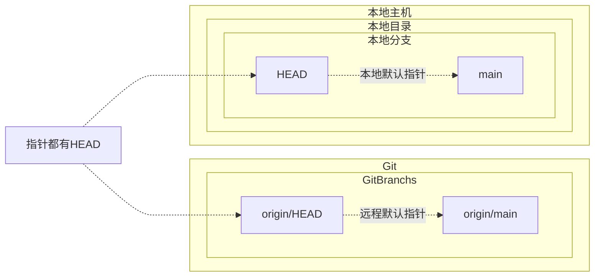

### 2：提交和推送代码
```mermaid

```
### 3：创建新分支并拉取远程分支
```mermaid
flowchart BT

CreateBranchAndPull -.1_先新建分支.-> LocOthers <--2_PULL--> GitMainBranch

subgraph Git
    subgraph GitBranchs
        GitMainBranch[origin/main]
    end
end

subgraph 本地主机
    subgraph 本地目录
        subgraph 本地分支
            LocOthers[new_feature]
        end
    end
end

CreateBranchAndPull['git checkout -b new-feature origin/main']
```
### 4.HEAD 指针的解释
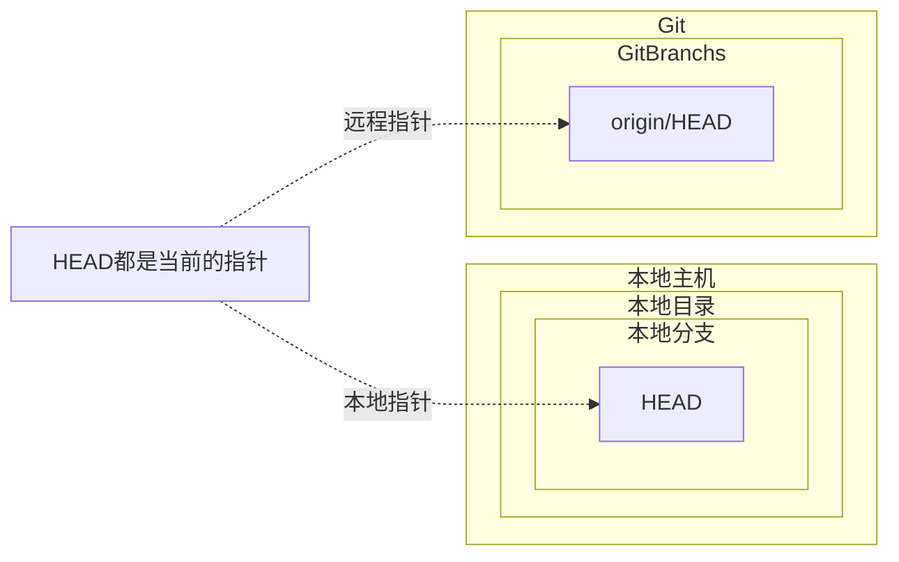

###  5：切换到其他分支
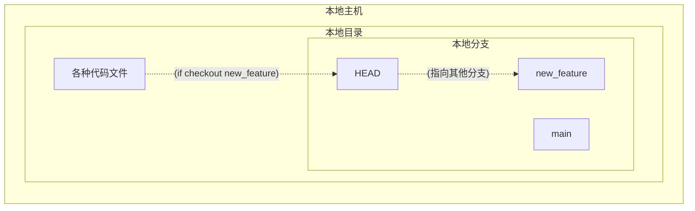

### 6：拉取远程分支的最新更改
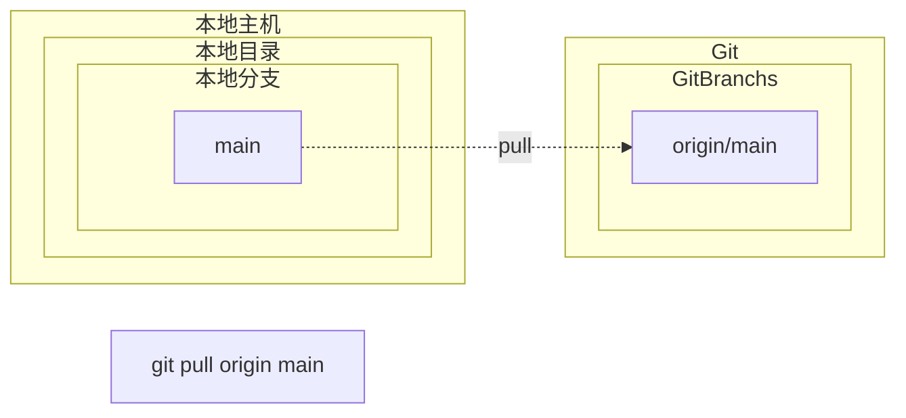

### 7.合并其他分支到当前分支
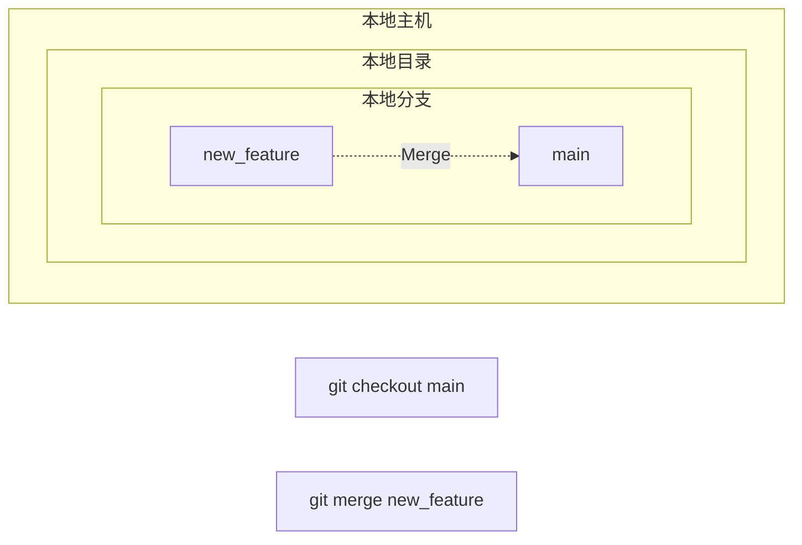
### 8：查看分支信息和当前HEAD位置
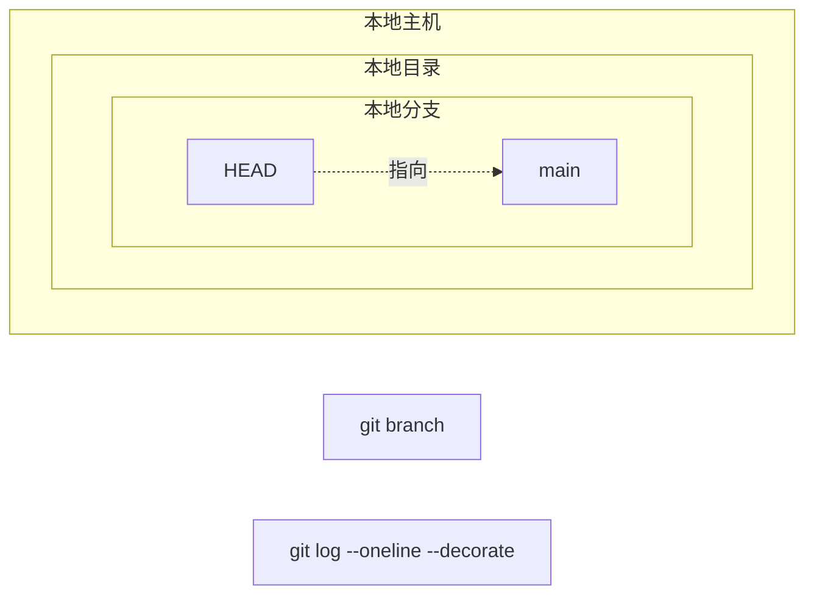
### 9：删除本地分支
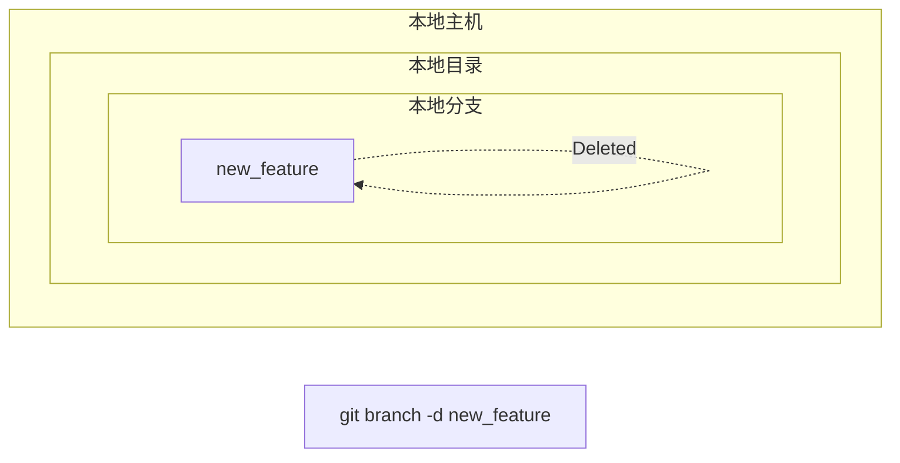

### 10：推送新分支到远程仓库
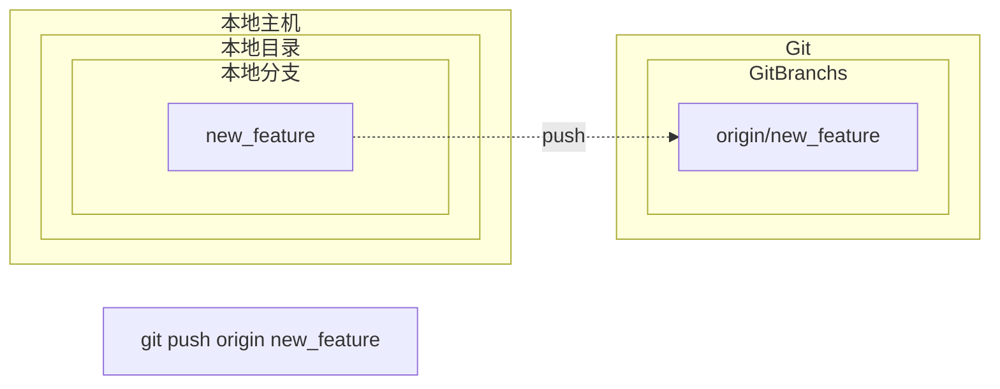
### 11.有冲突
情景描述

	1.	远程仓库中的修改：其他主机在远程仓库的 main 分支上修改了文件并推送。
	2.	本地主机中的修改：你在本地的 main 分支上修改了相同的文件。
	3.	拉取冲突：当你尝试从远程仓库拉取更新时，由于相同文件的修改导致冲突，无法自动合并。

步骤 1：其他主机修改并推送到远程仓库
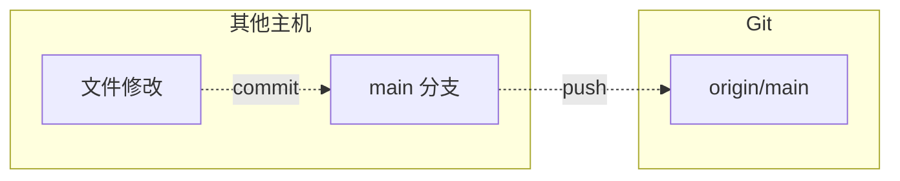
步骤 2：本地主机修改文件
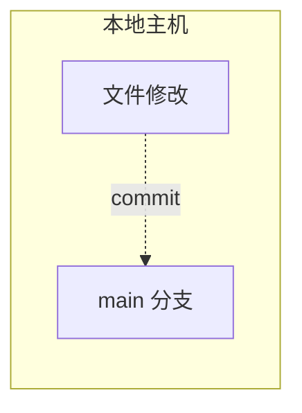
步骤 3：尝试拉取远程更改并遇到冲突
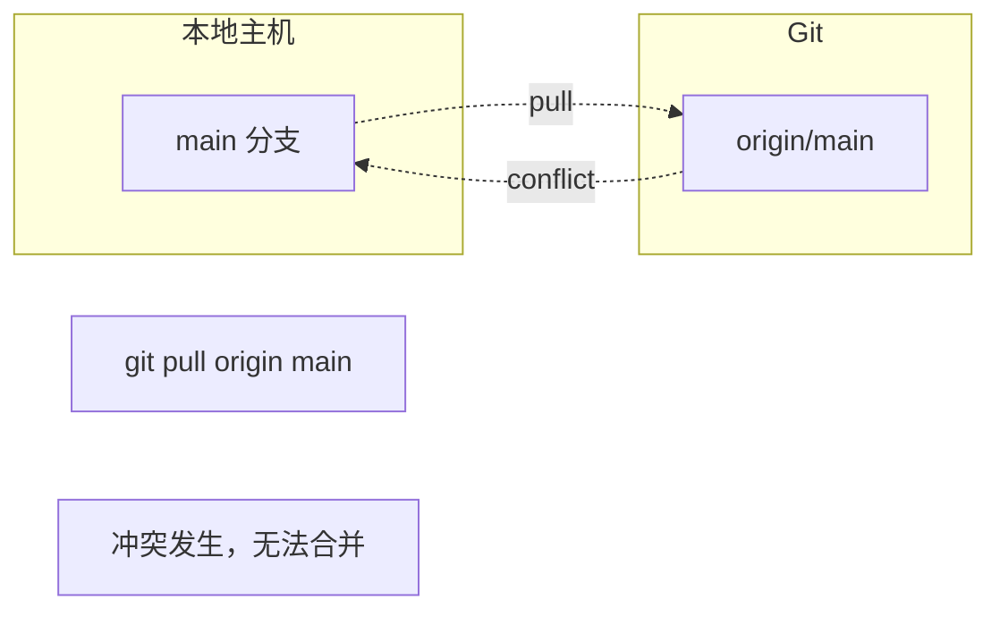
步骤 4：解决冲突并提交
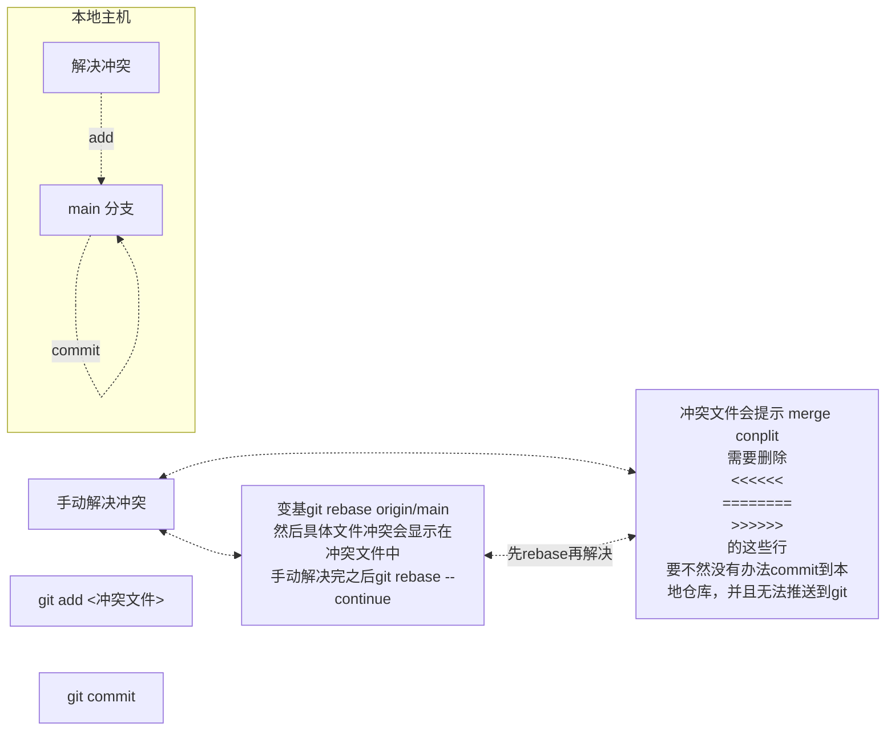

**手动解决步骤**:
如果有冲突，远程还是会同步到本地的分支,但是如果没有解决冲突(**conflit**)就无法推送到本地分支,并且push到远程了
你会看到类似以下的冲突信息：
```bash
Auto-merging someFile.txt
CONFLICT (content): Merge conflict in someFile.txt
Automatic merge failed; fix conflicts and then commit the result.
```
查看冲突文件
冲突文件中会有冲突标记，表示本地和远程的不同更改。例如：

```bash
<<<<<< HEAD1
本地主机的修改
=======
其他主机的修改
>>>>>> origin/main
```

需要删除冲突标记 
`<<<<<<<<`
`========`
`>>>>>>>>`

删除完之后应该如下,然后再commit 并且 push
```bash
本地主机的修改
其他主机的修改
```


解决冲突
• 手动编辑文件，删除冲突标记，并合并内容。
• 保存文件后，将解决冲突的文件添加到暂存区。
• 提交解决冲突后的更改。
推送更改
• 只有在解决冲突并提交后，你才能将本地的更改推送到远程仓库。


步骤 5：推送解决后的更改到远程仓库
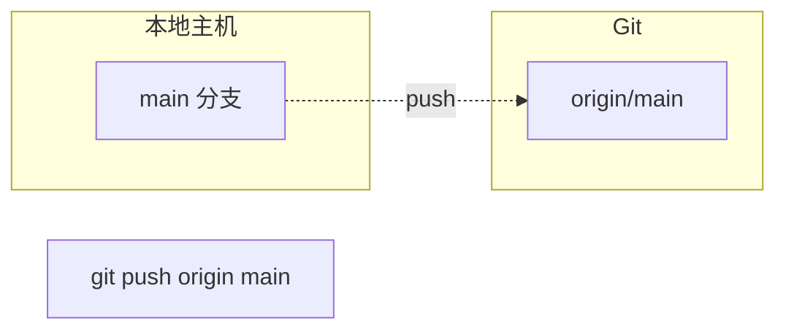


## 配置

```bash
$ git config --global user.name "Your Name"
$ git config --global user.email "email@example.com"
```

## init

```bash
git init 

```

## 当修改了文件

```bash
git status 会提示 modified: 
git diff

git add 之后就不能看到git diff的内容
```

## 查看之前的commit

```bash
git log
```

## 查看某个文件的修改记录
```bash
git log -- /path/filename
-- 后面有空格
```

## 查看状态

```bash
git status
```

```bash
(base) min122218@localhost testGit %git status
On branch main
Changes not staged for commit:
  (use "git add <file>..." to update what will be committed)
  (use "git restore <file>..." to discard changes in working directory)
	modified:   readme.txt

Untracked files:
  (use "git add <file>..." to include in what will be committed)
	hello.txt

no changes added to commit (use "git add" and/or "git commit -a")

//git status 命令的输出显示了你的 Git 仓库的当前状态。这是它的含义：

//On branch main：你当前在 main 分支。

//Changes not staged for commit:：这一部分列出了已经修改但还没有暂存（即，还没有用 git add 命令添加到下一次提交中）的文件。在你的例子中，readme.txt 文件已经被修改，但还没有暂存。

//Untracked files:：这一部分列出了 Git 还没有开始跟踪的文件。这些文件在你的 Git 仓库中是新出现的，Git 还不知道是否需要跟踪它们的更改。在你的例子中，hello.txt 是一个未跟踪的文件。

//no changes added to commit (use "git add" and/or "git commit -a")：这是一个提示，告诉你没有文件被暂存以准备提交。你可以使用 git add <file> 命令来暂存文件，或者使用 git commit -a 命令来一次性暂存所有已经被修改的文件。
```

## 退回到版本

```bash
git reset 命令有三个主要的参数：

--soft：此选项会移动 HEAD 到指定的提交，但不会改变索引和工作目录。这意味着你的文件不会被改变，但是所有在指定提交之后的提交都会被标记为待提交的更改。

--mixed：这是 git reset 的默认选项。此选项会移动 HEAD 到指定的提交，并且会改变索引，但不会改变工作目录。这意味着你的文件不会被改变，但是所有在指定提交之后的提交都会被标记为未暂存的更改。

--hard：此选项会移动 HEAD 到指定的提交，并且会改变索引和工作目录。这意味着所有在指定提交之后的提交和更改都会被丢弃。
```

```bash
git reset --hard HEAD^   //回退第一个

```

```bash

commit f7d9049370b20732989da3e2e312ea7580adc927 (HEAD -> main)
Author: Mac_M2 <Mac_M2@fake.com>
Date:   Tue May 7 11:29:10 2024 +0800

    需要git删除的

commit 0794930f4ab4a0b9774e8f7e80cc6997d931ebc0
Author: Mac_M2 <Mac_M2@fake.com>
Date:   Tue May 7 10:53:35 2024 +0800

    add 2 file

commit 6d9d101213f78c0a16ba3f76885062b392a64e29
Author: Mac_M2 <Mac_M2@fake.com>
Date:   Tue May 7 10:52:40 2024 +0800

    wrote a readme file
  
  
回退到特定的 
比如:commit 6d9d101213f78c0a16ba3f76885062b392a64e29

git reset --hard 6d9d1012 
```

## 记录每一次命令

```bash
git reflog

git refence log 引用那什么
```

```bash
(base) min122218@localhost testGit %git reflog
6d9d101 (HEAD -> main) HEAD@{0}: reset: moving to 6d9d
a24dca4 HEAD@{1}: reset: moving to a24dc
aa5afe2 HEAD@{2}: commit: 第三次
a24dca4 HEAD@{3}: commit: modified: readme.txt
6d9d101 (HEAD -> main) HEAD@{4}: reset: moving to 6d9d101213f
0794930 HEAD@{5}: reset: moving to 07949
f7d9049 HEAD@{6}: commit: 需要git删除的
0794930 HEAD@{7}: reset: moving to HEAD^
97d82ac HEAD@{8}: reset: moving to HEAD^
e4ac535 HEAD@{9}: commit: file3第二次修改
97d82ac HEAD@{10}: commit: file3第一次
0794930 HEAD@{11}: reset: moving to HEAD^
8d46029 HEAD@{12}: commit: 第三次修改
0794930 HEAD@{13}: commit: add 2 file

如果要切换 当次提交 用git reset --hard aa5afe2 就行了
```

## 查看分支的一些信息具体信息

```
git show <commit-hash>
```

## 使用分支

```bash
git branch //查看分支
git branch name //创建分支
git checkout name //切换分支
git checkout -b name	 //创建 +切换分支
git merge name 	//合并分支
git branch -d name //删除分支
```

## 恢复修改的文件

```
git checkout -- filename
```

## 合并分支

一般是将开发分支合并到主分支，例如有两个分支:main 和tst
在tst分支上修改并且提交

```bash
git add .
git commit -m "commit message"
```

然后切换到main分支，并且合并分支tst

```bash
git checkout main
git merge tst
```
