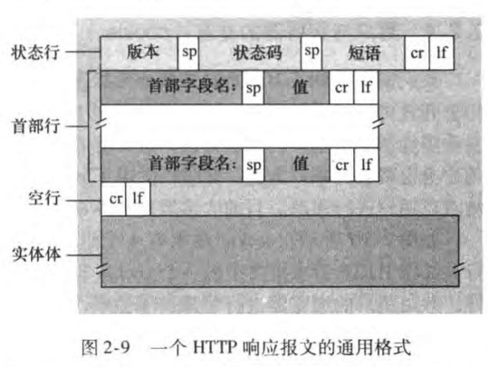

# 应用层
传输层向应用层提示的服务形式就是socket
    因此套接字也称为应用程序和网络之间的应用程序编程接(Application Programming Interface,API) 
运行通信的实际上是进程

##  网络架构
- **cs 模式 client server**
    可扩展性差，几十万台服务器就不行，硬件跟不上，网络出口，网络本身，可靠性差
- **peer peer 对等的模式（迅雷）**
    别人请求我的服务，我请求别人的服务
- **混合体(napster）**
    Music app，向服务器注册，同时上传自己app里面的音乐。服务器接到请求查询数据库，查询到另外两个用户有音乐，向新用户发送新的音乐。
    QQ 登录的时候向服务器注册。服务器维护，此用户在这个IP上。可以告诉你你的好友在哪些ip上。


## 进程通信
-   客户端进程：发起通信的进程
-   服务器进程：等待通信的进程

## 要解决地址
    标示自己，让别人找到。唯一的
    应用借助层间借口(sap server pointer) socket 
        服务访问点
    定义应用Message的格式 


## 如何标识进程
-   **IP**
    在哪个终端设备，终端设备的ip是什么
-  **TCP/UDP**
    你在终端系统在TCP还是UDP
-   **端口 end point**
    TCP有好多应用进程，具体在哪一个进程

## 应用层交给传输层的信息
- 主机IP + TCP/UDP的端口号 （谁发的 那个应用进程发的 ） 
- 目标 IP + TCP/UDP的端口号 （谁收）
- message (货物本身)

message + (哪个应用层发的 **TCP/UDP端口**标识) + 发给谁(目标IP+端口)

数据本身 那个进程传递的（本机端口区分） 目标Ip

 C语言握手 先 自身的端口和文件描述符 和对方的端口和文件描述符 先进行三次握手


## socket_TCP

每次都要标记 发送方ip 端口 和对方的IP和端口，这些事传递数据中不变的 采用**socket**

socket是操作系统提供的，要建立一个socket，操作系统给你返回一个整数，某个数组的索引（socket里面还有状态）

- 在TCP中绑定了 我的IP 我的端口号 对方的Ip和对方的端口号
- 在UDP中


在操作系统中维护一张表(TCP socket)

| socket | 源IP        | 源端口 | 目标ip      | 目标端口 | 状态           |
| ------ | ----------- | ------ | ----------- | -------- | -------------- |
| 1      | 195.156.1.1 | 50     | 192.168.1.1 | 8443     | 状态会不断更新 |
|        |             |        |             |          |                |
|        |             |        |             |          |                |


相同的端口号和不同的主机之间可以建立不同的socket

下面对于主机为2.2.2.2 的80端口来说，本地的80端口 通过绑定不同的目标ip 得到不同的socket
| TCP_socket | 源IP    | 源端口 | 目标ip  | 目标端口 | 状态           |
| ---------- | ------- | ------ | ------- | -------- | -------------- |
| 22222      | 2.2.2.2 | 80     | 1.1.1.1 | 233      | 状态会不断更新 |
| 22223      | 2.2.2.2 | 80     | 3.3.3.3 | 3535     | 状态会不断更新 |
|            |         |        |         |          |                |


## SOCKET_UDP

UPD的socket绑定的是本机的IP和端口。

UDP每个message都是独立的，所以每次都要加上目标的IP和端口 和数据本身

| UDP_socket | 源IP | 源端口 |
| ---------- | ---- | ------ |
|            |      |        |
|            |      |        |


## 端口号

网络层区分应用层 

IP只能区分哪个主机。端口号是区分不用的应用进程

TCP和UDP都有 2**16次方 6W多个端口


提示某个端口被占用的时候，需要关闭占用端口的线程

然后可以用`netstate -ap ` 查看端口

`netstat -ap |grep 进程ID`  可以杀死进程

```bash
# :~/netWork$ netstat -ap |grep 12345
(Not all processes could be identified, non-owned process info
 will not be shown, you would have to be root to see it all.)
tcp        0      0 0.0.0.0:12345           0.0.0.0:*               LISTEN      18054/./a.out       
tcp        0      0 localhost:12345         localhost:52467         ESTABLISHED 18054/./a.out 

//查找12345端口的时候 发现是10854线程占用了，而且该线程开辟了两个socket 
```


## 应用层协议

公开的协议会以为RFC文档定义，可以自助查询


## 应用层需要传输层提供什么样的服务


吞吐：发出去数据量 有效的到达对方


## TCP和UDP的区别


TCP接收方 如果接收数据太快，导致不能很好的处理，可以协同发送方发慢一点

TCP的硬件，可以感知路线的拥挤程度，扩大或者减少发送速率


## UDP 存在的理由


有一些大的网络供应商会把UDP的包给过滤丢弃掉


## 安全性


SSL跑在TCP之上，在应用层

SSL提供：服务端的认证,服务端的认证，私密传输， MESSAGE的完整性

APP 采用SSL的库编译运行


HTTPS 是HTTP跑在SSL之上，浏览器和服务器就是安全的

SSL也提供SOCKETAPI


# WEB和HTTP


“Web是指万维网（World Wide Web）的缩写

任何对象都可以采用URL唯一的标识

**http  是匿名访问 所以不需要用户和口令 默认端口是80**

ftp 默认端口是21

如果html对象 含有图片，图片也会HTTP协议，可以再访问图片的地址，然后再网页里面画出来

### HTTP：

​	超文本传输协议，先建立TCP的连接，在连接之上建立HTTP的请求,server把Client请求的对象封装成HTTP响应的报文


### HTTP连接

Http 1.0响应完请求之后会关闭socket

http1.1响应完请求之后不关闭socket 会维持连接


### 流水线请求方式和非流水线请求方式

客户端跟服务器挥手之后:

如果有10张图片要请求

非流水线请求方式：先请求一张，然后收到响应之后，再请求另外一张  ..... 

流水线请求方式: 依次请求，不等服务器响应，直接全部请求10张图


### 请求报文的格式

要ascii 人类可以读取

```http
GET /somedir/page.html HTTP/1.1 
Host: www.someschool.edu
Connection : close 
User-agent: Mozilla/5.0
Accept-language: fr
```


### 请求行 ( request line) 

**GET  /somedir/page.html HTTP/1.1 **

方法字段、 URL 字段和 HTTP 版本字段 

1. 方法字段：GET 
   
  ```
  -	GET、 POST、 HEAD 、 PUT 和 DELETE(GET请东西 POST往上载 HEAD拿头过来)
  -	绝大部分的 HTTP 请求报文使用 GET 方法 。 当浏览器请求一个对象时，使用 GET 方法，在 URL 字段带有请求对象的标识 。
  -	HEAD拿头过来,只需要head 搜索引擎用于 建索引 google baidu，维护的时候也用
  
  HTML1.1增加的方法：网页管理员用上传或者删除文件用
  -	put 把实体主题中的文件上传到URl字段规定的路径 
  - delete 删除URL字段规定的文件 
  ```

2.	URL 字段: /somedir/page.html  那个目录和文件
   
	```
	-	 主机名因为已经建立连接了，所以不需要了
	-	 正在请求对象/somedir/ page. html
	```
	
3.	HTTP/1.1
   
	```
	-	HTTP 版本字段  协议和版本号
	-	浏览器实现的是HTTP/1.J 版本
  - 
	```

###  首部行 (header line)

1. Host: www.sorneschool.edu

```
首部行Host: www.sorneschool.edu指明了对象所在的主
机。 你也许认为该首部行是不必要的，因为在该主机中已经有一条TCP连接存在了。 但 是，如我们将在 2.2.5 节中所见，该首部行提供的信息是 Web 代理高速缓存所要求的 。 通 过包含 Connection: close 首部行，该浏览器告诉服务器不要麻烦地使用持续连接 ，它要求服务器在发送完被请求的对象后就 关 闭这条连接 
```

2. User-agent 用户代理：名称/版本号

   ```
   首部行用来指明用户 代理 即向服务器发送请求的浏览器的类型 。 这里浏览器类型是 Mozilla/5. 0, 即 Firefox 浏览器 。
   这个首部行是有用的，因为服务器可以有效地 为不同类型的用户代理实际发送相 同对象的 不同版本 。 (每个版本都由相同的 URL 寻址 。)
   ```
   
3.	Connection: close

	```
	Connection: close 
   首部行，该浏览器告诉服务器不要麻烦地使用持续连接 ，它 要求
	服务器在发送完被请求的对象后就 关闭这条连接
   ```
   
4. Accept-language:fr

```
Accept-language : 首部行表示用户想 得到该对象的法语版本 (如果服务器中 有这样的对象的话) ;
```


### 请求报文通用格式


SP是space 空格 cr是回车 if是换行 

请求头完毕后要多加一个 cr和if

实体体是 其他的一些参数 ，比如用户账号密码等 ...

如果是方法是GET 没有实体体,POST要向服务器递交一些表单的信息，表单的内容就在实体的部分


### GET 和 POST


POST参数

```HTML
URL：
	https://www.bilibili.com/video/BV1JV411t7ow/?p=14&spm_id_from=pageDriver&vd_source=b52b0523dff3a3af97b99e79de89363f
	
HOST:
	https://www.bilibili.com/video/BV1JV411t7ow/
post携带的参数:
	url后面？后面的是参数 多个参数用& 连接
	p=14
	spm_id_from=pageDriver
	vd_source=b52b0523dff3a3af97b99e79de89363f
```


### 响应报文的格式

```HTTP
HTTP/1.l 200 OK\r\n 
Connectior. : close\r\n
Date: Tue, 18 Aug 2015 15:44:04 GMT\r\n
server : Apache/2 . 2 . 3 (CentOS )\r\n
Last-Modified: Tue, 18 Aug 2015 15:11:0J GMT \r\n
Content-Length: 6821\r\n
Content-Type: text/html\r\n
\r\n
(data data data data data ...)

版本 状态码 短语
六个
```



版本:协议/版本

状态码：

​	200 是ok,301请求的对象已经被转移400 坏请求，不能被服务器请求

server:服务器信息

last_motify:请求的对象在上一次修改的时间 相当于版本号

Content-Length:内容的长度

Content-Type:内容的类型

实体类:响应的内容


TCP向上一层提供的服务是不提供边界检查等，需要应用层自行检查


### HTTP的状态码


### Telnet 测试

`telnet cis.poly.edu 80`

`telnet Url Port`


### COOKIE

服务器不维护客户端的状态，请求什么响应什么

电商网站或者文件系统需要维护客户端状态，你是谁，你的用户名是什么，购物车有什么东西，你以前买过什么东西

Cookie是文本文件，windows在一个目录,多次暴露COOkie会暴露隐私


### 	WEB缓存(代理服务器)

 


原理:

客户端1访问服务器的时候，现在代理服务器上找，如果代理服务器上没有，就另外请求服务器，然后本地缓存一份，然后再返回客户端1

客户端2访问服务器的时候（和客户端1一样的请求），现在代理服务器上找，代理服务器在本地的文件系统中找到了要响应的数据，就不用另外请求服务器了。

好处：

客户端响应更快，不需要访问服务器

服务器本来应该有100个请求，但是50个请求是一样的，这50个会在代理服务器中响应，

网络的负担也变轻了

但是会有一个问题，代理服务器里面的内容是陈旧的，初始化服务器已经修改过，响应的内容

这个时候会可以使用 条件get方法


### 条件get

代理服务器向WEB服务器发送一个请求

```HTTP
GET /fruit/kiwi.git HTTP/1.l 
Host: www.exotiquecuisine.com
If-modify-since: Wed, 9 Sep 2015 09:23:24  //条件get
```


服务器收到这个请求之后，会查看If-modify-since 字段后，如果数据更新超过该日期，会发送完整的新的响应给代理服务器，让代理服务器重新缓存，如果没有超过这个日期，服务器发送下面这个响应给代理服务器

```HTTP
HTTP/1.1 304 Not Modified  				//没有改变过  超过请求的日期，会发送完整的响应给服务器
Date: Sat, 10 Oct 2015 15:39:29			
Server : Apache/1 . 3 . 0 (Unix)
```


​		


#	FTP

FTP

客户端和FTP服务器建立连接，21号端口，控制连接(control connect) 

FTP服务器开辟一个socket,使用20号端口，和客户端建立连接，并且传递数据，这个叫数据连接(data connect)


FTP的发送指令


# EMAIL

EMAIL的端口25号

EMAIL 发送的协议:SMTP

EMAIL  拉取的协议:pop3,IMAP,HTTP也可以


Pop3 只能看到收件人 发件人 （明文）

IMAP 有目录，移动等

HTTP也可以文件上下载


用户发邮件的时候，通过用户代理，邮件客户端 GMAIL APP等，邮件服务器放在队列里面，先进先出的把邮件打出去，打到相应的邮件服务器，邮件服务器会放在响应的用户邮箱当中里面

收邮件的时候，通过用户代理(app)。连接到邮件服务器(比如谷歌GMAIL,QQ邮箱)，通过邮件拉取协议(POP3等)，缓存到app里面

邮件服务器之间会定期的发送，几分钟发一次，不会来了就发，来了就发


https://blog.csdn.net/weixin_39732640/article/details/119603813


# DNS

端口 udp/c v 53 

动态的域名映射 ip

包括要增加 或者 删除映射

可以起别名

邮箱 负责映射邮件服务器

不同地区 访问同一个网页，映射不同的IP

顶级域 com，cn，top

国家域 cn ，jp，us

顶级域 分二级域


## DNS资源记录表(RR)
记录DNS的表叫做资源记录表（RR）

RR里面有一些字段 name，type ,value（rdata），TTL，数据长度，资源数据

Name 和value（rdata） 会根据type的类型不同而改变

type=A 

- name为主机名称 value（rdata）=IP地址

type=CName

- name为规范名称的别名 value（rdata）=规范的名称

type=NS

- name为域名 value=权威服务器的域名  DNS服务器

type=MX mailbox

- value为name对应的邮件服务器的名字


DNS资源记录（Resource Record，简称RR）是DNS系统中的基本信息单元，用于描述域名相关的各种数据。一个典型的DNS资源记录包含以下字段：

1. **域名（Name）**：资源记录所对应的域名。例如，在资源记录中，`www.example.com` 就是一个域名。

2. **类型（Type）**：资源记录的类型。常见类型包括A（指向IPv4地址）、AAAA（指向IPv6地址）、CNAME（规范名称）、MX（邮件交换）、NS（名称服务器）等。

3. **类别（Class）**：记录的类别，通常是IN（Internet），但也有其他类别如CH（Chaosnet）和HS（Hesiod）等。

4. **生存时间（TTL，Time to Live）**：资源记录可以被缓存的时间，通常以秒为单位。TTL是DNS记录的一个重要部分，它指示DNS解析器或其他DNS服务器应该多久刷新一次该记录。

5. **数据长度（RDLENGTH）**：资源数据的长度，即RDATA的长度，通常以字节为单位。

6. **资源数据（RDATA）**：资源记录的数据部分，其格式和内容依赖于类型。例如，对于A类型记录，RDATA将是一个IPv4地址；对于MX记录，它将包含优先级和邮件服务器的地址。

   不同类型的DNS资源记录会根据其用途有所不同。例如，MX记录专用于定义邮件服务器的地址和优先级，而CNAME记录则用于将一个域名映射到另一个域名。

   资源记录的详细结构和内容取决于其类型和用途，但上述字段是大多数资源记录共有的基本组成部分。


##  查看DNS记录
**在linux路由器中，如何用命令查看DNS 记录表，DNS是否有端口**


在 Linux 系统中，查看 DNS 记录通常是指查询特定域名的 DNS 记录，而不是查看本地 DNS 记录表，因为 DNS 服务通常由远程服务器（如您的互联网服务提供商或公共 DNS 服务）提供，而不是在本地存储完整的 DNS 记录表。

### 查看 DNS 记录的命令

您可以使用 `dig` 或 `nslookup` 命令来查询 DNS 记录。这些工具允许您查看特定域名的不同类型的 DNS 记录。

#### 使用 `dig` 命令

```
bashCopy code
dig @dns-server domain.com A
```

- `@dns-server`：这是可选的，指定要查询的 DNS 服务器。

- `domain.com`：您要查询的域名。

- `A`：这是查询的记录类型，比如 A、AAAA、MX、NS 等。如果省略，则返回所有类型的记录。

- #### 使用 `nslookup` 命令

  ```
  nslookup -type=A domain.com
  ```
  
- `-type=A`：指定查询的记录类型。
  
  - `domain.com`：您要查询的域名。
  
### DNS 的端口

DNS 通常在 UDP 和 TCP 的端口 53 上运行。DNS 查询大多数情况下使用 UDP 协议，但在某些情况下（如响应数据太大或进行区域传输）则使用 TCP 协议。

### 查看本地 DNS 配置

在 Linux 上，如果您想要查看您的系统或路由器配置为使用哪个 DNS 服务器，您可以查看 `/etc/resolv.conf` 文件。这个文件包含了您的系统用于解析


当电脑要访问一个网址 比如www.any.edu.cn 的时候，会问离你最近的DNS服务器，比如路由器，路由器一般有缓冲资源记录

如果路由器也不知道，会访问cn的服务器，cn会找edu的服务器，edu会找any的服务器问www的ip然后返回给主机


查询ID 本地标记的一个ID，然后用ID流水线的方式访问多个别的DNS服务器 谁先回来用谁,DNS

查询会响应的报文格式是一样的


添加新域名

如果一个com的根，新进来一个公司叫Network utopia需要向资源记录表 插入两条数据 该公司的DNS服务器 还有该公司的ip

1. (Networkutopia.com,      dns1.Networkutopia.com,	NS), 该公司的DNS服务器 

2. (dns1.Networkutopia.com,	212.212,245.1,		A)，该公司的DNS服务器地址

只需要两个你的DNS服务器，你服务器的具体地址

查询会到你的DNS服务地址查询


DNS查询


# p2p

节点是客户端，同时也是服务器


**非结构化**

- 集中化目录

当节点A搜索电影，服务器告诉这个节点A，另外那些节点(B,C,D)有这个文件，然后A 节点向B,C,D 请求该资源,同时上报给服务器，说也有这个资源了

节点上线，告诉服务器，我的Ip 我的资源


- 完全分布式

 没有目录服务器，下载的时候有配置文件，配置文件是经常上线的节点的ip，这样新的节点就会和其他节点建立联系，有了初始的节点就好办了，随机挑选8-10个作为死党，如果下线了，跟着10个死党说88，10个死党再挑选其他节点作为死党替代A

示范软件Gnutella


- 混合体

  分成若干组 每个组有一个组长

  组长和组长之间是分布式的，组长和组员是集中化目录

每个文件有一个描述值，还有一个hash值，用户检索的时候匹配描述，用hash值当作文件的唯一标识，给其他peer发出查询


Bt网站

下载Bt的时候  会有一个文件，文件里面有哪些节点们在维护他 进行文件的上下载，然后加入这个文件的这个小组内，然后自己也变成这个文件的节点了


结构化

每个节点的Ip有hash值 16字节作为唯一标识，构成一个首尾相接的环 双向链表，一个文件分为若干块，每个Ip节点维护文件的一个块


# CDN 内容分发网络

互联网流量加速服务在计算机网络中通常被称为“内容分发网络”（CDN，Content Delivery Network）。CDN 是一种分布式网络服务，旨在通过将内容缓存到世界各地的多个地理位置上靠近用户的服务器上，来加速对网站和其他互联网内容的访问。

CDN 的主要特点和优势包括： 

1. **缩短加载时间**：通过在全球范围内分布的服务器上缓存内容（如网页、图片、视频等），用户可以从距离他们最近的服务器获取数据，从而显著减少加载时间。
2. **减轻原始服务器负担**：CDN 可以承担大量的流量，减轻中心服务器的负载，这有助于避免过载和崩溃。
3. **提高可靠性和可用性**：通过复制内容到多个位置，即使某个服务器或网络路径出现故障，用户通常仍然可以访问内容。
4. **安全性**：CDN 还可以提供安全性增强，如抵御分布式拒绝服务（DDoS）攻击。
5. **优化性能**：许多CDN提供其他性能优化功能，如自动图片优化、移动设备适应等。

CDN 是现代互联网架构的重要组成部分，特别是对于大流量和全球范围内访问的网站和网络服务而言。通过使用CDN，网站可以为用户提供更快、更可靠和更安全的体验


视频由一帧 一帧 组成 第二帧只传输帧动的部分


流媒体 边下载边看 减少用户等待的时间

常见的协议：DASH dynamic adaptive streaming over HTTP

视频切到8-10秒的每一个块,然后发布一个高表示文件 manifast文件，文件里面有不同编码的不同块的URL地址，各种清晰度，然后客户端按照需要去请求这些文件呢，客户端先下载第一块，看第一块的视频，然后看第一块视频的时候请求别的块


CDN（内容分发网络）不是一个特定的“运营商”，而是一种服务，由专门的公司或组织提供。CDN 服务提供商通过在全球多个地点部署服务器网络，将内容（如网页、视频、图像、应用程序数据）分发到离用户更近的地理位置，从而加速内容的加载速度和提高访问可靠性。

 

**CDN 服务提供商通过在全球多个地点部署服务器网络，将内容（如网页、视频、图像、应用程序数据）分发到离用户更近的地理位置，从而加速内容的加载速度和提高访问可靠性。**


**ICP (Internet Content Provider)** 向CDN买服务，加速ICP到端的速度，主机访问请求内容的时候，通过域名解析的重新定向到离自己最近的网络，这种服务叫内容加速服务。

ICP要提前把内容缓存在全球很多节点中。

客户端首先从原服务器拿到告示文件。然后根据需求去请求理他最近的服务器(CDN提供的)，网络的调速少。因此得到服务比较快。

1.通过域名解析 和 manifast文件 

CDN运营在网络的Edge，应用在应用层


1.本地节点访问某个网址需要CCTV视频的时候比如(www.cctv.com/video.mp4)，由于操作系统不知道URL对应的Ip

2.本机器访问路由器 要求解析该域名

3.路由器访问cctv.com的DNS

4.cctv.com的DNS返回 CDN(内容分布)的 DNS，返回具体的IP

5.路由器得到具体的Ip 告诉应用程序

6.应用程序直接和最近的缓存节点通信


 


## TCP


服务器端:

1. 服务器先运行。创建一个socket 需要指定TCP或者UDP返回 一个整数，(welcom_socket)
2. 绑定本地Ip和Port **bind(struct sockaddr_in的结构体)**,welcome_socket 只有本地的ip和端口，对方的没有。
3. Listen(welcome_socket,10); 建立一个队列 有访问就拿一个,没有就下一个
4. accept 来自于这个socket 建立tcp连接 。如果没有连接进来，会阻塞等待， socket来了一个连接请求，会返回一个新的socket值，conncet_socket，新的connect_socket绑定的是本地的Ip和端口和对方的ip和端口。这个时候accept解除阻塞。连接就建立起来了。

5. 这个时候可以和新socket会话，回话完后关闭这个socket，ServerSocket还是会在原来的地方阻塞等待。

6. read();读取

7. write();

8. Close(建立的socket上); 程序回到accpet 等下下一个用户建立请求

| Socket         | 本地ip  | 本地Port | 远程ip       | 远程Port       |
| -------------- | ------- | -------- | ------------ | -------------- |
| Welcome_socket | 1.1.1.1 | 80       | 无           | 无             |
| connect_socket | 1.1.1.1 | 80       | 请求连接的IP | 请求连接的端口 |

还有进程id 操作系统维护


客户端:

1.建立一个socket **(指明TCP or UDP) ** 操作系统隐式的给那一个会给你一个bind（）

2.绑定IP和端口

3.connect 服务器的ip 和端口，阻塞等待。（向对方请求连接 挥手） 除非服务器响应了同意连接，如果来了，连接才会解除阻塞返回一个有效值，socket会天上呢连接成功的远程Ip和Port

4.send_to();;可能是write();

5.read();


| Socket        | 本地ip        | 本地Port | 远程ip            | 远程Port            |
| ------------- | ------------- | -------- | ----------------- | ------------------- |
| client_socket | client_socket | 7777     | connect成功填上ip | connect成功填上Port |
|               |               |          |                   |                     |


两个重要的结构体

struct sockaddr_in;  //绑定IP和端口 TCP/UDP通信时候的一个端节点

```c++


struct sockaddr_in {
	__uint8_t       sin_len;    	// ？？ 
	sa_family_t     sin_family;  	//地址组
	in_port_t       sin_port;   	//端口号
	struct  in_addr sin_addr;   	//地址
	char            sin_zero[8];  //对齐的作用
};

struct in_addr {
	in_addr_t s_addr;
};
```


struct hostent 域名解析的函数调用

```c++

struct hostent {
	char	*h_name;				//主机的域名														/* official name of host */
	char	**h_aliases;		//主机一些列的别名											/* alias list */
	int	h_addrtype;				//主机的类型													/* host address type */
	int	h_length;					//地址的长度												/* length of address */
	char	**h_addr_list;	//ip地址的列表												/* list of addresses from name server */

  #if !defined(_POSIX_C_SOURCE) || defined(_DARWIN_C_SOURCE)
	#define	h_addr	h_addr_list[0]	/* address, for backward compatibility */
	#endif /* (!_POSIX_C_SOURCE || _DARWIN_C_SOURCE) */
};
```


```c++
gethostbyname("www.baidu.com"); 返回struct hostent；
  
hostent->h_addr_list 
放到sockaddr_in.in_addr 里面绑定一个ip
```


## UDP 

客户端:	只跟本地的ip和port捆绑,需要指定对方的Ip和端口
服务器:	对方Ip和端口，对方发过来什么 ，有可能会乱序，无连接的


UDP交互过程

服务器：
	1.	新建一个socket 参数ipv4，udp协议 3
	1.	Bind 绑定一个端口 和本地IP 
	1.	先进入循环  然后recefrom（阻塞）


| UDP_SOCKET          | 本地IP  | 本地port | 对方IP | 对方Port |
| ------------------- | ------- | -------- | ------ | -------- |
| service_socket  / 3 | 1.1.1.1 | 80       |        |          |
|                     |         |          |        |          |


客户端：

1.客户端先建立一个client socket ，参数ipv4 udp协议 隐式的绑定本地IP和端口

2.新建一个struct sockaddr_in，绑定对方的Ip和端口

3.sendto(client_socket ,内容，客户端的sockaddr_in，sockaddr_in 大小)；

4.recefrom 阻塞等待 客户端发过来的信息

| udp_SOCKET    | 本地IP      | 本地port       | 对方IP | 对方Port |
| ------------- | ----------- | -------------- | ------ | -------- |
| client_socket | 隐式2.2.2.2 | 隐式的端口7777 |        |          |
|               |             |                |        |          |


TCP和UDP socket的区别

TCP要建立连接，建立连接完之后socket才有效,建立连接完，我的IP和端口 对方的IP和端口已经确定了


### 简单的HTML 服务器

```python
import socket
# import ssl

port = 80
# 创建一个Socket对象
server_socket = socket.socket(socket.AF_INET, socket.SOCK_STREAM)

# 监听IP地址和端口
server_address = ('', port)
server_socket.bind(server_address)

# 启用SSL/TLS

# certfile参数应该是您的SSL证书文件的路径。SSL证书是由受信任的证书颁发机构（CA）签发的，
# 用于验证服务器的身份。它包含了服务器的公钥以及相关信息，客户端可以使用它来验证服务器是否可信。
# 证书文件通常具有.pem或.crt等扩展名。
# keyfile参数是您的SSL私钥文件的路径。私钥是与SSL证书配对的，
# 它用于解密客户端发送的数据和加密发送给客户端的数据。
# 私钥文件通常具有.key或.pem等扩展名。
server_socket = ssl.wrap_socket(server_socket, certfile="/path/to/your/certificate.pem", keyfile="/path/to/your/privatekey.pem", server_side=True)


# 开始监听
server_socket.listen(5)
# 设置socket选项，启用端口复用
server_socket.setsockopt(socket.SOL_SOCKET, socket.SO_REUSEADDR, 1)
print(f"Listening on port {port}")

while True:
    # 等待客户端连接
    client_socket, client_address = server_socket.accept()
    print(f"Accepted connection from {client_address}")

    # 构造HTTP响应
    response = "HTTP/1.1 200 OK\r\nContent-Type: text/html\r\n\r\n<html><body><h1>Hello, World!</h1><h1>Are you ate dinner????</h1><h1>Are your  finishing work????</h1></body></html>\r\n"

    # 发送响应到客户端
    client_socket.sendall(response.encode())

    # 关闭客户端连接
    client_socket.close()

```


 
