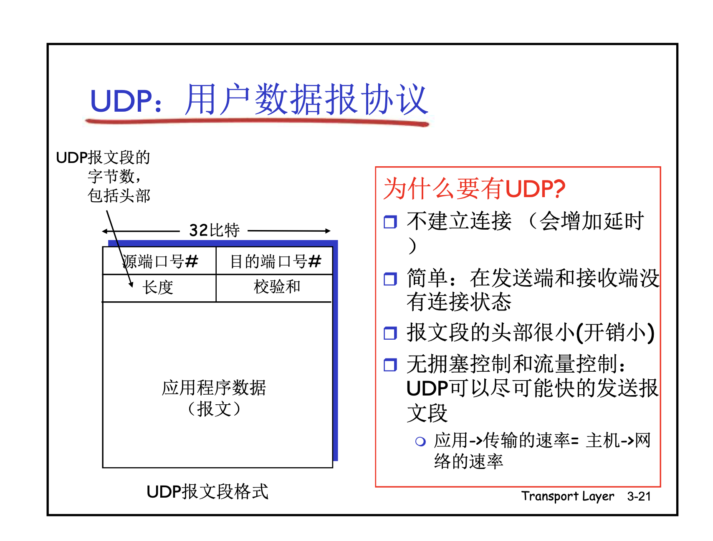
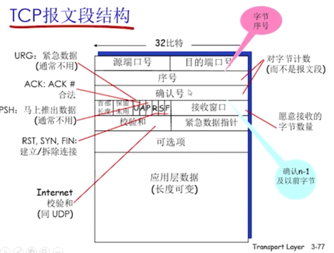
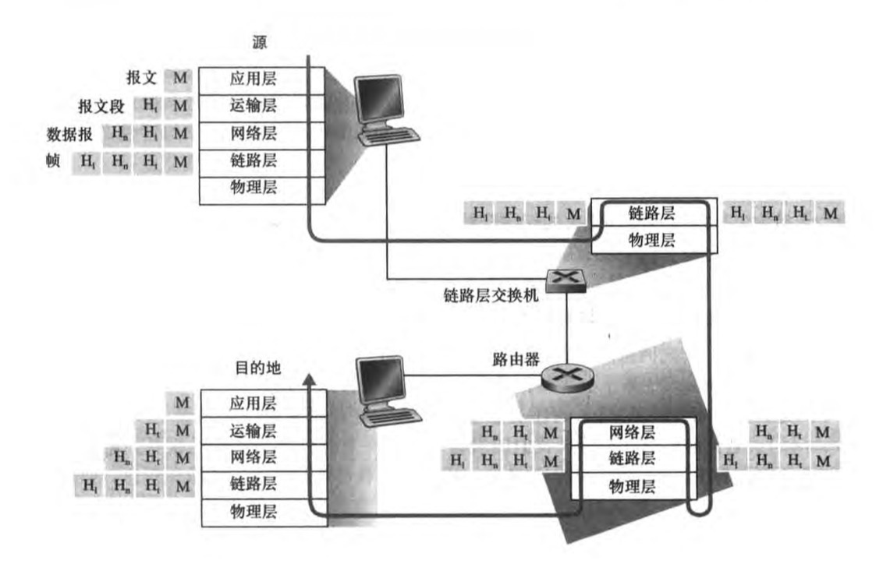

#	计算机网络模型
  1.[应用层](#应用层)
      1.1 [表示层](#表示层)  
      1.2 [会话层](#会话层)
  2.[运输层](#运输层)
  3.[网络层](#网络层)
  4.[链路层](#链路层)
  5.[物理层](#物理层)


# 各个层的结构

**应用层**

**传输层**




​	**网络层**


## 应用层 application
应用层的数据叫:message 报文

为人类用户或者其他饮用进程提供网络应用服务
    协议:
        FTP:
        SMTP:
        HTTP:
        DNS:
        常见的协议有数百种


## 表示层
允许饮用解释传输的数据，加密，压缩，机器相关的的表示转换

## 会话层
建立session,维持session
    


## 运输层 transport
运输层的数据叫:	segment 报文段

每段都会加上段头

区分进程,加强网络层提供的服务，把不可靠变可靠
    协议:
        TCP:
        UDP:


## 网络层 network
网络层的数据叫：TCP(packet)	叫分组

​								UPD(datagram) 数据报

主机到主机端对端的服务,加上源IP目标IP
    协议: 
        IP(转发，从端口来，从哪个端口走)
        路由协议(路由选择)


## 链路层 link
链路层的数据叫：frame 帧

给网络层的数据报分组，加上链路层的头部和尾部，组成帧 交给物理层

相邻两点之间以为帧（frame）为单位的数据传输
    协议:
        点对对协议PPP
        802.11(WIFI)
        Ethernet


## 物理层 physiacal

在线路上传输Bit
    协议: 


链路层和物理层一般封装在一张网卡上

路由器上有多个网卡，每个网卡接收到5层的信息，拨开最下面两层。分析源ip和目标Ip，然后封装链路层和物理层。交给下一个网卡，网卡由1010等信号转换成电磁波信号

# image



## 抓包

😊**网卡：PC(6位)和路由器的MAC地址（6位） + 2位的ipv4 标识 0x0800   一共14字节**

PC 6位 路由器6位 (前三位有掩码) 

😊**网络协议4:																								-一共20字节**  (网卡+网络协议4 得34字节)

version 4位 (半个char) 												0.5字节

header lenght 4 位 (半个char) 										0.5字节

differentiated serivice field 											1字节

Total length  :1short 														2字节

identification:识别 1 short											 2字节


dont‘t fragment 不要碎裂 ：			3bit

fragment offset ：片段偏移			13bit 和上面一共 2字节

timeTolive TTL																	1字节

protocol 协议	着上面怎么显示6									1字节

header checksum ：头部标头校验和                			2字节			

Source IP:																		4字节

Destination ip:																4字节


😊**传输层：传输控制协议                显示有32字节**

 Source Port:端口												2字节

 Destination Port: 59611									2字节


{sequence number (raw) 序列号								4位

}

{Acknowledgment number (raw)  确认编号	4位


}

header  leader：													1字节

{flags 																	1字节

每个位都有意义

}

{ 不知道什么结构												 2个字节

Window

window size scaling factor

calculated window size

}

Checksum  :校验和													2字节

urgen pointer： 紧急指针                           			2字节


TCP option{															最后12个字节

TCP option:					1字节

TCP option：					1字节

TCP 时间戳：{	first Frame in this Tcp stream					5字节/10字节

​							Time since previous frame in this TCP stream 	5字节

​							}					

}


应用层 ：data 27字节


```text
Frame 23857: 93 bytes on wire (744 bits), 93 bytes captured (744 bits) on interface en0, id 0
Ethernet II, Src: ASUSTekC_60:86:2f (74:d0:2b:60:86:2f), Dst: Apple_8e:1d:ec (f0:18:98:8e:1d:ec)
    Destination: Apple_8e:1d:ec (f0:18:98:8e:1d:ec)
        Address: Apple_8e:1d:ec (f0:18:98:8e:1d:ec)
        .... ..0. .... .... .... .... = LG bit: Globally unique address (factory default)
        .... ...0 .... .... .... .... = IG bit: Individual address (unicast)
    Source: ASUSTekC_60:86:2f (74:d0:2b:60:86:2f)
        Address: ASUSTekC_60:86:2f (74:d0:2b:60:86:2f)
        .... ..0. .... .... .... .... = LG bit: Globally unique address (factory default)
        .... ...0 .... .... .... .... = IG bit: Individual address (unicast)
    Type: IPv4 (0x0800)
Internet Protocol Version 4, Src: 18.141.71.65, Dst: 192.168.2.66
Transmission Control Protocol, Src Port: 7716, Dst Port: 59611, Seq: 28, Ack: 43, Len: 27
    Source Port: 7716
    Destination Port: 59611
    [Stream index: 1276]
    [Conversation completeness: Incomplete, DATA (15)]
    [TCP Segment Len: 27]
    Sequence Number: 28    (relative sequence number)
    Sequence Number (raw): 4038411978
    [Next Sequence Number: 55    (relative sequence number)]
    Acknowledgment Number: 43    (relative ack number)
    Acknowledgment number (raw): 1398968734
    1000 .... = Header Length: 32 bytes (8)
    Flags: 0x018 (PSH, ACK)

           0. .... .... = Reserved: Not set
                      ...0 .... .... = Accurate ECN: Not set
                      .... 0... .... = Congestion Window Reduced: Not set
                      .... .0.. .... = ECN-Echo: Not set
                      .... ..0. .... = Urgent: Not set
                      .... ...1 .... = Acknowledgment: Set
                      .... .... 1... = Push: Set
                      .... .... .0.. = Reset: Not set
                      .... .... ..0. = Syn: Not set
                      .... .... ...0 = Fin: Not set
                      [TCP Flags: ·······AP···]
                  Window: 490
                  [Calculated window size: 62720]
                  [Window size scaling factor: 128]
                  Checksum: 0xb280 [unverified]
                  [Checksum Status: Unverified]
                  Urgent Pointer: 0
                  Options: (12 bytes), No-Op eration (NOP), No-Operation (NOP), Timestamps
                      TCP Option - No-Operation (NOP)
                      TCP Option - No-Operation (NOP)
                      TCP Option - Timestamps
                          Kind: Time Stamp Option (8)
                          Length: 10
                          Timestamp value: 3037130281: TSval 3037130281, TSecr 138655633
                          Timestamp echo reply: 138655633
                  [Timestamps]
                      [Time since first frame in this TCP stream: 70.564376000 seconds]
                      [Time since previous frame in this TCP stream: 0.108854000 seconds]
                  [SEQ/ACK analysis]
                      [This is an ACK to the segment in frame: 23853]
                      [The RTT to ACK the segment was: 0.108854000 seconds]
                      [iRTT: 0.098251000 seconds]
                      [Bytes in flight: 27]
                      [Bytes sent since last PSH flag: 27]
                  TCP payload (27 bytes)
              Data (27 bytes)
                  Data: 5365727669636520676f7420746865206d6573736167652e2e0a00
                  [Length: 27]
```

           0. 

```
```

## 通信之前三次交互

1.src  TO des ：网卡  14bit + 协议层  20 bit + 网络层 44 bit        78字节

2.des  to src:：网卡  14bit + 协议层  20 bit + 网络层 40 bit        74字节

3.src  TO des ：网卡  14bit + 协议层  20 bit + 网络层 32 bit        66字节

挥手完毕

4 src  to des:	网卡  14bit + 协议层  20 bit + 网络层 32 bit        66字节   + data  


## 硬件地址 NAT 和arp表是什么关系

NAT "Network Address Translation"

硬件地址、NAT和ARP表是IP网络中三个重要的概念。

**硬件地址**，也称为MAC地址，是用来标识网络设备在数据链路层的唯一标识符。

**NAT**，即网络地址转换，是用于解决IP地址不足问题的技术。NAT通过将内部网络的私有IP地址转换为外部网络的公有IP地址，实现内部网络与外部网络的通信。

**ARP表**，即地址解析协议表，是用于存储IP地址和MAC地址映射关系的表。

**硬件地址、NAT和ARP表的关系**如下：

- **硬件地址是用来标识网络设备的，而NAT和ARP表是用来解析IP地址和MAC地址的。**
- **NAT可以将内部网络的私有IP地址转换为外部网络的公有IP地址，而ARP表可以根据IP地址查找MAC地址。**
- **在使用NAT的情况下，ARP表中会保存内部网络的私有IP地址和NAT设备的公有IP地址的映射关系。**

例如，在一个使用NAT的局域网中，有一台主机的IP地址为192.168.1.1，MAC地址为00:00:00:00:00:01。当这台主机向外部网络发送数据包时，NAT设备会将IP地址192.168.1.1转换为公有IP地址192.168.1.2。在ARP表中，会保存一条映射关系，即IP地址192.168.1.1对应MAC地址00:00:00:00:00:01和公有IP地址192.168.1.2。

当外部网络的主机向局域网中的主机发送数据包时，外部网络的主机会将数据包发送到NAT设备。NAT设备会根据数据包的目的IP地址查找ARP表，找到对应的MAC地址，然后将数据包转发给局域网中的主机。

因此，硬件地址、NAT和ARP表是相互联系的，共同实现了IP网络中的通信。


## 端口是什么意思，目的是分辨进程吗

端口是指计算机在网络中的一个逻辑接口，用于区分不同的应用程序或进程。端口号是一个整数，范围从 0 到 65535。每个端口号都对应一个特定的应用程序或进程。

端口的目的是为了分辨进程，使不同的进程能够在同一台计算机上同时运行，并通过网络与其他计算机进行通信。

例如，Web 服务器通常使用 80 端口来提供 HTTP 服务。当用户访问一个 Web 站点时，浏览器会向 Web 服务器发送一个 HTTP 请求，请求服务器返回网页。Web 服务器会在 80 端口上接收 HTTP 请求，并在同一个端口上返回网页。

端口还可以用于安全控制。例如，防火墙可以根据端口号来限制对特定应用程序或服务的访问。

因此，端口的作用主要有以下几点：

- **区分进程**：端口号用于区分不同的进程，使不同的进程能够在同一台计算机上同时运行。
- **提供网络服务**：不同的端口号对应不同的网络服务，例如 HTTP、HTTPS、FTP、SMTP 等。
- **安全控制**：防火墙可以根据端口号来限制对特定应用程序或服务的访问。

端口号是一个重要的概念，在计算机网络中有着广泛的应用。


# bps , Mbps ,Bps


**100 bps	表示100个bit per second**

**100 Bps       表示100字节(Byte)  per second**


100 M bps 是 100 Megabits per second 的缩写，表示每秒传输的兆位数。

**1 Megabit 等于 10^6 bits**，因此 100 M bps 等于每秒传输 10^8 bits 的数据。


1Bps = 1字节(Byte)   per second


