# QT 笔记

[]: https://doc.qt.io/qt-6.2/classes.html "**QT 官方文档**"

[toc]

## NOTE Md中加入超级连接

```cpp
//插入其他路径文件
[提示名字](代码路径)
//插入url
[ ]: http://yourUrl.com “提示标题”
```

[示范代码 代码在其他文件里面](tmp/delete.h)

**格式** \[name\]\(current_path\)

[]: http://baidu.com "百度"

[]: http://pornhub.com	"承认万盏"

## Qt Office Document

[]: http://baidu.com
[ ]:http://www.baidu/com "百度"

## 宏

`Q_UNUSED`()		没使用的参数

`qDebug(const char *message,...);`	当printf使用也可以 qDebug() << "message";

`foreach(type)`

## 应用程序的模板

- `Qt Widgets Application`，支持桌面平台的有图形用户界面（Graphic User Interface，GUI）界面的应用程序。GUI的设计完全基于C++语言，采用Qt提供的一套C++类库
- `Qt Console Application`，控制台应用程序，无GUI界面，一般用于学习C/C++语言，只需要简单的输入输出操作时可创建此类项目。
- `Qt Quick Application`，创建可部署的Qt Quick 2应用程序。Qt Quick是Qt支持的一套GUI开发架构，其界面设计采用QML语言，程序架构采用C++语言。利用Qt Quick可以设计非常炫的用户界面，一般用于移动设备或嵌入式设备上无边框的应用程序的设计。
- `Qt Quick Controls 2 Application`，创建基于Qt Quick Controls 2组件的可部署的Qt Quick 2应用程序。Qt QuickControls 2组件只有Qt 5.7及以后版本才有。
- `Qt Canvas 3D Application`，创建Qt Canvas 3DQML项目，也是基于QML语言的界面设计，支持3D画布。

**`基类们`**

- `QMainWindow`是主窗口类，主窗口具有主菜单栏、工具栏和状态栏，类似于一般的应用程序的主窗口；
- `QWidget`是所有具有可视界面类的基类，选择QWidget创建的界面对各种界面组件都可以支持；
- `QDialog`是对话框类，可建立一个基于对话框的界面。


### G++ 编译 Makefile文件

```bash
/Library/Developer/CommandLineTools/usr/bin/clang++   									# 编译器
-stdlib=libc++ 																													# 使用 libc++ 标准库
-headerpad_max_install_names  																					# 设置最大安装路径长度
-arch arm64 																														# 编译为 arm64 架构
-isysroot /Library/Developer/CommandLineTools/SDKs/MacOSX.sdk 					# 指定 SDK 路径
-mmacosx-version-min=10.14 																							# 指定目标 macOS 版本为 10.14
-Wl,-rpath,@executable_path/../Frameworks 															# 在可执行文件中设置动态库搜索路径
-Wl,-rpath,/Users/min122218/Qt/6.2.4/macos/lib 													# 设置动态库搜索路径
-o samp2_2.app/Contents/MacOS/samp2_2 																	# 输出文件
main.o dialog.o moc_dialog.o   																					# source file 源文件
-F/Users/min122218/Qt/6.2.4/macos/lib 																	# 指定框架搜索路径
-framework QtWidgets 																										# 框架
-framework QtGui 
-framework AppKit 
-framework ImageIO 
-framework Metal 
-framework QtCore 
-framework DiskArbitration 
-framework IOKit 
-framework AGL 
-framework OpenGL  
```

## 示范代码结构


## QT编译过程


## 小部件翻译


## 继承关系


## UI工具栏


## QT快捷键


## ui_widget.h

```cpp
#ifndef UI_WIDGET_H
#define UI_WIDGET_H

#include <QtCore/QVariant>
#include <QtWidgets/QApplication>
#include <QtWidgets/QPushButton>
#include <QtWidgets/QWidget>

QT_BEGIN_NAMESPACE

class Ui_Widget
{
public:
    QPushButton *pushButton;				//public:方便访问

    void setupUi(QWidget *Widget)
    {
        if (Widget->objectName().isEmpty())
            Widget->setObjectName(QString::fromUtf8("Widget")); //设置名字呗
        Widget->resize(1200, 600);				 //窗口
        Widget->setMinimumSize(QSize(1200, 600));
        Widget->setCursor(QCursor(Qt::UpArrowCursor));			 //油表
        pushButton = new QPushButton(Widget);
        pushButton->setObjectName(QString::fromUtf8("pushButton"));
        pushButton->setGeometry(QRect(1000, 530, 100, 32));

        retranslateUi(Widget);

        QMetaObject::connectSlotsByName(Widget);
    } // setupUi

  
	//设置界面各组件的文字内容属性，如标签的文字、按键的文字、窗体的标题等。将界面上的文字设置的内容独立出来作为一个函数retranslateUi()
    void retranslateUi(QWidget *Widget)
    {
        Widget->setWindowTitle(QCoreApplication::translate("Widget", "\n"
"				Fuckyou\n"
"			", nullptr));
        pushButton->setText(QCoreApplication::translate("Widget", "PushButton", nullptr));
    } // retranslateUi

};

namespace Ui {
    class Widget: public Ui_Widget {};
} // namespace Ui

QT_END_NAMESPACE

#endif // UI_WIDGET_H  


Widget->resize(1200, 600); 
  Widget->setMinimumSize(QSize(1200, 600));
  Widget->setCursor(QCursor(Qt::UpArrowCursor)); 
```

## QT 元对象系统

### Q_OBJECT #todo

- **QObject是所有元对象的基类**
- **必须在类开头的部分插入关键字Q_OBJECT**
- **MOC编译器 遇到含有Q_OBJECT关键字的类会单独编译这个类，会为这个类生成包含元信息的C++文件**，然后和类的实现一起被标准C++编译和链接
- **每一个类都会有一个元对象**(meta object),    元对象的类型为**QMetaObject**

  获取元对象的两种方式，对象和对象指针

> ```c++
> QPushButton * btn=new QPushButton;
> QMetaObject *metaPtr=btn->metaObject();			//元对象指针
> QMetaObject meta =btn->staticMetaObject();		//元对象
> ```
>
> **QMetaObject**的一些主要接口函数
>
> ```c++
> //类的信息
> char *className();			//返回这个类的名称
> QMetaType metaType();
> Bool inhetits(QMetaObject *metaObject);
> QObject *newInstance(参数略...);
>
>
> //类信息元数据
> QMetaClassInfo  classInfo(int index);
> int	indexOfClassInfo(char *name);
> int classInfoCount();
> int classInfoOffset();   
>
> //构造函数元数据
> int constructorCount();
> QMetaMethod constructor(int index);
> int indexOfCounstructor(char *constructor);
>
>
> //方法元数据
> QMetaMethod method(int index);
> int methodCount();
> int methodOffset();
> int indexOfMethod(char *method);
>
> //枚举类型元数据
> QMetaEnum enumeartor(int index);
> int enumeartor()
>
> ```

## 信号与槽

`connect`函数是**QObject**的静态函数,**QObject** 是所有QT类的基类

- **一个信号可以连接多个槽**

  ```cpp
  connect(spinNum, SIGNAL(valueChanged(int)), this,SLOT(addFun(int));
  connect(spinNum, SIGNAL(valueChanged(int)), this,SLOT(updateStatus(int));
  //当信号和槽函数带有参数时，在connect()函数里，要写明参数的类型，但可以不写参数名称。
  ```
- **多个信号可以连接同一个槽**

  ```cpp
  connect(ui->rBtnBlue,SIGNAL(clicked()),this,SLOT(setTextFontColor()));
  connect(ui->rBtnRed,SIGNAL(clicked()),this,SLOT(setTextFontColor()));
  connect(ui->rBtnBlack,SIGNAL(clicked()),this,SLOT(setTextFontColor()));
  ```
- **一个信号可以连接另外一个信号**

  ```c++
  connect(spinNum, SIGNAL(valueChanged(int)), this,SIGNAL (refreshInfo(int));
  // 注意两个都是SIGAL
  //当一个信号发射时，也会发射另外一个信号，实现某些特殊的功能
  ```
- **严格的情况下，信号与槽的参数个数和类型需要一致，至少信号的参数不能少于槽的参数。如果不匹配，会出现编译错误或运行错误**
- **在使用信号与槽的类中，必须在类的定义中加入宏Q_OBJECT **
- **当一个信号被发射时，与其关联的槽函数通常被立即执行，就像正常调用一个函数一样。只有当信号关联的所有槽函数执行完毕后，才会执行发射信号处后面的代码**

```c++
QObject::connect(sender,SIGAL(signal()),receiver,SLOT(slot()));
//信号可以看做是特殊的函数，需要带括号，有参数时还需要指明参数。receiver是接收信号的对象名称，slot()是槽函数的名称，需要带括号，有参数时还需要指明参数
```

`SIGAL` 和 `SLOT`宏

```c++
QObject::connect(pushButton,SIGAL(clicked()),Dialog,SLOT(close()));
//SIGAL(clicked()) 和 SLOT(close()) 会被替换成下面的
QObject::connect(pushButton, &QPushButton::clicked, Dialog, qOverload<>(&QDialog::close));
```

#### QMetaObject::connectSlotsByName 如何使用

如果你使用 **`QMetaObject::connectSlotsByName(Dialog)`**，不需要手动定义信号函数。该函数会根据命名约定自动连接槽函数与相应的信号。

在使用 `QMetaObject::connectSlotsByName(Dialog)` 进行自动连接时，你需要按照命名约定在 `Dialog` 类或其派生类中定义槽函数，并确保它们的命名符合规范，例如 "on_XXX_clicked"。然后，通过调用 `QMetaObject::connectSlotsByName(Dialog)`，自动连接会在运行时根据命名约定找到相应的槽函数并与相应的信号进行连接。

注意，自动连接机制只适用于特定的命名约定，并且在运行时进行动态查找。因此，确保命名约定的准确性和槽函数的存在是很重要的。如果命名不正确或者槽函数不存在，连接可能会失败。

总结：使用 `QMetaObject::connectSlotsByName(Dialog)` 进行自动连接时，你不需要手动定义信号函数，只需要按照命名约定定义槽函数并调用自动连接函数即可。

#### QMetaObject::connectSlotsByName 和 Qobject::connect 函数的区别

`QMetaObject::connectSlotsByName(Dialog)` 和普通的 `QObject::connect` 函数有以下不同之处：

1. 自动连接机制：`QMetaObject::connectSlotsByName(Dialog)` 是 Qt 中的自动连接机制，它会根据对象的命名约定自动连接信号和槽。具体来说，它会在对象 `Dialog` 中查找以 "on_XXX_clicked" 命名的槽函数，并将它们与相应的信号自动连接起来。这样可以避免手动编写 `QObject::connect` 来连接信号和槽的代码。
2. 命名约定：`QMetaObject::connectSlotsByName` 依赖于一种命名约定，即槽函数的命名必须遵循特定的格式 "on_XXX_clicked"，其中 "XXX" 是发出信号的对象的名称。这种约定使得自动连接机制能够识别并正确连接信号和槽。
3. 运行时动态查找：`QMetaObject::connectSlotsByName(Dialog)` 在运行时动态查找对象 `Dialog` 中的槽函数，并将其与相应的信号进行连接。这意味着在运行时才能确定连接是否成功，如果槽函数的命名或对象的名称有误，连接可能会失败。

相比之下，普通的 `QObject::connect` 函数是手动编写的连接代码，需要显式指定信号和槽的对象和函数指针，没有依赖于命名约定和运行时动态查找的机制。它可以更灵活地连接任意的信号和槽，不受命名约定的限制。

总之，`QMetaObject::connectSlotsByName(Dialog)` 提供了一种自动连接信号和槽的机制，依赖于特定的命名约定和运行时动态查找。它适用于简单的信号槽连接场景，并可以减少手动编写连接代码的工作量。而普通的 `QObject::connect` 函数更为灵活，适用于复杂的信号槽连接需求。

## 添加资源文件 qrc

点击qt项目，添加新文件，选择QT QT_resouce_file 添加个名字NewName.qrc

### 添加ICO文件

macos 无法用图形界面添加Source File，手动新建一个qrc文件 格式

qrc是描述文件在什么位置，并且可以给他取一个别名

```html
//filename icos.qrc

<!DOCTYPE RCC><RCC version="1.0">
<qresource>
  <file > filePath </file>
	<file alias="angle-right.png">/Users/min122218/GitHubObjs/QtOnBook/src/chapter2/HybridUi/hybridui/icos/angle-right.png</file>
	<file alias="menu-burger.png">/Users/min122218/GitHubObjs/QtOnBook/src/chapter2/HybridUi/hybridui/icos/menu-burger.png</file>
	<file alias="interrogation.png">/Users/min122218/GitHubObjs/QtOnBook/src/chapter2/HybridUi/hybridui/icos/interrogation.png</file>
	<file alias=".DS_Store">/Users/min122218/GitHubObjs/QtOnBook/src/chapter2/HybridUi/hybridui/icos/.DS_Store</file>
	<file alias="settings.png">/Users/min122218/GitHubObjs/QtOnBook/src/chapter2/HybridUi/hybridui/icos/settings.png</file>
	<file alias="home.png">/Users/min122218/GitHubObjs/QtOnBook/src/chapter2/HybridUi/hybridui/icos/home.png</file>
	<file alias="search.png">/Users/min122218/GitHubObjs/QtOnBook/src/chapter2/HybridUi/hybridui/icos/search.png</file>
	<file alias="angle-left.png">/Users/min122218/GitHubObjs/QtOnBook/src/chapter2/HybridUi/hybridui/icos/angle-left.png</file>
	<file alias="cross.png">/Users/min122218/GitHubObjs/QtOnBook/src/chapter2/HybridUi/hybridui/icos/cross.png</file>
	<file alias="refresh.png">/Users/min122218/GitHubObjs/QtOnBook/src/chapter2/HybridUi/hybridui/icos/refresh.png</file>
</qresource>
</RCC>
```

**添加到 项目文件里面** 重新构建一下项目就可以了

```bash

SOURCES += \
    main.cpp \
...


RESOURCES += icos.qrc   //TODO:: 添加这一行
...


```

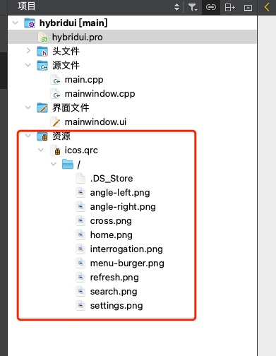

## Action的功能和实现

在UI中，"action" 是指用户与界面进行交互时触发的事件或操作。这些操作可以是点击按钮、输入文本、选择选项等等。通过执行动作，用户可以与应用程序进行沟通并引发相应的响应。通常，开发人员会编写代码来处理这些操作，以便根据用户的行为更新UI或执行特定的任务。

**trigger** action的信号

# 数据结构-容器

## 🚴QList

`list 列表  QList是Qt5的QVector ` 向量 应该不分配

- append();  					                        列表末添加数据
- prepend();                                             列表首位添加数据
- insert(int index,T value);                        插入数据 inse
- replace(int index ,T value);                     替换索引的数据
- at(int index);                                           查看数据，索引超出范围会抛出错误
- clear();                                                       清空数据
- size();                                                       列表长度
- resize(int size);                                        重新分配大小，不够的用默认值填充 int 是0
- reserve();                                                  给列表重新分配内存，但是不改变列表的长度
- count();                                                    没有参数 = size()
- count(T value);                                       返回Value出现的次数
- isEmpty();                                              判空
- remove();removeAt();removeAll();removeFirst();removeLast();     删除列表数据的一些操作
- takeAt();takeFirst();takeLast();                拿走列表里面的数据，从列表里面删除，并且返回要删除的元素

```c++
QList<int> myInt;
myInt << 1 << 2 << 3;  //重载了<< 相当于 myInt.append(1).append(2).append(3); 
myInt() =3;
```

### QObjectList

```c++
typedef Qlist<QObject*> QObjectList; //取别名， 是QObject的指针列表
```

## 🚴QStack

`栈 先进后出`

- push();
- pop();
- isEmpty();
- ```c++
  //code ... 
  QStack<QString> fuck;
  fuck.push("hello");
  fuck.push("kitty");
  while(!fuck.isEmpty())
      qDebug() << fuck.pop();
  ```

## 🚴QQueue

`队列 先进显出`

- enqueue();        #进队列
- dequeue();       //出队列
- isEmpty();         //判空
- head() ;            //返回第一个元素
- swap(QQueue `<T>`);    //交换队列

## 🚴QSet

`集合 去除重复元素`

- contains(T value)  -> bool;					//是否包含value
- values()-> QList `<T>`;                            //转换成 QList `<T>` 进行遍历
- remove(const T& value);  	               //移除某个原属
- ```c++
  //遍历Qset
  for(auto it=setString.begin();it !=setString.end();it++){
      qDebug() << *it;   //对迭代器解引用
  }

  //遍历方法2
  QList<QString> fuck=setString.values();
  for(int i=0;i<fuck.size();i++){
      qDebug() << fuck[i] ;
  }
  ```

## 🚴QMap

`有点像python 里面的字典 一个key 对应一个value`

**QMap<typename key,typename value>**

- operator[](key valut T=value())             // 重载[]  取值，赋值都可以的
- insert(key,value)                     //插入key，如果key存在，更新对应的value
- remove(key) ->int;                 //删除key key存在返回1 key不存在返回0
- find(key);                              //value
- clear();  ->void                        //清除
- contains()->bool;                   //是否包含
- key(value,default) ;             //通过key查找key,没有返回key的默认构造函数 或者自己赋
- value(key,default) ;                 //取值 ，如果key存在返回value，不存在返回default
- keys() -> QList `<key>`;       //返回key门的列表
- values()-> QList `<Values>`;   //返回values的列表
- count() ->int ;	            //返回key value 的个数
- keyBegin() ->;           //keys们的首个迭代器
- erase(iterator) ；   删除该迭代器所指向的key

## 🚴QMultiMap

`多重映射` 不支持 operator [] 运算符

**QMultiMap<class key,class value>**

```python
# key 可以重复
{"key1":"value1", 
	"key1":"value2",
	"key2":"other"};
```

- insert(key,value);
- value(key);
- values(keys) ->Qlist `<value>`;
- count();  返回个数，插入几个算几个，即使重复；
- isEmpty() ->bool;
- clear();
- remove(const Key &key) ->; 返回被移除的value 个数，可以为0
- remove(key ,value) -> ；移除key value 都配对的
- begin()  ->iterator;     返回第一个元素的迭代器
- end() ->iterator;            遍历用
- take() ;      //取走
- erase(const_iterator it);
- replace(const Key &key, const T &value)； 替换
- uniqueKeys() ->QList `<key>`                       返回keys的去处重复的QList

## 🚴QHash

`功能和QMap的功能和用法类似`

- **Qhash 比QMap的速度更快** (有可能QMap是基于二叉树自动排序，QHash用哈希表)
- key 比如 有operator < 运算符，和 operator ==

# Class 常用的类

## ✈️QVariant

万能的数据类型，可以存储任何的数据类型，很多库函数返回值都是QVariant 类型的

## ✈️QFlags

Qt里面有一个宏

```c++
#define Q_DECLARE_FLAGS(Flags, Enum)\
typedef QFlags<Enum> Flags; //枚举类型
#endif
```

Qt 里面有很多全局的enum 类型 在 `qfalgs.h` 里面

```c++
enum AlignmentFlag {
        AlignLeft = 0x0001,
        AlignLeading = AlignLeft,
        AlignRight = 0x0002,
        AlignTrailing = AlignRight,
  			AlignVCenter = 0x0080,
...}
  

//marco 宏
Q_DECLARE_FLAGS(Alignment, AlignmentFlag)
//宏生成 
typedef QFlags<WindowState> Alignment;

//类里面会一些函数比如
Qt::Alignment aligment();
void setAligment(Qt::Alignment);  

//其实这个函返回值是 或者函数参数是AlignmentFlag  枚举类型里面的枚举常量
//QT::AlignLeft  

//给窗口上的QLabel组建设置对齐方式:
ui->label->setAlignment(Qt::AlignLeft | Qt::AlignVcenter);

//实际上是创建一个对象
QFlags<Qt::AlignmentFlag> flags=Qt::AlignLeft| Qt::AlignVcenter;
ui->label->setAlignment(flags);


Qt::QFlags<Qt::alignmentFlag> flags=ui->label->aligment();	//先得到原来的对齐方式
flags ｜=Qt::AlignVCenter;										//异或一下中间
ui->label->setAlignment(flag);								//设置

```

## ✈️QRandomGenerator

**随机数生成器**

```c++


#include <QCoreApplication>
#include <QRandomGenerator>
#include <QList>
#include <QDateTime>

#define testing(x,y) qDebug() << x << ":" << y ;

int main(int argc, char *argv[])
{
    QCoreApplication a(argc, argv);

    /*  2个静态函数利用硬件自动生成随机种子 并且返回对象的指针
    */
    QRandomGenerator *randPtr=QRandomGenerator::system(); //返回值是指针类型
    QRandomGenerator *randPtr1=QRandomGenerator::global();
    QRandomGenerator rand=QRandomGenerator::securelySeeded(); //静态方法创建类

    QRandomGenerator randPtr2(1); //随机种子是固定的，每次生成的都一样

    /* NOTE::QDateTime::currentMSecsSinceEpoch();随机数种子
    */
    QRandomGenerator randPt3(QDateTime::currentMSecsSinceEpoch()); //随机数种子
    static int n=3;
    while(n--)testing("重载了括号运算符，变成了仿函数 -> ",randPtr2());

    QList<quint32> arr;
    arr.resize(3);
    /*填满数组arr只是一个对象， arr.data()才返回 内存地址*/
    randPtr->fillRange(arr.data(),arr.size());

    quint32 arr2[10];
    randPt3.fillRange<quint32,10>(arr2);  //调用类模版函数


    //一些接口
    quint32 num=rand.generate();            //32位随机数
    quint64 num2=rand.generate64();         //54位无符号整数
    double num3=rand.generateDouble();     // 0-1之间的浮点数
    double num4=rand.bounded(3.3);          //0 -3.3 之间
    int num5=rand.bounded(1,100);           //1-100之间

    /* NOTE:qDebug 类似 printf的打印
    */
    qDebug("randon number = %u",QRandomGenerator::system()->generate());

   
    return a.exec();
}

```

# 界面常用组件

## 🐱button相关组件

### 🐮button类的继承关系


## 🐱Input 相关组件

### 🐮 Show

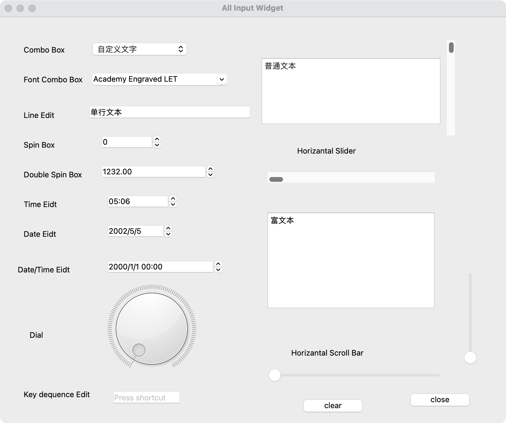

### 🐮说明


### 🐮input继承关系


## 🐱Display 相关组件

### 🐮说明


### 🐮Show


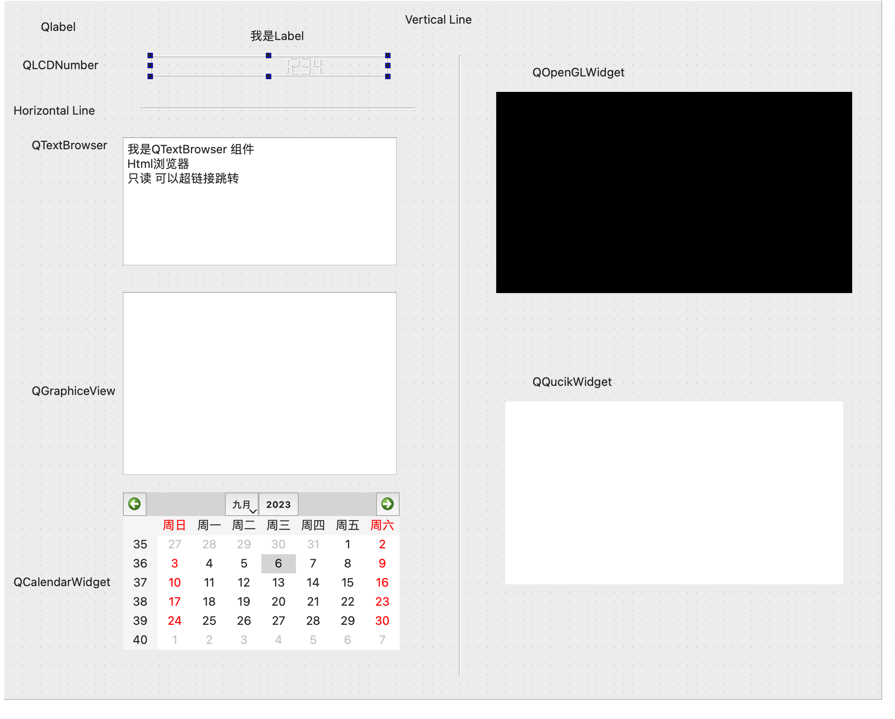

### 🐮Display继承关系们


## 🐱Container容器类组件

### 🐮说明


### 🐮Show

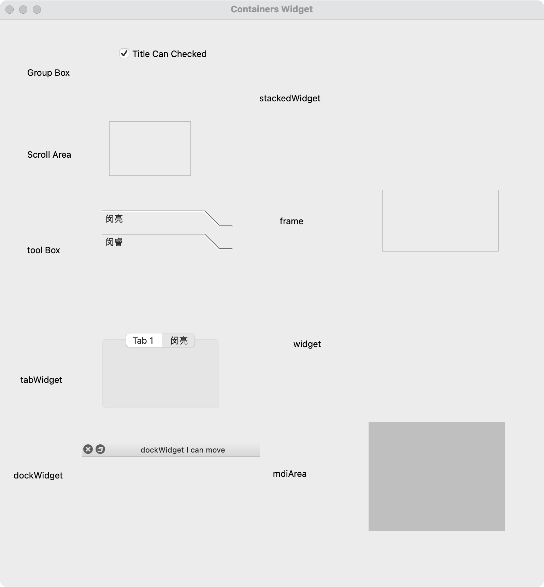</img>

### 🐮Container继承关系们


## 🐱Item 相关组件

### 🐮Item Show & Inherit


### 🐮Show

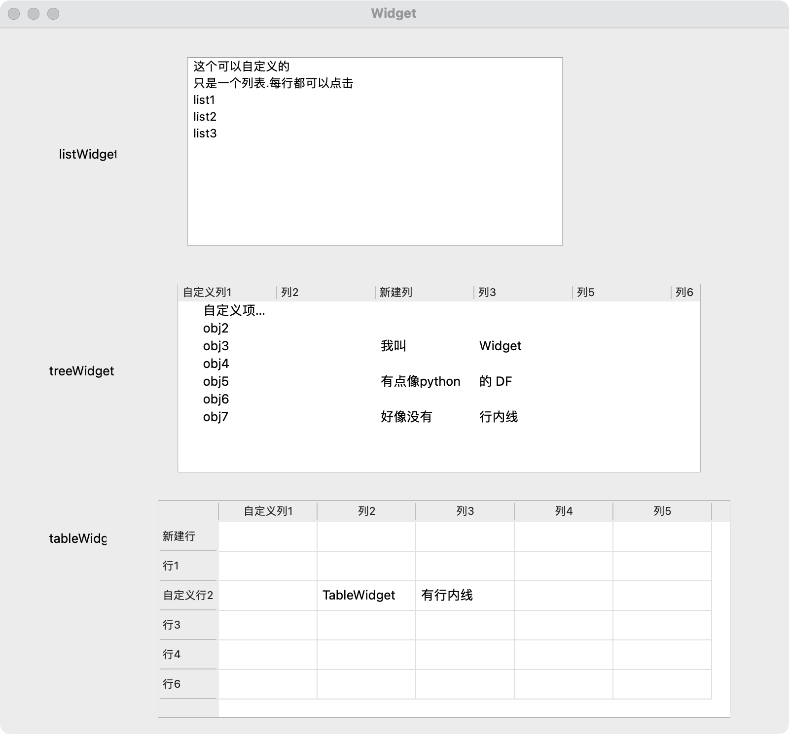

## 🐱Layout 布局管理相关组件


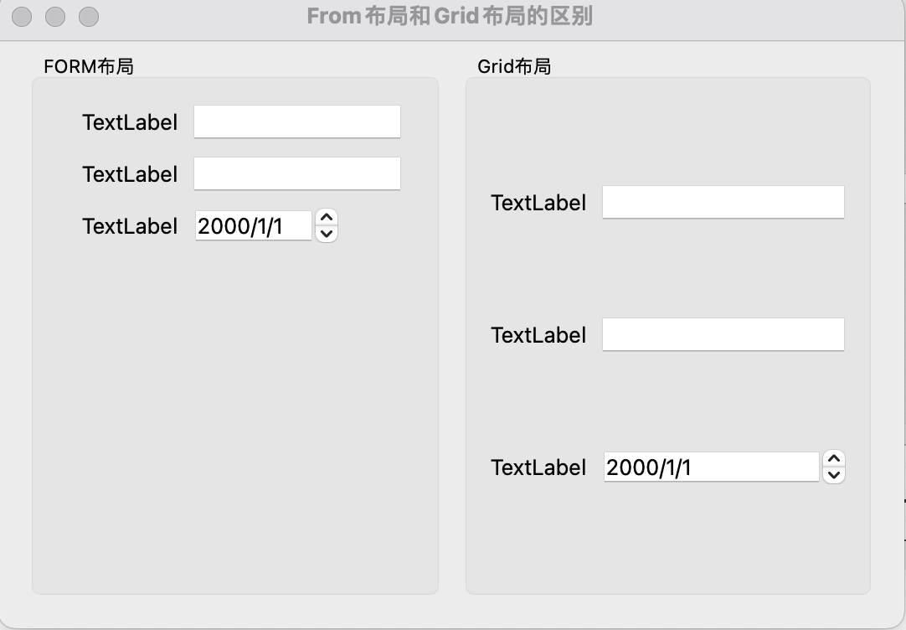

### 🐮QHBoxLayout 和QVBoxLayout

**QHBoxLayout QVBoxLayout都是继承QBoxLayout**

QHBoxLayout 是水平布局 QVBoxLayout是垂直布局

一般在一个容器内可以新建一个QVBoxLayout 水平布局；

**ui界面有layoutScrtch** 如果有三个部件，layoutScrtch的值设置为3个  1,1,2 比例回分成 1/4，1/4，1/2

或者用QSizePolicy类，实例QSizePolicy类之后 有setHorizontalStretch(int ratio)  ;//ratio为 比例 类似 1/4，1/4，1/2

```c++
QVBoxLayout Qvptr=new QVBoxLayout(parent = 容器指针);
//hor->setSpacing(10);                     //组件之间的距离设置为130px
//hor->setContentsMargins(10,10,10,10);     //四周的距离
Qvptr->addWidget(btn_pointer);
Qvptr->addWidget(btn_pointer);
Qvptr->addWidget(btn_pointer);

```

### 🐮QFormLayout

**网格布局,多个组件按照行和列实现网格状自动布局**

### 🐮QGridLayout

**表单布局，与QGridLayout功能相似,适用于两列组件的布局管理**

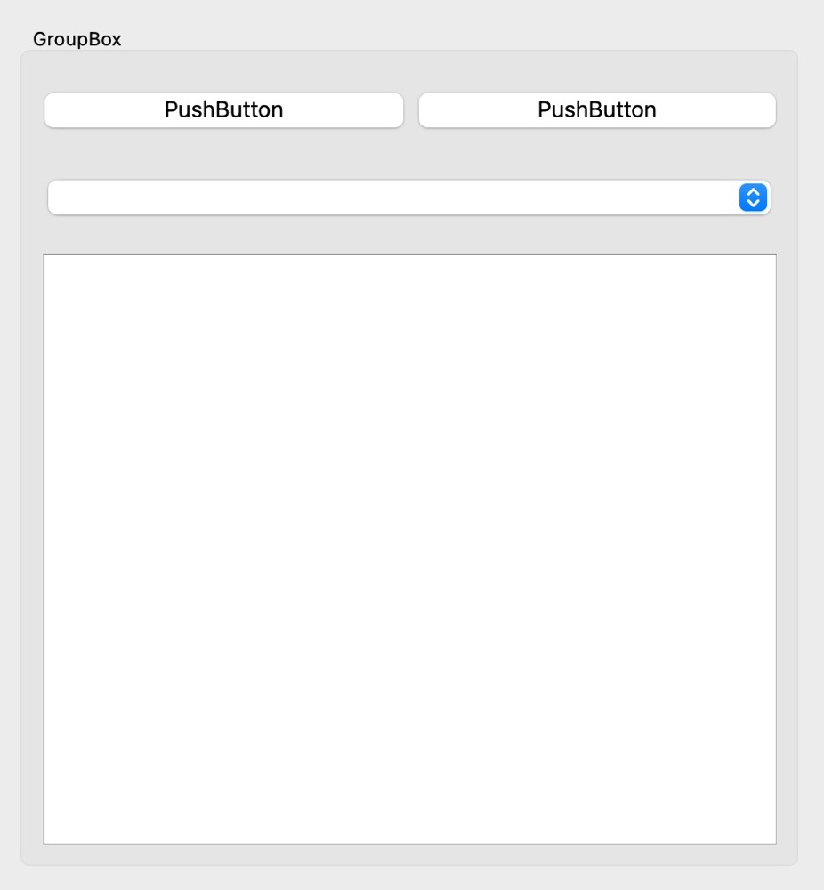

```c++
void setupUi(QWidget *Widget)
    {
        if (Widget->objectName().isEmpty())
            Widget->setObjectName(QString::fromUtf8("Widget"));
        Widget->resize(800, 600);
        groupBox = new QGroupBox(Widget);
        groupBox->setObjectName(QString::fromUtf8("groupBox"));
        groupBox->setGeometry(QRect(140, 60, 451, 491));  //容器搭建好框架设置好位置之后，把Layout添加进来就行了
        /*
        *   一下操作都是对Layout操作
        *   gridLayout 添加添加Widget的时候
        *void addWidget(QWidget *, int row, int column, Qt::Alignment = Qt::Alignment());
        *void addWidget(QWidget *, int row, int column, int rowSpan, int columnSpan, Qt::Alignment = Qt::Alignment());
        *void addLayout(QLayout *, int row, int column, Qt::Alignment = Qt::Alignment());
        *void addLayout(QLayout *, int row, int column, int rowSpan, int columnSpan, Qt::Alignment = Qt::Alignment());
        *  
        */
        gridLayout = new QGridLayout(groupBox);         //parent 为Group        
        gridLayout->setObjectName(QString::fromUtf8("gridLayout"));
        gridLayout->setHorizontalSpacing(7);          //组件的水平边距(像素)
        gridLayout->setVerticalSpacing(12);           //组件的垂直边距(像素)
        gridLayout->setContentsMargins(10, 10, 9, 9); //设置四周的边距(像素)
        btn1 = new QPushButton(groupBox);               //TODO::pushButton的parent为Group 不是Layout 
        btn1->setObjectName(QString::fromUtf8("btn1"));

        gridLayout->addWidget(btn1, 0, 0, 1, 1);     //0011代表 组件添加到第0行第0列 占用1行1列

        btn2 = new QPushButton(groupBox);
        btn2->setObjectName(QString::fromUtf8("btn2"));

        gridLayout->addWidget(btn2, 0, 1, 1, 1);     //0111代表 组件添加到第0行第0列 占用1行1列
        comboBox = new QComboBox(groupBox);              //parent 为Group  
        comboBox->setObjectName(QString::fromUtf8("comboBox"));
        gridLayout->addWidget(comboBox, 1, 0, 1, 2);  //1012代表组件添加到 第1行第0列 占用1行2列
        plainTextEdit = new QPlainTextEdit(groupBox);
        plainTextEdit->setObjectName(QString::fromUtf8("plainTextEdit"));
        gridLayout->addWidget(plainTextEdit, 2, 0, 1, 2); //2012代表组件添加到第2行第0列 占用1行2列
        /*
         *     void setRowMinimumHeight(int row, int minSize);  //设置第几行的 最低尺寸
         *     void setColumnMinimumWidth(int column, int minSize);
        */
        gridLayout->setRowMinimumHeight(0, 40);     //第0行最低尺寸为40px
        gridLayout->setRowMinimumHeight(1, 40);
        gridLayout->setRowMinimumHeight(2, 40);

        retranslateUi(Widget);

        QMetaObject::connectSlotsByName(Widget);
    } // setupUi
```

### 🐮QSplitter

**分隔条** 水平线可以移动的


```c++
    void setupUi(QWidget *Widget)
    {
        if (Widget->objectName().isEmpty())
            Widget->setObjectName(QString::fromUtf8("Widget"));
        Widget->resize(800, 600);
        //设置Parent
        splitter = new QSplitter(Widget);
        splitter->setObjectName(QString::fromUtf8("splitter"));
        //设置坐标
        splitter->setGeometry(QRect(0, 100, 800, 400));
        //设置最小尺寸
        splitter->setMinimumSize(QSize(600, 400));
        //设置策略 水平 或者垂直
        splitter->setOrientation(Qt::Horizontal);
      

        groupBox = new QGroupBox(splitter);
        groupBox->setObjectName(QString::fromUtf8("groupBox"));
      
        //分割条添加小部件
        splitter->addWidget(groupBox);
        plainTextEdit = new QPlainTextEdit(splitter);
        plainTextEdit->setObjectName(QString::fromUtf8("plainTextEdit"));
        splitter->addWidget(plainTextEdit);

        retranslateUi(Widget);

        QMetaObject::connectSlotsByName(Widget);
    } // setupUi
```

## 🐯 其他组件

有一些常用的组件 没有出现在Qt Designer里面

`QdMenuBar`	菜单栏

`QMenu` 	菜单

`QToolBar` 	工具栏

`QStatusBar`	状态栏

## 💻QWidget 的主要功能

### 📱QWidget 的主要功能

```c++ 
class Qwidget{
  	//enabled
 		//使能 当为true的时候 才可以对widget 进行操作
  	Q_PROPERTY(bool enabled READ isEnabled WRITE setEnabled)

    //geometry
    //几何坐标相关
    Q_PROPERTY(QRect geometry READ geometry WRITE setGeometry)

    //sizePolicy
    //组件的默认布局
    Q_PROPERTY(QSizePolicy sizePolicy READ sizePolicy WRITE setSizePolicy)

    //最大 最小尺寸
    Q_PROPERTY(QSize minimumSize READ minimumSize WRITE setMinimumSize)
    Q_PROPERTY(QSize maximumSize READ maximumSize WRITE setMaximumSize)

    //palette 组件的调色板，定义了一些特定部分的颜色，比如背景颜色，文字颜色等
    Q_PROPERTY(QPalette palette READ palette WRITE setPalette)
  
  
    //Font 字体 
    //组件使用的字体，字体名称，大小 粗体 斜体 等
    Q_PROPERTY(QFont font READ font WRITE setFont)
  
    //cursor
    //光标移动到组件上的形状
    Q_PROPERTY(QCursor cursor READ cursor WRITE setCursor RESET unsetCursor)
  
    //mouseTracking
    //若为True 只要鼠标在组件上移动，组件就能收到鼠标移动时间，否则只有鼠标被按下的时候，组件才会接受鼠标移动时间
    Q_PROPERTY(bool mouseTracking READ hasMouseTracking WRITE setMouseTracking)
  
    //contextMenuPolicy
    //组件的上下文策略，点击鼠标右键的时候 弹出的快捷菜单
    Q_PROPERTY(Qt::ContextMenuPolicy contextMenuPolicy READ contextMenuPolicy WRITE setContextMenuPolicy)
  
  
    //acceptDrops
    //是否接受拖动来的其他对象
    Q_PROPERTY(bool acceptDrops READ acceptDrops WRITE setAcceptDrops)
  
  
    //toolTip
    //鼠标移动到组件的时候,在光标出显示的简短提示
    Q_PROPERTY(QString toolTip READ toolTip WRITE setToolTip)
  
    //statusTip
    //鼠标移动到组件上的时候，在主窗口状态栏显示的提示文字，显示2秒后消失
    Q_PROPERTY(QString statusTip READ statusTip WRITE setStatusTip)
  
    //autoFillBackground
    //组件的背景是否自动填充，如果组件使用样式表设定了背景色，这个属性会被自动设置为false
    Q_PROPERTY(bool autoFillBackground READ autoFillBackground WRITE setAutoFillBackground)
  
    //styleSheet
    //样式表 定义界面的显示效果
    Q_PROPERTY(QString styleSheet READ styleSheet WRITE setStyleSheet)
  
    //tableTracking
    //平板电脑模式相关，或者鼠标笔
    Q_PROPERTY(bool tabletTracking READ hasTabletTracking WRITE setTabletTracking)
  
    //focusPolicy
    //组件的焦点策略，表示组件获取焦点的方式 
    Q_PROPERTY(Qt::FocusPolicy focusPolicy READ focusPolicy WRITE setFocusPolicy)
  
  
};
```

## 💻QWidget 作为窗口的属性

#### QSizePloicy 尺寸策略

```c++
//新建一个尺寸策略
QSizePolicy sizePolicy1(QSizePolicy::Preferred, QSizePolicy::Preferred);  //小部件的宽度和高度的策略 


QSizePloicy 类里面的枚举类型，构造函数需要两个参数，分别是水平策略和 垂直策略
QSizePloicy::fixed 						固定尺寸
QSizePloicy::Minimun 					最小尺寸 拖动窗口后达到最小尺寸就不再小了
QSizePloicy::Maximum 					最大尺寸 拖动窗口后达到最大尺寸就不再小了
QSizePloicy::Perferred 				首选尺寸,//使用sizeHits() 返回最有尺寸，组件可以缩放，但是不回超过sizeHits()的返回值
QSizePloicy::Expanding 				可拓展尺寸
QSizePloicy::Minimumexpanding 最小可扩展尺寸
QSizePloicy::Ignored 					 忽略尺寸
```

```c++
//一个新的Widget boxGroup
box2 = new QGroupBox(Widget);
//设置名字object_name
box2->setObjectName(QString::fromUtf8("box2"));

//新建一个尺寸策略
QSizePolicy sizePolicy1(QSizePolicy::Preferred, QSizePolicy::Preferred);

//水平伸展比例  如果有三个 Widget
//水平伸展分别是 5 2 5
//他们所占的比例分别是总尺寸的 5/12 2/12 5/12

sizePolicy1.setHorizontalStretch(2);
//垂直伸展 没有设置
sizePolicy1.setVerticalStretch(0);
//这一句美看懂
sizePolicy1.setHeightForWidth(box2->sizePolicy().hasHeightForWidth());

//小部件设置尺寸策略
box2->setSizePolicy(sizePolicy1);
```

## 💻QWidget作为主要窗口的属性

### 📱属性

```c++
class Qwidget{
  //窗口标题栏上的文字
Q_PROPERTY(QString windowTitle READ windowTitle WRITE setWindowTitle NOTIFY windowTitleChanged)
  
  //窗口的图标
Q_PROPERTY(QIcon windowIcon READ windowIcon WRITE setWindowIcon NOTIFY windowIconChanged)
  
  //窗口的不透明度 取值范围0.0 - 1.0  默认1.0
  Q_PROPERTY(double windowOpacity READ windowOpacity WRITE setWindowOpacity)
  
  //窗口相关包含路径的文件名称 只有在windows上获取才有意义
  Q_PROPERTY(QString windowFilePath READ windowFilePath WRITE setWindowFilePath)
  
  //表示窗口的文档是否被修改
  Q_PROPERTY(bool windowModified READ isWindowModified WRITE setWindowModified)
}
```

### 📱其他借口函数

```c++
class Qwidget{
	void close();									//窗口关闭
  void hide();									//窗口隐藏
  void show();									//窗口显示
  void showFullScreen();				//窗口全屏
  void showMaximized();					//窗口最大化
  void showMinimized();					//窗口最小化
  void ShowNormal();						//全屏，最大化最小化之后，回复正常大小
}
```

📱槽Slot函数

```c++
class Qwidget{
Q_SIGNALS:
  //标题被改
    void windowTitleChanged(const QString &title);
  //图标被改
    void windowIconChanged(const QIcon &icon);
    void windowIconTextChanged(const QString &iconText);
  
  //鼠标点击右键的时候被发射
    void customContextMenuRequested(const QPoint &pos);
    }
```
