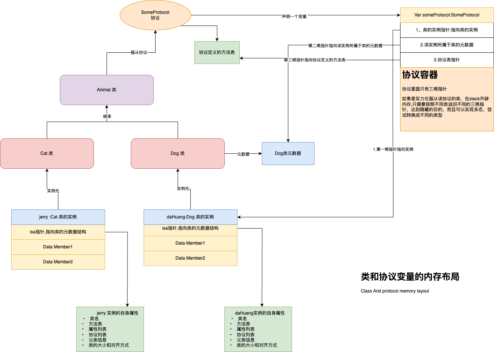
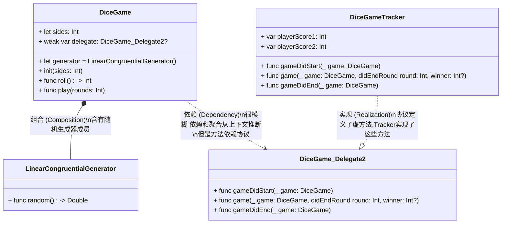
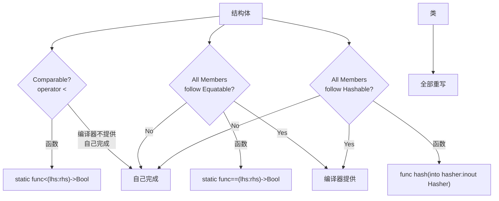
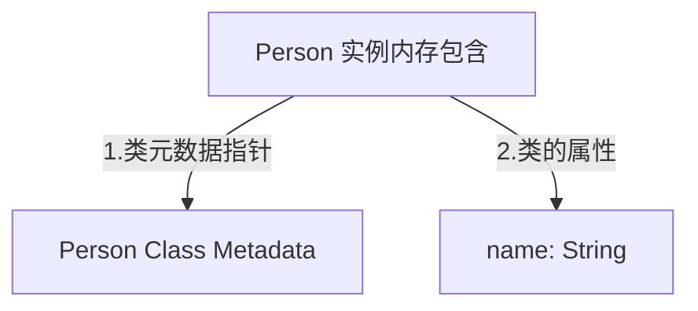
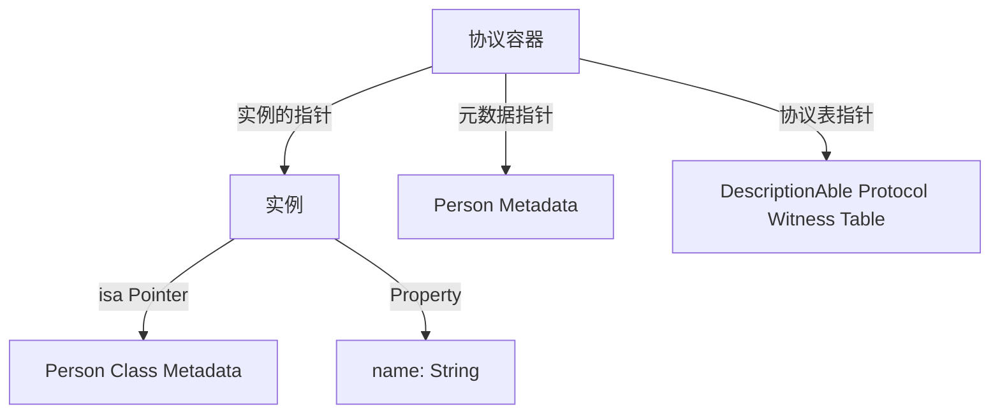
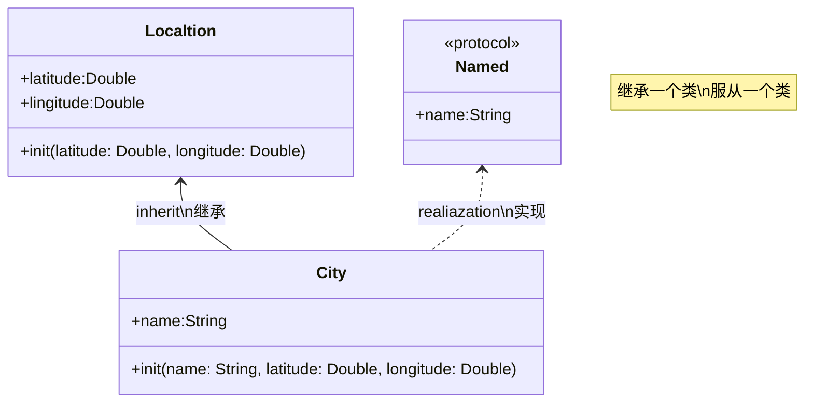
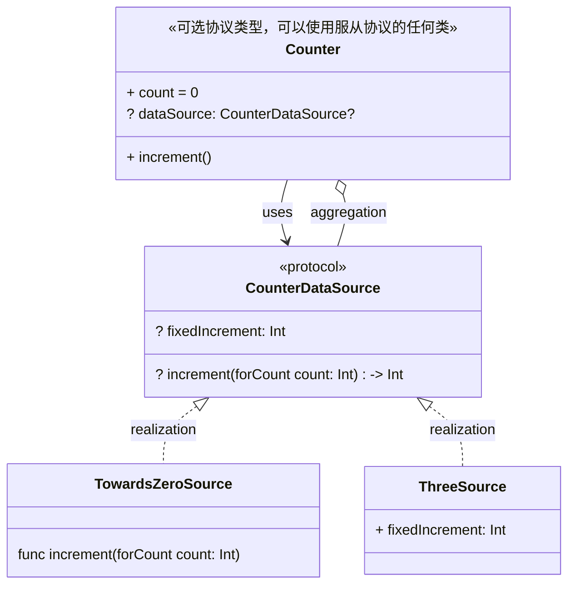
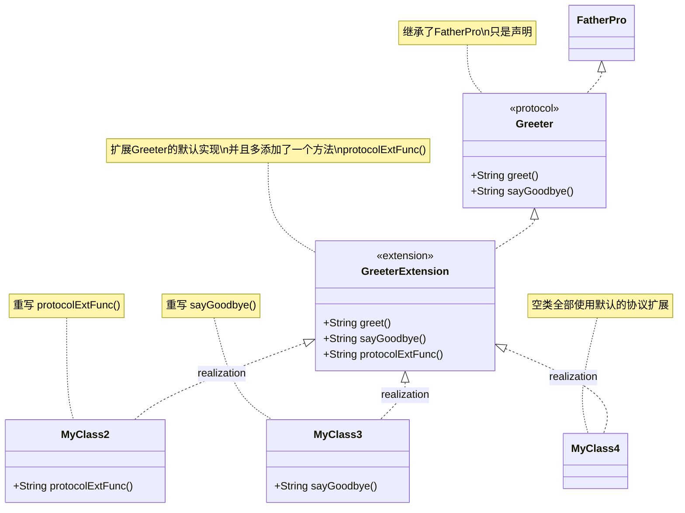

## Protocol协议

定义符合类型必须实现的要求。

协议定义了适合特定任务或功能的方法、属性和其他要求的蓝图。然后，类、结构或枚举可以采用该协议来提供这些要求的实际实现。任何满足协议要求的类型都被称为符合该协议。

除了指定符合类型必须实现的要求之外，您还可以扩展协议来实现其中一些要求或实现符合类型可以利用的附加功能。

**内存布局**




### 1.协议语法

您定义协议的方式与类、结构和枚举非常相似：

```swift
protocal SomeProtocol{
	//protocol definition goes here
}
```

自定义类型声明它们采用特定的协议，将协议名称放在类型名称后面，并用冒号分隔，作为其定义的一部分。可以列出多个协议，并用逗号分隔：

```swift
struct SomeStructure: FirstProtocol, AnotherProtocol {
    // structure definition goes here
}
```

如果一个类有一个超类，请在它采用的任何协议之前列出超类名称，后跟一个逗号：

> **Note**：继承超类并且服从协议的时候，超类写在最前面

```swift
class SomeClass: SomeSuperclass, FirstProtocol, AnotherProtocol {
    // class definition goes here
}
```


#### 1.1 泛型协议语法

```swift
protocol TemplateProtocol{
  associatedType item 	//声明一个占位符
  
}
```


> **Note**:因为协议是类型，所以它们的名称以大写字母开头（例如 `FullyNamed` 和 `RandomNumberGenerator` ），以匹配 Swift 中其他类型的名称（例如 `Int` 、 `String` 和 `Double` ）。


### 2.存储属性要求

协议可以要求任何符合类型提供具有特定名称和类型的实例属性或类型属性。该协议没有指定属性应该是存储属性还是计算属性 - **协议只指定所需的属性名称和类型**。该协议还指定每个属性是否必须是可获取的，或者是可获取且可设置的。


如果协议要求属性可获取和可设置，则常量存储属性或只读计算属性无法满足该属性要求。如果协议仅要求属性可获取，则任何类型的属性都可以满足该要求，并且如果这对您自己的代码有用，则该属性也是可设置的也是有效的。

属性要求始终声明为变量属性，并以 `var` 关键字为前缀。可获取和可设置的属性通过在类型声明后写入 `{ get set }` 来表示，可获取的属性通过写入 `{ get }` 来表示。


```swift
protocol SomeProtocol {
    var mustBeSettable: Int { get set }
    var doesNotNeedToBeSettable: Int { get }
}
```


在协议中定义类型属性要求时，始终使用 `static` 关键字作为前缀。即使类型属性要求在由类实现时可以使用 `class` 或 `static` 关键字作为前缀，但该规则仍然适用：

```swift
protocol AnotherProtocol {
    static var someTypeProperty: Int { get set }
}
```

以下是具有单实例属性要求的协议示例：

```swift
protocol FullyNamed {
    var fullName: String { get }
}
```


`FullyNamed` 协议需要一致的类型来提供完全限定的名称。该协议没有指定有关一致类型性质的任何其他内容 - 它只指定该类型必须能够为自身提供全名。该协议规定任何 `FullyNamed` 类型都必须具有名为 `fullName` 的可获取实例属性，该属性的类型为 `String` 。

下面是一个采用并符合 `FullyNamed` 协议的简单结构示例：

```swift
struct Person: FullyNamed {
    var fullName: String
}
let john = Person(fullName: "John Appleseed")
// john.fullName is "John Appleseed"
```

此示例定义了一个名为 `Person` 的结构，它表示特定的指定人员。它声明它采用 `FullyNamed` 协议作为其定义第一行的一部分。

`Person` 的每个实例都有一个名为 `fullName` 的存储属性，其类型为 `String` 。这符合 `FullyNamed` 协议的单一要求，并且意味着 `Person` 已正确符合该协议。 （如果未满足协议要求，Swift 将在编译时报告错误。）

这是一个更复杂的类，它也采用并符合 `FullyNamed` 协议：

```swift
class Starship: FullyNamed {
    var prefix: String?
    var name: String
    init(name: String, prefix: String? = nil) {
        self.name = name
        self.prefix = prefix
    }
    var fullName: String {
        return (prefix != nil ? prefix! + " " : "") + name
    }
}
var ncc1701 = Starship(name: "Enterprise", prefix: "USS")
// ncc1701.fullName is "USS Enterprise"
```

此类将 `fullName` 属性要求实现为星舰的计算只读属性。每个 `Starship` 类实例都存储一个必需的 `name` 和一个可选的 `prefix` 。 `fullName` 属性使用 `prefix` 值（如果存在），并将其添加到 `name` 的开头以创建星舰的全名。


### 3. 方法要求

协议可能要求特定的实例方法和类型方法由一致的类型来实现。这些方法作为协议定义的一部分编写，其方式与普通实例和类型方法完全相同，但没有花括号或方法体。允许使用可变参数，但遵循与普通方法相同的规则。但是，**不能为协议定义中的方法参数指定默认值**。

与类型属性要求一样，在协议中定义类型方法要求时，您始终使用 `static` 关键字作为前缀。即使类型方法要求在由类实现时以 `class` 或 `static` 关键字为前缀，情况也是如此：

```swift
protocol SomeProtocol {
    static func someTypeMethod()
}
```

以下示例定义了具有单实例方法要求的协议：

```swift
protocol SomeProtocol {
    static func someTypeMethod()
}
```

此协议 `RandomNumberGenerator` 要求任何符合类型都具有名为 `random` 的实例方法，每当调用该方法时，该方法都会返回 `Double` 值。尽管它没有被指定为协议的一部分，但假设该值是从 `0.0` 到（但不包括） `1.0` 的数字。

`RandomNumberGenerator` 协议不会对如何生成每个随机数做出任何假设 - 它只是要求生成器提供生成新随机数的标准方法。

下面是一个采用并符合 `RandomNumberGenerator` 协议的类的实现。此类实现了称为线性同余生成器的伪随机数生成器算法：

```swift
class LinearCongruentialGenerator: RandomNumberGenerator {
    var lastRandom = 42.0
    let m = 139968.0
    let a = 3877.0
    let c = 29573.0
    func random() -> Double {
        lastRandom = ((lastRandom * a + c)
            .truncatingRemainder(dividingBy:m))
        return lastRandom / m
    }
}
let generator = LinearCongruentialGenerator()
print("Here's a random number: \(generator.random())")
// Prints "Here's a random number: 0.3746499199817101"
print("And another one: \(generator.random())")
// Prints "And another one: 0.729023776863283"
```


### 4.编译方法要求

有时，方法需要修改（或变异）它所属的实例。例如，值类型（即结构和枚举）上的方法可以将 `mutating` 关键字放在方法的 `func` 关键字之前，以指示该方法可以修改它所属的实例以及该实例的任何属性。从实例方法内修改值类型中描述了此过程。

如果您定义的协议实例方法要求旨在改变采用该协议的任何类型的实例，请使用 `mutating` 关键字标记该方法作为协议定义的一部分。这使得结构和枚举能够采用协议并满足该方法要求。

>
>
>**Note**:类可以不需要mutating 但是枚举和struct需要


下面的示例定义了一个名为 `Togglable` 的协议，它定义了一个名为 `toggle` 的单个实例方法要求。顾名思义， `toggle()` 方法旨在切换或反转任何符合类型的状态，通常是通过修改该类型的属性来实现。

`toggle()` 方法用 `mutating` 关键字标记，作为 `Togglable` 协议定义的一部分，以指示该方法预计会改变一致实例的状态当它被调用时：

```swift
protocol Togglable {
    mutating func toggle()
}
```

如果您为结构或枚举实现 `Togglable` 协议，则该结构或枚举可以通过提供也标记为 `mutating`

下面的示例定义了一个名为 `OnOffSwitch` 的枚举。此枚举在两种状态之间切换，由枚举情况 `on` 和 `off` 指示。枚举的 `toggle` 实现标记为 `mutating` ，以匹配 `Togglable` 协议的要求：

```swift
enum OnOffSwitch: Togglable {
    case off, on
    mutating func toggle() {
        switch self {
        case .off:
            self = .on
        case .on:
            self = .off
        }
    }
}
var lightSwitch = OnOffSwitch.off
lightSwitch.toggle()
// lightSwitch is now equal to .on
```


### 5.初始化要求

协议可能要求特定的初始化器由一致的类型来实现。您可以将这些初始值设定项编写为协议定义的一部分，其方式与普通初始值设定项完全相同，但没有大括号或初始值设定项主体：

```swift
protocol SomeProtocol {
    init(someParameter: Int)
}
```


#### 5.1初始化协议起要求的类实现

您可以在符合类上实现协议初始值设定项要求作为指定初始值设定项或便利初始值设定项。在这两种情况下，您都必须使用 `required` 修饰符标记初始值设定项实现：

> **Note:** **协议要求init的必须加上required关键字**
>
> 

```swift
class SomeClass: SomeProtocol {
    required init(someParameter: Int) {
        // initializer implementation goes here
    }
}
```

使用 `required` 修饰符可确保您在符合类的所有子类上提供初始化程序要求的显式或继承实现，以便它们也符合协议。

如果子类覆盖超类中的指定初始化程序，并且还实现了协议中匹配的初始化程序要求，请使用 `required` 和 `override` 修饰符标记初始化程序实现：

```swift
protocol SomeProtocol {
    init()
}


class SomeSuperClass {
    init() {
        // initializer implementation goes here
    }
}


class SomeSubClass: SomeSuperClass, SomeProtocol {
    // "required" from SomeProtocol conformance; "override" from SomeSuperClass
    required override init() {
        // initializer implementation goes here
    }
}
```


> **Note**:如果子类 继承了超类，并且 需要服从协议，需要加上关键字**required override** 声明是服从协议，并且重写超类的init构造函数


#### 5.2 可失败的初始化程序要求 TODO::不懂

协议可以为符合类型定义可失败的初始化程序要求，如可失败初始化程序中所定义。

可失败的初始值设定项要求可以通过符合类型的可失败或不可失败的初始值设定项来满足。不可失败的初始化器要求可以通过不可失败的初始化器或隐式解包的可失败初始化器来满足。


### 6.协议类型

**协议本身实际上并不实现任何功能**。无论如何，您都可以在代码中使用协议作为类型。

将**协议用作类型的最常见方法是将协议用作泛型约束**。具有泛型约束的代码可以使用符合协议的任何类型，并且特定类型由使用 API 的代码选择。例如，当您调用一个接受参数的函数并且该参数的类型是泛型时，调用方将选择该类型。

具有不透明类型的代码适用于符合协议的某种类型。基础类型在编译时是已知的，API 实现选择该类型，但该类型的标识对 API 的客户端是隐藏的。使用不透明类型可以防止 API 的实现细节通过抽象层泄露，例如，通过隐藏函数中的特定返回类型，并且仅保证该值符合给定的协议。

具有盒装协议类型的代码适用于在运行时选择的符合协议的任何类型。为了支持这种运行时灵活性，Swift 在必要时会添加一个间接级别——称为 box，这会产生性能成本。由于这种灵活性，Swift 在编译时不知道底层类型，这意味着你只能访问协议所需的成员。访问基础类型上的任何其他 API 都需要在运行时进行强制转换。

有关使用协议作为泛型约束的信息，请参阅泛型。有关不透明类型和盒装协议类型的信息，请参阅不透明和盒装协议类型。


#### 6.1 协议服从另外一个协议


```swift
protocol Valueable{
    associatedtype ValueType  //声明绑定一个类型，泛行
    var value:ValueType{
        get
    }
}


protocol Iterable:Valueable{
 						
    subscript(index:Int) -> ValueType? {get}  //协议里面可以直接用服从的协议里面的类型
}


class MyClasses:Iterable{
    typealias ValueType = Int
    var Value:ValueType = 0
    subscript(index:ValueType) -> ValueType?{
        return Value * index
    }
    var value: ValueType {
        get {Value}
        set {Value = newValue}
    }
}

```


### 7. Delegation 委托

委派是一种设计模式，它使类或结构能够将其某些职责移交给（或委派）另一种类型的实例。此设计模式是通过定义封装委派职责的协议来实现的，这样，符合类型（称为委派）就可以保证提供已委派的功能。委派可用于响应特定操作，或从外部源检索数据，而无需知道该源的基础类型。


下面的示例定义了一个骰子游戏和一个跟踪游戏进度的委托的嵌套协议：

```swift
class DiceGame {
    let sides: Int
    let generator = LinearCongruentialGenerator()
    weak var delegate: Delegate?


    init(sides: Int) {
        self.sides = sides
    }


    func roll() -> Int {
        return Int(generator.random() * Double(sides)) + 1
    }


    func play(rounds: Int) {
        delegate?.gameDidStart(self)
        for round in 1...rounds {
            let player1 = roll()
            let player2 = roll()
            if player1 == player2 {
                delegate?.game(self, didEndRound: round, winner: nil)
            } else if player1 > player2 {
                delegate?.game(self, didEndRound: round, winner: 1)
            } else {
                delegate?.game(self, didEndRound: round, winner: 2)
            }
        }
        delegate?.gameDidEnd(self)
    }


    protocol Delegate: AnyObject {
        func gameDidStart(_ game: DiceGame)
        func game(_ game: DiceGame, didEndRound round: Int, winner: Int?)
        func gameDidEnd(_ game: DiceGame)
    }
}
```


该 `DiceGame` 类实现了一个游戏，每个玩家轮流掷骰子，掷出最高数字的玩家赢得这一轮。它使用本章前面示例中的线性同余生成器来生成掷骰子的随机数。

该协议 `DiceGame.Delegate` 可用于跟踪骰子游戏的进度。由于 `DiceGame.Delegate` 该协议始终在骰子游戏的上下文中使用，因此它嵌套在 `DiceGame` 类中。协议可以嵌套在类型声明（如结构和类）中，只要外部声明不是泛型的。有关嵌套类型的信息，请参阅嵌套类型。

为了防止强引用循环，委托被声明为弱引用。有关弱引用的信息，请参阅类实例之间的强引用循环。将协议标记为仅类允许类声明 `DiceGame` 其委托必须使用弱引用。纯类协议的标识是其继承自 `AnyObject` ，如纯类协议中所述。

`DiceGame.Delegate` 提供了三种跟踪游戏进度的方法。这三种方法在上面 `play(rounds:)` 的方法中被合并到游戏逻辑中。当新游戏开始、新回合开始或游戏结束时， `DiceGame` 该类调用其委托方法。

由于该 `delegate` 属性是可选的 `DiceGame.Delegate` ，因此该 `play(rounds:)` 方法每次在委托上调用方法时都使用可选链接，如可选链接中所述。如果 `delegate` 该属性为 nil，则忽略这些委托调用。如果 `delegate` 该属性为 non-nil，则调用委托方法，并将其作为参数传递实例 `DiceGame` 。


下一个示例显示了一个名为 `DiceGameTracker` 的类，该类采用以下 `DiceGame.Delegate` 协议：

```swift
class DiceGameTracker: DiceGame.Delegate {
    var playerScore1 = 0
    var playerScore2 = 0
    func gameDidStart(_ game: DiceGame) {
        print("Started a new game")
        playerScore1 = 0
        playerScore2 = 0
    }
    func game(_ game: DiceGame, didEndRound round: Int, winner: Int?) {
        switch winner {
            case 1:
                playerScore1 += 1
                print("Player 1 won round \(round)")
            case 2: playerScore2 += 1
                print("Player 2 won round \(round)")
            default:
                print("The round was a draw")
        }
    }
    func gameDidEnd(_ game: DiceGame) {
        if playerScore1 == playerScore2 {
            print("The game ended in a draw.")
        } else if playerScore1 > playerScore2 {
            print("Player 1 won!")
        } else {
            print("Player 2 won!")
        }
    }
}
```


该 `DiceGameTracker` 类实现 `DiceGame.Delegate` 协议所需的所有三个方法。它使用这些方法在新游戏开始时将两个玩家的分数归零，在每轮结束时更新他们的分数，并在游戏结束时宣布获胜者。

以下是操作方法 `DiceGame` 和 `DiceGameTracker` 外观：

```swift
let tracker = DiceGameTracker()
let game = DiceGame(sides: 6)
game.delegate = tracker
game.play(rounds: 3)
// Started a new game
// Player 2 won round 1
// Player 2 won round 2
// Player 1 won round 3
// Player 2 won!
```




####  **总结**

委托的底层，我感觉像是协议里面全部定义成抽象基类，类似于c++的纯虚函数。

类似于一个饭店，把菜单写好，委托给厨师，但是厨师不知道是哪个，所以把菜单抽出来，定义成协议，以委托成不同的类


### 8. 通过扩展添加协议的一致性

即使您无权访问现有类型的源代码，您也可以扩展现有类型以采用并符合新协议。扩展可以向现有类型添加新的属性、方法和下标，因此能够添加协议可能需要的任何要求。有关扩展的更多信息，请参阅扩展。

> **Note:**当在扩展中将一致性添加到实例的类型时，类型的现有实例会自动采用并符合协议。


**定义一个协议 并且让class服从协议，并且定义协议里面的方法**

```swift
protocol someProtocol{
	func someMethod(); //协议接口
}

extension OtherClass:someProtocol{
  func someMethod(){
    //完成协议里面的方法
  }
}
```

例如，这个名为 `TextRepresentable` 的协议可以由任何能够表示为文本的类型来实现。这可能是对其自身的描述，或其当前状态的文本版本：

```swift
protocol TextRepresentable {
    var textualDescription: String { get }
}
```

上面的 `Dice` 类可以扩展为采用并符合 `TextRepresentable` ：

```swift
extension Dice: TextRepresentable {
    var textualDescription: String {
        return "A \(sides)-sided dice"
    }
}
```

此扩展采用新协议的方式与 `Dice` 在其原始实现中提供的方式完全相同。协议名称在类型名称之后提供，以冒号分隔，并且协议所有要求的实现在扩展的花括号内提供。

任何 `Dice` 实例现在都可以被视为 `TextRepresentable` ：

```swift
let d12 = Dice(sides: 12, generator: LinearCongruentialGenerator())
print(d12.textualDescription)
// Prints "A 12-sided dice"
```

同样， `SnakesAndLadders` 游戏类可以扩展为采用并符合 `TextRepresentable` 协议：

```swift
extension SnakesAndLadders: TextRepresentable {
    var textualDescription: String {
        return "A game of Snakes and Ladders with \(finalSquare) squares"
    }
}
print(game.textualDescription)
// Prints "A game of Snakes and Ladders with 25 squares"
```


### 9. 有条件的服从协议

> **Note:** 关键字 **Element**元素
>
> 当元素服从协议的时候，就服从协议

泛型类型可能仅在某些条件下才能满足协议的要求，例如当类型的泛型参数符合协议时。您可以通过在扩展类型时列出约束来使泛型类型有条件地符合协议。通过编写通用 `where` 子句，将这些约束写入您要采用的协议名称之后。有关通用 `where`子句的更多信息，请参阅通用Where 子句。

以下扩展使 `Array` 实例在存储符合 `TextRepresentable` 类型的元素时符合 `TextRepresentable` 协议。

```swift
//当元素服从协议的时候，就服从协议
extension Array: TextRepresentable where Element: TextRepresentable {
    var textualDescription: String {
        let itemsAsText = self.map { $0.textualDescription }
        return "[" + itemsAsText.joined(separator: ", ") + "]"
    }
}
let myDice = [d6, d12]
print(myDice.textualDescription)
// Prints "[A 6-sided dice, A 12-sided dice]"
```


### 10.通过拓展声明协议

如果一个类型已经符合协议的所有要求，但尚未声明它采用该协议，则可以使其采用具有空扩展名的协议：

```swift
protocol TextRepresentable {
	var textualDescription: String{
		get
	}
}

//类满足协议的要求，但是没有采用该协议
struct Hamster {
    var name: String
    var textualDescription: String {
        return "A hamster named \(name)"
    }
}

//让对象服从该协议
extension Hamster: TextRepresentable {}
```

现在，只要 `TextRepresentable` 是必需类型，就可以使用 `Hamster` 的实例：、

```swift
let simonTheHamster = Hamster(name: "Simon")

//显式的写 类型为某个协议 ，应该理解为服从该协议的对象 实现多态度
let somethingTextRepresentable: TextRepresentable = simonTheHamster
//调用协议的方法
print(somethingTextRepresentable.textualDescription)
// Prints "A hamster named Simon"

//Error:该协议没有声明该变量
print(virPointer.name)
```


> **Note**:类型不会满足协议的要求就会自动的采用协议，他们必须显式的声明 该类型采用该协议


### 11.采用综合实现的协议

在许多简单的情况下，Swift 可以自动为 `Equatable` 、 `Hashable` 和 `Comparable` 提供协议一致性。使用这种综合实现意味着您不必编写重复的样板代码来自己实现协议要求。


#### 11.1 Equatable

可以使用 == 

**Swift 为以下类型的自定义类型提供了 `Equatable` 的综合实现：**

- 仅存储符合 `Equatable` 协议的属性的结构
- 仅具有符合 `Equatable` 协议的关联类型的枚举
- 没有关联类型的枚举

要接收 `==` 的综合实现，请在包含原始声明的文件中声明与 `Equatable` 的一致性，而无需自己实现 `==` 运算符。 `Equatable` 协议提供了 `!=` 的默认实现。

```swift
struct Vector3D: Equatable {
    var x = 0.0, y = 0.0, z = 0.0
  //所有成员都服从了Equatable协议，编译器会自动生成以下实现
  	static func == (lhs:Vector3D,rhs:Vector3D) -> Bool{
      return lhs.x == rhs.y && lhs.x == rhs.y && lhs.x == rhs.y
    }
}


let twoThreeFour = Vector3D(x: 2.0, y: 3.0, z: 4.0)
let anotherTwoThreeFour = Vector3D(x: 2.0, y: 3.0, z: 4.0)
if twoThreeFour == anotherTwoThreeFour {
    print("These two vectors are also equivalent.")
}
// Prints "These two vectors are also equivalent."
```


#### 11.2 Hashable

Swift 为以下类型的自定义类型提供了 `Hashable` 的综合实现：

- 仅存储符合 `Hashable` 协议的属性的结构
- 仅具有符合 `Hashable` 协议的关联类型的枚举
- 没有关联类型的枚举

要接收 `hash(into:)` 的综合实现，请在包含原始声明的文件中声明与 `Hashable` 的一致性，而无需自己实现 `hash(into:)` 方法。

```swift
struct Point: Hashable {
    var x: Int
    var y: Int
  //所有成员都遵循了Hashable协议会自动实现以下函数
   func hash(into hasher: inout Hasher) {
        hasher.combine(x)
        hasher.combine(y)
    }
}

let pointSet: Set = [Point(x: 1, y: 2), Point(x: 1, y: 2)]
print(pointSet.count) // 输出: 1
```


> **Note**:
>
> **什么是哈希（Hashing）**
>
> 哈希是一种将数据转换为固定大小的整数值（通常称为哈希值或哈希码）的过程。这个整数值用于在哈希表中存储和快速查找数据。哈希函数需要满足以下几个条件：
>
> - **一致性**：对于同一个输入，哈希函数必须始终返回相同的输出。
>
> - **高效性**：计算哈希值应该是一个快速的操作。
> - **分布均匀**：哈希函数应尽量将输入数据均匀分布到哈希表的所有位置上，以减少碰撞。
>
> **为什么某些类型不可哈希**
>
> -  **不可变性**：对象的哈希值在其生命周期内不能改变。如果对象的哈希值在其作为键时发生变化，那么哈希表将无法正确定位该对象。
>
> -  **遵循** **Hashable** **协议**：对象必须实现hash(into:)方法和==操作符，用于计算哈希值和判断相等性。
>
> 


#### 11.3 Comparable

> **Note**：编译器不会自动生成 Comparable的实现,需要**自己实现static func < (lhs:rhs)函数**

Swift 为没有原始值的枚举提供了 `Comparable` 的综合实现。如果枚举具有关联类型，则它们都必须符合 `Comparable` 协议。要接收 `<` 的综合实现，请在包含原始枚举声明的文件中声明与 `Comparable` 的一致性，而无需自己实现 `<` 运算符。 **`Comparable` 协议的默认实现 `<=` 、 `>` 和 `>=` 提供了其余的比较运算符**。

下面的示例定义了一个 `SkillLevel` 枚举，其中包含针对初学者、中级和专家的案例。专家还根据他们拥有的星星数量进行排名。

```swift
enum SkillLevel: Comparable {
    case beginner
    case intermediate
    case expert(stars: Int)
}
var levels = [SkillLevel.intermediate, SkillLevel.beginner,
              SkillLevel.expert(stars: 5), SkillLevel.expert(stars: 3)]
for level in levels.sorted() {
    print(level)
}
// Prints "beginner"
// Prints "intermediate"
// Prints "expert(stars: 3)"
// Prints "expert(stars: 5)"
```


#### 11.4 总结

 **Equatable** 和 **Comparable** 协议因为是对两个成员进行操作，所以要把函数 定义成static

**Hashable** 只需要对 自己操作，所以不需要static


如果成员都服从了 Equatable 和 Hashable 协议 就不需要自己写了,编译器会自动生成(但是只是有 判断== 和可以hashing的功能)

但是 comparable 编译器不会自动生成，需要自己写



>  **Note**:
>
> 1.一个结构,没有明确服从Equatable 和 Hashable 只是拥有 判断相等和hashing的功能呢，但是不算服从Equatable，Hashable协议，如果明确的服从协议，全部需要重写重写函数


### 12. 协议类型合集

协议可以用作存储在集合（例如数组或字典）中的类型，如协议作为类型中所述。此示例创建一个 `TextRepresentable`内容的数组：

```swift
//声明为协议类型的数组
let things: [TextRepresentable] = [game, d12, simonTheHamster]
```

现在可以迭代数组中的项目，并打印每个项目的文本描述：(**只能打印协议里面的方法**)

```swift
for thing in things {
    print(thing.textualDescription)
}
// A game of Snakes and Ladders with 25 squares
// A 12-sided dice
// A hamster named Simon
```


#### 12.1协议变量的内存布局

> **Note**:**协议变量实际上是一个协议容器，分别有三根指针，当用协议去接收一个对象的时候，只能访问协议里面的方法，不暴露实例的其他接口**


普通类的成员 有元数据指针和存储属性



当复制给一个协议变量的时候，会使用协议类型(存在容器)




### 13.协议类型的类型转换

当你使用协议类型的变量去接收一个对象时，你只能通过该变量调用协议中定义的方法和属性。协议变量只暴露协议定义的接口，而不暴露具体类型的其他方法和属性。这是为了确保代码的灵活性和可维护性，因为协议可以被多种类型实现，而协议变量应该对这些不同的实现保持通用性。

**示例**

假设我们有一个协议DescriptionAble和两个遵循该协议的类型Person和Car：

```swift
protocol DescriptionAble {
    func describe() -> String
}

struct Person: DescriptionAble {
    var name: String
    func describe() -> String {
        return "Person: \(name)"
    }
    func sayHello() {
        print("Hello, my name is \(name)")
    }
}
struct Car: DescriptionAble {
    var model: String
    func describe() -> String {
        return "Car: \(model)"
    }
    func drive() {
        print("Driving \(model)")
    }
}
```

**使用协议变量**

当你使用协议类型的变量来接收对象时，只能调用协议中定义的方法：

```swift
let describable: DescriptionAble = Person(name: "Alice")
print(describable.describe())  // 输出: Person: Alice

// 下面的调用会出错，因为协议类型变量只能调用协议定义的方法
// describable.sayHello()  // 错误: 'DescriptionAble' 类型没有成员 'sayHello'

let anotherDescribable: DescriptionAble = Car(model: "Tesla Model S")
print(anotherDescribable.describe())  // 输出: Car: Tesla Model S

// 下面的调用会出错，因为协议类型变量只能调用协议定义的方法
// anotherDescribable.drive()  // 错误: 'DescriptionAble' 类型没有成员 'drive'
```

**访问具体类型的方法**

如果你需要访问具体类型的方法，可以进行类型转换（类型检查和强制转换）：

```swift
if let person = describable as? Person {
    person.sayHello()  // 输出: Hello, my name is Alice
} else if let car = describable as? Car {
    car.drive()  // 这个分支不会被执行
}
```

**类型转换示例**

以下是如何通过类型转换来调用具体类型的方法：

```swift
let describable: DescriptionAble = Person(name: "Alice")

// 类型检查和强制转换
if let person = describable as? Person {
    person.sayHello()  // 输出: Hello, my name is Alice
} else {
    print("Not a Person")
}

let anotherDescribable: DescriptionAble = Car(model: "Tesla Model S")

// 类型检查和强制转换
if let car = anotherDescribable as? Car {
    car.drive()  // 输出: Driving Tesla Model S
} else {
    print("Not a Car")
}
```


#### 13.1 协议转换类型示范

基类服从Soundable协议

派生类重写

用协议类型转尝试转换成派生类 实现多态

```swift


//定义一个协议
protocol Soundable{
    func makeSound() -> String
}

//抽象基类服从协议
class Animal:Soundable{
    var name:String
    
    init(name:String){
        self.name = name
    }
    
    func makeSound() ->String {
        return "\(self.name) MakeSound ...."
    }
}

class Cat:Animal{
//  自动继承 不用其他功能不用重写
//    override init(name:String){
//        super.init(name: name)
//    }
    override func makeSound()  ->String{
        return "Cat: " + super.makeSound()
    }
    
    func getInfo()->String{
        return "this is Cat names:\(self.name)"
    }
}

class Dog:Animal{
    override func makeSound()  ->String{
        return "Dog: " + super.makeSound()
    }
    
    func getInfo()->String{
        return "this is Dog and you can't get name"
    }
    
    func otherFunc() ->String{
        return "奥 奥 奥"
    }
}


let someProtocol:Soundable = Dog(name:"西瓜")

//一个协议尝试转换成不同的类。实现多态
if let someValue = someProtocol as? Dog{
    print(someValue.otherFunc())
}else if let someValue = someProtocol as? Cat{
    print(someValue.makeSound())
}else{
    print("协议转换失败")
}

```

**参考一下布局**


### 14.协议继承


协议可以继承一个或多个其他协议，并且可以在其继承的要求之上添加更多要求。协议继承的语法与类继承的语法类似，但可以选择列出多个继承的协议，以逗号分隔：

```swift
protocol InheritingProtocol: SomeProtocol, AnotherProtocol {
    // protocol definition goes here
}
```

这是继承上面的 `TextRepresentable` 协议的协议示例：

```swift
protocol PrettyTextRepresentable: TextRepresentable {
    var prettyTextualDescription: String { get }
}
```

此示例定义了一个新协议 `PrettyTextRepresentable` ，它继承自 `TextRepresentable` 。任何采用 `PrettyTextRepresentable` 的内容都必须满足 `TextRepresentable` 强制执行的所有要求，以及 `PrettyTextRepresentable`强制执行的附加要求。在此示例中， `PrettyTextRepresentable` 添加了一个要求，以提供一个名为 `prettyTextualDescription` 的可获取属性，该属性返回 `String` 。


`SnakesAndLadders` 类可以扩展以采用并符合 `PrettyTextRepresentable` ：

```swift
extension SnakesAndLadders: PrettyTextRepresentable {
    var prettyTextualDescription: String {
        var output = textualDescription + ":\n"
        for index in 1...finalSquare {
            switch board[index] {
            case let ladder where ladder > 0:
                output += "▲ "
            case let snake where snake < 0:
                output += "▼ "
            default:
                output += "○ "
            }
        }
        return output
    }
}
```

此扩展声明它采用 `PrettyTextRepresentable` 协议并为 `SnakesAndLadders` 类型提供 `prettyTextualDescription` 属性的实现。任何 `PrettyTextRepresentable` 也必须是 `TextRepresentable` ，因此 `prettyTextualDescription` 的实现首先从 `TextRepresentable` 属性。 /b7> 协议开始输出字符串。它附加一个冒号和一个换行符，并使用它作为其漂亮文本表示的开始。然后它迭代棋盘方块数组，并附加一个几何形状来表示每个方块的内容：

`prettyTextualDescription` 属性现在可用于打印任何 `SnakesAndLadders` 实例的漂亮文本描述：

```swift
print(game.prettyTextualDescription)
// A game of Snakes and Ladders with 25 squares:
// ○ ○ ▲ ○ ○ ▲ ○ ○ ▲ ▲ ○ ○ ○ ▼ ○ ○ ○ ○ ▼ ○ ○ ▼ ○ ▼ ○
```


### 15.只让类服从协议

> **Note**:加上关键字 `AnyObject` 结构和枚举会编译错误
>
> 当协议要求定义的行为假设或要求一致类型具有引用语义而不是值语义时，请使用仅类协议。有关引用和值语义的更多信息，请参阅结构和枚举是值类型和类是引用类型。

**您可以通过将 `AnyObject` 协议添加到协议的继承列表来将协议采用限制为类类型（而不是结构或枚举）。**

```swift
protocol SomeClassOnlyProtocol: AnyObject, SomeInheritedProtocol {
    // class-only protocol definition goes here
}
```

在上面的例子中， `SomeClassOnlyProtocol` 只能被类类型采用。编写尝试采用 `SomeClassOnlyProtocol` 的结构或枚举定义是一个编译时错误。


### 16. 协议组成

要求一种类型同时符合多个协议可能很有用。您可以使用协议组合将多个协议组合成一个需求。协议组合的行为就像您定义了一个临时本地协议，该协议具有组合中所有协议的组合要求。协议组合不定义任何新的协议类型。

协议组合的形式为 `SomeProtocol & AnotherProtocol` 。您可以根据需要列出任意多个协议，并用与号 ( `&` ) 分隔它们。除了协议列表之外，协议组合还可以包含一种类类型，您可以使用它来指定所需的超类。

下面是一个示例，它将两个名为 `Named` 和 `Aged` 的协议组合成函数参数的单个协议组合要求：

```swift
protocol Named {
    var name: String { get }
}
protocol Aged {
    var age: Int { get }
}

//服从两个协议
struct Person: Named, Aged {
    var name: String
    var age: Int
}
//服从两个协议的类型，两个协议用 & 链接
func wishHappyBirthday(to celebrator: Named & Aged) {
    print("Happy birthday, \(celebrator.name), you're \(celebrator.age)!")
}


let birthdayPerson = Person(name: "Malcolm", age: 21)
wishHappyBirthday(to: birthdayPerson)
// Prints "Happy birthday, Malcolm, you're 21!"
```

在此示例中， `Named` 协议对名为 `name` 的可获取 `String` 属性有一个单一要求。 `Aged` 协议对名为 `age` 的可获取 `Int` 属性有一个单一要求。这两种协议均采用名为 `Person` 的结构。

该示例还定义了一个 `wishHappyBirthday(to:)` 函数。 `celebrator` 参数的类型是 `Named & Aged` ，这意味着“同时符合 `Named` 和 `Aged` 协议的任何类型。”传递给函数的具体类型并不重要，只要它符合两个所需的协议即可。

然后，该示例创建一个名为 `birthdayPerson` 的新 `Person` 实例，并将该新实例传递给 `wishHappyBirthday(to:)` 函数。由于 `Person` 符合两种协议，因此该调用有效，并且 `wishHappyBirthday(to:)` 函数可以打印其生日祝福。

下面的示例将上一示例中的 `Named` 协议与 `Location` 类相结合：

```swift
class Location {
    var latitude: Double
    var longitude: Double
    init(latitude: Double, longitude: Double) {
        self.latitude = latitude
        self.longitude = longitude
    }
}
class City: Location, Named {
    var name: String
    init(name: String, latitude: Double, longitude: Double) {
        self.name = name
        super.init(latitude: latitude, longitude: longitude)
    }
}
func beginConcert(in location: Location & Named) {
    print("Hello, \(location.name)!")
}


let seattle = City(name: "Seattle", latitude: 47.6, longitude: -122.3)
beginConcert(in: seattle)
// Prints "Hello, Seattle!"
```




`beginConcert(in:)` 函数采用 `Location & Named` 类型的参数，这意味着“任何类型是 `Location` 的子类并且符合 `Named` 协议。”在本例中， `City` 满足这两个要求。


### 17.检查协议的一致性

您可以使用类型转换中描述的 `is` 和 `as` 运算符来检查协议一致性，并转换为特定协议。检查和转换为协议遵循与检查和转换为类型完全相同的语法：

- 如果实例符合协议，则 `is` 运算符返回 `true` ；如果不符合协议，则返回 `false` 。
- 向下转型运算符的 `as?` 版本返回协议类型的可选值，如果实例不符合该协议，则该值为 `nil` 。
- `as!` 版本的向下转型运算符会强制向下转型为协议类型，如果向下转型不成功，则会触发运行时错误。

此示例定义了一个名为 `HasArea` 的协议，具有名为 `area` 的可获取 `Double` 属性的单个属性要求：

```swift
protocol HasArea {
    var area: Double { get }
}
```

这里有两个类 `Circle` 和 `Country` ，它们都符合 `HasArea` 协议：

```swift
class Circle: HasArea {
    let pi = 3.1415927
    var radius: Double
    var area: Double { return pi * radius * radius }
    init(radius: Double) { self.radius = radius }
}
class Country: HasArea {
    var area: Double
    init(area: Double) { self.area = area }
}
```

`Circle` 类基于存储的 `radius` 属性将 `area` 属性要求实现为计算属性。 `Country` 类直接将 `area` 要求实现为存储属性。这两个类都正确符合 `HasArea` 协议。

这是一个名为 `Animal` 的类，它不符合 `HasArea` 协议：

```swift
class Animal {
    var legs: Int
    init(legs: Int) { self.legs = legs }
}
```

`Circle` 、 `Country` 和 `Animal` 类没有共享基类。尽管如此，它们都是类，因此所有三种类型的实例都可以用于初始化存储 `AnyObject` 类型值的数组：

```swift
let objects: [AnyObject] = [
    Circle(radius: 2.0),
    Country(area: 243_610),
    Animal(legs: 4)
]
```

`objects` 数组使用包含半径为 2 个单位的 `Circle` 实例的数组文字进行初始化；一个 `Country` 实例，初始化为英国的表面积（以平方公里为单位）；和一个有四条腿的 `Animal` 实例。

现在可以迭代 `objects` 数组，并且可以检查数组中的每个对象以查看它是否符合 `HasArea` 协议：

```swift
for object in objects {
    if let objectWithArea = object as? HasArea {
        print("Area is \(objectWithArea.area)")
    } else {
        print("Something that doesn't have an area")
    }
}
// Area is 12.5663708
// Area is 243610.0
// Something that doesn't have an area
```

每当数组中的对象符合 `HasArea` 协议时， `as?` 运算符返回的可选值就会通过可选绑定解包到名为 `objectWithArea` 的常量中。 `objectWithArea` 常量已知为 `HasArea` 类型，因此可以以类型安全的方式访问和打印其 `area` 属性。

请注意，转换过程不会更改底层对象。它们仍然是 `Circle` 、 `Country` 和 `Animal` 。但是，当它们存储在 `objectWithArea` 常量中时，仅知道它们是 `HasArea` 类型，因此只有它们的 `area` 属性可以访问。


### 18.可选协议要求


>
>
>**Note**:**@objc** 可以和objective-C 兼容 ,表示协议里面有可选方法，一些方法可能没有要求
>
>**@objc optional** **修饰符**：将协议中的方法和属性定义为可选的。


您可以定义协议的可选要求。这些要求不必由符合协议的类型来实现。可选要求以 `optional` 修饰符为前缀，作为协议定义的一部分。提供了可选要求，以便您可以编写与 Objective-C 互操作的代码。协议和可选要求都必须用 `@objc` 属性标记。请注意， **`@objc` 协议只能由类采用**，而不能由结构或枚举采用。

当您在可选需求中使用方法或属性时，其类型自动变为可选。例如， `(Int) -> String` 类型的方法变为 `((Int) -> String)?` 。请注意，整个函数类型都包含在可选值中，而不是方法的返回值中。


可以使用可选链来调用可选协议要求，以考虑该要求未由符合协议的类型实现的可能性。您可以通过在调用方法时在方法名称后面写一个问号来检查可选方法的实现，例如 `someOptionalMethod?(someArgument)` 。有关可选链的信息，请参阅可选链。

下面的示例定义了一个名为 `Counter` 的整数计数类，它使用外部数据源来提供其增量。该数据源由 `CounterDataSource` 协议定义，该协议有两个可选要求：

```swift
@objc protocol CounterDataSource {
    @objc optional func increment(forCount count: Int) -> Int
    @objc optional var fixedIncrement: Int { get }
}

```

`CounterDataSource` 协议定义了一个名为 `increment(forCount:)` 的可选方法要求和一个名为 `fixedIncrement` 的可选属性要求。这些要求定义了数据源为 `Counter` 实例提供适当增量的两种不同方式。

> **Note**:严格来说，您可以编写符合 `CounterDataSource` 的自定义类，而无需实现任一协议要求。毕竟它们都是可选的。尽管技术上允许，但这并不能成为一个非常好的数据源。

下面定义的 `Counter` 类具有 `CounterDataSource?` 类型的可选 `dataSource` 属性：

```swift
class Counter {
    var count = 0
    var dataSource: CounterDataSource?
    func increment() {
      	//当dataSource存在(非nil值)并且increment方法也存在的时候才会有返回值非ni l
        if let amount = dataSource?.increment?(forCount: count) {
            count += amount
        } else if let amount = dataSource?.fixedIncrement {
            count += amount
        }
    }
}
```

`Counter` 类将其当前值存储在名为 `count` 的变量属性中。 `Counter` 类还定义了一个名为 `increment` 的方法，每次调用该方法时都会递增 `count` 属性。

`increment()` 方法首先尝试通过在其数据源上查找 `increment(forCount:)` 方法的实现来检索增量。 `increment()`方法使用可选链接来尝试调用 `increment(forCount:)` ，并将当前 `count` 值作为该方法的单个参数传递。

请注意，这里有两个级别的可选链在起作用。首先， `dataSource` 可能是 `nil` ，因此 `dataSource` 在其名称后面有一个问号，表示 `increment(forCount:)` 应该是仅当 `dataSource` 不是 `nil` 时调用。其次，即使 `dataSource` 确实存在，也不能保证它实现 `increment(forCount:)` ，因为它是一个可选要求。这里， `increment(forCount:)` 可能无法实现的可能性也由可选链处理。仅当 `increment(forCount:)` 存在时，即不存在 `nil` 时，才会调用 `increment(forCount:)` 。这就是为什么 `increment(forCount:)` 的名字后面也写着一个问号。

由于对 `increment(forCount:)` 的调用可能因这两个原因之一而失败，因此该调用返回一个可选的 `Int` 值。即使 `increment(forCount:)` 被定义为在 `CounterDataSource` 定义中返回非可选 `Int` 值，情况也是如此。即使有两个可选的链接操作，一个接一个，结果仍然包装在一个可选中。有关使用多个可选链接操作的更多信息，请参阅链接多个级别的链接。

调用 `increment(forCount:)` 后，它返回的可选 `Int` 将使用可选绑定解包到名为 `amount` 的常量中。如果可选的 `Int`确实包含一个值 - 也就是说，如果委托和方法都存在，并且该方法返回一个值 - 未包装的 `amount` 将添加到存储的 `count`属性，增量完成。

如果无法从 `increment(forCount:)` 方法检索值 - 要么因为 `dataSource` 为零，要么因为数据源未实现 `increment(forCount:)` - 那么 `increment()` 方法尝试从数据源的 `fixedIncrement` 属性中检索值。 `fixedIncrement` 属性也是一个可选要求，因此它的值是可选的 `Int` 值，即使 `fixedIncrement` 被定义为非可选 `Int` 协议定义的一部分。

这是一个简单的 `CounterDataSource` 实现，其中数据源每次查询时都会返回一个常量值 `3` 。它通过实现可选的 `fixedIncrement` 属性要求来实现此目的：

```swift
class ThreeSource: NSObject, CounterDataSource {
    let fixedIncrement = 3
}
```

您可以使用 `ThreeSource` 实例作为新 `Counter` 实例的数据源：

```swift
var counter = Counter()
counter.dataSource = ThreeSource()
for _ in 1...4 {
    counter.increment()
    print(counter.count)
}
// 3
// 6
// 9
// 12
```

上面的代码创建了一个新的 `Counter` 实例；将其数据源设置为新的 `ThreeSource` 实例；并调用计数器的 `increment()`方法四次。正如预期的那样，每次调用 `increment()` 时，计数器的 `count` 属性都会增加 3。

这是一个更复杂的数据源，称为 `TowardsZeroSource` ，它使 `Counter` 实例从其当前 `count` 值向上或向下计数到零：


```swift
class TowardsZeroSource: NSObject, CounterDataSource {
    func increment(forCount count: Int) -> Int {
        if count == 0 {
            return 0
        } else if count < 0 {
            return 1
        } else {
            return -1
        }
    }
}
```

`owardsZeroSource` 类实现 `CounterDataSource` 协议中可选的 `increment(forCount:)` 方法，并使用 `count` 参数值来确定计数方向如果 `count` 已经为零，则该方法返回 `0` 以指示不应进行进一步计数。

> **Note**:	
>
> ​	•	**NSObject**：Objective-C的根类，为所有继承自它的类提供基础的对象行为和运行时特性。
>
> ​	•	**在Swift中的作用**：主要用于与Objective-C代码的互操作，并利用Objective-C运行时的一些特性。
>
> ​	•	**示例代码**：展示了如何通过继承NSObject和实现协议来创建与Objective-C兼容的Swift类。


您可以将 `TowardsZeroSource` 实例与现有 `Counter` 实例一起使用，以从 `-4` 计数到零。一旦计数器达到零，就不再进行计数：

```swift
counter.count = -4
counter.dataSource = TowardsZeroSource()
for _ in 1...5 {
    counter.increment()
    print(counter.count)
}
// -3
// -2
// -1
// 0
// 0
```





### 19.协议扩展和默认实现

#### 19.1 协议扩展

｜**Note**: 协议里面必须有扩展的必须都要实现，不能有只有声明，当函数调用方法的时候，优先调用自己写的方法，找不到再用扩展里面的

可以扩展协议以向一致类型提供方法、初始化器、下标和计算属性实现。这允许您在协议本身上定义行为，而不是在每种类型的单独一致性或全局函数中定义行为。

例如，可以扩展 `RandomNumberGenerator` 协议以提供 `randomBool()` 方法，该方法使用所需 `random()` 方法的结果返回随机 `Bool`

```swift
extension RandomNumberGenerator {
  //服从这个协议的，会优先调用自己写的，没有的话才会用这个
    func randomBool() -> Bool {
        return random() > 0.5
    }
}
```

通过在协议上创建扩展，所有符合标准的类型都会自动获得此方法实现，而无需任何额外的修改。

```swift
let generator = LinearCongruentialGenerator()
print("Here's a random number: \(generator.random())")
// Prints "Here's a random number: 0.3746499199817101"
print("And here's a random Boolean: \(generator.randomBool())")
// Prints "And here's a random Boolean: true"
```

协议扩展可以向一致类型添加实现，但不能使协议扩展或继承另一个协议。协议继承始终在协议声明本身中指定。


#### 19.2 默认实现

您可以使用协议扩展来为该协议的任何方法或计算属性要求提供默认实现。如果符合类型提供了所需方法或属性的自己的实现，则将使用该实现而不是扩展提供的实现。

> **Note**:
>
> 扩展提供的默认实现的协议要求与可选协议要求不同。尽管符合类型不必提供它们自己的实现，但可以在没有可选链接的情况下调用默认实现的需求。

例如，继承 `TextRepresentable` 协议的 `PrettyTextRepresentable` 协议可以提供其所需 `prettyTextualDescription` 属性的默认实现，以简单地返回访问 `textualDescription` 属性：

```swift
extension PrettyTextRepresentable  {
  	//默认的，当然也可以重写覆盖
    var prettyTextualDescription: String {
        return textualDescription
    }
}

```


#### 19.3 总结

```swift
protocol FatherPro{
    
}

//继承协议
protocol Greeter:FatherPro {
    func greet() -> String
    func sayGoodbye() -> String
}
//扩展协议
extension Greeter {
    func greet() -> String {
        return "Hello!"
    }
    
    func sayGoodbye() -> String {
        return "Goodbye!"
    }
    //多扩展了一个方法，并且实现了默认的两个方法
    func protocolExtFunc() ->String{
        return greet() + sayGoodbye()
    }
}

class MyClass2:Greeter {
    //重写扩展里面的方法,优先调用这个，不用加关键字 override
    func protocolExtFunc() ->String{
        "override from protocol"
    }
}


class MyClass3:Greeter{
    //重写一个，协议里面有protocolExtFunc 调用 两个函数 改写了其中一个实现多台
    func sayGoodbye() -> String {
        "xigua"
    }
    
}

//空类，全部使用默认的
class MyClass4:Greeter{
    
}

let class2 = MyClass2()
let class3 = MyClass3()
let class4 = MyClass4()

print(class2.protocolExtFunc()) //out: override from protocol
print(class3.protocolExtFunc()) //out: Hello!xigua
print(class4.protocolExtFunc()) //out: Hello!Goodbye
```





### 20.向协议扩展添加约束

定义协议扩展时，可以指定在扩展的方法和属性可用之前一致类型必须满足的约束。您可以通过编写通用 `where` 子句在要扩展的协议名称之后编写这些约束。有关通用 `where` 子句的更多信息，请参阅通用Where 子句。


例如，您可以定义 `Collection` 协议的扩展，该扩展适用于其元素符合 `Equatable` 协议的任何集合。通过将集合的元素限制为 `Equatable` 协议（Swift 标准库的一部分），您可以使用 `==` 和 `!=` 运算符来检查相等和不相等两个元素之间。


```swift
//可以这样理解,当所有成员服从Equatable的时候，该Collection的扩展才成立
extension Collection where Element: Equatable {
    func allEqual() -> Bool {
        for element in self {
            if element != self.first {
                return false
            }
        }
        return true
    }
}
```

考虑两个整数数组，一个所有元素都相同，另一个则不同：

```swift
//数组已经服从Collection协议了了
let equalNumbers = [100, 100, 100, 100, 100]
let differentNumbers = [100, 100, 200, 100, 200]
```

>  **Note**:如果一致类型满足为同一方法或属性提供实现的多个约束扩展的要求，则 Swift 将使用与最专业的约束相对应的实现


结构(所有成员变量已经服从Equatable)了 结构会自动服从，但是需要声明一下:

```swift
protocol Greeter{
    func greet()->String
    func sayGoodbye() ->String
}

extension Greeter{
    func greet()->String{
        return "Hello"
    }
    func sayGoodbye() ->String{
        return "GoodBye"
    }
}

//当自己服从 Equatable的时候就
extension Greeter where Self:Equatable{
    func compare(to other:Self) -> Bool{
        return self == other
    }
}
//结构已经可以func ==（）函数了，只要服从Equatable协议 就可以了
struct Person:Equatable,Greeter{
    var id:Int
    init( _ id:Int){
        self.id = id
    }
}

//extension Person:Equatable{}

let instance1 = Person( 1)
let instance2 = Person(1)

print(instance1.compare(to:instance2))
 
```


**class类服从Equatable要自己写函数**

```swift
extension Collection where Element:Equatable{
    func allSameValue()->Bool{
        for item in self{
            if item != self.first{
                return false
            }
            
        }
        return true
    }
}

let array1 = [100,100,100,100,100,100,100,100,100,100,100,100]
let array2 = [100,200,100,100,100,100]
print(array1.allSameValue())
print(array2.allSameValue())

let strArray = ["Hello","Hello","Hello","Hello","Hello"]
print(strArray.allSameValue())

//自己定义的类
class Others:Equatable{
    var value:Int  = 0
    static func == (lhs:Others,rhs:Others) ->Bool{
        return lhs.value == rhs.value
    }
}

let others:[Others] = [Others(),Others(),Others()]
print(others.allSameValue())

struct OthersStruct:Equatable{
    var value:Int  = 0
}

let othersStruct:[OthersStruct] = [OthersStruct(),OthersStruct(),OthersStruct()]
print(othersStruct.allSameValue())


```


