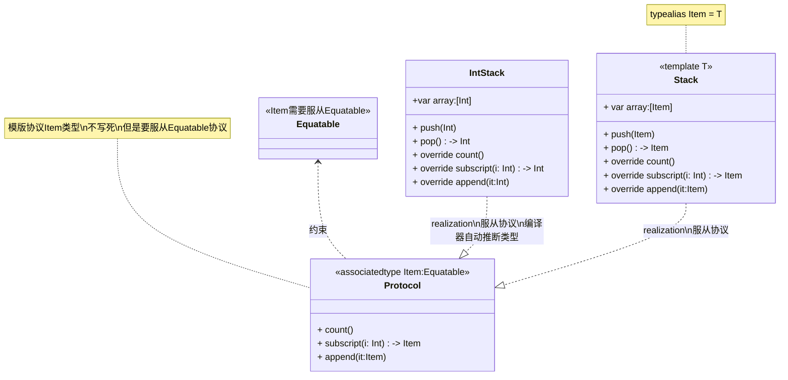
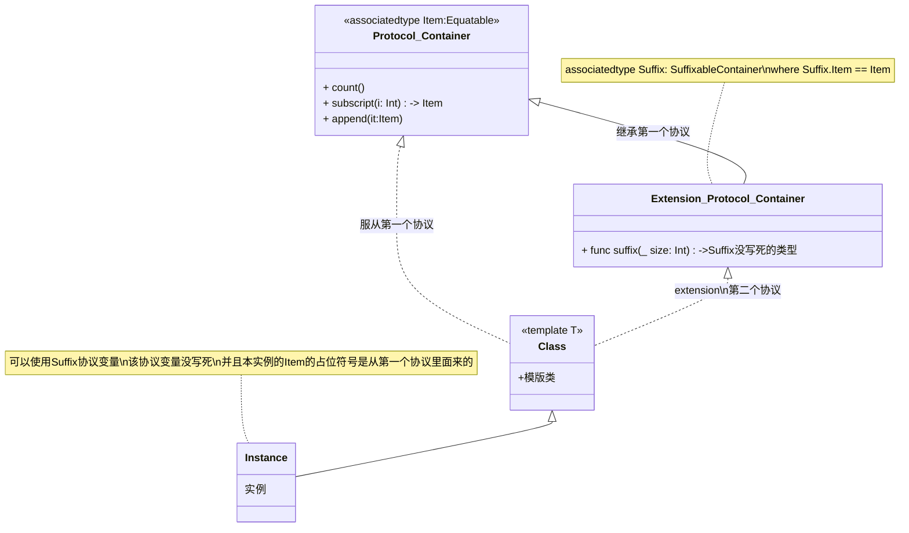
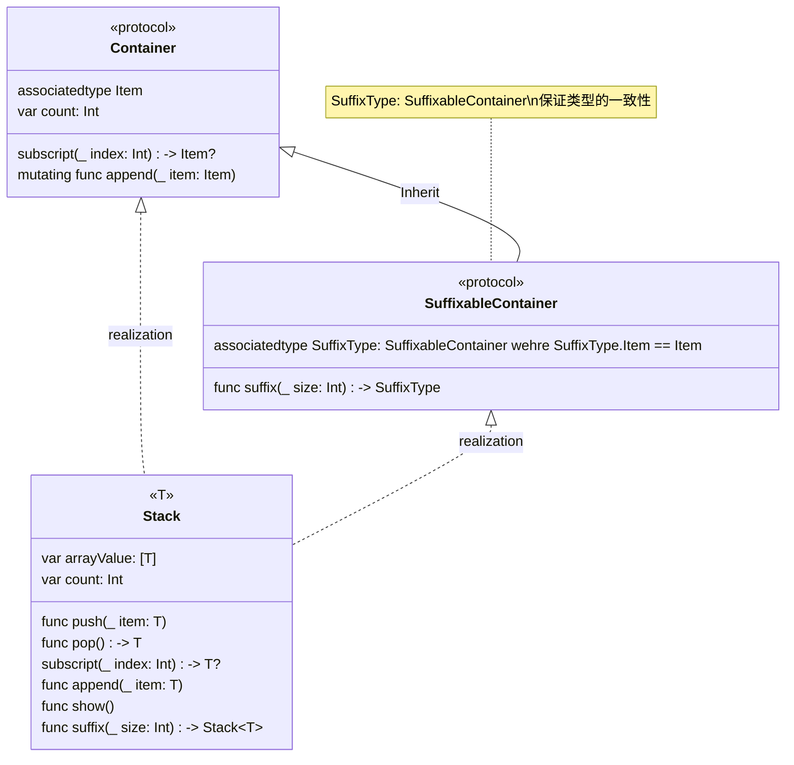
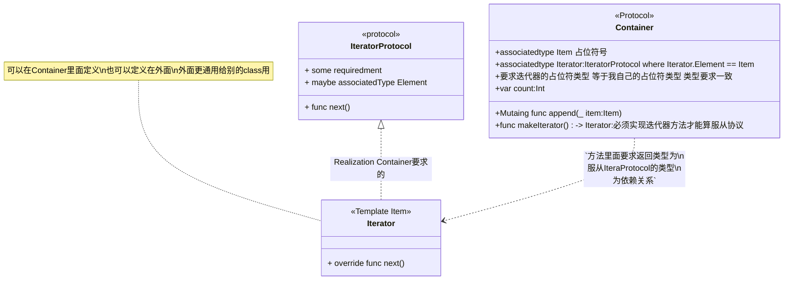

## 泛形

> **Note**:实例化的时候，不用像C++一样指定模版的类型，直接调用
> ```swift
> class Print<T>{
>    let vt:T
>    init(_ anyType:T){self.vt = anyType}
>    func pt(){
>        Swift.print("\(vt)") //全局函数啊，要不然递归自己
>    }
>}
>//Not Print<Int>(5) 编译器直接推断类型
>let toBePrint = Print(5)
>toBePrint.pt()
> 
> ```

**编写适用于多种类型的代码并指定这些类型的要求。**

通用代码使您能够编写灵活的、可重用的函数和类型，这些函数和类型可以根据您定义的要求与任何类型一起使用。您可以编写避免重复并以清晰、抽象的方式表达其意图的代码。

泛型是 Swift 最强大的功能之一，Swift 标准库的大部分都是用泛型代码构建的。事实上，您在整个语言指南中一直在使用泛型，即使您没有意识到这一点。例如，Swift 的 `Array` 和 `Dictionary` 类型都是泛型集合。您可以创建一个保存 `Int` 值的数组，或者一个保存 `String` 值的数组，或者实际上是可以在 Swift 中创建的任何其他类型的数组。同样，您可以创建一个字典来存储任何指定类型的值，并且该类型没有限制。


### 1.泛型解决的问题 the problem that generics solov

这是一个名为 `swapTwoInts(_:_:)` 的标准非泛型函数，它交换两个 `Int` 值：

```swift

func swapTwoInts(_ a: inout Int, _ b: inout Int) {
    let temporaryA = a
    a = b
    b = temporaryA
}
```

此函数使用输入输出参数来交换 `a` 和 `b` 的值，如输入输出参数中所述。

`swapTwoInts(_:_:)` 函数将 `b` 的原始值交换为 `a` ，将 `a` 的原始值交换为 `b` 。您可以调用此函数来交换两个 `Int` 变量中的值：

```swift
var someInt = 3
var anotherInt = 107
swapTwoInts(&someInt, &anotherInt)
print("someInt is now \(someInt), and anotherInt is now \(anotherInt)")
// Prints "someInt is now 107, and anotherInt is now 3"
```

`swapTwoInts(_:_:)` 函数很有用，但它只能与 `Int` 值一起使用。如果要交换两个 `String` 值或两个 `Double` 值，则必须编写更多函数，例如 `swapTwoStrings(_:_:)` 和 `swapTwoDoubles(_:_:)` 功能如下图：

```swift
func swapTwoStrings(_ a: inout String, _ b: inout String) {
    let temporaryA = a
    a = b
    b = temporaryA
}


func swapTwoDoubles(_ a: inout Double, _ b: inout Double) {
    let temporaryA = a
    a = b
    b = temporaryA
}
```

您可能已经注意到 `swapTwoInts(_:_:)` 、 `swapTwoStrings(_:_:)` 和 `swapTwoDoubles(_:_:)` 函数的主体是相同的。唯一的区别是它们接受的值的类型（ `Int` 、 `String` 和 `Double` ）。

编写一个交换任意类型的两个值的函数更有用，也更灵活。通用代码使您能够编写这样的函数。 （这些函数的通用版本定义如下。）

> **Note**:
>
> 在所有三个函数中， `a` 和 `b` 的类型必须相同。如果 `a` 和 `b` 不是同一类型，则无法交换它们的值。 Swift 是一种类型安全语言，不允许（例如） `String` 类型的变量和 `Double` 类型的变量相互交换值。尝试这样做会导致编译时错误。


### 2.通用类型

泛型函数可以用于任何类型。这是上面的 `swapTwoInts(_:_:)` 函数的通用版本，称为 `swapTwoValues(_:_:)` ：

```swift
func swapTwoValues<T>(_ a: inout T, _ b: inout T) {
    let temporaryA = a
    a = b
    b = temporaryA
}
```

`swapTwoValues(_:_:)` 函数的主体与 `swapTwoInts(_:_:)` 函数的主体相同。但是， `swapTwoValues(_:_:)` 的第一行与 `swapTwoInts(_:_:)` 略有不同。以下是第一行的比较：

```swift
func swapTwoInts(_ a: inout Int, _ b: inout Int)
func swapTwoValues<T>(_ a: inout T, _ b: inout T)
```

该函数的通用版本使用占位符类型名称（在本例中称为 `T` ）而不是实际类型名称（例如 `Int` 、 `String` 、或 `Double` ）。占位符类型名称没有说明 `T` 必须是什么，但它确实表明 `a` 和 `b` 必须属于同一类型 `T` ，无论 `T` 代表什么。每次调用 `swapTwoValues(_:_:)` 函数时都会确定用于代替 `T` 的实际类型。

泛型函数和非泛型函数之间的另一个区别是泛型函数的名称 ( `swapTwoValues(_:_:)` ) 后跟尖括号 ( `<T>` ) /b2> ）。括号告诉 Swift `T` 是 `swapTwoValues(_:_:)` 函数定义中的占位符类型名称。因为 `T` 是一个占位符，Swift 不会查找名为 `T` 的实际类型。

`swapTwoValues(_:_:)` 函数现在可以按照与 `swapTwoInts` 相同的方式调用，不同之处在于它可以传递任何类型的两个值，只要这两个值的类型相同彼此一样。每次调用 `swapTwoValues(_:_:)` 时，都会根据传递给函数的值类型推断出 `T` 使用的类型。


在下面的两个示例中， `T` 分别被推断为 `Int` 和 `String` ：

```swift
var someInt = 3
var anotherInt = 107
swapTwoValues(&someInt, &anotherInt)
// someInt is now 107, and anotherInt is now 3


var someString = "hello"
var anotherString = "world"
swapTwoValues(&someString, &anotherString)
// someString is now "world", and anotherString is now "hello"
```


> **Note**:上面定义的 `swapTwoValues(_:_:)` 函数受到名为 `swap` 的通用函数的启发，该函数是 Swift 标准库的一部分，并且会自动供您在应用程序中使用。如果您需要在自己的代码中实现 `swapTwoValues(_:_:)`函数的行为，则可以使用 Swift 现有的 `swap(_:_:)` 函数，而不是提供自己的实现。


### 3.类型参数

在上面的 `swapTwoValues(_:_:)` 示例中，占位符类型 `T` 是类型参数的示例。类型参数指定并命名占位符类型，并紧跟在函数名称之后，位于一对匹配的尖括号之间（例如 `<T>` ）。


指定类型参数后，您可以使用它来定义函数参数的类型（例如 `swapTwoValues(_:_:)` 函数的 `a` 和 `b` 参数） ，或作为函数的返回类型，或作为函数体内的类型注释。在每种情况下，每当调用函数时，类型参数都会替换为实际类型。 （在上面的 `swapTwoValues(_:_:)` 示例中， `T` 在第一次调用函数时被替换为 `Int` ，并在第一次调用时被替换为 `String` 第二次被调用。）

您可以通过在尖括号内写入多个类型参数名称（以逗号分隔）来提供多个类型参数。


### 4.命名类型参数

在大多数情况下，类型参数具有描述性名称，例如 `Dictionary<Key, Value>` 中的 `Key` 和 `Value` 以及 `Array<Element>` > ，它告诉读者类型参数和它所使用的泛型类型或函数之间的关系。但是，当它们之间没有有意义的关系时，传统上使用单个字母来命名它们，例如 `T` 和 `V` ，例如上面 `swapTwoValues(_:_:)` 函数中的 `T` 。

>
>
>**Note**:始终为类型参数提供大驼峰式名称（例如 `T` 和 `MyTypeParameter` ），以表明它们是类型的占位符，而不是值。


### 5.通用类型Generic Type

除了泛型函数之外，Swift 还允许您定义自己的泛型类型。这些是自定义类、结构和枚举，可以与任何类型一起使用，类似于 `Array` 和 `Dictionary` 。

本节向您展示如何编写名为 `Stack` 的通用集合类型。堆栈是一组有序的值，类似于数组，但其操作集比 Swift 的 `Array` 类型更受限制。数组允许在数组中的任何位置插入和删除新项目。然而，堆栈只允许将新项目附加到集合的末尾（称为将新值推入堆栈）。类似地，堆栈允许仅从集合末尾删除项目（称为从堆栈中弹出值）。

> **Note**:`UINavigationController` 类使用堆栈的概念来建模其导航层次结构中的视图控制器。您调用 `UINavigationController` 类 `pushViewController(_:animated:)` 方法将视图控制器添加（或推送）到导航堆栈，并调用其 `popViewControllerAnimated(_:)` 方法删除（或弹出）导航堆栈中的视图控制器。当您需要严格的“后进先出”方法来管理集合时，堆栈是一个有用的集合模型。


下图显示了堆栈的压入和弹出行为：


- 当前堆栈上有三个值。
- 第四个值被推入堆栈顶部。
- 堆栈现在包含四个值，最新的值位于顶部。
- 堆栈顶部的项目被弹出。
- 弹出一个值后，堆栈再次保存三个值。

```swift
struct IntStack {
    var items: [Int] = []
    mutating func push(_ item: Int) {
        items.append(item)
    }
    mutating func pop() -> Int {
        return items.removeLast()
    }
}
```

此结构使用名为 `items` 的 `Array` 属性来存储堆栈中的值。 `Stack` 提供了两种方法： `push` 和 `pop` ，用于将值压入堆栈或从堆栈中弹出。这些方法被标记为 `mutating` ，因为它们需要修改（或变异）结构体的 `items`数组。

但是，上面显示的 `IntStack` 类型只能与 `Int` 值一起使用。定义一个通用的 `Stack` 结构会更有用，它可以管理任何类型值的堆栈。

这是相同代码的通用版本：

```swift
struct Stack<Element> {
    var items: [Element] = []
    mutating func push(_ item: Element) {
        items.append(item)
    }
    mutating func pop() -> Element {
        return items.removeLast()
    }
}
```

请注意 `Stack` 的泛型版本本质上与非泛型版本相同，但具有名为 `Element` 的类型参数，而不是 `Int` 的实际类型。此类型参数写在结构名称后面的一对尖括号 ( `<Element>` ) 内。

`Element` 为稍后提供的类型定义占位符名称。这种未来类型可以在结构定义中的任何位置称为 `Element` 。在本例中， `Element` 在三个地方用作占位符：

- 创建一个名为 `items` 的属性，该属性使用 `Element` 类型值的空数组进行初始化
- 指定 `push(_:)` 方法有一个名为 `item` 的参数，该参数的类型必须为 `Element`
- 指定 `pop()` 方法返回的值将是 `Element` 类型的值

因为它是泛型类型，所以 `Stack` 可用于在 Swift 中创建任何有效类型的堆栈，其方式与 `Array` 和 `Dictionary` 类似。

您可以通过在尖括号内写入要存储在堆栈中的类型来创建一个新的 `Stack` 实例。例如，要创建新的字符串堆栈，请编写 `Stack<String>()` ：

```swift
var stackOfStrings = Stack<String>()
stackOfStrings.push("uno")
stackOfStrings.push("dos")
stackOfStrings.push("tres")
stackOfStrings.push("cuatro")
// the stack now contains 4 strings

```

以下是将这四个值推入堆栈后 `stackOfStrings` 的外观：


从堆栈中弹出一个值会删除并返回顶部值 `"cuatro"` ：

```swift
let fromTheTop = stackOfStrings.pop()
// fromTheTop is equal to "cuatro", and the stack now contains 3 strings
```

以下是弹出顶部值后堆栈的外观：


### 6.扩展泛型

**扩展（extension）是用于向现有的类、结构体、枚举和协议添加新功能的机制。扩展是编译时行为，意味着它们在编译时被合并到原始类型中，因此可以无缝地使用扩展中定义的方法、属性和其他成员。**

当您扩展泛型类型时，您不会提供类型参数列表作为扩展定义的一部分。相反，原始类型定义中的类型参数列表在扩展主体中可用，并且原始类型参数名称用于引用原始定义中的类型参数。

以下示例扩展通用 `Stack` 类型以添加名为 `topItem` 的只读计算属性，该属性返回堆栈顶部的项目，而不将其从堆栈中弹出：

```swift
extension Stack {
    var topItem: Element? {  //扩展里面也可以直接用占位符
        return items.isEmpty ? nil : items[items.count - 1]
    }
}
```

`topItem` 属性返回 `Element` 类型的可选值。如果堆栈为空，则 `topItem` 返回 `nil` ；如果堆栈不为空，则 `topItem` 返回 `items` 数组中的最后一项。

请注意，此扩展没有定义类型参数列表。相反，在扩展中使用 `Stack` 类型的现有类型参数名称 `Element` 来指示 `topItem` 计算属性的可选类型。

`topItem` 计算属性现在可以与任何 `Stack` 实例一起使用，以访问和查询其顶部项目，而无需删除它。

```swift
if let topItem = stackOfStrings.topItem {
    print("The top item on the stack is \(topItem).")
}
// Prints "The top item on the stack is tres."
```

泛型类型的扩展还可以包括扩展类型的实例必须满足才能获得新功能的要求，如下面的带有泛型Where子句的扩展中所述。


### 7. 类型约束

`swapTwoValues(_:_:)` 函数和 `Stack` 类型可以与任何类型一起使用。但是，有时对可与泛型函数和泛型类型一起使用的类型强制执行某些类型约束很有用。类型约束指定类型参数必须从特定类继承，或者符合特定协议或协议组合。

例如，Swift 的 `Dictionary` 类型对可用作字典键的类型进行了限制。如字典中所述，字典键的类型必须是可散列的。也就是说，它必须提供一种使自己具有独特代表性的方法。 `Dictionary` 需要其键是可散列的，以便它可以检查它是否已包含特定键的值。如果没有此要求， `Dictionary` 无法判断是否应该插入或替换特定键的值，也无法找到字典中已有的给定键的值。

此要求是通过对 `Dictionary` 的键类型进行类型约束来强制执行的，该约束指定键类型必须符合 `Hashable`协议，这是 Swift 标准库中定义的特殊协议。默认情况下，所有 Swift 的基本类型（例如 `String` 、 `Int` 、 `Double` 和 `Bool` ）都是可哈希的。有关使您自己的自定义类型符合 `Hashable` 协议的信息，请参阅符合 Hashable 协议。

您可以在创建自定义泛型类型时定义自己的类型约束，这些约束提供了泛型编程的大部分功能。像 `Hashable`这样的抽象概念根据其概念特征而不是具体类型来表征类型。


### 8.类型约束语法

您可以通过在类型参数名称后面放置单个类或协议约束来编写类型约束，并用冒号分隔，作为类型参数列表的一部分。泛型函数类型约束的基本语法如下所示（尽管泛型类型的语法相同）：


```swift
func someFunction<T: SomeClass, U: SomeProtocol>(someT: T, someU: U) {
    // function body goes here
}
```

上面的假设函数有两个类型参数。第一个类型参数 `T` 具有类型约束，要求 `T` 是 `SomeClass` 的子类。第二个类型参数 `U` 具有类型约束，要求 `U` 符合协议 `SomeProtocol` 


**Chagpt**

----

好的，以下是一个完整的示例代码，展示如何定义和使用一个带有泛型参数的函数，该函数要求泛型参数分别符合某个类和某个协议。

**示例代码**

首先，定义一个类 `SomeClass` 和一个协议 `SomeProtocol`：

```swift
class SomeClass {
    var value: Int

    init(value: Int) {
        self.value = value
    }

    func describe() -> String {
        return "SomeClass with value \(value)"
    }
}

protocol SomeProtocol {
    func protocolMethod() -> String
}
```

然后，定义一个符合 `SomeProtocol` 协议的类 `AnotherClass`：

```swift
class AnotherClass: SomeProtocol {
    var name: String

    init(name: String) {
        self.name = name
    }

    func protocolMethod() -> String {
        return "AnotherClass with name \(name)"
    }
}
```

现在，定义一个带有泛型参数的函数 `someFunction`，这些泛型参数分别符合 `SomeClass` 和 `SomeProtocol`：

```swift
func someFunction<T: SomeClass, U: SomeProtocol>(someT: T, someU: U) {
    print(someT.describe())
    print(someU.protocolMethod())
}
```

最后，使用 `someFunction` 函数：

```swift
let instanceOfSomeClass = SomeClass(value: 42)
let instanceOfAnotherClass = AnotherClass(name: "Example")

someFunction(someT: instanceOfSomeClass, someU: instanceOfAnotherClass)
```

**解释**

1. **定义类和协议**：
   - `SomeClass` 是一个具有 `value` 属性和 `describe` 方法的类。
   - `SomeProtocol` 是一个协议，要求实现 `protocolMethod` 方法。

2. **符合协议的类**：
   - `AnotherClass` 是一个符合 `SomeProtocol` 协议的类，具有 `name` 属性和 `protocolMethod` 方法的实现。

3. **带有泛型参数的函数**：
   - `someFunction` 函数带有两个泛型参数 `T` 和 `U`，分别要求 `T` 符合 `SomeClass` 和 `U` 符合 `SomeProtocol`。
   - 函数体中调用了 `someT` 的 `describe` 方法和 `someU` 的 `protocolMethod` 方法。

4. **使用函数**：
   - 创建 `SomeClass` 和 `AnotherClass` 的实例。
   - 调用 `someFunction` 函数，传入这两个实例。

**代码输出**

运行上述代码会输出：

```
SomeClass with value 42
AnotherClass with name Example
```

这个示例展示了如何定义和使用一个带有泛型参数的函数，这些泛型参数分别符合某个类和某个协议。如果你有更多问题或需要进一步解释，请随时告诉我！


### 9. 泛型类型约束

这是一个名为 `findIndex(ofString:in:)` 的非泛型函数，它被赋予一个要查找的 `String` 值以及一个要在其中查找它的 `String` 值数组。 `findIndex(ofString:in:)` 函数返回一个可选的 `Int` 值，如果找到，该值将是数组中第一个匹配字符串的索引，如果字符串可以，则返回 `nil` 找不到：

```swift
func findIndex(ofString valueToFind: String, in array: [String]) -> Int? {
    for (index, value) in array.enumerated() {
        if value == valueToFind {
            return index
        }
    }
    return nil
}
```

`findIndex(ofString:in:)` 函数可用于在字符串数组中查找字符串值：

```swift
let strings = ["cat", "dog", "llama", "parakeet", "terrapin"]
if let foundIndex = findIndex(ofString: "llama", in: strings) {
    print("The index of llama is \(foundIndex)")
}
// Prints "The index of llama is 2"
```

然而，在数组中查找值的索引的原理不仅仅适用于字符串。您可以通过将任何提及的字符串替换为某种类型 `T`的值来编写与泛型函数相同的功能。


以下是您可能期望的 `findIndex(ofString:in:)` 通用版本（称为 `findIndex(of:in:)` ）的编写方式。请注意，此函数的返回类型仍然是 `Int?` ，因为该函数返回一个可选的索引号，而不是数组中的可选值。但请注意，该函数无法编译，原因在示例后解释：

```swift
func findIndex<T>(of valueToFind: T, in array:[T]) -> Int? {
    for (index, value) in array.enumerated() {
        if value == valueToFind { //需要服从Equatable 才可以使用 == 
            return index
        }
    }
    return nil
}
```

这个函数不能像上面写的那样编译。问题在于相等性检查“ `if value == valueToFind` ”。并非 Swift 中的所有类型都可以与等于运算符 ( `==` ) 进行比较。例如，如果您创建自己的类或结构来表示复杂的数据模型，那么 Swift 无法为您猜测该类或结构的“等于”含义。因此，无法保证此代码适用于每种可能的类型 `T` ，并且当您尝试编译该代码时会报告相应的错误。

然而，一切并没有失去。 Swift 标准库定义了一个名为 `Equatable` 的协议，它要求任何符合的类型实现等于运算符 ( `==` ) 和不等于运算符 ( `!=` ) 比较该类型的任意两个值。所有 Swift 的标准类型都自动支持 `Equatable`协议。

```swift
func findIndex<T: Equatable>(of valueToFind: T, in array:[T]) -> Int? {
    for (index, value) in array.enumerated() {
        if value == valueToFind {
            return index
        }
    }
    return nil
}
```

`findIndex(of:in:)` 的单一类型参数写为 `T: Equatable` ，这意味着“符合 `Equatable` 协议的任何类型 `T` ”。

`findIndex(of:in:)` 函数现在可以成功编译，并且可以与 `Equatable` 的任何类型一起使用，例如 `Double` 或 `String` ：


### 10. 关联相关类型 AssociatedType

｜**协议的占位符号 AssociatedType**

定义协议时，将一个或多个关联类型声明为协议定义的一部分有时很有用。关联类型为用作协议一部分的类型提供占位符名称。在采用协议之前，不会指定用于该关联类型的实际类型。关联类型由 `associatedtype` 关键字指定。


#### 10.1 实际应用中的AssociatedType

下面是一个名为 `Container` 的协议示例，它声明了一个名为 `Item` 的关联类型：

```swift
protocol Container {
    associatedtype Item //占位符
    mutating func append(_ item: Item)
    var count: Int { get }
    subscript(i: Int) -> Item { get }
}
```


`Container` 协议定义了任何容器都必须提供的三个必需功能：

- 必须可以使用 `append(_:)` 方法将新项目添加到容器中。
- 必须可以通过返回 `Int` 值的 `count` 属性访问容器中的项目计数。
- 必须能够使用采用 `Int` 索引值的下标检索容器中的每个项目。

该协议没有指定容器中的项目应如何存储或允许它们是什么类型。该协议仅指定任何类型必须提供的三位功能才能被视为 `Container` 。只要满足这三个要求，一致类型就可以提供附加功能。

任何符合 `Container` 协议的类型都必须能够指定它存储的值的类型。具体来说，它必须确保只有正确类型的项被添加到容器中，并且必须清楚其下标返回的项的类型。

为了定义这些要求， `Container` 协议需要一种方法来引用容器将保存的元素的类型，而不知道该类型对于特定容器来说是什么。 `Container` 协议需要指定传递给 `append(_:)` 方法的任何值都必须与容器的元素类型具有相同的类型，并且容器的下标返回的值将是与容器的元素类型相同的类型。

为了实现这一点， `Container` 协议声明了一个名为 `Item` 的关联类型，写为 `associatedtype Item` 。该协议没有定义 `Item` 是什么 - 该信息留给任何符合要求的类型提供。尽管如此， `Item` 别名提供了一种方法来引用 `Container` 中的项目类型，并定义与 `append(_:)` 方法一起使用的类型和下标，以确保强制执行任何 `Container` 的预期行为。

这是上面通用类型中的非通用 `IntStack` 类型的一个版本，经过修改以符合 `Container` 协议：

```swift
struct IntStack: Container {
    // original IntStack implementation
    var items: [Int] = []
    mutating func push(_ item: Int) {
        items.append(item)
    }
    mutating func pop() -> Int {
        return items.removeLast()
    }
    // conformance to the Container protocol
    typealias Item = Int
    mutating func append(_ item: Int) {
        self.push(item)
    }
    var count: Int {
        return items.count
    }
    subscript(i: Int) -> Int {
        return items[i]
    }
}
```


`IntStack` 类型实现了 `Container` 协议的所有三个要求，并且在每种情况下都包装了 `IntStack` 类型现有功能的一部分来满足这些要求。

此外， `IntStack` 指定对于 `Container` 的此实现，要使用的适当的 `Item` 是 `Int` 的类型。对于 `Container` 协议的实现， `typealias Item = Int` 的定义将 `Item` 的抽象类型转换为 `Int` 的具体类型。

由于 Swift 的类型推断，您实际上不需要将 `Int` 的具体 `Item` 声明为 `IntStack` 定义的一部分。由于 `IntStack` 符合 `Container` 协议的所有要求，因此 Swift 可以通过查看 `append(_:)` >方法的 `item` 参数和下标的返回类型。事实上，如果您从上面的代码中删除 `typealias Item = Int` 行，一切仍然有效，因为 `Item` 应该使用什么类型是很清楚的。

您还可以使通用 `Stack` 类型符合 `Container` 协议：

```swift
struct Stack<Element>: Container {
    // original Stack<Element> implementation
    var items: [Element] = []
    mutating func push(_ item: Element) {
        items.append(item)
    }
    mutating func pop() -> Element {
        return items.removeLast()
    }
    // conformance to the Container protocol
    mutating func append(_ item: Element) {
        self.push(item)
    }
    var count: Int {
        return items.count
    }
    subscript(i: Int) -> Element {
        return items[i]
    }
}
```


这次使用类型参数 `Element` 作为 `append(_:)` 方法的 `item` 参数的类型和下标的返回类型。因此，Swift 可以推断 `Element` 是用作此特定容器的 `Item` 的适当类型。


#### 10.2 向关联的类型添加约束

您可以向协议中的关联类型添加类型约束，以要求一致类型满足这些约束。例如，以下代码定义了 `Container` 的版本，该版本要求容器中的项目可相等。

```swift
protocol Container {
    associatedtype Item: Equatable
    mutating func append(_ item: Item)
    var count: Int { get }
    subscript(i: Int) -> Item { get }
}
```





### 10.3 向其关联类型的约束中使用协议

议可以作为其自身需求的一部分出现。例如，下面的协议改进了 `Container` 协议，添加了 `suffix(_:)`方法的要求。 `suffix(_:)` 方法从容器末尾返回给定数量的元素，并将它们存储在 `Suffix` 类型的实例中。

```swift
protocol SuffixableContainer: Container {
  	//定义一个占位符 Suffix 类型 服从 SuffixableContainer
  	//该协议变量Suffix 里面的Item确保是从Container 里面来的，保证占位符的一致性
    associatedtype Suffix: SuffixableContainer where Suffix.Item == Item
    func suffix(_ size: Int) -> Suffix
}
```

在此协议中， `Suffix` 是关联类型，如上面 `Container` 示例中的 `Item` 类型。 `Suffix` 有两个约束：它必须符合 `SuffixableContainer` 协议（当前正在定义的协议），其 `Item` 类型必须与容器的 < b6> 类型。 `Item` 上的约束是一个通用 `where` 子句，这将在下面的带有通用Where 子句的关联类型中讨论。

这是上面通用类型中 `Stack` 类型的扩展，它增加了对 `SuffixableContainer` 协议的一致性：

```swift
extension Stack: SuffixableContainer {
    func suffix(_ size: Int) -> Stack {  //Stack自动推断SuffixableContainer::Suffix
        var result = Stack()
        for index in (count-size)..<count {
            result.append(self[index])
        }
        return result
    }
    // Inferred that Suffix is Stack.
}
var stackOfInts = Stack<Int>()
stackOfInts.append(10)
stackOfInts.append(20)
stackOfInts.append(30)
let suffix = stackOfInts.suffix(2)
// suffix contains 20 and 30
```





**Example**

```swift

protocol Container{
    associatedtype Item //定位一个占位符
    var count:Int {get}
    subscript(_ index:Int) -> Item? {get}
    mutating func append(_ item:Item) -> Void
}


protocol  SuffixableContainer:Container {
    //继承协议
    //再定义一个占位符并且类型是本类型，意味着是服从协议的类，Stack<T>服从这个协议，
    //那 SuffixType就是Stack<T>的协议容器,并且该协议里面的Item = Container继承的Item保证一致性
    associatedtype SuffixType:SuffixableContainer where SuffixType.Item  == Item
    func suffix(_ size: Int) -> SuffixType  //返回类型为占位符
}


class Stack<T>:Container{
    
    
    //定义一个数组，并且自动为该类型的空数组
    var arrayValue = [T]()
    
    var count:Int {arrayValue.count}
    
    func push(_ item:T){
        arrayValue.append(item)
    }
    
    func pop() -> T{
        return arrayValue.removeLast()
    }
    
    //协议里面的类型，不写也行，会自动推断
    //但是写了方便拓展，
    typealias Item = T
    
    subscript(_ index:Int) -> T? {
        if index < 0 || index >= count{
            return nil
        }
        return arrayValue[index]
    }
    
    func append(_ item:Item) -> Void{
        self.push(item)
    }
    
    func show() -> Void{
        print("[ ",terminator: " ")
        for index in 0..<count{
            print("\(self[index]!),",terminator: " ")
        }
        print("] ")
    }
    
}


extension Stack:SuffixableContainer{
    
    func suffix(_ size: Int) -> Stack<T>{
        var retValue = Stack<T>()
      	if size <= 0 || size > self.count 
        for index in self.count-size ..< self.count{
            guard let tmp = self[index] else {return retValue}
            retValue.append(tmp)
        }
        return retValue
    }
}

let strStack = Stack<String>()

strStack.push("fuck")
strStack.push("you")
strStack.push("xi")
strStack.push("gua")

let subStack = strStack.suffix(2)
subStack.show()
```





### 10.4 通用Where子剧

类型约束（如类型约束中所述）使您能够定义与泛型函数、下标或类型关联的类型参数的要求。

定义关联类型的要求也很有用。您可以通过定义通用 where 子句来实现此目的。通用 `where` 子句使您能够要求关联类型必须符合特定协议，或者特定类型参数和关联类型必须相同。通用 `where` 子句以 `where` 关键字开头，后跟关联类型的约束或类型与关联类型之间的相等关系。您可以在类型或函数体的左大括号之前编写通用 `where` 子句。

下面的示例定义了一个名为 `allItemsMatch` 的通用函数，它检查两个 `Container` 实例是否包含相同顺序的相同项目。如果所有项目都匹配，则该函数返回布尔值 `true` ；如果不匹配，则返回值 `false` 。


要检查的两个容器不必是相同类型的容器（尽管可以是），但它们必须容纳相同类型的物品。此要求通过类型约束和通用 `where` 子句的组合来表达：


```swift


func allItemsMatch<C1: Container, C2: Container>
        (_ someContainer: C1, _ anotherContainer: C2) -> Bool
        where C1.Item == C2.Item, C1.Item: Equatable {


    // Check that both containers contain the same number of items.
    if someContainer.count != anotherContainer.count {
        return false
    }


    // Check each pair of items to see if they're equivalent.
    for i in 0..<someContainer.count {
        if someContainer[i] != anotherContainer[i] {
            return false
        }
    }


    // All items match, so return true.
    return true
}
```

该函数采用两个名为 `someContainer` 和 `anotherContainer` 的参数。 `someContainer` 参数的类型为 `C1` ，而 `anotherContainer` 参数的类型为 `C2` 。 `C1` 和 `C2` 都是函数调用时要确定的两种容器类型的类型参数。

对函数的两个类型参数有以下要求：

1. `C1` 必须符合 `Container` 协议（写为 `C1: Container` ）。
2. `C2` 还必须符合 `Container` 协议（写为 `C2: Container` ）。
3. `C1` 的 `Item` 必须与 `C2` 的 `Item` 相同（写为 `C1.Item == C2.Item` ）。
4. `C1` 的 `Item` 必须符合 `Equatable` 协议（写为 `C1.Item: Equatable` ）。

第一个和第二个要求在函数的类型参数列表中定义，第三个和第四个要求在函数的通用 `where` 子句中定义。

1. `someContainer` 是 `C1` 类型的容器。
2. `anotherContainer` 是 `C2` 类型的容器。
3. `someContainer` 和 `anotherContainer` 包含相同类型的项目。
4. 可以使用不等于运算符 ( `!=` ) 检查 `someContainer` 中的项目，看看它们是否彼此不同。

第三个和第四个要求结合起来意味着 `anotherContainer` 中的项目也可以使用 `!=` 运算符进行检查，因为它们与 `someContainer`

这些要求使 `allItemsMatch(_:_:)` 函数能够比较两个容器，即使它们属于不同的容器类型。

`allItemsMatch(_:_:)` 函数首先检查两个容器是否包含相同数量的项目。如果它们包含不同数量的项目，则它们无法匹配，并且该函数返回 `false` 。

进行此检查后，该函数使用 `for` - `in` 循环和半开范围运算符 ( `..<` ）。对于每个项目，该函数都会检查 `someContainer`中的项目是否不等于 `anotherContainer` 中的相应项目。如果两个项目不相等，则两个容器不匹配，并且该函数返回 `false` 。

如果循环结束时没有发现不匹配，则两个容器匹配，并且函数返回 `true` 。

下面是 `allItemsMatch(_:_:)` 函数的实际效果：

```swift
var stackOfStrings = Stack<String>()
stackOfStrings.push("uno")
stackOfStrings.push("dos")
stackOfStrings.push("tres")


var arrayOfStrings = ["uno", "dos", "tres"]


if allItemsMatch(stackOfStrings, arrayOfStrings) {
    print("All items match.")
} else {
    print("Not all items match.")
}
// Prints "All items match."
```


上面的示例创建一个 `Stack` 实例来存储 `String` 值，并将三个字符串压入堆栈。该示例还创建一个 `Array` 实例，该实例使用包含与堆栈相同的三个字符串的数组文字进行初始化。尽管堆栈和数组的类型不同，但它们都遵循 `Container` 协议，并且都包含相同类型的值。因此，您可以使用这两个容器作为参数来调用 `allItemsMatch(_:_:)` 函数。在上面的示例中， `allItemsMatch(_:_:)` 函数正确报告两个容器中的所有项目都匹配。


#### 10.4.1 编译器检查顺序

**`where 写在返回值的后面`:**

- **可以这样理解，当Where里面的条件成立了，函数才允许被调用**
- Where 条件应该对类型的判断，不应该是具体实例

`func myFunc<SomeType:SomeProtocol>(_ arg:SomeType) ->Int where ArgType:Equatable`

- 先检查SomeProtoco 是否存在
- 检查\<SomeType:SomeProtocol\> 泛型约束 SomeType是否服从 someProtocol
- 检查arg是否符合sometype
- 检查where子句 条件

**编译器检查循序：**先检查协议，检查类型是否服从协议，检查参数是否为改类型，检查where语句,检查函数体

下面的示例定义了一个名为 `allItemsMatch` 的通用函数，它检查两个 `Container` 实例是否包含相同顺序的相同项目。如果所有项目都匹配，则该函数返回布尔值 `true` ；如果不匹配，则返回值 `false` 。


### 10.5 带有where子句的扩展

您还可以使用通用 `where` 子句作为扩展的一部分。下面的示例扩展了前面示例中的通用 `Stack` 结构，以添加 `isTop(_:)`方法。

```swift

//Element 是模版类的类型，用别的占位符的时候，比如T 就where T 当T 服从Equatable协议的时候，不服从会编译报错
extension Stack where Element: Equatable {
    func isTop(_ item: Element) -> Bool {
        guard let topItem = items.last else {
            return false
        }
        return topItem == item
    }
}
```

这个新的 `isTop(_:)` 方法首先检查堆栈是否为空，然后将给定的项目与堆栈最顶层的项目进行比较。如果您尝试在没有通用 `where` 子句的情况下执行此操作，则会遇到问题： `isTop(_:)` 的实现使用 `==` 运算符，但 < b4> 不要求其项可相等，因此使用 `==` 运算符会导致编译时错误。使用通用 `where` 子句可让您向扩展添加新要求，以便扩展仅在堆栈中的项相等时添加 `isTop(_:)` 方法。

下面是 `isTop(_:)` 方法的实际效果：

```swift
if stackOfStrings.isTop("tres") {
    print("Top element is tres.")
} else {
    print("Top element is something else.")
}
// Prints "Top element is tres."
```

如果您尝试在元素不可相等的堆栈上调用 `isTop(_:)` 方法，您将收到编译时错误。

```swift
struct NotEquatable { }
var notEquatableStack = Stack<NotEquatable>()
let notEquatableValue = NotEquatable()
notEquatableStack.push(notEquatableValue)
notEquatableStack.isTop(notEquatableValue)  // Error
```

您可以使用带有协议扩展的通用 `where` 子句。下面的示例扩展了前面示例中的 `Container` 协议，添加了 `startsWith(_:)` 方法。

```swift
extension Container where Item: Equatable {
    func startsWith(_ item: Item) -> Bool {
        return count >= 1 && self[0] == item
    }
}
```

`startsWith(_:)` 方法首先确保容器中至少有一个项目，然后检查容器中的第一个项目是否与给定项目匹配。这个新的 `startsWith(_:)` 方法可以与任何符合 `Container` 协议的类型一起使用，包括上面使用的堆栈和数组，只要容器的项是相等的。

```swift
if [9, 9, 9].startsWith(42) {
    print("Starts with 42.")
} else {
    print("Starts with something else.")
}
// Prints "Starts with something else."

```

上例中的通用 `where` 子句要求 `Item` 符合协议，但您也可以编写需要 `Item`

```swift
extension Container where Item == Double {
    func average() -> Double {
        var sum = 0.0
        for index in 0..<count {
            sum += self[index]
        }
        return sum / Double(count)
    }
}
print([1260.0, 1200.0, 98.6, 37.0].average())
// Prints "648.9"
```

此示例向 `Item` 类型为 `Double` 的容器添加 `average()` 方法。它迭代容器中的项目以将它们相加，然后除以容器的计数来计算平均值。它显式地将计数从 `Int` 转换为 `Double` 以便能够进行浮点除法。


> **Note:**如果where中有多个条件，用,分隔


### 10.6 上下文Where子句

当您已经在泛型类型的上下文中工作时，您可以编写泛型 `where` 子句作为声明的一部分，该声明没有自己的泛型类型约束。例如，您可以在泛型类型的下标或泛型类型扩展中的方法上编写泛型 `where` 子句。 `Container` 结构是通用的，下面示例中的 `where` 子句指定必须满足哪些类型约束才能使这些新方法在容器上可用。


```swift
//两个不一样的条件放在一个扩展里面
extension Container {
    func average() -> Double where Item == Int {  //当类型条件满足的时候，才可以被调用
        var sum = 0.0
        for index in 0..<count {
            sum += Double(self[index])
        }
        return sum / Double(count)
    }
    func endsWith(_ item: Item) -> Bool where Item: Equatable { //当类型服从协议的时候，才可以被调用
        return count >= 1 && self[count-1] == item
    }
}
let numbers = [1260, 1200, 98, 37]
print(numbers.average())
// Prints "648.75"
print(numbers.endsWith(37))
// Prints "true"
```


当项是整数时，此示例向 `Container` 添加一个 `average()` 方法，当项可相等时，它添加一个 `endsWith(_:)` 方法。这两个函数都包含一个通用 `where` 子句，该子句将类型约束添加到 `Container` 原始声明中的通用 `Item` 类型参数。


如果您想在不使用上下文 `where` 子句的情况下编写此代码，则可以编写两个扩展，每个扩展对应一个通用 `where` 子句。上面的示例和下面的示例具有相同的行为。


```swift
//分开拓展，对模版类型进行约束，要求模版类型等于Int
extension Container where Item == Int {
    func average() -> Double {
        var sum = 0.0
        for index in 0..<count {
            sum += Double(self[index])
        }
        return sum / Double(count)
    }
}

//分开拓展，对模版类型进行约束，要求类型服从Equatable
extension Container where Item: Equatable {
    func endsWith(_ item: Item) -> Bool {
        return count >= 1 && self[count-1] == item
    }
}
```


在此示例的使用上下文 `where` 子句的版本中， `average()` 和 `endsWith(_:)` 的实现都在同一扩展中，因为每个方法的通用 `where` 子句使得这些方法在相同情况下可用，但每个要求需要一个扩展。


### 10.7 与通用Where子句关联的类型


您可以在关联类型上包含通用 `where` 子句。例如，假设您想要制作一个包含迭代器的 `Container` 版本，就像 Swift 标准库中使用的 `Sequence` 协议一样。你可以这样写：


```swift
protocol Container {  //定义协议
    associatedtype Item   //占位符号
    mutating func append(_ item: Item)
    var count: Int { get }
    subscript(i: Int) -> Item { get }
		
  
  
    associatedtype Iterator: IteratorProtocol where Iterator.Element == Item
  	//类型约束 定义一个占位符号 并且满足IteratorProtocol makeIterator 使用
  
  //生成迭代器,协议里面要满足全部要求，要不然无法完整服从协议，只是要求返回迭代器
  //迭代器可以在类型里面完成 也可以在外面完成,要求相关联
  	func makeIterator() -> Iterator
}
```

`Iterator` 上的通用 `where` 子句要求迭代器必须遍历与容器项目具有相同项目类型的元素，而不管迭代器的类型如何。 `makeIterator()` 函数提供对容器迭代器的访问。

对于从另一个协议继承的协议，可以通过在协议声明中包含通用 `where` 子句来向继承的关联类型添加约束。例如，以下代码声明一个 `ComparableContainer` 协议，要求 `Item` 符合 `Comparable` ：

```swift
protocol ComparableContainer: Container where Item: Comparable { }
```


**Example Code:**

```swift

protocol Containerr {
    associatedtype Item
    mutating func append(_ item: Item)
    var count: Int { get }
    subscript(i: Int) -> Item { get }


    associatedtype Iterator: IteratorProtocol where Iterator.Element == Item
    func makeIterator() -> Iterator
}

//我是MyArray<T>服从Containerr协议 依赖的类型，我写在MyArray<T> 里面也可以
struct ArrayIterator<T>:IteratorProtocol{
    private var currentIndex = 0
    private let item:[T]
    init(item:[T]){
        self.item = item
    }
    mutating func next() -> T? {
        if currentIndex < item.count{
            let ret = item[currentIndex]
            currentIndex += 1
            return ret
        }
        return nil
    }
}

class MyArray<T>:Containerr{
    typealias Item = T
    
    var pList = [T]()
    
    func append(_ item: Item){
        pList.append(item)
    }
    var count: Int { pList.count }
    
    init(_ ar: [T] = [T]()) {
        self.pList = ar
    }
    subscript(i: Int) -> Item {
        if i >= 0 && i < pList.count {
           return  pList[i]
        }else {
            return pList[i]
        }
    }
    
    
    //associatedtype Iterator: IteratorProtocol where Iterator.Element == Item
    func makeIterator() -> ArrayIterator<T>{
        return ArrayIterator<T>(item:pList)
    }
}


let myArray = MyArray<Int>([1,2,3,4])

//初始化迭代器
var pointer = myArray.makeIterator()

//迭代器取值
while let next = pointer.next(){
    print("\(next)")
}

```





### 10.8 通用下标Generic Subscripts TODO: 有点没看懂

下标可以是通用的，并且可以包含通用的 `where` 子句。您可以在 `subscript` 之后的尖括号内写入占位符类型名称，并在下标主体的左大括号之前写入通用 `where` 子句。例如：

```swift
extension Container {
  //函数模版 Sequence是序列，Sequence 有可能是数组，范围(range),自定义的序列类型
  //
    subscript<Indices: Sequence>(indices: Indices) -> [Item]
            where Indices.Iterator.Element == Int {
        var result: [Item] = []
        for index in indices {
            result.append(self[index])
        }
        return result
    }
}

//编译器检查顺序
//先检查Sequence 是否存在
//Indices是否服从 Sequence
//indices是否是Indices 类型
//检查where语句 Indices.Iterator.Element == Int 

```

`Container` 协议的此扩展添加了一个下标，该下标采用一系列索引并返回一个包含每个给定索引处的项目的数组。该通用下标受到如下约束：

- 尖括号中的泛型参数 `Indices` 必须是符合 Swift 标准库中的 `Sequence` 协议的类型。
- 下标采用单个参数 `indices` ，它是该 `Indices` 类型的实例。
- 通用 `where` 子句要求序列的迭代器必须遍历 `Int` 类型的元素。这确保了序列中的索引与用于容器的索引的类型相同。

总而言之，这些约束意味着为 `indices` 参数传递的值是一个整数序列。
