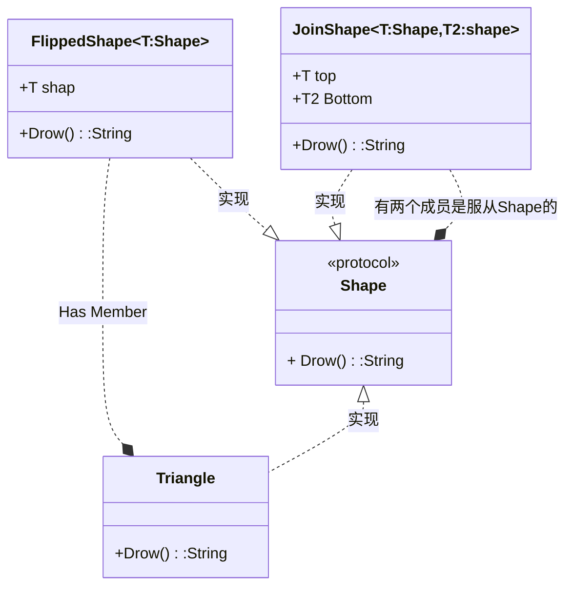
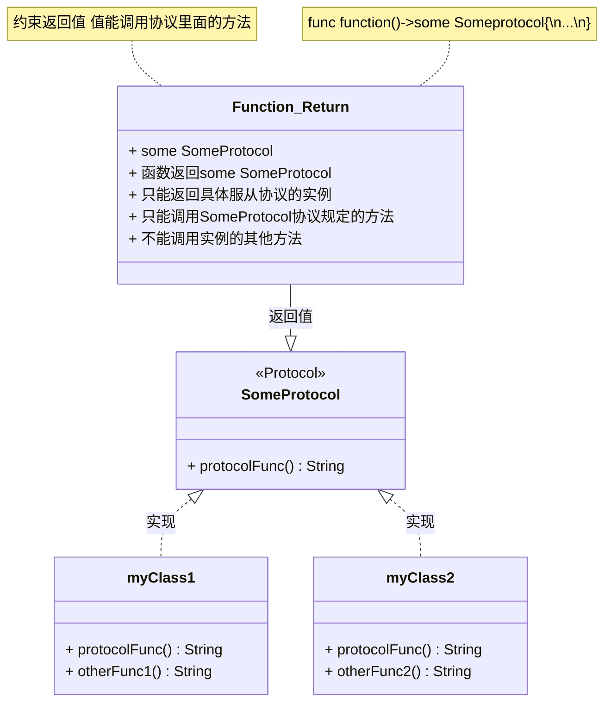
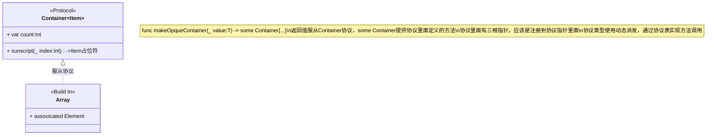

##  不透明的封装协议类型

隐藏有关值类型的实现细节。

Swift 提供了两种方法来隐藏有关值类型的详细信息：不透明类型和盒装协议类型。隐藏类型信息在模块和调用模块的代码之间的边界非常有用，因为返回值的基础类型可以保持私有。

返回不透明类型的函数或方法隐藏其返回值的类型信息。返回值不是提供具体类型作为函数的返回类型，而是根据它支持的协议来描述。不透明类型保留类型标识——编译器可以访问类型信息，但模块的客户端却不能。


装箱协议类型可以存储符合给定协议的任何类型的实例。装箱协议类型不保留类型标识——值的特定类型直到运行时才知道，并且随着存储不同值的时间的推移，它可能会发生变化。


### 1.不透明类型解决的问题

例如，假设您正在编写一个绘制 ASCII 艺术形状的模块。 ASCII 艺术形状的基本特征是一个 `draw()` 函数，它返回该形状的字符串表示形式，您可以将其用作 `Shape` 协议的要求：

```swift
protocol Shape {
    func draw() -> String
}


struct Triangle: Shape {
    var size: Int
    func draw() -> String {
       var result: [String] = []
       for length in 1...size {
           result.append(String(repeating: "*", count: length))
       }
       return result.joined(separator: "\n")
    }
}
let smallTriangle = Triangle(size: 3)
print(smallTriangle.draw())
// *
// **
// ***
```


您可以使用泛型来实现垂直翻转形状等操作，如下面的代码所示。然而，这种方法有一个重要的限制：翻转的结果暴露了用于创建它的确切泛型类型。

```swift
struct FlippedShape<T: Shape>: Shape {
    var shape: T
    func draw() -> String {
        let lines = shape.draw().split(separator: "\n")
        return lines.reversed().joined(separator: "\n")
    }
}
let flippedTriangle = FlippedShape(shape: smallTriangle)
print(flippedTriangle.draw())
// ***
// **
// *
```


这种定义将两个形状垂直连接在一起的 `JoinedShape<T: Shape, U: Shape>` 结构的方法（如下面的代码所示）会通过将三角形与翻转的三角形连接起来而产生类似 `JoinedShape<Triangle, FlippedShape<Triangle>>` 的类型。

```swift
struct JoinedShape<T: Shape, U: Shape>: Shape {
    var top: T
    var bottom: U
    func draw() -> String {
       return top.draw() + "\n" + bottom.draw()
    }
}
let joinedTriangles = JoinedShape(top: smallTriangle, bottom: flippedTriangle)
print(joinedTriangles.draw())
// *
// **
// ***
// ***
// **
// *
```


由于需要声明完整的返回类型，公开有关形状创建的详细信息会导致不属于 ASCII art 模块公共接口一部分的类型泄漏。模块内部的代码可以通过多种方式构建相同的形状，而模块外部使用该形状的其他代码不必考虑有关转换列表的实现细节。像 `JoinedShape` 和 `FlippedShape` 这样的包装类型对于模块的用户来说并不重要，而且它们不应该是可见的。该模块的公共接口由连接和翻转形状等操作组成，这些操作返回另一个 `Shape` 值。




### 2.返回不透明类型

> **Note**: `some` ProtocolName 约束返回的类型 只能使用协议规范的方法/函数，或变量

您可以将不透明类型视为泛型类型的反面。泛型类型允许调用函数的代码选择该函数参数的类型并以从函数实现中抽象出来的方式返回值。例如，以下代码中的函数返回取决于其调用者的类型：

```swift
func max<T>(_ x: T, _ y: T) -> T where T: Comparable { ... }
```

调用 `max(_:_:)` 的代码选择 `x` 和 `y` 的值，这些值的类型决定 `T` 的具体类型。调用代码可以使用任何符合 `Comparable` 协议的类型。函数内部的代码以通用方式编写，因此它可以处理调用者提供的任何类型。 `max(_:_:)` 的实现仅使用所有 `Comparable`类型共享的功能。

对于具有不透明返回类型的函数，这些角色相反。不透明类型允许函数实现以从调用函数的代码中抽象出来的方式为其返回值选择类型。例如，以下示例中的函数返回一个梯形，但不公开该形状的基础类型。

```swift
struct Square: Shape {
    var size: Int
    func draw() -> String {
        let line = String(repeating: "*", count: size)
        let result = Array<String>(repeating: line, count: size)
        return result.joined(separator: "\n")
    }
}


func makeTrapezoid() -> some Shape {
    let top = Triangle(size: 2)
    let middle = Square(size: 2)
    let bottom = FlippedShape(shape: top)
    let trapezoid = JoinedShape(
        top: top,
        bottom: JoinedShape(top: middle, bottom: bottom)
    )
    return trapezoid
}
let trapezoid = makeTrapezoid()
print(trapezoid.draw())
```


本例中的 `makeTrapezoid()` 函数将其返回类型声明为 `some Shape` ；因此，该函数返回符合 `Shape` 协议的某个给定类型的值，而不指定任何特定的具体类型。以这种方式编写 `makeTrapezoid()` 可以让它表达其公共接口的基本方面 - 它返回的值是一个形状 - 而不需要根据其公共接口的一部分创建该形状的特定类型。此实现使用两个三角形和一个正方形，但可以重写该函数以以各种其他方式绘制梯形，而无需更改其返回类型。


此示例强调了不透明返回类型与泛型类型的相反方式。 `makeTrapezoid()` 内部的代码可以返回所需的任何类型，只要该类型符合 `Shape` 协议，就像调用代码对泛型函数所做的那样。调用该函数的代码需要以通用方式编写，例如通用函数的实现，以便它可以处理 `makeTrapezoid()` 返回的任何 `Shape` 值。


您还可以将不透明返回类型与泛型结合起来。以下代码中的函数都返回符合 `Shape` 协议的某种类型的值。


```swift
func flip<T: Shape>(_ shape: T) -> some Shape {
    return FlippedShape(shape: shape)
}
func join<T: Shape, U: Shape>(_ top: T, _ bottom: U) -> some Shape {
    JoinedShape(top: top, bottom: bottom)
}


let opaqueJoinedTriangles = join(smallTriangle, flip(smallTriangle))
print(opaqueJoinedTriangles.draw())
```


此示例中 `opaqueJoinedTriangles` 的值与本章前面“不透明类型解决的问题”部分中的泛型示例中的 `joinedTriangles` 相同。但是，与该示例中的值不同， `flip(_:)` 和 `join(_:_:)` 将通用形状操作返回的基础类型包装在不透明的返回类型中，这会阻止这些类型可见。这两个函数都是通用的，因为它们依赖的类型是通用的，并且函数的类型参数传递 `FlippedShape` 和 `JoinedShape` 所需的类型信息。


如果具有不透明返回类型的函数从多个位置返回，则所有可能的返回值必须具有相同的类型。对于泛型函数，该返回类型可以使用函数的泛型类型参数，但它仍然必须是单一类型。例如，以下是形状翻转函数的无效版本，其中包含正方形的特殊情况：

```swift
func invalidFlip<T: Shape>(_ shape: T) -> some Shape {
    if shape is Square {
        return shape // Error: return types don't match
    }
    return FlippedShape(shape: shape) // Error: return types don't match
}
```

如果您使用 `Square` 调用此函数，它将返回 `Square` ；否则，它返回一个 `FlippedShape` 。这违反了仅返回一种类型的值的要求，并使 `invalidFlip(_:)` 代码无效。修复 `invalidFlip(_:)` 的一种方法是将正方形的特殊情况移至 `FlippedShape` 的实现中，这使得该函数始终返回 `FlippedShape` 值：


```swift
struct FlippedShape<T: Shape>: Shape {
    var shape: T
    func draw() -> String {
        if shape is Square {
           return shape.draw()
        }
        let lines = shape.draw().split(separator: "\n")
        return lines.reversed().joined(separator: "\n")
    }
}
```

始终返回单一类型的要求并不妨碍您在不透明的返回类型中使用泛型。下面是一个函数示例，该函数将其类型参数合并到其返回值的基础类型中：

```swift
func `repeat`<T: Shape>(shape: T, count: Int) -> some Collection {
    return Array<T>(repeating: shape, count: count)
}
```





### 3.盒装协议类型

> **Note:**`[any ProtocolName]`:是协议协议数组
> 

装箱协议类型有时也称为存在类型，它来自短语“存在一个类型 T，使得 T 符合协议”。要创建盒装协议类型，请在协议名称前写入 `any` 。这是一个例子：


```swift
struct VerticalShapes: Shape {
    var shapes: [any Shape]
    func draw() -> String {
        return shapes.map { $0.draw() }.joined(separator: "\n\n")
    }
}


let largeTriangle = Triangle(size: 5)
let largeSquare = Square(size: 5)
let vertical = VerticalShapes(shapes: [largeTriangle, largeSquare])
print(vertical.draw())
```


在上面的示例中， VerticalShapes 将 shapes 的类型声明为 [any Shape] — 装箱的 Shape 元素的数组。数组中的每个元素可以是不同的类型，并且每种类型都必须符合 Shape 协议。为了支持这种运行时灵活性，Swift 在必要时添加了一定程度的间接——这种间接称为盒子，它会带来性能成本。


在 VerticalShapes 类型中，代码可以使用 Shape 协议所需的方法、属性和下标。例如， VerticalShapes 的 draw() 方法对数组的每个元素调用 draw() 方法。此方法可用是因为 Shape 需要 draw() 方法。相反，尝试访问三角形的 size 属性或 Shape 不需要的任何其他属性或方法会产生错误。


对比可用于 shapes 的三种类型：

-   使用泛型，通过编写 struct VerticalShapes<S: Shape> 和 var shapes: [S] ，创建一个数组，其元素是某种特定的形状类型，并且该特定类型的标识对于与该数组交互的任何代码都是可见的。
-   使用不透明类型，通过编写 var shapes: [some Shape] ，创建一个数组，其元素是某种特定的形状类型，并且隐藏该特定类型的标识。
-   使用装箱协议类型，通过编写 var shapes: [any Shape] ，创建一个可以存储不同类型元素的数组，并且隐藏这些类型的标识。

在这种情况下，盒装协议类型是允许 VerticalShapes 调用者将不同类型的形状混合在一起的唯一方法。
```swift
if let downcastTriangle = vertical.shapes[0] as? Triangle {
    print(downcastTriangle.size)
}
// Prints "5"
```

判断是不是某个模版类
```swift
for index in 0..<vc.count{
//Square 是模版，Square<Type>才是类，调用的时候不需要传递参数
//但是 判断的时候需要传递具体类型，才能判断是不是这个类呀
    if vc[index] is Square<Trigangle>{
        print("Only Trigangle")
        print(vc[index].Draw())
    }
}
```


### 4.不透明类型和和装类型之间的差异


返回不透明类型看起来与使用装箱协议类型作为函数的返回类型非常相似，但这两种返回类型的不同之处在于它们是否保留类型标识(类型的其他方法/非协议方法)。不透明类型指的是一种特定类型，尽管函数的调用者无法看到是哪种类型；装箱协议类型可以指任何符合该协议的类型。一般来说，盒装协议类型(any Protocol 组成的协议数组)为您提供了关于它们存储的值的基础类型的更大灵活性，而不透明类型让您可以对这些基础类型做出更有力的保证。

-  **some Protocol，隐藏了类型（非协议内的其他方法）**
-  **盒装类型是指把某个服从某个协议的类型放一个数组数组或者其他集合内 但是限制了某些操作（例如：== 运算符）。**


例如，下面是 flip(_:) 的一个版本，它使用盒装协议类型作为其返回类型，而不是不透明的返回类型：


```swift
//返回值为某个协议，只需要返回服从这个协议的类型就可以了
func protoFlip<T: Shape>(_ shape: T) -> Shape {
    return FlippedShape(shape: shape)
}
```


此版本的 protoFlip(_:) 与 flip(_:) 具有相同的主体，并且它始终返回相同类型的值。与 flip(_:) 不同， protoFlip(_:) 返回的值不需要始终具有相同的类型 - 它只需符合 Shape 协议即可。换句话说， protoFlip(_:) 与其调用者建立的 API 契约比 flip(_:) 建立的契约宽松得多。它保留返回多种类型值的灵活性：


```swift

func protoFlip<T: Shape>(_ shape: T) -> Shape {
    //如果参数是特定类型，就返回特定参数
    if shape is Square {
        return shape
    }
    //要不然就返回其他类型
    return FlippedShape(shape: shape)
}
```


代码的修订版本返回 Square 的实例或 FlippedShape 的实例，具体取决于传入的形状。此函数返回的两个翻转形状可能具有完全不同的类型。当翻转相同形状的多个实例时，此函数的其他有效版本可能返回不同类型的值。 protoFlip(_:) 中不太具体的返回类型信息意味着许多依赖于类型信息的操作在返回值上不可用。例如，不可能编写 == 运算符来比较此函数返回的结果。


```swift
let protoFlippedTriangle = protoFlip(smallTriangle)
let sameThing = protoFlip(smallTriangle)
protoFlippedTriangle == sameThing  // Error
```


示例最后一行出现错误的原因有多种。眼前的问题是 Shape 不包含 == 运算符作为其协议要求的一部分。如果您尝试添加一个，您将遇到的下一个问题是 == 运算符需要知道其左侧和右侧参数的类型。这种运算符通常采用 Self 类型的参数，匹配采用协议的任何具体类型，但是向协议添加 Self 要求不允许发生以下情况的类型擦除：您使用协议作为一种类型。


使用装箱协议类型作为函数的返回类型使您可以灵活地返回符合协议的任何类型。但是，这种灵活性的代价是无法对返回值执行某些操作。该示例显示了 == 运算符如何不可用 - 它取决于使用盒装协议类型未保留的特定类型信息。


这种方法的另一个问题是形状变换不嵌套。翻转三角形的结果是 Shape 类型的值，并且 protoFlip(_:) 函数采用符合 Shape 协议的某种类型的参数。然而，装箱协议类型的值不符合该协议； protoFlip(_:) 返回的值不符合 Shape 。这意味着像 protoFlip(protoFlip(smallTriangle)) 这样应用多个转换的代码是无效的，因为翻转的形状不是 protoFlip(_:) 的有效参数。


相反，不透明类型保留基础类型的标识。 Swift 可以推断关联类型，这使您可以在无法将装箱协议类型用作返回值的地方使用不透明的返回值。例如，下面是 Generics 中 Container 协议的一个版本：


```swift
protocol Container {
    associatedtype Item
    var count: Int { get }
    subscript(i: Int) -> Item { get }
}
extension Array: Container { }  //把数组扩展服从某个类
```


您不能使用 Container 作为函数的返回类型，因为该协议具有关联的类型。您也不能将其用作泛型返回类型中的约束，因为函数体外部没有足够的信息来推断泛型类型需要是什么。


```swift
// Error: Protocol with associated types can't be used as a return type.
func makeProtocolContainer<T>(item: T) -> Container {
    return [item]    //返回[]数组的扩展
}


// Error: Not enough information to infer C.
// 没有足够的信息推断类型为C
func makeProtocolContainer<T, C: Container>(item: T) -> C {
    return [item]
}
```


使用不透明类型 some Container 作为返回类型表达了所需的 API 约定 - 函数返回一个容器，但拒绝指定容器的类型：

```swift
//把不确定类型的 放到扩展的容器里面
func makeOpaqueContainer<T>(item: T) -> some Container {
    return [item]
}
let opaqueContainer = makeOpaqueContainer(item: 12)
let twelve = opaqueContainer[0]
print(type(of: twelve))
// Prints "Int"
```

twelve 的类型被推断为 Int ，这说明了类型推断适用于不透明类型。在 makeOpaqueContainer(item:) 的实现中，不透明容器的底层类型是 [T] 。在本例中， T 是 Int ，因此返回值是一个整数数组，并且 Item 关联类型被推断为 Int . Container 上的下标返回 Item ，这意味着 twelve 的类型也被推断为 Int 。


**Example**：

```swift
//定义一个协议，泛滥
protocol Container{
    associatedtype Item
    var count:Int {get}
    subscript(_ index:Int) ->Item {
        get
    }
}

//扩展 Array,自动匹配Container 里面的Item占位符
extension Array:Container{}

//返回协议，因为Container定义了可以取下标
func makeOpqueContainer<T>(_ value:T) -> some Container{
    return [value]
}


//任意类型取下标
let someValue = makeOpqueContainer(666)
print(someValue[0])

let someStr = makeOpqueContainer("西瓜")
print(someStr[0])


```




