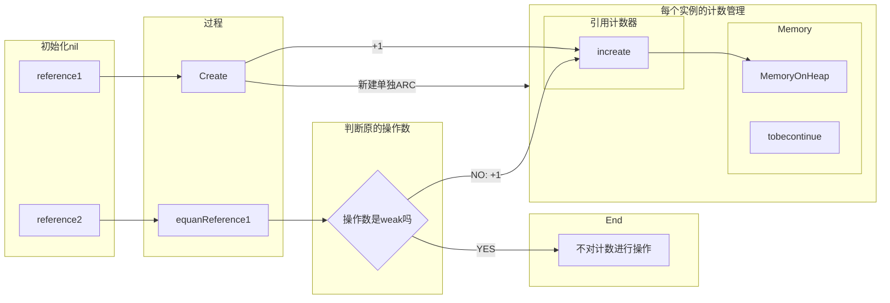
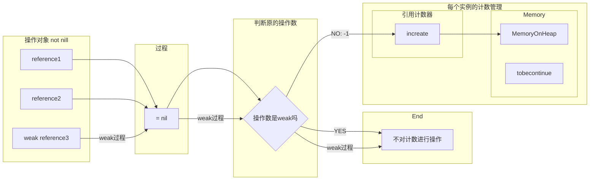
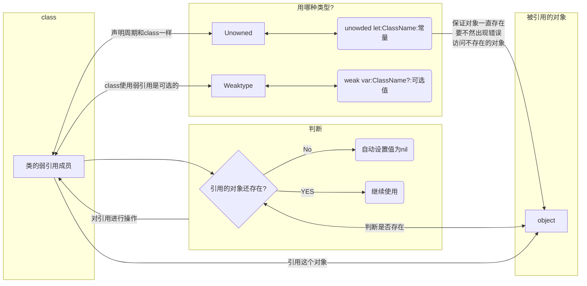
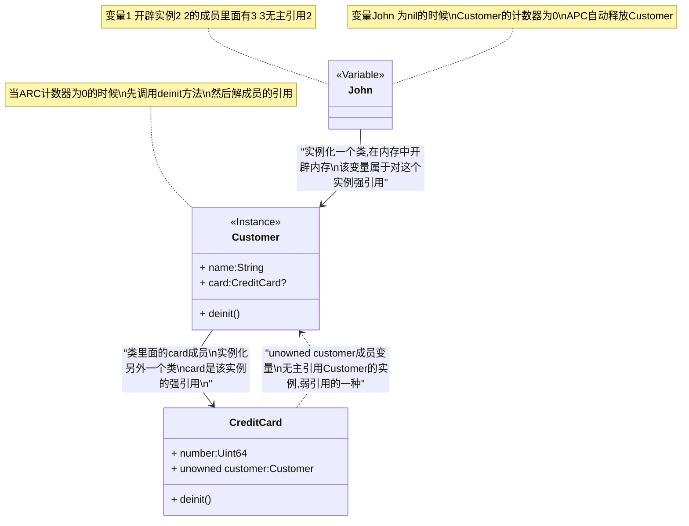
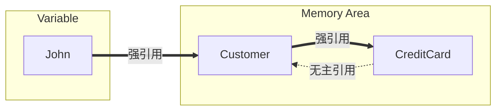

## 自动引用计数

Swift 使用自动引用计数 (ARC) 来跟踪和管理应用程序的内存使用情况。在大多数情况下，这意味着内存管理在 Swift 中“正常工作”，您不需要自己考虑内存管理。当不再需要类实例时，ARC 会自动释放这些实例所使用的内存。

但是，在某些情况下，ARC 需要有关代码各部分之间关系的更多信息，以便为您管理内存。本章描述了这些情况，并展示了如何启用 ARC 来管理应用程序的所有内存。在 Swift 中使用 ARC 与过渡到 ARC 发行说明中描述的在 Objective-C 中使用 ARC 的方法非常相似。

**引用计数仅适用于类的实例。结构体和枚举是值类型，而不是引用类型，并且不通过引用存储和传递。**


### 1.[ARC 的工作原理](https://docs.swift.org/swift-book/documentation/the-swift-programming-language/automaticreferencecounting#How-ARC-Works)

每次创建类的新实例时，ARC(**Automatic Refence Counting**) 都会分配一块内存来存储有关该实例的信息。该内存保存有关实例类型的信息，以及与该实例关联的任何存储属性的值。

此外，当不再需要某个实例时，ARC 会释放该实例使用的内存，以便该内存可以用于其他目的。这确保了类实例不再需要时不会占用内存空间。

**所有类的实例(引用类型)都是在堆中分配内存的，即使它们是作为局部变量在栈空间中声明的。这个行为是由 ARC（Automatic Reference Counting）管理的。对于类实例，ARC 会自动管理它们的内存生命周期，包括引用计数的增加和减少，以决定何时释放对象。**

但是，如果 ARC 取消分配仍在使用的实例，则将无法再访问该实例的属性或调用该实例的方法。事实上，如果您尝试访问该实例，您的应用程序很可能会崩溃。

为了确保实例在仍然需要时不会消失，ARC 会跟踪当前引用每个类实例的属性、常量和变量的数量。只要至少一个对该实例的活动引用仍然存在，ARC 就不会释放该实例。


为了实现这一点，每当将类实例分配给属性、常量或变量时，该属性、常量或变量都会对该实例进行强引用。该引用被称为“强”引用，因为它牢牢保留该实例，并且只要该强引用仍然存在，就不允许它被释放。


#### 1.1 弱引用和强引用

**强引用**

- **增加引用计数**：每当创建一个强引用或将一个对象赋值给一个强引用变量时，引用计数会增加。
- **自动跟踪**：ARC 自动跟踪强引用的数量，并在引用计数降为零时释放对象的内存。

**弱引用**：

- **不增加引用计数**：弱引用不会增加引用对象的引用计数。
- **不跟踪引用**：当引用的对象被释放时，弱引用会自动变为 nil，不会阻止对象的销毁。


### 2. ARC的一些行为

这是自动引用计数如何工作的示例。此示例从一个名为 `Person` 的简单类开始，它定义了一个名为 `name` 的存储常量属性：

```swift
class Person {
    let name: String
    init(name: String) {
        self.name = name
        print("\(name) is being initialized")
    }
    deinit {
        print("\(name) is being deinitialized")
    }
}
```

`Person` 类有一个初始化程序，用于设置实例的 `name` 属性并打印一条消息以指示初始化正在进行中。 `Person` 类还有一个析构器，当该类的实例被释放时，它会打印一条消息。


下一个代码片段定义了三个 `Person?` 类型的变量，它们用于在后续代码片段中设置对新 `Person` 实例的多个引用。由于这些变量是可选类型（ `Person?` ，而不是 `Person` ），因此它们会自动使用值 `nil` 进行初始化，并且当前不引用一个 `Person` 实例。


```swift
//三个值都会会被编译器初始化为nil
var reference1: Person?  
var reference2: Person?
var reference3: Person?
```


您现在可以创建一个新的 `Person` 实例并将其分配给以下三个变量之一：


```swift
reference1 = Person(name: "John Appleseed")
// Prints "John Appleseed is being initialized"
```

请注意，消息 `"John Appleseed is being initialized"` 是在调用 `Person` 类的初始值设定项时打印的。这确认初始化已经发生。


由于新的 `Person` 实例已分配给 `reference1` 变量，因此现在有从 `reference1` 到新 `Person` 实例的强引用。因为至少有一个强引用，所以 ARC 确保此 `Person` 保留在内存中并且不会被释放。


如果将相同的 `Person` 实例分配给另外两个变量，则会建立对该实例的另外两个强引用：


```swift 
reference2 = reference1
reference3 = reference1
```

现在这个单个 `Person` 实例有三个强引用。

如果通过将 `nil` 分配给其中两个变量来破坏其中两个强引用（包括原始引用），则会保留一个强引用，并且 `Person` 实例不会被释放：

```swift
reference1 = nil
reference2 = nil
```

ARC 不会释放 `Person` 实例，直到第三个也是最后一个强引用被破坏，此时很明显您不再使用 `Person` 实例：

```swift
reference3 = nil
// Prints "John Appleseed is being deinitialized"
```


**计数器增加的过程**




**计数器减少的过程**




###  3.类实例之间的强引用循环

在上面的示例中，ARC 能够跟踪对您创建的新 `Person` 实例的引用数量，并在不再需要该 `Person` 实例时释放该实例。

但是，编写的代码中类的实例可能永远不会达到零强引用的程度。如果两个类实例彼此保持强引用，从而每个实例都使另一个实例保持活动状态，则可能会发生这种情况。这称为强引用循环。

您可以通过将类之间的某些关系定义为弱引用或无主引用而不是强引用来解决强引用循环。解决类实例之间的强引用循环中描述了此过程。然而，在学习如何解决强引用循环之前，了解这种循环是如何引起的是很有用的。


这是一个如何意外创建强引用循环的示例。此示例定义了两个名为 Person 和 Apartment 的类，它们对公寓楼及其居民进行建模：


```swift
class Person {
    let name: String
    init(name: String) { self.name = name }
    var apartment: Apartment?
    deinit { print("\(name) is being deinitialized") }
}


class Apartment {
    let unit: String
    init(unit: String) { self.unit = unit }
    var tenant: Person?
    deinit { print("Apartment \(unit) is being deinitialized") }
}
```

每个 Person 实例都有一个 String 类型的 name 属性和一个可选的 apartment 属性，该属性最初为 nil 。 apartment 属性是可选的，因为一个人可能并不总是拥有一套公寓。

同样，每个 Apartment 实例都有一个 String 类型的 unit 属性，并具有一个可选的 tenant 属性，该属性最初为 nil .租户财产是可选的，因为公寓可能并不总是有租户。

这两个类还定义了一个反初始化程序，它打印该类的实例正在被反初始化的事实。这使您能够查看 Person 和 Apartment 的实例是否按预期被释放。


下一个代码片段定义了两个名为 john 和 unit4A 的可选类型变量，它们将被设置为特定的 Apartment 和 Person 实例以下。由于是可选的，这两个变量的初始值为 nil ：

```swift
var john: Person?
var unit4A: Apartment?
```


您现在可以创建特定的 Person 实例和 Apartment 实例，并将这些新实例分配给 john 和 unit4A 变量：

```swift
john = Person(name: "John Appleseed")
unit4A = Apartment(unit: "4A")
```

以下是创建并分配这两个实例后强引用的外观。 john 变量现在对新的 Person 实例具有强引用， unit4A 变量对新的 Apartment 具有强引用实例：


您现在可以将两个实例链接在一起，以便该人拥有一套公寓，并且该公寓有一个租户。请注意，感叹号 ( `!` ) 用于解包和访问存储在 `john` 和 `unit4A` 可选变量中的实例，以便这些实例的属性可以设置：

```swift
john!.apartment = unit4A
unit4A!.tenant = joh
```


以下是将两个实例链接在一起后强引用的外观：


不幸的是，链接这两个实例会在它们之间创建一个强引用循环。 `Person` 实例现在对 `Apartment` 实例具有强引用， `Apartment` 实例对 `Person` 实例具有强引用。因此，当您破坏 `john` 和 `unit4A` 变量所持有的强引用时，引用计数不会降至零，并且 ARC 不会释放实例：


```swift
john = nil
unit4A = nil
```

请注意，当您将这两个变量设置为 `nil` 时，两个反初始化器都没有被调用。强引用循环可防止 `Person` 和 `Apartment` 实例被释放，从而导致应用程序内存泄漏。

以下是将 `john` 和 `unit4A` 变量设置为 `nil` 后强引用的外观：


### 4.解决类实例之间的强引用循环

当您使用类类型的属性时，Swift 提供了两种解决强引用循环的方法：弱引用和无主引用。

弱引用和无主引用使引用循环中的一个实例能够引用另一实例，而无需对其进行强保留。然后，实例可以相互引用，而无需创建强引用循环

当另一个实例的生命周期较短时（即可以先释放另一个实例时），请使用弱引用。在上面的 `Apartment` 示例中，公寓在其生命周期的某个时刻可以没有租户，因此弱引用是打破这种情况下引用循环的适当方法。相反，当另一个实例具有相同的生命周期或更长的生命周期时，请使用无主引用。

- **类的成员是可以选择的，并且生命周期可能不一样，这个时候用weak 并且类型应该标记为可选的 ？** 因为可选的才可以为nil
- **成员和实例有一样的生命周期的时候使用 unowned**  通常被标记为let,常量,ARC不会把unowned标记为nil





#### 4.1 弱引用

> **Note**:弱引用标记为weak

弱引用是不会对其所引用的实例保持强保留的引用，因此不会阻止 ARC 处理所引用的实例。此行为可防止引用成为强引用循环的一部分。您可以通过在属性或变量声明之前放置 `weak` 关键字来指示弱引用。

由于弱引用不会对其所引用的实例保持强保留，因此当弱引用仍在引用该实例时，该实例可能会被释放。因此，**当 `nil` 引用的实例被释放时，ARC 会自动设置对 `nil` 的弱引用**。而且，由于弱引用需要允许其值在运行时更改为 `nil` ，因此 **它们(弱引用)始终被声明为可选类型的变量，而不是常量。**


您可以检查弱引用中是否存在某个值，就像任何其他可选值一样，并且您永远不会得到对不再存在的无效实例的引用。

> **Note**:当 ARC 设置对 `nil` 的弱引用时，不会调用属性观察器。


下面的示例与上面的 `Person` 和 `Apartment` 示例相同，但有一个重要区别。这一次， `Apartment` 类型的 `tenant` 属性被声明为弱引用：

```swift
class Person {
    let name: String
    init(name: String) { self.name = name }
    var apartment: Apartment?
    deinit { print("\(name) is being deinitialized") }
}


class Apartment {
    let unit: String
    init(unit: String) { self.unit = unit }
    weak var tenant: Person?
    deinit { print("Apartment \(unit) is being deinitialized") }
}
```

来自两个变量（ `john` 和 `unit4A` ）的强引用以及两个实例之间的链接的创建方式与以前一样：

```swift
var john: Person?
var unit4A: Apartment?


john = Person(name: "John Appleseed")
unit4A = Apartment(unit: "4A")


john!.apartment = unit4A
unit4A!.tenant = john
```


现在您已将两个实例链接在一起，引用的外观如下：


### 4.2 无主引用

与弱引用一样，无主引用不会对其所引用的实例保持牢固的控制。然而，与弱引用不同的是，当另一个实例具有相同的生存期或更长的生存期时，将使用无主引用。您可以通过在属性或变量声明之前放置 `unowned` 关键字来指示无主引用。

与弱引用不同，无主引用应始终具有值。因此，将值标记为无主并不意味着它是可选的，并且 ARC 永远不会将无主引用的值设置为 `nil` 。

> **Note**:仅当您确定引用始终引用尚未释放的实例时，才使用无主引用。
>
> 如果您在实例被释放后尝试访问无主引用的值，您将收到运行时错误。

以下示例定义了两个类 `Customer` 和 `CreditCard` ，它们为银行客户和该客户可能的信用卡建模。这两个类各自将另一个类的实例存储为属性。这种关系有可能创建一个强大的引用循环。

`Customer` 和 `CreditCard` 之间的关系与上面弱引用示例中看到的 `Apartment` 和 `Person` 之间的关系略有不同。在此数据模型中，客户可能有也可能没有信用卡，但信用卡将始终与客户相关联。 `CreditCard` 实例的寿命永远不会比它所引用的 `Customer` 长。为了表示这一点， `Customer` 类有一个可选的 `card` 属性，但 `CreditCard` 类有一个无主（且非可选） `customer` 财产。


此外，只能通过将 `number` 值和 `customer` 实例传递给自定义 `CreditCard` 初始值设定项来创建新的 `CreditCard` 实例。这可确保在创建 `CreditCard` 实例时， `CreditCard` 实例始终具有与其关联的 `customer` 实例。

由于信用卡始终有客户，因此您将其 `customer` 属性定义为无主引用，以避免强引用循环：


```swift
//客户有可能没有信用卡，但是信用卡一定有所属人
class Customer {
    let name: String
    var card: CreditCard?
    init(name: String) {
        self.name = name
    }
    deinit { print("\(name) is being deinitialized") }
}


class CreditCard {
  	//CreditCard 类的 number 属性定义为 UInt64 类型，而不是 Int ，以确保 number
    let number: UInt64
    unowned let customer: Customer
    init(number: UInt64, customer: Customer) {
        self.number = number
        self.customer = customer
    }
    deinit { print("Card #\(number) is being deinitialized") }
}

```

下一个代码片段定义了一个名为 `john` 的可选 `Customer` 变量，该变量将用于存储对特定客户的引用。该变量的初始值为 nil，因为它是可选的：

```swift
var john: Customer?
```

您现在可以创建一个 `Customer` 实例，并使用它来初始化并分配一个新的 `CreditCard` 实例作为该客户的 `card` 属性：

```swift
john = Customer(name: "John Appleseed")
john!.card = CreditCard(number: 1234_5678_9012_3456, customer: john!)
```

现在您已经链接了两个实例，引用的外观如下：


`Customer` 实例现在具有对 `CreditCard` 实例的强引用， `CreditCard` 实例具有对 `Customer` 实例的无主引用。

由于无主 `customer` 引用，当您破坏 `john` 变量所持有的强引用时，将不再有对 `Customer` 实例的强引用：






