## 自动引用计数

Swift 使用自动引用计数 (ARC) 来跟踪和管理应用程序的内存使用情况。在大多数情况下，这意味着内存管理在 Swift 中“正常工作”，您不需要自己考虑内存管理。当不再需要类实例时，ARC 会自动释放这些实例所使用的内存。

但是，在某些情况下，ARC 需要有关代码各部分之间关系的更多信息，以便为您管理内存。本章描述了这些情况，并展示了如何启用 ARC 来管理应用程序的所有内存。在 Swift 中使用 ARC 与过渡到 ARC 发行说明中描述的在 Objective-C 中使用 ARC 的方法非常相似。

**引用计数仅适用于类的实例。结构体和枚举是值类型，而不是引用类型，并且不通过引用存储和传递。**


### 1.[ARC 的工作原理](https://docs.swift.org/swift-book/documentation/the-swift-programming-language/automaticreferencecounting#How-ARC-Works)

每次创建类的新实例时，ARC(**Automatic Refence Counting**) 都会分配一块内存来存储有关该实例的信息。该内存保存有关实例类型的信息，以及与该实例关联的任何存储属性的值。

此外，当不再需要某个实例时，ARC 会释放该实例使用的内存，以便该内存可以用于其他目的。这确保了类实例不再需要时不会占用内存空间。

**所有类的实例(引用类型)都是在堆中分配内存的，即使它们是作为局部变量在栈空间中声明的。这个行为是由 ARC（Automatic Reference Counting）管理的。对于类实例，ARC 会自动管理它们的内存生命周期，包括引用计数的增加和减少，以决定何时释放对象。**

但是，如果 ARC 取消分配仍在使用的实例，则将无法再访问该实例的属性或调用该实例的方法。事实上，如果您尝试访问该实例，您的应用程序很可能会崩溃。

为了确保实例在仍然需要时不会消失，ARC 会跟踪当前引用每个类实例的属性、常量和变量的数量。只要至少一个对该实例的活动引用仍然存在，ARC 就不会释放该实例。


为了实现这一点，每当将类实例分配给属性、常量或变量时，该属性、常量或变量都会对该实例进行强引用。该引用被称为“强”引用，因为它牢牢保留该实例，并且只要该强引用仍然存在，就不允许它被释放。


#### 1.1 弱引用和强引用

**强引用**

- **增加引用计数**：每当创建一个强引用或将一个对象赋值给一个强引用变量时，引用计数会增加。
- **自动跟踪**：ARC 自动跟踪强引用的数量，并在引用计数降为零时释放对象的内存。

**弱引用**：

- **不增加引用计数**：弱引用不会增加引用对象的引用计数。
- **不跟踪引用**：当引用的对象被释放时，弱引用会自动变为 nil，不会阻止对象的销毁。


### 2. ARC的一些行为

这是自动引用计数如何工作的示例。此示例从一个名为 `Person` 的简单类开始，它定义了一个名为 `name` 的存储常量属性：

```swift
class Person {
    let name: String
    init(name: String) {
        self.name = name
        print("\(name) is being initialized")
    }
    deinit {
        print("\(name) is being deinitialized")
    }
}
```

`Person` 类有一个初始化程序，用于设置实例的 `name` 属性并打印一条消息以指示初始化正在进行中。 `Person` 类还有一个析构器，当该类的实例被释放时，它会打印一条消息。


下一个代码片段定义了三个 `Person?` 类型的变量，它们用于在后续代码片段中设置对新 `Person` 实例的多个引用。由于这些变量是可选类型（ `Person?` ，而不是 `Person` ），因此它们会自动使用值 `nil` 进行初始化，并且当前不引用一个 `Person` 实例。


```swift
//三个值都会会被编译器初始化为nil
var reference1: Person?  
var reference2: Person?
var reference3: Person?
```


您现在可以创建一个新的 `Person` 实例并将其分配给以下三个变量之一：


```swift
reference1 = Person(name: "John Appleseed")
// Prints "John Appleseed is being initialized"
```

请注意，消息 `"John Appleseed is being initialized"` 是在调用 `Person` 类的初始值设定项时打印的。这确认初始化已经发生。


由于新的 `Person` 实例已分配给 `reference1` 变量，因此现在有从 `reference1` 到新 `Person` 实例的强引用。因为至少有一个强引用，所以 ARC 确保此 `Person` 保留在内存中并且不会被释放。


如果将相同的 `Person` 实例分配给另外两个变量，则会建立对该实例的另外两个强引用：


```swift 
reference2 = reference1
reference3 = reference1
```

现在这个单个 `Person` 实例有三个强引用。

如果通过将 `nil` 分配给其中两个变量来破坏其中两个强引用（包括原始引用），则会保留一个强引用，并且 `Person` 实例不会被释放：

```swift
reference1 = nil
reference2 = nil
```

ARC 不会释放 `Person` 实例，直到第三个也是最后一个强引用被破坏，此时很明显您不再使用 `Person` 实例：

```swift
reference3 = nil
// Prints "John Appleseed is being deinitialized"
```


**计数器增加的过程**


**计数器减少的过程**


###  3.类实例之间的强引用循环

在上面的示例中，ARC 能够跟踪对您创建的新 `Person` 实例的引用数量，并在不再需要该 `Person` 实例时释放该实例。

但是，编写的代码中类的实例可能永远不会达到零强引用的程度。如果两个类实例彼此保持强引用，从而每个实例都使另一个实例保持活动状态，则可能会发生这种情况。这称为强引用循环。

您可以通过将类之间的某些关系定义为弱引用或无主引用而不是强引用来解决强引用循环。解决类实例之间的强引用循环中描述了此过程。然而，在学习如何解决强引用循环之前，了解这种循环是如何引起的是很有用的。


这是一个如何意外创建强引用循环的示例。此示例定义了两个名为 Person 和 Apartment 的类，它们对公寓楼及其居民进行建模：


```swift
class Person {
    let name: String
    init(name: String) { self.name = name }
    var apartment: Apartment?
    deinit { print("\(name) is being deinitialized") }
}


class Apartment {
    let unit: String
    init(unit: String) { self.unit = unit }
    var tenant: Person?
    deinit { print("Apartment \(unit) is being deinitialized") }
}
```

每个 Person 实例都有一个 String 类型的 name 属性和一个可选的 apartment 属性，该属性最初为 nil 。 apartment 属性是可选的，因为一个人可能并不总是拥有一套公寓。

同样，每个 Apartment 实例都有一个 String 类型的 unit 属性，并具有一个可选的 tenant 属性，该属性最初为 nil .租户财产是可选的，因为公寓可能并不总是有租户。

这两个类还定义了一个反初始化程序，它打印该类的实例正在被反初始化的事实。这使您能够查看 Person 和 Apartment 的实例是否按预期被释放。


下一个代码片段定义了两个名为 john 和 unit4A 的可选类型变量，它们将被设置为特定的 Apartment 和 Person 实例以下。由于是可选的，这两个变量的初始值为 nil ：

```swift
var john: Person?
var unit4A: Apartment?
```


您现在可以创建特定的 Person 实例和 Apartment 实例，并将这些新实例分配给 john 和 unit4A 变量：

```swift
john = Person(name: "John Appleseed")
unit4A = Apartment(unit: "4A")
```

以下是创建并分配这两个实例后强引用的外观。 john 变量现在对新的 Person 实例具有强引用， unit4A 变量对新的 Apartment 具有强引用实例：


您现在可以将两个实例链接在一起，以便该人拥有一套公寓，并且该公寓有一个租户。请注意，感叹号 ( `!` ) 用于解包和访问存储在 `john` 和 `unit4A` 可选变量中的实例，以便这些实例的属性可以设置：

```swift
john!.apartment = unit4A
unit4A!.tenant = joh
```


以下是将两个实例链接在一起后强引用的外观：


不幸的是，链接这两个实例会在它们之间创建一个强引用循环。 `Person` 实例现在对 `Apartment` 实例具有强引用， `Apartment` 实例对 `Person` 实例具有强引用。因此，当您破坏 `john` 和 `unit4A` 变量所持有的强引用时，引用计数不会降至零，并且 ARC 不会释放实例：


```swift
john = nil
unit4A = nil
```

请注意，当您将这两个变量设置为 `nil` 时，两个反初始化器都没有被调用。强引用循环可防止 `Person` 和 `Apartment` 实例被释放，从而导致应用程序内存泄漏。

以下是将 `john` 和 `unit4A` 变量设置为 `nil` 后强引用的外观：


### 4.解决类实例之间的强引用循环

当您使用类类型的属性时，Swift 提供了两种解决强引用循环的方法：弱引用和无主引用。

弱引用和无主引用使引用循环中的一个实例能够引用另一实例，而无需对其进行强保留。然后，实例可以相互引用，而无需创建强引用循环

当另一个实例的生命周期较短时（即可以先释放另一个实例时），请使用弱引用。在上面的 `Apartment` 示例中，公寓在其生命周期的某个时刻可以没有租户，因此弱引用是打破这种情况下引用循环的适当方法。相反，当另一个实例具有相同的生命周期或更长的生命周期时，请使用无主引用。

- **类的成员是可以选择的，并且生命周期可能不一样，这个时候用weak 并且类型应该标记为可选的 ？** 因为可选的才可以为nil
- **成员和实例有一样的生命周期的时候使用 unowned**  通常被标记为let,常量,ARC不会把unowned标记为nil


类析构deiit的步骤:

- 当让ARC(automatic reference counting)值为1

- 处理deinit函数

- 对于每个成员，ARC 会递减其引用计数。如果某个成员的引用计数变为 0，那么该成员也会被销毁，其 deinit 方法也会被调用（如果存在的话）

- 释放内存

  


#### 4.1 弱引用

> **Note**:弱引用标记为weak

弱引用是不会对其所引用的实例保持强保留的引用，因此不会阻止 ARC 处理所引用的实例。此行为可防止引用成为强引用循环的一部分。您可以通过在属性或变量声明之前放置 `weak` 关键字来指示弱引用。

由于弱引用不会对其所引用的实例保持强保留，因此当弱引用仍在引用该实例时，该实例可能会被释放。因此，**当 `nil` 引用的实例被释放时，ARC 会自动设置对 `nil` 的弱引用**。而且，由于弱引用需要允许其值在运行时更改为 `nil` ，因此 **它们(弱引用)始终被声明为可选类型的变量，而不是常量。**


您可以检查弱引用中是否存在某个值，就像任何其他可选值一样，并且您永远不会得到对不再存在的无效实例的引用。

> **Note**:当 ARC 设置对 `nil` 的弱引用时，不会调用属性观察器。


下面的示例与上面的 `Person` 和 `Apartment` 示例相同，但有一个重要区别。这一次， `Apartment` 类型的 `tenant` 属性被声明为弱引用：

```swift
class Person {
    let name: String
    init(name: String) { self.name = name }
    var apartment: Apartment?
    deinit { print("\(name) is being deinitialized") }
}


class Apartment {
    let unit: String
    init(unit: String) { self.unit = unit }
    weak var tenant: Person?
    deinit { print("Apartment \(unit) is being deinitialized") }
}
```

来自两个变量（ `john` 和 `unit4A` ）的强引用以及两个实例之间的链接的创建方式与以前一样：

```swift
var john: Person?
var unit4A: Apartment?


john = Person(name: "John Appleseed")
unit4A = Apartment(unit: "4A")


john!.apartment = unit4A
unit4A!.tenant = john
```


现在您已将两个实例链接在一起，引用的外观如下：


#### 4.2 无主引用

与弱引用一样，无主引用不会对其所引用的实例保持牢固的控制。然而，与弱引用不同的是，当另一个实例具有相同的生存期或更长的生存期时，将使用无主引用。您可以通过在属性或变量声明之前放置 `unowned` 关键字来指示无主引用。

与弱引用不同，无主引用应始终具有值。因此，将值标记为无主并不意味着它是可选的，并且 ARC 永远不会将无主引用的值设置为 `nil` 。

> **Note**:仅当您确定引用始终引用尚未释放的实例时，才使用无主引用。
>
> 如果您在实例被释放后尝试访问无主引用的值，您将收到运行时错误。

以下示例定义了两个类 `Customer` 和 `CreditCard` ，它们为银行客户和该客户可能的信用卡建模。这两个类各自将另一个类的实例存储为属性。这种关系有可能创建一个强大的引用循环。

`Customer` 和 `CreditCard` 之间的关系与上面弱引用示例中看到的 `Apartment` 和 `Person` 之间的关系略有不同。在此数据模型中，客户可能有也可能没有信用卡，但信用卡将始终与客户相关联。 `CreditCard` 实例的寿命永远不会比它所引用的 `Customer` 长。为了表示这一点， `Customer` 类有一个可选的 `card` 属性，但 `CreditCard` 类有一个无主（且非可选） `customer` 财产。


此外，只能通过将 `number` 值和 `customer` 实例传递给自定义 `CreditCard` 初始值设定项来创建新的 `CreditCard` 实例。这可确保在创建 `CreditCard` 实例时， `CreditCard` 实例始终具有与其关联的 `customer` 实例。

由于信用卡始终有客户，因此您将其 `customer` 属性定义为无主引用，以避免强引用循环：


```swift
//客户有可能没有信用卡，但是信用卡一定有所属人
class Customer {
    let name: String
    var card: CreditCard?
    init(name: String) {
        self.name = name
    }
    deinit { print("\(name) is being deinitialized") }
}


class CreditCard {
  	//CreditCard 类的 number 属性定义为 UInt64 类型，而不是 Int ，以确保 number
    let number: UInt64
    unowned let customer: Customer
    init(number: UInt64, customer: Customer) {
        self.number = number
        self.customer = customer
    }
    deinit { print("Card #\(number) is being deinitialized") }
}

```

下一个代码片段定义了一个名为 `john` 的可选 `Customer` 变量，该变量将用于存储对特定客户的引用。该变量的初始值为 nil，因为它是可选的：

```swift
var john: Customer?
```

您现在可以创建一个 `Customer` 实例，并使用它来初始化并分配一个新的 `CreditCard` 实例作为该客户的 `card` 属性：

```swift
john = Customer(name: "John Appleseed")
john!.card = CreditCard(number: 1234_5678_9012_3456, customer: john!)
```

现在您已经链接了两个实例，引用的外观如下：


`Customer` 实例现在具有对 `CreditCard` 实例的强引用， `CreditCard` 实例具有对 `Customer` 实例的无主引用。

由于无主 `customer` 引用，当您破坏 `john` 变量所持有的强引用时，将不再有对 `Customer` 实例的强引用：

[](https://docs.swift.org/swift-book/images/org.swift.tspl/unownedReference02@2x.png)


##### TODO:此处缺1图无法渲然


由于不再有对 `Customer` 实例的强引用，因此它被释放。发生这种情况后，不再有对 `CreditCard` 实例的强引用，并且它也被释放：

```swift
john = nil // Prints "John Appleseed is being deinitialized" // Prints "Card #1234567890123456 is being deinitialized"
```

上面的最终代码片段显示，在 `john` 变量设置为 `nil` 实例的反初始化器都打印其“反初始化”消息> 。


> **Note**:上面的示例展示了如何使用安全的无主引用。 Swift 还为您需要禁用运行时安全检查的情况提供不安全的无主引用 - 例如，出于性能原因。与所有不安全的操作一样，您有责任检查该代码的安全性。
>
> 您可以通过编写 `unowned(unsafe)` 来指示不安全的无主引用。如果在释放其引用的实例后尝试访问不安全的无主引用，则程序将尝试访问该实例曾经所在的内存位置，这是不安全的操作。


#### 4.3无主引用可选参考

您可以将对类的可选引用标记为无主。就 ARC 所有权模型而言，无主可选引用和弱引用都可以在相同的上下文中使用。不同之处在于，当您**使用无主可选引用时，您有责任确保它始终引用有效对象或设置为 `nil` 。**


下面是一个跟踪学校特定部门提供的课程的示例：

```swift
class Department {
    var name: String
    var courses: [Course]
    init(name: String) {
        self.name = name
        self.courses = []
    }
}


class Course {
    var name: String
    unowned var department: Department
    unowned var nextCourse: Course?
    init(name: String, in department: Department) {
        self.name = name
        self.department = department
        self.nextCourse = nil
    }
}
```


`Department` 对该部门提供的每门课程都保留了强有力的参考。在 ARC 所有权模型中，一个部门拥有其课程。 `Course` 有两个无主引用，一个指向院系，另一个指向学生应该选修的下一门课程；课程不拥有这些对象中的任何一个。每门课程都是某个部门的一部分，因此 `department` 属性不是可选的。但是，由于某些课程没有推荐的后续课程，因此 `nextCourse`属性是可选的。

下面是使用这些类的示例：

```swift
let department = Department(name: "Horticulture")


let intro = Course(name: "Survey of Plants", in: department)
let intermediate = Course(name: "Growing Common Herbs", in: department)
let advanced = Course(name: "Caring for Tropical Plants", in: department)


intro.nextCourse = intermediate
intermediate.nextCourse = advanced
department.courses = [intro, intermediate, advanced]
```


上面的代码创建了一个部门及其三门课程。入门课程和中级课程都在其 `nextCourse` 属性中存储了建议的下一课程，该属性保留了对学生在完成本课程后应学习的课程的无主可选引用。


无主可选引用不会对其包装的类的实例保持牢固的控制，因此它不会阻止 ARC 释放该实例。它的行为与 ARC 下无主引用的行为相同，只是无主可选引用可以是 `nil` 。

与非可选的无主引用一样，您有责任确保 `nextCourse` 始终引用尚未取消分配的课程。在这种情况下，例如，当您从 `department.courses` 中删除课程时，您还需要删除其他课程可能拥有的对它的任何引用。


> **Note**:可选值的基础类型是 `Optional` ，它是 Swift 标准库中的枚举。但是，可选值是值类型不能用 `unowned` 标记的规则的一个例外。
>
> 包装类的可选值不使用引用计数，因此您不需要维护对可选值的强引用。


### 4.4 无主引用和隐式解包可选属性

上面的弱引用和无主引用的示例涵盖了两种更常见的场景，在这些场景中需要打破强引用循环。

`Person` 和 `Apartment` 示例显示了一种情况，其中两个属性（都允许为 `nil` ）有可能导致强引用循环。这种情况最好通过弱引用来解决。

`Customer` 和 `CreditCard` 示例显示了一种情况，其中一个允许为 `nil` 的属性和另一个不能为 `nil` 的属性具有导致强引用循环的潜力。这种情况最好通过无主引用来解决。

两个都是可选属性，使用弱引用，

一个为可选，一个必须有值使用无主引用

然而，还有第三种情况，其中两个属性都应该始终有一个值，并且一旦初始化完成，两个属性都不应该是 `nil` 。在这种情况下，将一个类上的无主属性与另一个类上的隐式解包可选属性组合起来非常有用。


这使得初始化完成后可以直接访问这两个属性（无需可选的展开），同时仍然避免引用循环。本节向您展示如何建立这样的关系。


下面的示例定义了两个类 `Country` 和 `City` ，每个类都将另一个类的实例存储为属性。在这个数据模型中，每个国家都必须有一个首都，并且每个城市都必须属于一个国家。为了表示这一点， `Country` 类有一个 `capitalCity` 属性， `City` 类有一个 `country` 属性：

```swift
class Country {
    let name: String
    var capitalCity: City!  //也还是可选值，但是访问之前必须有值，编译器隐式解包
    init(name: String, capitalName: String) {
        self.name = name
        self.capitalCity = City(name: capitalName, country: self)
    }
}


class City {
    let name: String
    unowned let country: Country
    init(name: String, country: Country) {
        self.name = name
        self.country = country
    }
}
```


为了设置两个类之间的相互依赖关系， `City` 的初始化程序采用一个 `Country` 实例，并将该实例存储在其 `country` 属性中。

`City` 的初始化程序是从 `Country` 的初始化程序中调用的。但是，在新的 `Country` 实例完全初始化之前， `Country` 的初始化程序无法将 `self` 传递给 `City` 初始化程序，如下所述在两阶段初始化中。

为了满足此要求，您将 `Country` 的 `capitalCity` 属性声明为隐式解包的可选属性，由其类型注释末尾的感叹号表示 ( `City!` 属性具有默认值 `nil` ，与任何其他可选属性一样，但无需解开其值即可访问，如隐式解开选项中所述。

由于 `capitalCity` 具有默认的 `nil` 值，因此只要 `Country` 实例设置其 `name` 实例就被视为完全初始化。 > 其初始值设定项中的属性。这意味着一旦设置了 `name` 属性， `Country` 初始值设定项就可以开始引用并传递隐式 `self` 属性。因此，当 `Country` 初始化器设置其自己的 `capitalCity` 作为 `City` 初始化器的参数之一传递属性。

所有这些意味着您可以在单个语句中创建 `Country` 和 `City` 实例，而无需创建强引用循环，并且可以访问 `capitalCity`属性直接，无需使用感叹号来解开其可选值：

```swift
var country = Country(name: "Canada", capitalName: "Ottawa")
print("\(country.name)'s capital city is called \(country.capitalCity.name)")
// Prints "Canada's capital city is called Ottawa"
```

在上面的示例中，使用隐式解包可选意味着满足所有两阶段类初始值设定项要求。初始化完成后， `capitalCity` 属性可以像非可选值一样使用和访问，同时仍然避免强引用循环。


### 4.5 链表中的引用类型


链表 从 ARC的角度看，第1个对象 强引用下一个对象，下一个对象弱引用我，防止嵌套死循环


### 4.6 闭包的强引用循环

您在上面看到了当两个类实例属性相互持有强引用时如何创建强引用循环。您还了解了如何使用弱引用和无主引用来打破这些强引用循环。


如果将闭包分配给类实例的属性，并且该闭包的主体捕获该实例，也可能会发生强引用循环。发生此捕获可能是因为闭包的主体访问实例的属性（例如 `self.someProperty` ），或者因为闭包调用实例上的方法（例如 `self.someMethod()`）。无论哪种情况，这些访问都会导致闭包“捕获” `self` ，从而创建强引用循环。


发生这种强引用循环是因为闭包和类一样，都是引用类型。当您将闭包分配给属性时，您正在分配对该闭包的引用。从本质上讲，这和上面的问题是一样的——两个强大的引用使彼此保持活力。然而，这次不是两个类实例，而是一个类实例和一个闭包使彼此保持活动状态。


Swift 为这个问题提供了一个优雅的解决方案，称为闭包捕获列表。然而，在学习如何使用闭包捕获列表打破强引用循环之前，了解如何导致这种循环是很有用的。


下面的示例展示了如何在使用引用 `self` 的闭包时创建强引用循环。此示例定义了一个名为 `HTMLElement` 的类，它为 HTML 文档中的单个元素提供了一个简单的模型：


```swift
class HTMLElement {


    let name: String
    let text: String?

//具有延迟计算属性的闭包函数，参数为Void 返回值为String
    lazy var asHTML: () -> String = {
        if let text = self.text {
            return "<\(self.name)>\(text)</\(self.name)>"
        } else {
            return "<\(self.name) />"
        }
    }


    init(name: String, text: String? = nil) {
        self.name = name
        self.text = text
    }


    deinit {
        print("\(name) is being deinitialized")
    }


}
```

`HTMLElement` 类定义了 `name` 属性，该属性指示元素的名称，例如 `"h1"` 表示标题元素， `"p"` 表示段落元素，或 `"br"`换行元素。 `HTMLElement` 还定义了一个可选的 `text` 属性，您可以将其设置为表示要在该 HTML 元素中呈现的文本的字符串。

除了这两个简单的属性之外， `HTMLElement` 类还定义了一个名为 `asHTML` 的惰性属性。此属性引用一个将 `name` 和 `text`组合成 HTML 字符串片段的闭包。 `asHTML` 属性的类型为 `() -> String` ，或“不带参数并返回 `String` 值的函数”。

默认情况下， `asHTML` 属性被分配一个闭包，该闭包返回 HTML 标记的字符串表示形式。如果存在，此标记包含可选的 `text` 值，如果 `text` 不存在，则不包含任何文本内容。对于段落元素，闭包将返回 `"<p>some text</p>"` 或 `"<p />"`，具体取决于 `text` 属性是否等于 `"some text"` 或 `nil`


`asHTML` 属性的命名和使用有点像实例方法。但是，由于 `asHTML` 是闭包属性而不是实例方法，因此如果您想要更改 HTML 呈现，则可以用自定义闭包替换 `asHTML` 属性的默认值特定的 HTML 元素。


例如，如果 `text` 属性为 `nil` ，则可以将 `asHTML` 属性设置为默认为某些文本的闭包，以防止表示返回一个空的 HTML 标签：


```swift
let heading = HTMLElement(name: "h1")
let defaultText = "some default text"

//更改类里面的闭包
heading.asHTML = {
    return "<\(heading.name)>\(heading.text ?? defaultText)</\(heading.name)>"
}
print(heading.asHTML())
// Prints "<h1>some default text</h1>"
```

>  **Note**:`asHTML` 属性被声明为惰性属性，因为仅当元素实际需要呈现为某些 HTML 输出目标的字符串值时才需要它。 `asHTML` 是一个惰性属性，这意味着您可以在默认闭包中引用 `self` ，因为直到初始化完成并且 `self` 已知存在。

`HTMLElement` 类提供了一个初始值设定项，它采用 `name` 参数和（如果需要） `text` 参数来初始化新元素。该类还定义了一个析构器，它会在 `HTMLElement` 实例被释放时打印一条消息来显示。

以下是如何使用 `HTMLElement` 类创建和打印新实例：

```swift
var paragraph: HTMLElement? = HTMLElement(name: "p", text: "hello, world")
print(paragraph!.asHTML())
// Prints "<p>hello, world</p>"
```

> **Note**:上面的 `paragraph` 变量被定义为可选的 `HTMLElement` ，因此可以将其设置为下面的 `nil` 以演示强引用循环的存在。

不幸的是，如上所述， `HTMLElement` 类在 `HTMLElement` 实例和用于其默认 `asHTML` 值的闭包之间创建了强引用循环。循环如下：


**实例的 `asHTML` 属性拥有对其闭包的强引用。但是，由于闭包在其主体内引用 `self` （作为引用 `self.name` 和 `self.text` 的一种方式）**，因此闭包捕获 self，这意味着它保存对 `HTMLElement` 实例的强引用。两者之间创建了强引用循环。 （有关在闭包中捕获值的更多信息，请参阅捕获值。）

```mermaid
classDiagram

HTMLElement	--> htmlElement:Make Instance\n生成实例
htmlElement ..> htmlElement:闭包函数强引用自己
htmlElement --> htmlElement:标记闭包中的引用self为unowned
htmlElement ..> ARC_htmlElement_Counter:闭包函数导致计数器再次加1
htmlElement --> Resolution:解决方案
Resolution --> ARC_htmlElement_Counter:标记闭包中的引用为无主引用

	
	
	class HTMLElement{
		+name:String
		+text:String?
		lazy var asHTML: () -> String
	}
	
	class Resolution{
	<<标记闭包无主引用>>
	}
	
	class ARC_htmlElement_Counter{
		+ htmlElement的ARC计数器
	}

	namespace Memory{
		class htmlElement{
		<<Instance>>
		+name:String
		+text:String?
		lazy var asHTML: () -> String
		}
	}
	
	
	
	
```





> **Note**:即使闭包多次引用 `self` ，它也仅捕获对 `HTMLElement` 实例的一次强引用。
>
> 

如果将 `paragraph` 变量设置为 `nil` 并中断其对 `HTMLElement` 实例的强引用，则强引用循环会阻止释放 `HTMLElement`实例及其关闭：

```swift
paragraph = nil
// deinit unused
```

请注意， `HTMLElement` 析构器中的消息未打印，这表明 `HTMLElement` 实例未释放。


### 4.7 解决闭包中的强引用循环

通过将捕获列表定义为闭包定义的一部分，可以解决闭包和类实例之间的强引用循环。捕获列表定义了在闭包体内捕获一个或多个引用类型时要使用的规则。与两个类实例之间的强引用循环一样，您将每个捕获的引用声明为弱引用或无主引用，而不是强引用。弱或无主的适当选择取决于代码不同部分之间的关系。

**在闭包中标记self 为weak 或者Unowned self **


> **Note**:每当您引用 `self` 或 `self.someMethod()` （而不仅仅是 `someProperty` 或 `someMethod()` ） 在一个闭包内。这可以帮助您记住，可能会意外捕获 `self` 。


#### 4.7.1 定义捕获列表

捕获列表中的每个项目都是 `weak` 或 `unowned` 关键字与对类实例（例如 `self` ）的引用或初始化为变量的配对一些值（例如 `delegate = self.delegate` ）。这些配对写在一对方括号内，并用逗号分隔。

将捕获列表放在闭包的参数列表和返回类型（如果提供）之前：

```swift
lazy var someClosure = {
        [unowned self, weak delegate = self.delegate]
        (index: Int, stringToProcess: String) -> String in
    // closure body goes here
}
```

以上语法分解

```swift
lazy var someClosure = {
        [函数的捕获列表 或者定义weak之类的]
        (函数的参数) -> 函数的返回值 in
    // closure body goes here
    //闭包函数体 Or return value
}

[函数的捕获列表](函数参数标签) 函数返回值都可以忽略
```

如果闭包没有指定参数列表或返回类型，因为它们可以从上下文中推断出来，请将捕获列表放在闭包的最开始处，后跟 `in`关键字：

```swift
lazy var someClosure = {
        [unowned self, weak delegate = self.delegate] in
    // closure body goes here
}
```


####  4.7.2 弱引用和无主引用

当闭包和它捕获的实例始终相互引用并且始终同时释放时，将闭包中的捕获定义为无主引用。

相反，当捕获的引用在将来的某个时刻可能变为 `nil` 时，将捕获定义为弱引用。弱引用始终是可选类型，并在其引用的实例被释放时自动变为 `nil` 。这使您能够检查它们是否存在于闭包体内。

> **Note**:如果捕获的引用永远不会变成 `nil` ，则应始终将其捕获为无主引用，而不是弱引用。

无主引用是用于解析上述闭包强引用循环中的 `HTMLElement` 示例中的强引用循环的适当捕获方法。以下是编写 `HTMLElement` 类以避免循环的方法：


```swift
class HTMLElement {


    let name: String
    let text: String?


    lazy var asHTML: () -> String = {
            [unowned self] in
        if let text = self.text {
            return "<\(self.name)>\(text)</\(self.name)>"
        } else {
            return "<\(self.name) />"
        }
    }


    init(name: String, text: String? = nil) {
        self.name = name
        self.text = text
    }


    deinit {
        print("\(name) is being deinitialized")
    }


}
```

除了在 `asHTML` 闭包中添加捕获列表之外， `HTMLElement` 的实现与之前的实现相同。在本例中，捕获列表是 `[unowned self]` ，这意味着“将 self 捕获为无主引用而不是强引用”。

您可以像以前一样创建并打印 `HTMLElement` 实例：

```swift
var paragraph: HTMLElement? = HTMLElement(name: "p", text: "hello, world")
print(paragraph!.asHTML())
// Prints "<p>hello, world</p>"
```


以下是带有捕获列表的引用的外观：


这次，闭包捕获的 `self` 是一个无主引用，并且不会对其捕获的 `HTMLElement` 实例保持牢固的控制。如果将 `paragraph`变量的强引用设置为 `nil` ，则 `HTMLElement` 实例将被释放，从其 deinitializer 消息的打印可以看出下面的例子：

```
paragraph = nil
// Prints "p is being deinitialized"  调用deinit了 说明内存被正确释放

```


