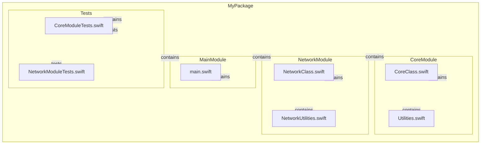
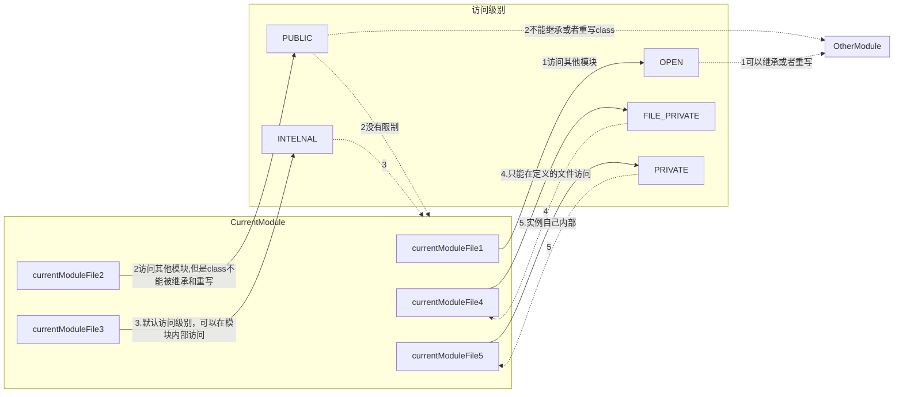
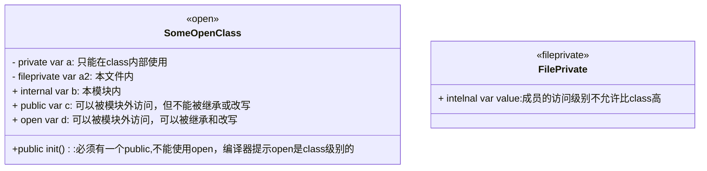
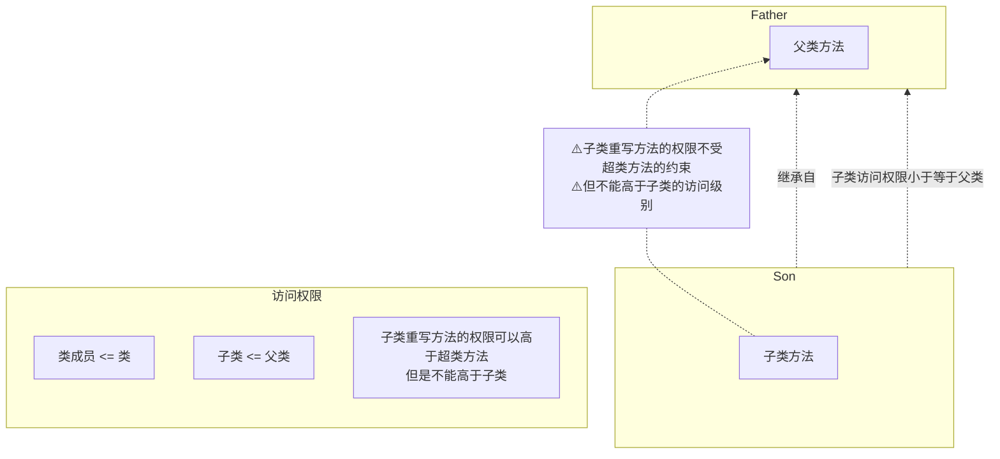

## 访问控制

**通过声明，文件和模块管理代码的可见性**

访问控制限制其他源文件和模块中的代码对部分代码的访问。此功能使您能够隐藏代码的实现细节，并指定可以访问和使用该代码的首选接口。

您可以为各个类型（类、结构和枚举）以及属于这些类型的属性、方法、初始值设定项和下标分配特定的访问级别。协议可以被限制在特定的上下文中，全局常量、变量和函数也是如此。

除了提供各种级别的访问控制之外，Swift 还通过为典型场景提供默认访问级别来减少指定显式访问控制级别的需要。事实上，如果您正在编写单目标应用程序，则可能根本不需要指定显式访问控制级别。


> **Note**:为简洁起见，代码中可以应用访问控制的各个方面（属性、类型、函数等）在下面的部分中称为“实体”。
>
> 


### 1.模块 源文件和包

Swift 的访问控制模型基于模块、源文件和包的概念。

**模块是代码分发的单个单元——作为单个单元构建和发布的框架或应用程序**，可以由另一个模块使用 Swift 的 `import` 关键字导入。

Xcode 中的每个构建目标（例如应用程序包或框架）在 Swift 中都被视为单独的模块。如果您将应用程序代码的各个方面组合在一起作为一个独立的框架（也许是为了在多个应用程序中封装和重用该代码），那么您在该框架中定义的所有内容在应用程序中导入和使用时都将成为单独模块的一部分，或者当它在另一个框架中使用时。

**源文件是模块内的单个 Swift 源代码文件（实际上是应用程序或框架内的单个文件）**。尽管在单独的源文件中定义单个类型很常见，但单个源文件可以包含多个类型、函数等的定义。

**包是作为一个单元开发的一组模块。您将构成包的模块定义为配置您正在使用的构建系统的一部分，而不是作为 Swift 源代码的一部分**。例如，如果您使用 Swift Package Manager 构建代码，则可以使用 PackageDescription 模块中的 API 在 `Package.swift` 文件中定义包，如果使用 Xcode，则可以在 Package Access 中指定包名称标识符构建设置。


```bash
MyPackage/
├── Package.swift
├── Sources/
│   ├── CoreModule/
│   │   ├── CoreClass.swift
│   │   └── Utilities.swift
│   ├── NetworkModule/
│   │   ├── NetworkClass.swift
│   │   └── NetworkUtilities.swift
│   └── MainModule/
│       └── main.swift
└── Tests/
    ├── CoreModuleTests/
    │   └── CoreModuleTests.swift
    ├── NetworkModuleTests/
    │   └── NetworkModuleTests.swift
```





#### 1.1 swift命令构建

**构建步骤**

1. 先建立一个文件夹，是包的名字比如MyPackage `midir Mypackage` 然后进入`cd Mypackage`

2. 初始化包，使用命令`swift package init --type library`

3. 根据你的项目需求，编辑 Package.swift 文件，确保模块和依赖项正确配置，如上面提供的示例。

   ```swift
   // swift-tools-version:5.3
   import PackageDescription
   
   let package = Package(
       name: "MyPackage",
       platforms: [
           .macOS(.v10_15),
           .iOS(.v13)
       ],
       products: [
           // 定义库产品
           .library(
               name: "CoreModule",
               targets: ["CoreModule"]),
           .library(
               name: "NetworkModule",
               targets: ["NetworkModule"]),
           // 定义可执行文件产品
           .executable(
               name: "MainModule",
               targets: ["MainModule"]),
       ],
       dependencies: [
           // 添加依赖项
           .package(url: "https://github.com/Alamofire/Alamofire.git", from: "5.4.0"),
       ],
       targets: [
           // 定义 CoreModule 目标，并指定源文件路径
           .target(
               name: "CoreModule",
               path: "Sources/CoreModule",
               dependencies: []),
           // 定义 NetworkModule 目标，依赖于 CoreModule 和 Alamofire，并指定源文件路径
           .target(
               name: "NetworkModule",
               path: "Sources/NetworkModule",
               dependencies: ["CoreModule", "Alamofire"]),
           // 定义 MainModule 目标，依赖于 CoreModule 和 NetworkModule，并指定源文件路径
           .target(
               name: "MainModule",
               path: "Sources/MainModule",
               dependencies: ["CoreModule", "NetworkModule"]),
           // 定义 CoreModule 测试目标，并指定源文件路径
           .testTarget(
               name: "CoreModuleTests",
               path: "Tests/CoreModuleTests",
               dependencies: ["CoreModule"]),
           // 定义 NetworkModule 测试目标，并指定源文件路径
           .testTarget(
               name: "NetworkModuleTests",
               path: "Tests/NetworkModuleTests",
               dependencies: ["NetworkModule"]),
       ]
   )
   ```
   	所以文件都需要手动创建
   	MyPackage/
   	 ├── Package.swift
   	 ├── Sources/
   	 │   ├── CoreModule/  //模块名称
   	 │   │   ├── CoreClass.swift
   	 │   │   └── Utilities.swift
   	 │   ├── NetworkModule/  //模块名称
   	 │   │   ├── NetworkClass.swift
   	 │   │   └── NetworkUtilities.swift
   	 │   └── MainModule/ //模块名称
   	 │       └── main.swift
   	 └── Tests/
   	     ├── CoreModuleTests/ //测试模块名称
   	     │   └── CoreModuleTests.swift
   	     ├── NetworkModuleTests/   //测试模块名称
   	     │   └── NetworkModuleTests.swift

4. 在项目根目录下运行以下命令来构建项目：`swift build`

5. 运行可执行文件 `swift run MainModule`

6. 运行测试 `swift test`

TODO::其他待补充


### 2. 访问级别

Swift 为代码中的实体提供了六种不同的访问级别。这些访问级别与定义实体的源文件、源文件所属的模块以及模块所属的包相关。

1.	**OPEN** 	可以被其他模块访问

开放访问和公共访问使实体能够在其定义模块的任何源文件中使用，也可以在导入定义模块的另一个模块的源文件中使用。在指定框架的公共接口时，通常使用开放或公共访问。开放访问和公共访问之间的区别如下所述。

2. **PUBLIC**	可以被其他模块使用,但是只能在本模块内被继承或者重写

 包访问使实体能够在其定义包中的任何源文件中使用，但不能在该包之外的任何源文件中使用。您通常在构建为多个模块的应用程序或框架中使用包访问。

3. **Internal** 	可

内部访问允许实体在其定义模块的任何源文件中使用，但不能在该模块外部的任何源文件中使用。在定义应用程序或框架的内部结构时，您通常会使用内部访问。

4. **File-private**

文件私有访问将实体的使用限制为其自己定义的源文件。当在整个文件中使用特定功能的实现细节时，使用文件私有访问来隐藏这些细节。

5. **Private** 

私有访问将实体的使用限制为封闭声明以及同一文件中该声明的扩展。当特定功能的实现细节仅在单个声明中使用时，使用私有访问来隐藏这些细节。


| 访问级别    | 说明                                                         |
| ----------- | ------------------------------------------------------------ |
| open        | 可以在模块内外的任何地方访问，并且可以被继承和重写。         |
| public      | 可以在模块内外的任何地方访问，但只能在定义模块内被继承和重写。模块外不可以继承或者重写 |
| internal    | 可以在定义模块内的任何地方访问（默认访问级别）。             |
| fileprivate | 只能在定义它的文件内访问。                                   |
| private     | 只能在定义它的作用域及其扩展中访问。                         |





### 3. 访问级别指导

Swift 中的访问级别遵循总体指导原则：不能根据具有较低（更严格）访问级别的另一个实体来定义任何实体。

1. **公共变量不能定义为具有内部、文件私有或私有类型，因为该类型可能无法在使用公共变量的任何地方都可用。**
2. **函数不能具有比其参数类型和返回类型更高的访问级别，因为该函数可以在其组成类型对于周围代码不可用的情况下使用。**


### 4. 默认访问级别

如果您自己没有指定显式访问级别，则代码中的所有实体（除了一些特定的例外，如本章后面所述）都具有默认的**internal**访问级别。因此，在许多情况下，您不需要在代码中指定显式访问级别。


### 5.单目标的访问级别

当您编写简单的单目标应用程序时，应用程序中的代码通常在应用程序内是独立的，不需要在应用程序模块之外可用。内部的默认访问级别已满足此要求。因此，您不需要指定自定义访问级别。但是，您可能希望将代码的某些部分标记为文件私有或私有，以便对应用程序模块内的其他代码隐藏其实现细节。


### 6. 框架的访问级别

当您开发框架时，将该框架的面向公众的接口标记为开放 **open** 或公共**public**，以便其他模块（例如导入该框架的应用程序）可以查看和访问它。这个面向公众的接口是框架的应用程序编程接口（或 API）。


> 
>
> **Note**:**框架的任何内部实现细节仍然可以使用默认的内部访问级别，或者如果您想对框架内部代码的其他部分隐藏它们，则可以将其标记为私有或文件私有。仅当您希望某个实体成为框架 API 的一部分时，您才需要将其标记为开放或公共。**
>
> 


### 7.单元测试的访问级别 

当您编写具有单元测试目标的应用程序时，应用程序中的代码需要可供该模块使用才能进行测试。默认情况下，只有标记为开放或公共的实体才能被其他模块访问。但是，如果您使用 `@testable` 属性标记产品模块的导入声明并在启用测试的情况下编译该产品模块，则单元测试目标可以访问任何内部实体。


```swift
//filename:MyPackageTests.swift
import XCTest
@testable import MyPackage

final class MyPackageTests: XCTestCase {
    func testExample() throws {
        // 示例测试代码
        XCTAssertEqual(1, 1, "示例测试应该通过")
    }

    func testAnotherExample() throws {
        let value = "Hello, World!"
        XCTAssertEqual(value, "Hello, World!", "字符串应该相等")
    }

}
```


### 8.访问控制的语法

通过放置 `open` 、 `public` 、 `internal` 、 `fileprivate` 或 `private`

```swift
open class SomeOpenClass {}
public class SomePublicClass {}
internal class SomeInternalClass {}
fileprivate class SomeFilePrivateClass {}
private class SomePrivateClass {}


open var someOpenVariable = 0
public var somePublicVariable = 0
internal let someInternalConstant = 0
fileprivate func someFilePrivateFunction() {}  //如果有参数，返回值需要权限必参数更低
private func somePrivateFunction() {}
```

```swift
//允许外部继承，重写
open class Cadd<T:AdditiveArithmetic>{  
    //class自己用
  	private var vt:T
  
  	//构造方法允许使用
    public init( value:T){
        self.vt = value 
    } 
		
  	//允许使用
    public var value:T{
        get {
            self.vt
        }
    }
		//public 不允许被重写
    public func add ( _ vt:T){
        self.vt += vt 
    }
		//open 允许被重写
    open func add(_ other: Cadd<T>) -> Cadd<T> {
        let it = self.value + other.value
        return Cadd<T>(value:it)
    }
}

class SomeInternalClass {}              // implicitly internal 默认internal
let someInternalConstant = 0            // implicitly internal 默认intelnal 
```


#### 8.1. 自定义类型

如果要为自定义类型指定显式访问级别，请在定义该类型时执行此操作。然后可以在其访问级别允许的任何地方使用新类型。例如**，如果定义文件私有类，则该类只能在定义该文件私有类的源文件中用作属性类型、函数参数或返回类型。**

类型的访问控制级别还会影响该类型的成员（其属性、方法、初始值设定项和下标）的默认访问级别。如果将类型的访问级别定义为私有或文件私有，则其成员的默认访问级别也将是私有或文件私有。如果将类型的访问级别定义为 internal或公共（或使用内部的默认访问级别而不显式指定访问级别），则该类型的成员的默认访问级别将为 internal。


```swift
public class SomePublicClass {                   // explicitly public class
    public var somePublicProperty = 0            // explicitly public class member
    var someInternalProperty = 0                 // implicitly internal class member 默认为内部
    fileprivate func someFilePrivateMethod() {}  // explicitly file-private class member  本文件内私有
    private func somePrivateMethod() {}          // explicitly private class member			私有
}


class SomeInternalClass {                        // implicitly internal class 							默认为内部
    var someInternalProperty = 0                 // implicitly internal class member
    fileprivate func someFilePrivateMethod() {}  // explicitly file-private class member   只能在文件被调用
    private func somePrivateMethod() {}          // explicitly private class member					class内
}


fileprivate class SomeFilePrivateClass {         // explicitly file-private class
    func someFilePrivateMethod() {}              // implicitly file-private class member
    private func somePrivateMethod() {}          // explicitly private class member
}


private class SomePrivateClass {                 // explicitly private class
    func somePrivateMethod() {}                  // implicitly private class member
}
```





#### 8.2 Tuple类型 

元组类型的访问级别是该元组中使用的所有类型中限制最严格的访问级别。例如，如果您由两种不同类型组成一个元组，一种具有内部访问权限，另一种具有私有访问权限，则该复合元组类型的访问级别将为私有。

> **Note**:元组类型不像类、结构、枚举和函数那样具有独立的定义。元组类型的访问级别是根据组成元组类型的类型自动确定的，并且不能显式指定。


```swift
internal struct InternalType {
    // Internal 类型的内容
}

private struct PrivateType {
    // Private 类型的内容
}

// 创建一个元组类型 ,使用成员的的最低访问权限 编程private  
// LOW(members 访问权限)
let tupleConstant = (InternalType(), PrivateType())

// tuple 的访问级别将是 private，因为它包含的类型中最严格的访问级别是 private
```


#### 8.3函数类型

**函数的权限 不能高于所有参数和返回值的最低权限**

函数类型的访问级别计算为函数的参数类型和返回类型的最严格的访问级别。如果函数的计算访问级别与上下文默认值不匹配，则必须在函数定义中显式指定访问级别。

下面的示例定义了一个名为`someFunction()`的全局函数，但没有为函数本身提供特定的访问级别修饰符。您可能期望此函数具有“内部”的默认访问级别，但事实并非如此。事实上， `someFunction()`不会编译，如下所示：

```swift
//全局函数需要注明访问控制权限 要不然无法编译
func someFunction() -> (SomeInternalClass, SomePrivateClass) {
    // function implementation goes here
}
```

该函数的返回类型是一个元组类型，由上面[自定义类型](https://docs.swift.org/swift-book/documentation/the-swift-programming-language/accesscontrol#Custom-Types)中定义的两个自定义类组成。其中一个类定义为内部类，另一个类定义为私有类。因此，复合元组类型的整体访问级别是私有的（元组组成类型的最低访问级别）。

由于函数的返回类型是私有的，因此必须使用`private`修饰符标记函数的整体访问级别，函数声明才有效：

```swift
private func someFunction() -> (SomeInternalClass, SomePrivateClass) {    // function implementation goes here }
```

使用`public`或`internal`修饰符标记`some Function()`的定义，或使用默认的内部设置是无效的，因为函数的 public 或内部用户可能没有适当的访问函数返回中使用的私有类的权限类型。


```swift
internal class SomeInternalClass {
    init() {}
}

private class SomePrivateClass {
    init() {}
}

public class SomePublicClass {
    init() {}
}
// 错误示例：因为函数返回值包含 internal 类型，函数的访问级别不能是 public
public func someFunction() -> (SomePublicClass, SomeInternalClass) {
    return (SomePublicClass(), SomeInternalClass())
}

// 正确示例：函数的访问级别是 internal，与返回值的最低访问级别一致
internal func someFunction() -> (SomePublicClass, SomeInternalClass) {
    return (SomePublicClass(), SomeInternalClass())
}
// 错误示例：因为函数返回值包含 internal 类型，函数的访问级别不能是 public
public func someFunction() -> (SomePublicClass, SomeInternalClass) {
    return (SomePublicClass(), SomeInternalClass())
}

// 正确示例：函数的访问级别是 internal，与返回值的最低访问级别一致
internal func someFunction() -> (SomePublicClass, SomeInternalClass) {
    return (SomePublicClass(), SomeInternalClass())
}
// 错误示例：因为函数参数包含 private 类型，函数的访问级别不能是 internal
internal func anotherFunction(param: SomePrivateClass) {
    print(param)
}

// 正确示例：函数的访问级别是 private，与参数的最低访问级别一致
private func anotherFunction(param: SomePrivateClass) {
    print(param)
}
```


#### 8.4枚举类型

枚举的各个案例自动获得与其所属枚举相同的访问级别。您无法为各个枚举案例指定不同的访问级别。

在下面的示例中， `Compass Point`枚举的显式访问级别为 public。因此，枚举案例`north` 、 `south` 、 `east`和`west`也具有 public 访问级别：

```swift
public enum CompassPoint {
    case north
    case south
    case east
    case west
}
```


#### 8.5原始值和关联值

枚举定义中用于任何原始值或关联值的类型必须具有至少与枚举的访问级别一样高的访问级别。例如，您不能使用私有类型作为具有内部访问级别的枚举的原始值类型。


#### 8.6 嵌套类型

嵌套类型的访问级别与其包含类型相同，除非包含类型是公共的。公共类型中定义的嵌套类型具有内部的自动访问级别。如果您希望公共类型中的嵌套类型公开可用，则必须将嵌套类型显式声明为公共。

不高于外部定义的权限，没写的默认intelnal

可以理解为 **嵌套类型权限 <= 外部权限**

```swift
public class OuterClass {
    // 嵌套类型的默认访问级别是 internal
    class NestedClass1 {
        // ...
    }

    // 嵌套类型显式声明为 public
    public class NestedClass2 {
        // ...
    }

    // 嵌套类型显式声明为 private
    private class NestedClass3 {
        // ...
    }
}

internal class InternalOuterClass {
    // 嵌套类型的默认访问级别是 internal
    class NestedClass1 {
        // ...
    }

    // 嵌套类型显式声明为 private
    private class NestedClass2 {
        // ...
    }
}

private class PrivateOuterClass {
    // 嵌套类型的默认访问级别是 private
    class NestedClass1 {
        // ...
    }

    // 嵌套类型显式声明为 private
    private class NestedClass2 {
        // ...
    }
}
```


###  9.继承和子类化的权限

您可以对任何可以在当前访问上下文中访问并且在与子类相同的模块中定义的类进行子类化。您还可以对在不同模块中定义的任何开放类进行子类化。子类不能具有比其超类更高的访问级别 - 例如，您不能编写内部超类的公共子类。


此外，对于在同一模块中定义的类，您可以覆盖在特定访问上下文中可见的任何类成员（方法、属性、初始值设定项或下标）。对于在另一个模块中定义的类，您可以覆盖任何Open成员。



### 10.常量，变量，属性和下标

常量、变量或属性不能比其类型更公开。例如，**在私有类型编写公共属性是无效的**。同样，**下标不能比其索引类型或返回类型更公开。**

如果常量、变量、属性或下标使用私有类型，则该常量、变量、属性或下标也必须标记为`private`：

```swift
private var privateInstance = SomePrivateClass()
```

```swift
// 示例 1: 常量和变量
private class PrivateType {
    // 类的实现
}

// 错误示范: 不能在私有类型上声明公共常量或变量
// public let publicVar: PrivateType = PrivateType() // 错误: 'publicVar' 不能比 'PrivateType' 更公开

// 正确示范: 在私有类型上声明私有常量或变量
private let privateVar: PrivateType = PrivateType()

// 示例 2: 属性
private class AnotherPrivateType {
    // 类的实现
}

public class PublicClass {
    // 错误示范: 不能在私有类型上声明公共属性
    // public var publicProperty: AnotherPrivateType = AnotherPrivateType() // 错误: 'publicProperty' 不能比 'AnotherPrivateType' 更公开

    // 正确示范: 在私有类型上声明私有属性
    private var privateProperty: AnotherPrivateType = AnotherPrivateType()
}

// 示例 3: 下标
private struct PrivateStruct {
    // 结构体的实现
}

public struct PublicStruct {
    // 错误示范: 不能在私有类型上声明公共下标
    // public subscript(index: Int) -> PrivateStruct {
    //    return PrivateStruct() // 错误: 下标不能比 'PrivateStruct' 更公开
    //}

    // 正确示范: 在私有类型上声明私有下标
    private subscript(index: Int) -> PrivateStruct {
        return PrivateStruct()
    }
}
```


### 11. private(set) 访问级别和双重访问级别

### 12.Getter和Setter


常量、变量、属性和下标的 getter 和 setter 自动接收与其所属常量、变量、属性或下标相同的访问级别。


您可以为设置*器提供低于*其相应 getter 的访问级别，以限制该变量、属性或下标的读写范围。您可以通过在 `var` 或`下标`引入器之前写入 `fileprivate（set）`、`private（set）`、`internal（set）` 或 `package（set）` 来分配较低的访问级别。


您可以为设置*器提供低于*其相应 getter 的访问级别，以限制该变量、属性或下标的读写范围。您可以通过在 `var` 或`下标`引入器之前写入 `fileprivate（set）`、`private（set）`、`internal（set）` 或 `package（set）` 来分配较低的访问级别。


**private（set）限制只能在实体内部设置值**

```swift


struct TrackedString {
    //限制在内部设置值
    private(set) var numberOfEdits = 0
    var value: String = "" {
        didSet {
            numberOfEdits += 1
        }
    }
    mutating func increment(){
        self.numberOfEdits += 1
    }
}


var trackedStr = TrackedString()
trackedStr.value = "Hello"
print(trackedStr.numberOfEdits)   //out: 1
TrackedString.numberOfEdits = 444  //Error 限制set 值
trackedStr.increment()  //ok

print(trackedStr.numberOfEdits)  //out: 2

```

> **Note**:此规则适用于存储的属性以及计算的属性。即使你没有为存储属性编写显式的 getter 和 setter，Swift 仍然会为你合成一个隐式 getter 和 setter，以提供对存储属性的支持存储的访问。使用 `fileprivate（set）`、`private（set）`、`internal（set）` 和 `package（set）` 以与计算属性中的显式 setter 完全相同的方式更改此合成 setter 的访问级别。


`TrackedString` 结构定义了一个名为 `value` 的存储字符串属性，其初始值为 `“”`（空字符串） 。该结构还定义了一个存储的整数属性，称为 `numberOfEdits`，该属性用于跟踪该`值`被修改的次数。此修改跟踪是通过 `value` 属性上的 `didSet`属性观察器实现的，每次将 `value` 属性设置为新值时，该观察器都会增加`编辑次数`。

如果创建 `TrackedString` 实例并多次修改其字符串值，则可以看到 `NumberOf Edits` 属性值更新以匹配修改数：

```swift
var stringToEdit = TrackedString()
stringToEdit.value = "This string will be tracked."
stringToEdit.value += " This edit will increment numberOfEdits."
stringToEdit.value += " So will this one."
print("The number of edits is \(stringToEdit.numberOfEdits)")
// Prints "The number of edits is 3"
```

虽然您可以从另一个源文件中查询 `NumberOfEdits` 属性的当前值，但不能从另一个源文件*修改*该属性。此限制可保护 `TrackedString` 编辑跟踪功能的实现详细信息，同时仍提供对该功能某个方面的便捷访问。


**双重访问级别**

请注意，如果需要，您可以为 getter 和 setter 分配明确的访问级别。下面的示例显示了 `TrackedString` 结构的一个版本，其中结构是使用 public 的显式访问级别定义的。因此，默认情况下，结构的成员（包括`“编辑次数`”属性）具有内部访问级别。您可以通过组合 `public` 和 `private（set）` 访问级别修饰符，将结构的 `Number OfEdits` 属性 getter 设为公共，并将其属性 setter 设为私有：

```swift
public struct TrackedString {
  //读属性 和 设置属性
  //getter 和 setter
    public private(set) var numberOfEdits = 0
    public var value: String = "" {
        didSet {
            numberOfEdits += 1
        }
    }
    public init() {}
}
```


### 13.初始值的访问级别

可以为自定义初始值设定项分配一个小于或等于它们初始化的类型的访问级别。唯一的例外是必需的初始值设定项（如[必需的初始值设定项](https://docs.swift.org/swift-book/documentation/the-swift-programming-language/initialization#Required-Initializers)中所定义）。必需的初始值设定项必须具有与其所属类相同的访问级别。

与函数和方法参数一样，初始值设定项的参数类型不能比初始值设定项自身的访问级别更私密。


### 14.默认init()设定项

如 [Default Initializers](https://docs.swift.org/swift-book/documentation/the-swift-programming-language/initialization#Default-Initializers) 中所述，Swift 会自动为任何结构或基类提供*默认初始值设定项*，而不为任何为其所有属性提供默认值的基类提供任何参数，并且本身不提供至少一个初始值设定项。

默认初始值设定项与它初始化的类型具有相同的访问级别，除非该类型定义为`公共`类型。对于定义为`公共`的类型，默认初始值设定项被视为内部初始值设定项。如果您希望公共类型在另一个模块中使用时可以使用无参数初始值设定项进行初始化，则必须明确提供公共无参数初始值设定项作为类型定义的一部分。

**init()没有显式声明，最高的级别为 intelnal 如果class 访问级别小于intelnal 那就 = class的访问级别**

**init()有显式声明访问级别，但是也不能高于class的访问级别**


**示例 1: Internal 类和初始化器**

```swift
public class InternalClass {
    var value: Int

    // 默认为 internal，不能在模块外使用
    init(value: Int) {
        self.value = value
    }

    // 必须显式声明为 public，才能在模块外使用
    public init(publicValue: Int) {
        self.value = publicValue
    }
}

// 只能在模块内部使用默认的 internal 初始化器
let internalInstance = InternalClass(value: 10) // 错误：初始化器 'init(value:)' 是内部的
// 在模块外部，可以使用 public 初始化器
let publicInstance = InternalClass(publicValue: 20) // 正确：可以在模块内外使用
```

**示例 2: Internal 类和初始化器**

```swift
internal class InternalClass {
    var value: Int
 

    // 正确：初始化器的访问级别是 internal，与类的访问级别相同
    internal init(value: Int) {
        self.value = value
    }

    // 错误：初始化器的访问级别不能高于类的访问级别
    // public init(value: Int) { // 错误: Initializer cannot be more public than the enclosing class
    //     self.value = value
    // }
}

let internalInstance = InternalClass(value: 10) // 正确：可以在模块内使用
```


**示例 3: Public 类和初始化器**

```swift
public class PublicClass {
    var value: Int

    // 正确：初始化器的访问级别是 public，与类的访问级别相同
    public init(value: Int) {
        self.value = value
    }

    // 正确：初始化器的访问级别是 internal，比类的访问级别低
    internal init(internalValue: Int) {
        self.value = internalValue
    }

    // 错误：初始化器的访问级别不能高于类的访问级别
    // open init(openValue: Int) { // 错误: Initializer cannot be more public than the enclosing class
    //     self.value = openValue
    // }
}

let publicInstance = PublicClass(value: 20) // 正确：可以在模块内外使用
```

**示例 4: Private 类和初始化器**

```swift
private class PrivateClass {
    var value: Int

    // 正确：初始化器的访问级别是 private，与类的访问级别相同
    private init(value: Int) {
        self.value = value
    }

    // 错误：初始化器的访问级别不能高于类的访问级别
    // internal init(internalValue: Int) { // 错误: Initializer cannot be more public than the enclosing class
    //     self.value = internalValue
    // }
}

let privateInstance = PrivateClass(value: 30) // 错误：不能在类的外部使用
// `private` 类实例不能在类的定义外部创建
```


### 15.[结构类型的默认 Memberwise 初始值设定项](https://docs.swift.org/swift-book/documentation/the-swift-programming-language/accesscontrol#Default-Memberwise-Initializers-for-Structure-Types)

如果结构的任何存储属性是私有的，则结构类型的默认成员初始值设定项被视为私有。同样，如果结构的任何存储属性是文件私有的，则初始值设定项是文件私有的。否则，初始值设定项的访问级别为 internal。

与上面的默认初始值设定项一样，如果您希望公共结构类型在另一个模块中使用时可以使用 memberwise 初始值设定项进行初始化，则必须自己提供一个公共 memberwise 初始值设定项作为类型定义的一部分。


### 16.协议的访问级别

是的，Swift 中的协议也有访问级别。协议的访问级别控制哪些上下文可以使用和遵循该协议。以下是协议访问级别的一些规则和示例。


1. **默认访问级别**：
   - 如果没有显式指定，协议的默认访问级别是 `internal`，即只能在定义该协议的模块内使用。

2. **显式访问级别**：
   - 可以显式地将协议声明为 `public`、`internal` 或 `private`，以控制其可见性和使用范围。

3. **协议继承和类型符合性**：
   - 遵循某个协议的类型或子协议的访问级别不能高于该协议的访问级别。例如，如果协议是 `internal`，则遵循该协议的类型和任何继承该协议的子协议也必须是 `internal` 或更低访问级别。

#### 示例代码

##### 示例 1: `internal` 访问级别的协议

```swift
internal protocol InternalProtocol {
    func doSomething()
}

struct InternalStruct: InternalProtocol {
    func doSomething() {
        print("Doing something internally")
    }
}

// 只能在模块内使用 InternalProtocol
let internalInstance = InternalStruct()
internalInstance.doSomething()
```

##### 示例 2: `public` 访问级别的协议

```swift
public protocol PublicProtocol {
    func doSomething()
}

public struct PublicStruct: PublicProtocol {
    public func doSomething() {
        print("Doing something publicly")
    }
}

// 可以在模块内外使用 PublicProtocol
let publicInstance = PublicStruct()
publicInstance.doSomething()
```

##### 示例 3: `private` 访问级别的协议

```swift
private protocol PrivateProtocol {
    func doSomething()
}

private struct PrivateStruct: PrivateProtocol {
    func doSomething() {
        print("Doing something privately")
    }
}

// 只能在定义该协议的文件内使用 PrivateProtocol
let privateInstance = Private

```


### 17.继承协议的访问级别

如果定义从现有协议继承的新协议，则新协议最多可以具有与其继承的协议相同的访问级别。例如，您不能编写从内部协议继承的公共协议。


### 18. 协议的一致性

类型可以符合访问级别低于类型本身的协议。例如，您可以定义一个公共类型，该类型可以在其他模块中使用，但其对内部协议的一致性只能在内部协议的定义模块中使用。

类型符合特定协议的上下文是该类型的访问级别和协议的访问级别的最小值。例如，如果某个类型是公共的，但它遵循的协议是内部的，则该类型对该协议的符合性也是内部的。

在编写或扩展类型以符合协议时，必须确保该类型对每个协议要求的实现至少具有与该类型与该协议的一致性相同的访问级别。例如，如果公共类型符合内部协议，则该类型对每个协议要求的实现必须至少是内部的。

> **Note**:在 Swift 中，就像在 Objective-C 中一样，协议一致性是全局性的——在同一程序中，一种类型不可能以两种不同的方式符合协议。


### 19. 扩展的访问级别

可以在类、结构或枚举可用的任何访问上下文中扩展类、结构或枚举。在扩展中添加的任何类型成员都与在要扩展的原始类型中声明的类型成员具有相同的默认访问级别。如果扩展公共类型或内部类型，则添加的任何新类型成员的默认访问级别为 internal。如果扩展 file-private 类型，则添加的任何新类型成员都具有默认访问级别 file private。如果扩展私有类型，则添加的任何新类型成员的默认访问级别为私有。


或者，您可以使用显式访问级别修饰符（例如，`private`）标记扩展，以便为扩展中定义的所有成员设置新的默认访问级别。对于单个类型成员，仍然可以在扩展中覆盖此新的默认值。

如果使用扩展来添加协议一致性，则无法为该扩展提供显式访问级别修饰符。相反，协议自身的访问级别用于为扩展中的每个协议要求实现提供默认访问级别。


### 20.扩展中的私有成员

与它们扩展的类、结构或枚举位于同一文件中的扩展的行为就像扩展中的代码是作为原始类型声明的一部分编写的一样。因此，您可以：

- 在原始声明中声明一个私有成员，并从同一文件中的扩展访问该成员。
- 在一个扩展中声明一个私有成员，并从同一文件中的另一个扩展访问该成员。
- 在扩展中声明私有成员，并从同一文件的原始声明中访问该成员。

此行为意味着您可以以相同的方式使用扩展来组织您的代码，无论您的类型是否具有私有实体。例如，给定以下简单协议：

```swift
protocol SomeProtocol {
    func doSomething()
}
```

您可以使用扩展来添加协议一致性，如下所示：

```swift
struct SomeStruct {
    private var privateVariable = 12
}


extension SomeStruct: SomeProtocol {
    func doSomething() {
        print(privateVariable)
    }
}
```


### 21.泛形

泛型类型或泛型函数的访问级别是泛型类型或函数本身的访问级别的最小值，也是对其类型参数的任何类型约束的访问级别的最小值。


### 22.类型别名

出于访问控制的目的，您定义的任何类型别名都将被视为不同的类型。类型别名的访问级别可以小于或等于它别名的类型的访问级别。例如，私有类型别名可以为私有类型、文件私有类型、内部类型、公共类型或开放类型设置别名，但公共类型别名不能为内部类型、文件私有类型或私有类型设置别名。
