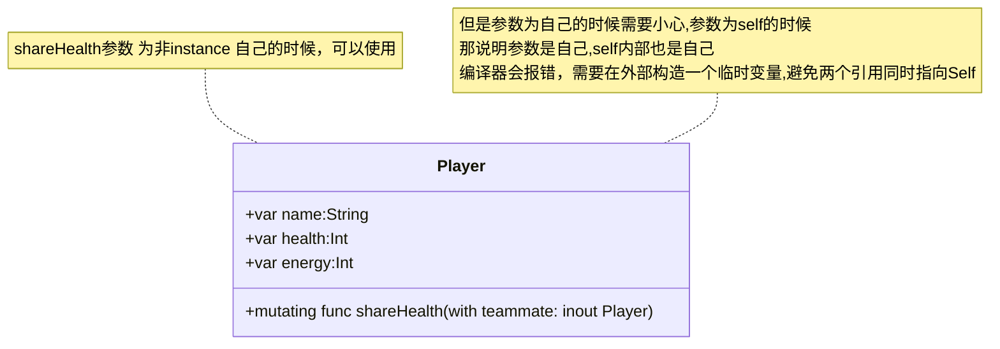

## 内存安全

**构建代码以避免访问内存时发生冲突。**

默认情况下，Swift 会阻止代码中发生不安全行为。例如，Swift 确保变量在使用之前被初始化，内存在释放后不会被访问，并且检查数组索引是否存在越界错误。

Swift 还要求修改内存中某个位置的代码具有对该内存的独占访问权限，从而确保对同一内存区域的多次访问不会发生冲突。因为 Swift 会自动管理内存，所以大多数时候你根本不需要考虑访问内存。但是，了解可能发生潜在冲突的位置非常重要，这样您就可以避免编写对内存访问存在冲突的代码。如果您的代码确实包含冲突，您将收到编译时或运行时错误。

> **Note**：Swift 因为无法保证全局变量是否被多个线程多使用导致数据同步不一致,所以不能用两个引用 指向一个内存区域。
>
> 但是如果对象为一个临时变量，因为函数为线程的最小调度单位。而且调用完会呗销毁。不会被多进程使用。所以随便怎么用

**全局变量和线程安全**


**全局变量的潜在问题**：

-	全局变量在程序的整个生命周期内都存在，可能会被多个线程同时访问和修改。

-	并发访问会导致数据竞争和未定义行为，这会破坏数据的一致性和程序的稳定性。
2.**内存访问控制**：

-	为了防止并发访问引发的数据竞争，Swift 对全局变量的 inout 操作进行严格限制。

-	Swift 编译器确保在函数执行期间对全局变量的内存访问是独占的，不允许多个引用同时访问同一内存区域。


**局部变量和函数作用域**


**1.局部变量的安全性**：

-	局部变量的生命周期受限于函数的执行期。当函数返回时，局部变量会被释放。
-	在单线程环境中，函数是线程的最小调度单位，函数内部的所有操作都是按顺序执行的，不会被其他线程中断。

**2.函数的独占访问**：

-	Swift 确保在函数执行期间，局部变量的访问是独占的。函数内部的局部变量不会被其他函数或线程同时访问。
-	这种独占访问确保了在函数执行期间，局部变量的所有读写操作都是安全的，不会引发内存访问冲突。


### 1.了解内存访问冲突

当您执行诸如设置变量值或将参数传递给函数之类的操作时，代码中会发生对内存的访问。例如，以下代码同时包含读访问和写访问：

```swift
// A write access to the memory where one is stored.
var one = 1


// A read access from the memory where one is stored.
print("We're number \(one)!")
```

当代码的不同部分尝试同时访问内存中的同一位置时，可能会发生对内存的访问冲突。同时多次访问内存中的某个位置可能会产生不可预测或不一致的行为。在 Swift 中，有多种方法可以修改跨多行代码的值，从而可以尝试在修改过程中访问值。

通过思考如何更新写在纸上的预算，您可以看到类似的问题。更新预算分为两步：首先添加商品名称和价格，然后更改总金额以反映列表中当前的商品。更新前后，您可以从预算中读取任何信息并得到正确答案，如下图所示。


当您向预算添加项目时，预算处于临时无效状态，因为总金额尚未更新以反映新添加的项目。在添加项目的过程中读取总金额会给您提供错误的信息。

此示例还演示了在修复内存访问冲突时可能遇到的挑战：有时有多种解决冲突的方法会产生不同的答案，并且并不总是很明显哪个答案是正确的。在此示例中，根据您想要原始总金额还是更新后的总金额，正确答案可能是 5 美元或 320 美元。在修复冲突的访问之前，您必须确定它的用途。

>**Note**:如果您编写过并发或多线程代码，对内存的访问冲突可能是一个熟悉的问题。然而，这里讨论的冲突访问可能发生在单个线程上，并且不涉及并发或多线程代码。
>
>如果您在单个线程内对内存的访问发生冲突，Swift 保证您将在编译时或运行时收到错误。对于多线程代码，使用 Thread Sanitizer 来帮助检测跨线程的访问冲突。


### 2.内存访问的特点

在冲突访问的情况下，需要考虑内存访问的三个特征：访问是读取还是写入、访问的持续时间以及正在访问的内存中的位置。具体来说，如**果您有两个满足以下所有条件的访问，则会发生冲突：**

- 至少一个是写访问或非原子访问。
- 他们访问内存中的同一位置。
- 它们的持续时间重叠。

读取和写入访问之间的区别通常很明显：写入访问会更改内存中的位置，但读取访问不会更改。内存中的位置指的是正在访问的内容，例如变量、常量或属性。内存访问的持续时间可以是瞬时的，也可以是长期的。

如果一个操作仅使用 C 原子操作，则该操作是原子的；否则它是非原子的。有关这些函数的列表，请参见 `stdatomic(3)`手册页。

如果在访问开始之后但结束之前不可能运行其他代码，则该访问是瞬时的。从本质上来说，两个瞬时访问不可能同时发生。大多数内存访问都是瞬时的。例如，下面的代码清单中的所有读写访问都是瞬时的：

```swift
func oneMore(than number: Int) -> Int {
    return number + 1
}


var myNumber = 1
myNumber = oneMore(than: myNumber)
print(myNumber)
// Prints "2"
```

但是，有多种访问内存的方法，称为长期访问，可以跨越其他代码的执行。瞬时访问和长期访问之间的区别在于，长期访问开始之后但结束之前可能有其他代码运行，这称为重叠。长期访问可以与其他长期访问和瞬时访问重叠。

重叠访问主要出现在函数和方法中使用输入输出参数或结构的变异方法的代码中。使用长期访问的特定类型的 Swift 代码将在下面的部分中讨论。


### 3.对输入输出参数的访问冲突

函数对其所有输入输出参数具有长期写入访问权限。对输入输出参数的写入访问在所有非输入输出参数均已求值后开始，并持续到该函数调用的整个持续时间。如果有多个输入输出参数，则写访问按照参数出现的顺序开始。

这种长期写入访问的一个后果是，您无法访问作为输入输出传递的原始变量，即使范围规则和访问控制允许它 - 对原始变量的任何访问都会产生冲突。例如：

```swift
var stepSize = 1
func increment(_ number: inout Int) {
    number += stepSize
}

increment(&stepSize)
//inout参数已经持有StepSize的所指向的内存区域了内存了，然后又在函数体里面 用stepSize操作改内存区域
// Error: conflicting accesses to stepSize

```

在上面的代码中， `stepSize` 是一个全局变量，通常可以从 `increment(_:)` 内部访问它。但是，对 `stepSize` 的读取访问与对 `number` 的写入访问重叠。如下图所示， `number` 和 `stepSize` 都指的是内存中的同一位置。读和写访问引用相同的内存并且它们重叠，从而产生冲突。


解决此冲突的一种方法是制作 `stepSize` 的显式副本：

```swift
// Make an explicit copy.
var copyOfStepSize = stepSize
increment(&copyOfStepSize)


// Update the original.
stepSize = copyOfStepSize
// stepSize is now 2
```

当您在调用 `increment(_:)` 之前复制 `stepSize` 时，很明显 `copyOfStepSize` 的值会按当前步长递增。读访问在写访问开始之前结束，因此不存在冲突。

对输入输出参数进行长期写入访问的另一个后果是，将单个变量作为同一函数的多个输入输出参数的参数传递会产生冲突。例如：

```swift
func balance(_ x: inout Int, _ y: inout Int) {
    let sum = x + y
    x = sum / 2
    y = sum - x
}
var playerOneScore = 42
var playerTwoScore = 30
balance(&playerOneScore, &playerTwoScore)  // OK

//错误，两个参数对一个内存区域 操作
balance(&playerOneScore, &playerOneScore)
// Error: conflicting accesses to playerOneScore

//再申明一个变量 开辟另外一个内存区域 解决办法也是 
var temp = playerOneScore  
balance(&playerOneScore, &temp)

```

上面的 `balance(_:_:)` 函数修改其两个参数，以在它们之间平均分配总值。使用 `playerOneScore` 和 `playerTwoScore` 作为参数调用它不会产生冲突 - 有两个写访问在时间上重叠，但它们访问内存中的不同位置。相反，将 `playerOneScore` 作为两个参数的值传递会产生冲突，因为它尝试同时对内存中的同一位置执行两次写访问。


> **Note**: 由于运算符是函数，因此它们还可以长期访问其输入输出参数。例如，如果 `balance(_:_:)` 是名为 `<^>` 的运算符函数，则编写 `playerOneScore <^> playerOneScore` 将导致与 `balance(&playerOneScore, &playerOneScore)` 相同的冲突。
>
> 意思是 类似于+= , *=的 函数 也会引起类似冲突


### 4.方法中对self的访问发生冲突

结构上的变异方法在方法调用期间具有对 `self` 的写访问权限。例如，考虑一个游戏，其中每个玩家都有一个生命值（在受到伤害时会减少）和一个能量值（在使用特殊能力时会减少）。

```swift
struct Player {
    var name: String
    var health: Int
    var energy: Int


    static let maxHealth = 10
    mutating func restoreHealth() {
        health = Player.maxHealth
    }
}
```

在上面的 `restoreHealth()` 方法中，对 `self` 的写访问从该方法的开头开始，一直持续到该方法返回。在这种情况下， `restoreHealth()` 内没有其他代码可以对 `Player` 实例的属性进行重叠访问。下面的 `shareHealth(with:)` 方法将另一个 `Player` 实例作为输入输出参数，从而创建了重叠访问的可能性。

```swift
extension Player {
    mutating func shareHealth(with teammate: inout Player) {
        balance(&teammate.health, &health)
    }
}


var oscar = Player(name: "Oscar", health: 10, energy: 10)
var maria = Player(name: "Maria", health: 5, energy: 10)
oscar.shareHealth(with: &maria)  // OK
```

在上面的示例中，调用 `shareHealth(with:)` 方法让 Oscar 的玩家与 Maria 的玩家共享生命值不会导致冲突。在方法调用期间有对 `oscar` 的写访问权限，因为 `oscar` 是变异方法中 `self` 的值，并且有对 `maria` 是作为输入输出参数传递的。如下图所示，它们访问内存中的不同位置。尽管两个写访问在时间上重叠，但它们并不冲突。


但是，如果将 `oscar` 作为参数传递给 `shareHealth(with:)` ，则会发生冲突：

```swift
oscar.shareHealth(with: &oscar)
// Error: conflicting accesses to oscar
```

变异方法需要在该方法的持续时间内对 `self` 进行写访问，并且 in-out 参数需要在相同的持续时间内对 `teammate` 进行写访问。在该方法中， `self` 和 `teammate` 都引用内存中的同一位置 - 如下图所示。两个写访问引用相同的内存并且它们重叠，从而产生冲突。





### 5. 对属性的访问控制

结构、元组和枚举等类型由各个组成值组成，例如结构的属性或元组的元素。由于这些是值类型，因此改变值的任何部分都会改变整个值，这意味着对其中一个属性的读或写访问需要对整个值进行读或写访问。例如，对元组元素的重叠写入访问会产生冲突：

```swift
var playerInformation = (health: 10, energy: 20)
balance(&playerInformation.health, &playerInformation.energy)
// Error: conflicting access to properties of playerInformation
```

在上面的示例中，对元组的元素调用 `balance(_:_:)` 会产生冲突，因为对 `playerInformation` 的写入访问存在重叠。 `playerInformation.health` 和 `playerInformation.energy` 都作为输入输出参数传递，这意味着 `balance(_:_:)` 在函数调用期间需要对它们进行写访问。在这两种情况下，对元组元素的写访问需要对整个元组的写访问。这意味着对 `playerInformation` 的两次写入访问的持续时间重叠，从而导致冲突。

下面的代码显示，对存储在全局变量中的结构的属性进行重叠写入访问时会出现相同的错误。

```swift
var holly = Player(name: "Holly", health: 10, energy: 10)
balance(&holly.health, &holly.energy)  // Error
```

实际上，对结构属性的大多数访问都可以安全地重叠。例如，如果将上例中的变量 `holly` 更改为局部变量而不是全局变量，则编译器可以证明对结构体存储属性的重叠访问是安全的：

```swift
func someFunction() {
    var oscar = Player(name: "Oscar", health: 10, energy: 10)
    balance(&oscar.health, &oscar.energy)  // OK
}
```

在上面的示例中，oscar的生命值和能量作为两个输入输出参数传递给 `balance(_:_:)` 。编译器可以证明内存安全得到保留，因为两个存储的属性不会以任何方式交互。

为了保护内存安全，并不总是需要限制对结构属性的重叠访问。内存安全是所需的保证，但独占访问是比内存安全更严格的要求 - 这意味着某些代码保留了内存安全，即使它违反了对内存的独占访问。如果编译器可以证明对内存的非独占访问仍然是安全的，则 Swift 允许这种内存安全代码。具体来说，如果满足以下条件，则可以证明对结构属性的重叠访问是安全的：

- 您仅访问实例的存储属性，而不是计算属性或类属性。(需要动态的计算出来)
- 该结构是局部变量的值，而不是全局变量。(保证在一个线程内)
- 该结构要么不被任何闭包捕获，要么仅被非转义闭包捕获。(Todo:不明白)

如果编译器无法证明访问是安全的，则不允许访问。
