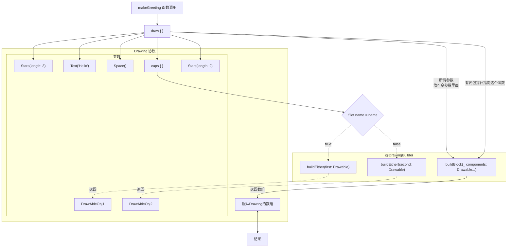
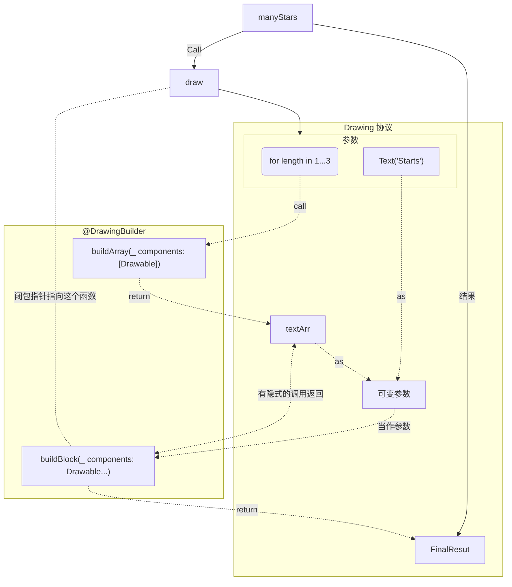
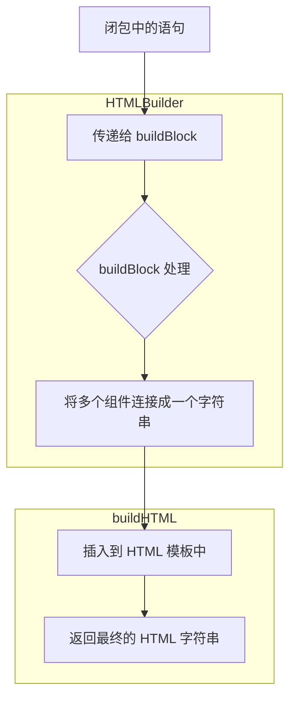
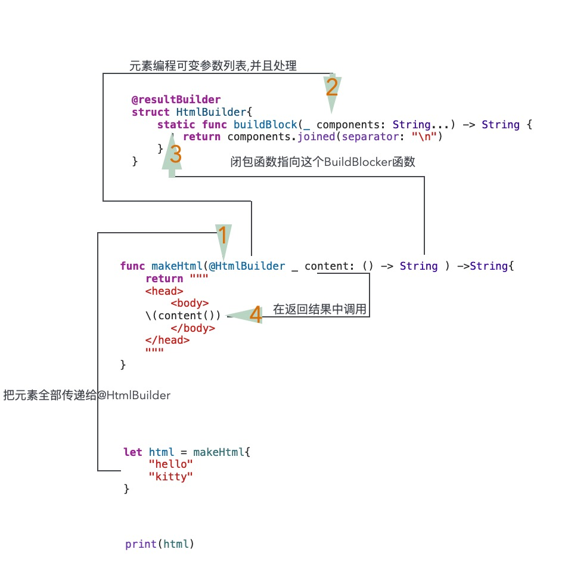

## 高级操作

定义自定义运算符，执行按位运算，并使用构建器语法。

除了 [Basic Operators](https://docs.swift.org/swift-book/documentation/the-swift-programming-language/basicoperators) 中描述的运算符外，Swift 还提供了几个高级运算符，用于执行更复杂的值操作。其中包括您将熟悉的 C 和 Objective-C 中的所有按位和位移运算符。

与 C 语言中的算术运算符不同，**Swift 中的算术运算符默认情况下不会溢出。溢出行为被捕获并报告为错误**。要选择启用溢出行为，请使用 Swift 的第二组算术运算符，这些算术运算符默认会溢出，例如溢出加法运算符 （`&+`）。所有这些溢出运算符都以与号 （`&`） 开头。

当您定义自己的结构、类和枚举时，为这些自定义类型提供您自己的标准 Swift 运算符实现可能会很有用。Swift 使提供这些运算符的定制实现变得容易，并准确地确定它们的行为对于您创建的每种类型应该是什么。

您不仅限于预定义的运算符。Swift 让你可以自由地定义自己的自定义中缀、前缀、后缀和赋值运算符，以及自定义的优先级和关联性值。可以像任何预定义的运算符一样在代码中使用和采用这些运算符，甚至可以扩展现有类型以支持定义的自定义运算符。


#### 1.按位运算符

*按位运算符*使您能够操作数据结构中的各个原始数据位。它们通常用于低级编程，例如图形编程和设备驱动程序创建。在处理来自外部源的原始数据时，按位运算符也很有用，例如对通过自定义协议进行通信的编码和解码数据。

Swift 支持在 C 中找到的所有按位运算符，如下所述。


##### 1.1. 按位 NOT 运算符 （～）

*按位 NOT 运算符* （`~`） 反转数字中的所有位：


按位 NOT 运算符是一个前缀运算符，它紧接在它所操作的值之前出现，没有任何空格： 


```swift
let initialBits: UInt8 = 0b00001111
let invertedBits = ~initialBits  // equals 11110000
```

`UInt8` 整数有 8 位，可以存储 `0` 到 `255` 之间的任何值。此示例使用二进制值 `00001111` 初始化 `UInt8` 整数，该整数的前四个位设置为 `0`，后四个位设置为 `1`。这相当于十进制值 `15`。

然后，使用按位 NOT 运算符创建一个名为`反转位`的新常量，该常量等于`初始位`，但所有位都反转。零变成一，一变成零。`反转位`的值为 `11110000`，等于无符号十进制值 `240`。


##### 1.2 按位 AND 运算符 (&)

*按位 AND 运算符* （`&`） 将两个数字的位组合在一起。仅当*两个*输入数字中的位都等于 `1` 时，它才会返回一个新数字，其位仅设置为 `1`：


在下面的示例中，`前6 位和后 6位`的值都有 4 个中间位等于 `1`。``按位 AND 运算符将它们组合在一起，使数字`00111100`，等于无符号十进制值 `60`：

```swift
let firstSixBits: UInt8 = 0b11111100
let lastSixBits: UInt8  = 0b00111111
let middleFourBits = firstSixBits & lastSixBits  // equals 00111100
```


##### 1.3 按位 OR 运算（｜）

*按位 OR 运算符* （`|`） 比较两个数字的位。运算符返回一个新数字，如果*任一输入*数字中的位等于 `1`，则其位设置为 `1`：


在下面的示例中，`某些位`和`更多位`的值将不同的位设置为 `1`。按位 OR 运算符将它们组合在一起，使数字`11111110`，等于 `254` 的无符号小数：

```swift
let someBits: UInt8 = 0b10110010
let moreBits: UInt8 = 0b01011110
let combinedbits = someBits | moreBits  // equals 11111110
```


##### 1.4按位异或 XOR 运算（^）

*按位 XOR 运算符*或“排他 OR 运算符”（`^`） 比较两个数字的位。运算符返回一个新数字，当输入位不同时，其位设置为 `1`，如果输入位相同，则其位设置为 `0`：


在下面的示例中，`firstBits` 和其他 `Bits` 的值在另一个 Bits 没有的位置都设置了一个 `1`。按位 XOR 运算符在其输出值中将这两个位设置为 `1`。`第一个位`中的所有其他位和其他`位`匹配，并在输出值中设置为 `0`：

```swift
let firstBits: UInt8 = 0b00010100
let otherBits: UInt8 = 0b00000101
let outputBits = firstBits ^ otherBits  // equals 00010001
```


##### 1.5 按位左移和右移运算符 （ << or >>)

*按位左移运算符* （`<<`） 和*按位右移运算符* （`>>`） 根据下面定义的规则将数字中的所有位向左或向右移动一定数量的位。

按位左移和向右移位具有将整数乘以或除以 2 的效果。将整数的位向左移动一个位置可使其值加倍，而将其向右移动一个位置可使其值减半。


**无符号整数的移动行为**

1. 现有位将按请求的位数向左或向右移动。
2. 任何超出整数存储边界的位都将被丢弃。
3. 在原始位向左或向右移动后，将零插入到留下的空格中。


这种方法被称为*逻辑偏移*。

下图显示了 `11111111 << 1`（`11111111`向左移动 `1` 位）和 `11111111 >> 1`（`11111111`向右移动 `1` 位）的结果。绿色数字被移动，灰色数字被丢弃，粉红色的零入：


以下是 Swift 代码中位移的样子：

```swift
let shiftBits: UInt8 = 4   // 00000100 in binary
shiftBits << 1             // 00001000
shiftBits << 2             // 00010000
shiftBits << 5             // 10000000
shiftBits << 6             // 00000000
shiftBits >> 2             // 00000001
```


您可以使用位移来对其他数据类型中的值进行编码和解码：

```swift
let pink: UInt32 = 0xCC6699
let redComponent = (pink & 0xFF0000) >> 16    // redComponent is 0xCC, or 204
let greenComponent = (pink & 0x00FF00) >> 8   // greenComponent is 0x66, or 102
let blueComponent = pink & 0x0000FF           // blueComponent is 0x99, or 153
```

此示例使用名为 `pink` 的 `UInt32` 常量来存储粉红色的级联样式表颜色值。CSS 颜色值 `#CC6699` 在 Swift 的十六进制数字表示中写为 `0xCC6699`。然后，该颜色被按位 AND 运算符 （`&`） 和按位右移运算符 （`>>）` 分解为红色 （`CC`）、绿色 （`66`） 和蓝色 （`99`） 分量。

红色分量是通过在数字 `0xCC6699` 和 `0xFF0000` 之间执行按位 AND 获得的。`0xFF0000` 中的零有效地“屏蔽”了 `0xCC6699` 的第二个和第三个字节，导致 `6699` 被忽略并留下 `0xCC0000`。

然后，该数字向右移动 16 位 （`>> 16`）。十六进制数中的每对字符都使用 8 位，因此向右移动 16 位会将 `0xCC0000` 转换为 `0x0000CC`。这与 `0xCC` 相同，其十进制值为 `204`。

同样，绿色分量是通过在数字 `0xCC6699` 和 `0x00FF00` 之间执行按位 AND 获得的，输出值为 `0x006600`。然后，该输出值向右移动 8 位，得出值 `0x66`，其十进制值为 `102`。

最后，通过在数字 `0xCC6699` 和 `0x0000FF` 之间执行按位 AND 来获得蓝色分量，输出值为 `0x000099`。因为 `0x000099`已经等于 `0x99`，而 的十进制值为 `153`，所以使用这个值时不会将其向右移动，


##### 1.5有符号整数的移动行为

由于有符号整数在二进制中表示的方式，有符号整数的移位行为比无符号整数更复杂。（为简单起见，以下示例基于 8 位有符号整数，但相同的原则适用于任何大小的有符号整数。

有符号整数使用其第一个位（称为*符号位*）来指示整数是正数还是负数。符号位 `0` 表示正值，符号位 `1` 表示负值。

其余位（称为*值位*）存储实际值。正数的存储方式与无符号整数的存储方式完全相同，从 `0` 开始计数。以下是 `Int8` 内部的位如何查找数字 `4`：


符号位是 `0`（表示“正”），七个值位只是数字 `4`，以二进制表示法书写。

但是，负数的存储方式不同。它们是通过从 `2` 减去绝对值到 `n` 的幂来存储的，其中 `n` 是值位数。一个 8 位数字有 7 个值位，因此这意味着 `2` 的 `7` 次方，即 `128`。

以下是 `Int8` 内部的位如何查找数字 `-4`：


**负数 全部取反 +1**

这一次，符号位是 `1`（表示“负”），七个值位的二进制值为 `124`（即 `128 - 4`）：


这种对负数的编码称为 *2 的补码*表示。这似乎是一种不寻常的表示负数的方式，但它有几个优点。

首先，您可以将 `-1` 加到 `-4`，只需执行所有 8 位（包括符号位）的标准二进制加法，并在完成后丢弃任何不适合这 8 位的内容：


其次，两者的补码表示还允许您像正数一样将负数的位向左和向右移动，并且最终仍然会在您向左移动时将它们加倍，或者在您向右移动时将它们减半。为了实现这一点，当有符号整数向右移动时，会使用一个额外的规则：当您将有符号整数向右移动时，应用与无符号整数相同的规则，但用*符号位*填充左侧的任何空位，而不是用零。


此操作可确保有符号整数在向右移动后具有相同的符号，这称为*算术移位*。

由于正数和负数的存储方式特殊，将它们中的任何一个向右移动都会使它们更接近于零。在此移位期间保持符号位相同意味着负整数在其值接近零时保持为负值。


##### 1.6 溢出运算符


如果您尝试将数字插入到无法保存该值的整数常量或变量中，默认情况下，Swift 会报告错误，而不是允许创建无效值。当您处理过大或过小的数字时，此行为可提供额外的安全性。

例如，`Int16` 整数类型可以保存 `-32768` 和 `32767` 之间的任何有符号整数。尝试将 `Int16` 常量或变量设置为此范围之外的数字会导致错误：

```swift

var potentialOverflow = Int16.max
// potentialOverflow equals 32767, which is the maximum value an Int16 can hold
potentialOverflow += 1
// this causes an error
```

在值过大或过小时提供错误处理，可以在编码边界值条件时提供更大的灵活性。

但是，当您明确希望溢出条件截断可用位数时，您可以选择参与此行为，而不是触发错误。Swift 提供了三个算术*溢出运算符*，它们可以选择使用溢出行为进行整数计算。这些运算符都以与号 （`&）` 开头：

**故意溢出不让编译器检查 在所有运算前面加上&**

- 溢流添加 （`&+`）
- 溢出减法 （`&-`）
- 溢出乘法 （`&*`）


##### 1.7 Value Overflow

数字可以在正方向和负方向上溢出。

下面是一个示例，说明当使用溢出加法运算符 （`&+`） 允许无符号整数在正方向上溢出时会发生什么：

```swift
var unsignedOverflow = UInt8.max
// unsignedOverflow equals 255, which is the maximum value a UInt8 can hold
unsignedOverflow = unsignedOverflow &+ 1
// unsignedOverflow is now equal to 0
```

变量 `unsignedOverflow` 使用 `UInt8` 可以容纳的最大值（`二进制为 255` 或 `11111111`）进行初始化。然后，使用溢出加法运算符 （`&+`） 将其递增 `1`。这会将其二进制表示形式推到 `UInt8` 可以容纳的大小上，从而导致其溢出超出其边界，如下图所示。溢出加法后保持在 `UInt8` 边界内的值为 `00000000`，即零。


当允许无符号整数在负方向上溢出时，也会发生类似的事情。下面是使用溢出减法运算符 （`&-`） 的示例：

```swift
var unsignedOverflow = UInt8.min
// unsignedOverflow equals 0, which is the minimum value a UInt8 can hold
unsignedOverflow = unsignedOverflow &- 1
// unsignedOverflow is now equal to 255
```

`UInt8` 可以保存的最小值为零，即二进制中的 `00000000`。如果使用溢出减法运算符 （`&-`） 从 `00000000` 中减去 `1`，则该数字将溢出并环绕到 `11111111`，即小数点后的 `255`。


有符号整数也会发生溢出。有符号整数的所有加法和减法均按位方式执行，符号位作为加法或减法数字的一部分包含在内，如[按位左移和右移运算符](https://docs.swift.org/swift-book/documentation/the-swift-programming-language/advancedoperators#Bitwise-Left-and-Right-Shift-Operators)中所述。


```swift
var signedOverflow = Int8.min
// signedOverflow equals -128, which is the minimum value an Int8 can hold
signedOverflow = signedOverflow &- 1
// signedOverflow is now equal to 127
```

`Int8` 可以保存的最小值是 `-128`，即二进制中的 `10000000`。使用溢出运算符从此二进制数中减去 `1` 得到二进制值 `01111111`，该值切换符号位并给出正 `127`，即 `Int8` 可以容纳的最大正值。


对于有符号整数和无符号整数，正方向的溢出从最大有效整数值绕回最小值，而负方向的溢出从最小值绕回最大值


### 2.运算符的优先级和关联系

运算符*优先级*使某些运算符的优先级高于其他运算符;首先应用这些运算符。

运算符*关联性*定义了如何将具有相同优先级的运算符组合在一起 — 从左侧分组，或从右侧分组。可以把它想象成“他们与左边的表达相关联”，或者“他们与右边的表达相关联”。

在计算复合表达式的计算顺序时，考虑每个运算符的优先级和关联性非常重要。例如，运算符优先级解释了为什么以下表达式等于 `17`。


```swift
2 + 3 % 4 * 5
// this equals 17

2 + 3 * 5
2 + 15 

```

如果严格从左到右阅读，则可能会期望表达式的计算方式如下：

- 2 + 3 =5
- 5 % 4 = 1
- 1 *5 = 5

然而，实际的答案是 `17`，而不是 `5`。在优先级较低的运算符之前评估优先级较高的运算符。在 Swift 中，与 C 一样，余数运算符 （`%`） 和乘法运算符 （`*`） 的优先级高于加法运算符 （`+`）。因此，在考虑添加之前，都会对它们进行评估。

但是，余数和乘法具有*相同的*优先级。要确定要使用的确切评估顺序，您还需要考虑它们的关联性。余数和乘法都与它们左边的表达式相关联。可以将其视为在表达式的这些部分周围添加隐式括号，从它们的左侧开始：

```swift
2 + ((3 % 4) * 5)
```

`（3 % 4）` 是 `3`，因此这相当于：

```swift
2 + (3 * 5)
```

`（3 * 5）` 是 `15`，所以这相当于：

```swift
2 + 15
```

这个计算得出的最终答案是 `17`。

> **Note**:Swift 的运算符优先级和关联性规则比 C 和 Objective-C 中的规则更简单、更可预测。但是，这意味着它们与基于 C 的语言并不完全相同。在将现有代码移植到 Swift 时，要小心确保操作员交互仍然按照您的预期方式运行。


### 3.运算符方法

类和结构可以提供它们自己的现有运算符的实现。这称为重载现有运算符。

下面的示例展示了如何为自定义结构实现算术加法运算符 ( `+` )。算术加法运算符是二元运算符，因为它在两个目标上运行，并且它是中缀运算符，因为它出现在这两个目标之间。

该示例为二维位置向量`(x, y)`定义了一个`Vector2D`结构，后跟一个用于将`Vector2D`结构的实例相加的*运算符方法*的定义：

```swift
struct Vector2D {
    var x = 0.0, y = 0.0
}


extension Vector2D {
    static func + (left: Vector2D, right: Vector2D) -> Vector2D {
       return Vector2D(x: left.x + right.x, y: left.y + right.y)
    }
}
```


运算符方法被定义为`Vector2D`上的类型方法，其方法名称与要重载的运算符 ( `+` ) 匹配。由于加法不是向量的基本行为的一部分，因此类型方法是在`Vector2D`的扩展中定义的，而不是在`Vector2D`的主结构声明中定义的。由于算术加法运算符是二元运算符，因此该运算符方法采用两个`Vector2D`类型的输入参数并返回一个同样为`Vector2D`类型的输出值。

在此实现中，输入参数被命名为`left`和`right`来表示位于`+`运算符左侧和右侧的`Vector2D`实例。该方法返回一个新的`Vector2D`实例，其`x`和`y`属性使用两个`Vector2D`实例相加的`x`和`y`属性之和进行初始化。

type 方法可以用作现有`Vector2D`实例之间的中缀运算符：

```swift
let vector = Vector2D(x: 3.0, y: 1.0)
let anotherVector = Vector2D(x: 2.0, y: 4.0)
let combinedVector = vector + anotherVector
// combinedVector is a Vector2D instance with values of (5.0, 5.0)

```

此示例将向量`(3 .0, 1 .0)`和`(2 .0, 4 .0)`加在一起以形成向量`(5 .0, 5 .0)` ，如下所示。


### 4.前后缀运算符 prefix/postfix


**前缀**：

上面显示的示例演示了二进制中缀运算符的自定义实现。类和结构还可以提供标准*一元运算符*的实现。一元运算符对单个目标进行操作。如果它们位于目标之前（例如`-a` ），则它们是*前缀* /**prefix**；如果它们位于目标之后（例如`b!` ），则它们是后缀/**postfix**运算符。

声明运算符方法时，可以通过在`func`关键字之前写入`prefix`或`postfix`修饰符来实现前缀或后缀一元运算符：

```swift
extension Vector2D {
  //静态函数，属于类的
    static prefix func - (vector: Vector2D) -> Vector2D {
        return Vector2D(x: -vector.x, y: -vector.y)
    }
}
```

上面的示例为`Vector2D`实例实现一元减运算符 ( `-a` )。一元减运算符是前缀运算符，因此必须使用`prefix`修饰符来限定此方法。

对于简单的数值，一元减运算符将正数转换为其等价的负数，反之亦然。 `Vector2D`实例的相应实现对`x`和`y`属性执行此操作：

```swift
let positive = Vector2D(x: 3.0, y: 4.0)
let negative = -positive
// negative is a Vector2D instance with values of (-3.0, -4.0)
let alsoPositive = -negative
// alsoPositive is a Vector2D instance with values of (3.0, 4.0)
```


**后缀：**

需要声明一下告诉编译器 `post operator ~`

```swift
postfix operator ~; //声明

struct SomeStruct<T>{
    var value:T
    static postfix  func ~( _ ins: SomeStruct<T>) -> String{
        return String(describing: "\(ins.value) 的postfix ～ 操作符")
    }
}


let iStr = SomeStruct<Int>(value: 32)
print(iStr~)

let iDouble = SomeStruct(value: "西瓜")
print(iDouble~)

```


#### 5.复合赋值运算符


*复合赋值运算符*将赋值 ( `=` ) 与另一个操作结合起来。例如，加法赋值运算符 ( `+=` ) 将加法和赋值合并为单个运算。您将复合赋值运算符的左输入参数类型标记为`inout` ，因为参数的值将直接从运算符方法内修改。

下面的示例为`Vector2D`实例实现加法赋值运算符方法：

```swift
extension Vector2D {
    static func += (left: inout Vector2D, right: Vector2D) {
        left = left + right
    }
}
```

因为前面已经定义了加法运算符，所以这里不需要重新实现加法过程。相反，加法赋值运算符方法利用现有的加法运算符方法，并使用它将左值设置为左值加上右值：

```swift
var original = Vector2D(x: 1.0, y: 2.0)
let vectorToAdd = Vector2D(x: 3.0, y: 4.0)
original += vectorToAdd
// original now has values of (4.0, 6.0)
```

> **Note**:
>
> **无法重载默认赋值运算符 ( `=` )。**仅复合赋值运算符可以重载。同样，三元条件运算符 ( `a ? b : c` ) 也不能重载。


### 6.等价运算符

默认情况下，自定义类和结构没有*等价运算符*的实现，即*等于*运算符 ( `==` ) 和*不等于*运算符 ( `!=` )。您通常实现`==`运算符，并使用 Swift 标准库的`!=`运算符的默认实现来否定`==`运算符的结果。有两种方法可以实现`==`运算符：您可以自己实现，或者对于许多类型，您可以要求 Swift 为您合成一个实现。在这两种情况下，您都可以添加对 Swift 标准库的`Equatable`协议的一致性。

您可以按照与实现其他中缀运算符相同的方式提供`==`运算符的实现：

```swift
extension Vector2D: Equatable {
    static func == (left: Vector2D, right: Vector2D) -> Bool {
       return (left.x == right.x) && (left.y == right.y)
    }
}
```

上面的示例实现了`==`运算符来检查两个`Vector2D`实例是否具有相等的值。在`Vector2D`的上下文中，将“等于”视为“两个实例具有相同的`x`值和`y`值”是有意义的，因此这是运算符实现所使用的逻辑。

您现在可以使用此运算符来检查两个`Vector2D`实例是否等效：

```swift
let twoThree = Vector2D(x: 2.0, y: 3.0)
let anotherTwoThree = Vector2D(x: 2.0, y: 3.0)
if twoThree == anotherTwoThree {
    print("These two vectors are equivalent.")
}
// Prints "These two vectors are equivalent."
```

在许多简单的情况下，您可以要求 Swift 为您提供等价运算符的综合实现，如[采用使用综合实现的协议](https://docs.swift.org/swift-book/documentation/the-swift-programming-language/protocols#Adopting-a-Protocol-Using-a-Synthesized-Implementation)中所述。


### 7.自定义运算符

除了 Swift 提供的标准运算符之外，您还可以声明和实现自己的*自定义运算符*。有关可用于定义自定义运算符的字符列表，请参阅[运算符](https://docs.swift.org/swift-book/documentation/the-swift-programming-language/lexicalstructure#Operators)。

新的运算符使用`operator`关键字在全局级别声明，并用`prefix` 、 `infix`或`postfix`修饰符进行标记：

​	•	prefix**前缀运算符**：位于操作数之前，例如 -a 中的 -。

​	•	infix **中缀运算符**：位于两个操作数之间，例如 a + b 中的 +。

​	•	postfix **后缀运算符**：位于操作数之后，例如 a! 中的 !。


**新的运算符使用`operator`关键字在全局级别声明，并用`prefix` 、 `infix`或`postfix`修饰符进行标记：**

```swift
prefix operator +++
```

上面的示例定义了一个名为`+++`的新前缀运算符。该运算符在 Swift 中没有现有含义，因此在下面使用`Vector2D`实例的特定上下文中为其赋予了自己的自定义含义。出于本示例的目的， `+++`被视为新的“前缀加倍”运算符。通过使用之前定义的加法赋值运算符将向量添加到自身，它将`Vector2D`实例的`x`和`y`值加倍。要实现`+++`运算符，请向`Vector2D`添加一个名为`+++`的类型方法，如下所示：

```swift
extension Vector2D {
    static prefix func +++ (vector: inout Vector2D) -> Vector2D {
        vector += vector
        return vector
    }
}


var toBeDoubled = Vector2D(x: 1.0, y: 4.0)
let afterDoubling = +++toBeDoubled
// toBeDoubled now has values of (2.0, 8.0)
// afterDoubling also has values of (2.0, 8.0)
```


### 8.自定义中缀运算符的优先级

每个自定义中缀运算符都属于一个优先级组。优先级组指定运算符相对于其他中缀运算符的优先级以及运算符的结合性。有关这些特征如何影响中缀运算符与其他中缀运算符交互的说明，请参阅[优先级和结合性](https://docs.swift.org/swift-book/documentation/the-swift-programming-language/advancedoperators#Precedence-and-Associativity)。


**优先级排名**


|优先级别| 优先级组                     | 运算符                     |说明|
|--|--|--|--|
|1| BitwiseShiftPrecedence       | <<, >>                     |移运算符（<<, >>）的优先级最高。|
|2| MultiplicationPrecedence     | *, /, %                    |乘法、除法和取模运算符（*, /, %）的优先级高于加法和减法。|
|3| AdditionPrecedence           | +, -                       |加法和减法运算符（+, -）的优先级高于范围运算符。|
|4| RangeFormationPrecedence     | ..., ..<                   |范围运算符（..., ..<）的优先级高于类型转换运算符。|
|5| CastingPrecedence            | is, as                     |类型转换运算符（is, as）的优先级高于空合并运算符。|
|6|NilCoalescingPrecedence      | ??                         |空合并运算符（??）的优先级高于比较运算符。|
|7| ComparisonPrecedence         | ==, !=, <, <=, >, >=       |比较运算符（==, !=, <, <=, >, >=）的优先级高于逻辑与运算符。|
|8|LogicalConjunctionPrecedence | &&                         |逻辑与运算符（&&）的优先级高于逻辑或运算符。|
|9|LogicalDisjunctionPrecedence |                            |逻辑或运算符（\|\|）的优先级高于三元运算符。|
|10|TernaryPrecedence            | ?:                         |三元运算符（?:）的优先级高于赋值运算符。|
|11|AssignmentPrecedence         | =, +=, -=, *=, /=, %=      |赋值运算符（=, +=, -=, *=, /=, %=）的优先级最低。|

未显式放入优先级组的自定义中缀运算符会被赋予默认优先级组，其优先级立即高于**TernaryPrecedence**/三元条件运算符的优先级。

以下示例定义了一个名为`+-`新自定义中缀运算符，它属于优先级组`Addition Precedence` ：

```swift
infix operator +-: AdditionPrecedence  //+= 级别
extension Vector2D {
    static func +- (left: Vector2D, right: Vector2D) -> Vector2D {
        return Vector2D(x: left.x + right.x, y: left.y - right.y)
    }
}
let firstVector = Vector2D(x: 1.0, y: 2.0)
let secondVector = Vector2D(x: 3.0, y: 4.0)
let plusMinusVector = firstVector +- secondVector
// plusMinusVector is a Vector2D instance with values of (4.0, -2.0)
```

该运算符将两个向量的`x`值相加，并从第一个向量中减去第二个向量的`y`值。因为它本质上是一个“加法”运算符，所以它被赋予了与`+`和`-`等加法中缀运算符相同的优先级组。有关 Swift 标准库提供的运算符的信息，包括运算符优先级组和结合性设置的完整列表，请参阅[运算符声明](https://developer.apple.com/documentation/swift/operator_declarations)。有关优先级组的更多信息以及查看定义您自己的运算符和优先级组的语法，请参阅[运算符声明](https://docs.swift.org/swift-book/documentation/the-swift-programming-language/declarations#Operator-Declaration)。

> **Note**:定义前缀或后缀运算符时不指定优先级。但是，如果对同一个操作数同时应用前缀和后缀运算符，则首先应用后缀运算符。


**自定义优先级别**

```swift
// 定义自定义的优先级组
precedencegroup CustomPrecedence {
    associativity: left  // 左结合
    higherThan: AdditionPrecedence  // 优先级高于加法运算符
    lowerThan: MultiplicationPrecedence  // 优先级低于乘法运算符
}

// 声明中缀运算符并指定优先级组
infix operator **: CustomPrecedence

// 实现中缀运算符
struct Vector2D {
    var x: Double
    var y: Double

    static func ** (lhs: Vector2D, rhs: Vector2D) -> Double {
        return lhs.x * rhs.x + lhs.y * rhs.y
    }
}

// 测试代码
let vector1 = Vector2D(x: 2.0, y: 3.0)
let vector2 = Vector2D(x: 4.0, y: 5.0)
let result = vector1 ** vector2 + 10  // 运算符优先级控制计算顺序
print(result)  // 输出: 33.0
```


### 9. resultBuilder TODO:有时间再看一遍没看太懂

*结果生成器*是您定义的一种类型，它添加用于以自然的声明性方式创建嵌套数据（例如列表或树）的语法。使用结果生成器的代码可以包含普通的 Swift 语法（例如`if`和`for` ）来处理条件数据或重复的数据。

下面的代码定义了几种使用星号和文本在单行上绘图的类型。

```swift
protocol Drawable {
    func draw() -> String
}

struct Line: Drawable {
    var elements: [Drawable]
    func draw() -> String {
        return elements.map { $0.draw() }.joined(separator: "")
    }
}

struct Text: Drawable {
    var content: String
    init(_ content: String) { self.content = content }
    func draw() -> String { return content }
}

struct Space: Drawable {
    func draw() -> String { return " " }
}

struct Stars: Drawable {
    var length: Int
    func draw() -> String { return String(repeating: "*", count: length) }
}

struct AllCaps: Drawable {
    var content: Drawable
    func draw() -> String { return content.draw().uppercased() }
}
```


`Drawable`协议定义了对可以绘制的东西的要求，例如线条或形状：该类型必须实现`draw()`方法。 `Line`结构代表单线绘图，它为大多数绘图提供顶级容器。要绘制`Line` ，该结构会对该线的每个组件调用`draw()` ，然后将生成的字符串连接成单个字符串。 `Text`结构包装一个字符串，使其成为绘图的一部分。 `All Caps`结构包装并修改另一个图形，将图形中的任何文本转换为大写。


可以通过调用它们的初始值设定项来使用这些类型进行绘图：

```swift
let name: String? = "Ravi Patel"
let manualDrawing = Line(elements: [
     Stars(length: 3),
     Text("Hello"),
     Space(),
     AllCaps(content: Text((name ?? "World") + "!")),
     Stars(length: 2),
])
print(manualDrawing.draw())
// Prints "***Hello RAVI PATEL!**"
```

这段代码可以工作，但是有点尴尬。 `All Caps`后嵌套很深的括号很难阅读。当`name` `nil`时使用“World”的后备逻辑必须使用`??`内联完成。运算符，这对于任何更复杂的事情来说都是困难的。如果您需要包含开关或`for`循环来构建绘图的一部分，则无法做到这一点。结果生成器允许您重写这样的代码，使其看起来像正常的 Swift 代码。

要定义结果生成器，您可以在类型声明上编写`@result Builder`属性。例如，此代码定义了一个名为`Drawing Builder`的结果生成器，它允许您使用声明性语法来描述绘图：

```swift
@resultBuilder
struct DrawingBuilder {
    static func buildBlock(_ components: Drawable...) -> Drawable {
      	//把可变参数全部放一个list 里面了
        return Line(elements: components)
    }

    static func buildEither(first: Drawable) -> Drawable {
        return first
    }
    static func buildEither(second: Drawable) -> Drawable {
        return second
    }
    	//caps 闭包中的条件语句 if let name = name 会使用 buildEither(first:) 和 buildEither(second:) 
  		//方法来处理条件分支。这是因为 @resultBuilder 的目的是将不同的组件组合在一起，而条件语句的不同分支则需要分别处理。
}
```

`绘图生成器`结构定义了三个方法来实现部分结果生成器语法。`构建块（_：）`方法添加了对在代码块中编写一系列行的支持。它将该块中的组件组合成一`条线`。`build Either（first：）`和`build Either（second：）`方法添加了对`if`-`else的`支持。


您可以将`@Drawing Builder`属性应用于函数的参数，这会将传递给函数的闭包转换为结果生成器从该闭包创建的值。举例来说：


```swift

func draw(@DrawingBuilder content: () -> Drawable) -> Drawable {
  	//所有的参数会被传递到 DrawingBuilder.buildBlock的可变参数 components 里面
  	//content 是指向 DrawingBuilder.buildBlock 函数的指针
  	//content() 是调用该函数
    return content()
}
func caps(@DrawingBuilder content: () -> Drawable) -> Drawable {
  	//caps的参数会被 DrawingBuilder.buildblock当作可变参数，
  	//然后content指向该函数。content()作为返回结果，在作为参数构造一个新的AllCaps 
    return AllCaps(content: content())
}


func makeGreeting(for name: String? = nil) -> Drawable {
    let greeting = draw {
        Stars(length: 3)
        Text("Hello")
        Space()
        caps {
          //出现分支 调用：DrawingBuilder.buildEither(first: Drawable)
            if let name = name {
                Text(name + "!")
            } else {  // 调用：DrawingBuilder.buildEither(second: Drawable)
                Text("World!")
            }
        }
        Stars(length: 2)
    }
    return greeting
}
let genericGreeting = makeGreeting()
print(genericGreeting.draw())
// Prints "***Hello WORLD!**"


let personalGreeting = makeGreeting(for: "Ravi Patel")
print(personalGreeting.draw())
// Prints "***Hello RAVI PATEL!**"
```

`make Greeting（for：）`函数接受一个`name`参数，并使用它来绘制个性化的问候语。`draw（_：）`和`caps（_：）`函数都使用一个闭包作为参数，该闭包用`@Drawing Builder`属性标记。调用这些函数时，使用`绘图生成器`定义的特殊语法。Swift将绘图的声明性描述转换为对`绘图构建器`上的方法的一系列调用，以构建作为函数参数传递的值。例如，Swift将该示例中对`caps（_：）`的调用转换为如下代码：


```swift
let capsDrawing = caps {
    let partialDrawing: Drawable
    if let name = name {
        let text = Text(name + "!")
        partialDrawing = DrawingBuilder.buildEither(first: text)
    } else {
        let text = Text("World!")
        partialDrawing = DrawingBuilder.buildEither(second: text)
    }
    return partialDrawing
}
```





Swift将`if`-`else`块转换为对`build Either（first：）`和`build Either（second：）`方法的调用。虽然你不会在自己的代码中调用这些方法，但显示转换的结果可以让你更容易地看到Swift在使用`Drawing Builder`语法时是如何转换代码的。


若要添加对在特殊绘图语法中编写`for`循环的支持，请添加`build Array（_：）`方法。

```swift
extension DrawingBuilder {
    static func buildArray(_ components: [Drawable]) -> Drawable {
        return Line(elements: components)
    }
}
let manyStars = draw {
    Text("Stars:")
    for length in 1...3 {
        Space()
        Stars(length: length)
    }
}
```


在上面的代码中，`for`循环创建了一个绘图数组，`build Array（_：）`方法将该数组转换为`Line`。

有关Swift如何将构建器语法转换为对构建器类型方法的调用的完整列表，请参见[resultBuilder](https://docs.swift.org/swift-book/documentation/the-swift-programming-language/attributes#resultBuilder)。





#### 9.1 chatgpt explain resultBuilder

好的，让我们来详细解释一下 `@resultBuilder`。

##### 什么是 `@resultBuilder`？

`@resultBuilder` 是 Swift 5.4 引入的特性，允许你创建自定义的 DSL（领域特定语言）语法。它使得在特定上下文中可以使用类似于 SwiftUI 中的声明式语法，生成复杂的数据结构或代码。

##### `@resultBuilder` 的作用

`@resultBuilder` 主要用于简化嵌套结构的构建。它通过将多行语句转换成一个结果来帮助你构建复杂的代码或数据结构。

##### `@resultBuilder` 的基本使用

我们通过一个简单的例子来演示如何使用 `@resultBuilder` 创建一个 HTML 构建器。

###### 定义结果构建器

首先，我们需要定义一个结果构建器。结果构建器是一种带有多个静态方法的结构体或类，这些方法定义了如何处理不同类型的语句。

```swift
@resultBuilder
struct HTMLBuilder {
    // 将单个组件转换为数组
    static func buildBlock(_ components: String...) -> String {
        components.joined(separator: "\n")
    }
}
```

###### 使用结果构建器

接下来，我们使用这个结果构建器来定义一个函数，该函数使用声明式语法生成 HTML 内容。

```swift
func buildHTML(@HTMLBuilder _ content: () -> String) -> String {
    """
    <html>
    <body>
    \(content())
    </body>
    </html>
    """
}
```

###### 构建 HTML 内容

最后，我们使用 `buildHTML` 函数来生成 HTML 内容。

```swift
let html = buildHTML {
    "Hello, World!"
    "This is an example of using @resultBuilder."
}

print(html)
```

```swift
func buildHTMLWithEmbeddedFunctions(content: () -> [String]) -> String {
    // 将闭包的结果连接成一个字符串
    let combinedContent = content().joined(separator: "\n")
    
    // 插入到 HTML 模板中
    return """
    <html>
    <body>
    \(combinedContent)
    </body>
    </html>
    """
}

// 使用内嵌函数生成 HTML 内容
let htmlWithEmbeddedFunctions = buildHTMLWithEmbeddedFunctions {
    // 返回字符串数组
    ["Hello, World!, "This is an example of using @resultBuilder."]
}

print(htmlWithEmbeddedFunctions)
```





输出：

```html
<html>
<body>
Hello, World!
This is an example of using @resultBuilder.
</body>
</html>
```

##### 更复杂的示例

为了更好地理解，我们可以创建一个更复杂的 HTML 构建器。

```swift
@resultBuilder
struct HTMLBuilder {
    // 处理单个字符串组件
    static func buildBlock(_ components: String...) -> String {
        components.joined(separator: "\n")
    }

    // 处理可选组件
    static func buildOptional(_ component: String?) -> String {
        component ?? ""
    }

    // 处理条件组件
    static func buildEither(first component: String) -> String {
        component
    }

    static func buildEither(second component: String) -> String {
        component
    }
}

func buildHTML(@HTMLBuilder _ content: () -> String) -> String {
    """
    <html>
    <body>
    \(content())
    </body>
    </html>
    """
}

let isLoggedIn = true

let html = buildHTML {
    "Hello, World!"
    if isLoggedIn {
        "Welcome back, user!"
    } else {
        "Please log in."
    }
}

print(html)
```

输出：

```html
<html>
<body>
Hello, World!
Welcome back, user!
</body>
</html>
```

##### `@resultBuilder` 方法详解

- `buildBlock`: 这是最基本的构建器方法，将多个组件组合成一个结果。
- `buildOptional`: 处理可选值。如果组件为 `nil`，则返回空字符串。
- `buildEither`: 处理条件分支，根据条件选择一个组件。

##### 总结

`@resultBuilder` 是一种强大的工具，可以让你使用声明式语法构建复杂的数据结构或代码。它通过将多个语句组合成一个结果，使代码更加简洁和可读。

希望这个解释和示例能帮助你理解 `@resultBuilder` 的概念和用法。如果有任何进一步的问题或需要更多的解释，请随时告诉我！


#### 9.2 自己理解的 resultBuild

```swift
@resultBuilder
struct HtmlBuilder{
    static func buildBlock(_ components: String...) -> String {
        return components.joined(separator: "\n")
    }
}


func makeHtml(@HtmlBuilder _ content: () -> String ) ->String{
    return """
    <head>
        <body>
    \(content())
        </body>
    </head>
    """
}


let html = makeHtml{
    "hello"
    "kitty"
}


print(html)

```


