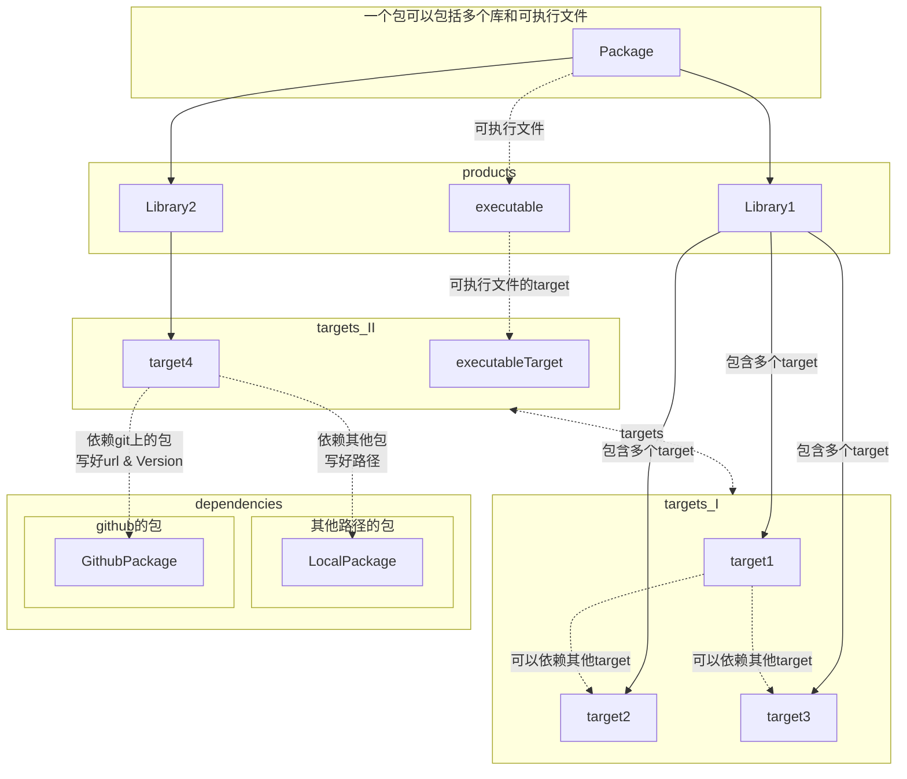

## 使用Swfit package管理

**新建可执行文件**
先新建一个目录,进入目录
`swift package init --type executable` 

**新建库**
`swift package init --type library`

不管是库或者可执行文件,文件夹下面都会有Package.swift用于管理包，库名和目标，目标之间的依赖，依赖可以是本地的其他已经写好的库，也可以是github上面的项目
如下:

```swift
let package = Package(
    //包的名字
    name: "XiGua",

    products:[
        //库 库名字 库目标
        .library(
            name:"libraryModule",
            targets:["libraryModule"]
        ),
        .library(
            name:"AlgorithmLib",
            targets:["AlgorithmLib"]
        ),
        //可执行文件 可执行文件名称  可执行文件的目标
        .executable(
            name:"mainModule",
            targets:["mainModule"]
        )
    ],
    //本地路径,包名字，路径 or Git
    dependencies:[.package(name:"algorithms",path:"/Users/min122218/app/SwiftLib/algorithms")],
    targets:[
        //可执行目标，名字，依赖目标数组
        .executableTarget(
            name:"mainModule",
            dependencies:["libraryModule","AlgorithmLib","algorithms"]
        ),
        //库目标，库名字，库依赖数组
        .target(
            name:"libraryModule",
            dependencies:[]
        ),
        //库目标，库名字，库依赖数组,指定路径，不指定在Resource下面
        .target(
            name:"AlgorithmLib",
            dependencies:[],
            path:"Sources/Algorithm"  //指定路径 一般放在Resource下面，但是也可以指定其他目录

        )

    ]

)

```

tree 
```bash
tree . 
.
├── AlgorithmLib // Not on Source directory
│   └── algo.swift
├── Makefile
├── Package.swift
└── Sources	// 规范在这个文件夹
    ├── Algorithm
    │   └── algorithm.swift
    ├── libraryModule
    │   └── libraryFile.swift
    └── mainModule
        └── main.swift

6 directories, 6 files
```



