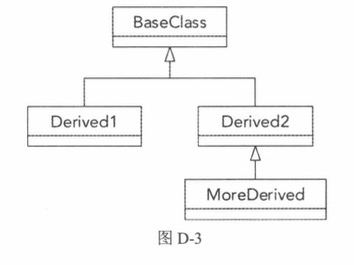
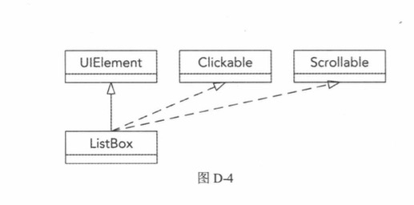
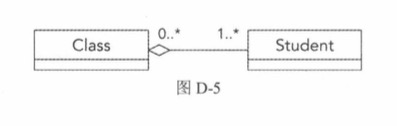
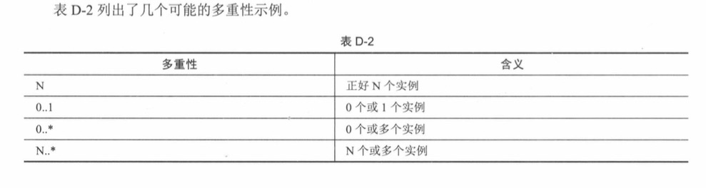
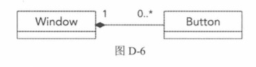
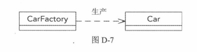
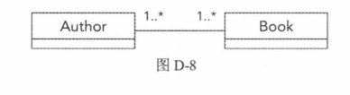

# UML介绍

UML（UnifiedModelingLanguage，统⼀建模语⾔）是⽤于显⽰类层次结构、⼦系统交互和序列图等的⾏业图形标准。本书使⽤UMIL来表⽰类图。要完整解释UNL标准，需要⼀整本书，因此本附录仅简要介绍本书正⽂中涉及的UML⽅⾯，即类

[ref] c++高级编程(第四版) 748页


## 1.类图

- **+** 表示public 公有成员
- **-** 表示private 私有成员
- **#**表示protect 


## 2.关系表示


### 2.1 继承

使⽤从派⽣类到基类的线来表⽰继承（Inheritance）关系。线的末端是⼀个空⼼三⾓箭头，位于基类⼀侧，描述“是⼀个”关系。图D-3显⽰了⼀个⽰例



### 2.2 实现/实施

实施/实现（Realization/implementation）某个接⼜的类基本是从那个接⼜继承（“是⼀个”关系）。但是，要区分⼀般的继承和接⼜实现，后者看上去像是继承，但⽤的是虚线⽽⾮实线，如图D-4所⽰。ListBox类从UIElement继承，并实现了Clickable和Scrollable接口。



在C++中，"Realization" 指的是一个类实现某个接口的过程。接口通常通过包含纯虚函数（pure virtual functions）的抽象类来定义，而实现这个接口的类必须提供这些**纯虚函数**的具体实现。

首先，我们定义两个接口`Clickable`和`Scrollable`。接口在C++中通常使用只有纯虚函数的类来定义。

```cpp
#include <iostream>

// 定义接口Clickable
class Clickable {
public:
    virtual void click() = 0;  // 纯虚函数，表示这是一个接口
    virtual ~Clickable() {}    // 虚析构函数，确保正确析构子类对象
};

// 定义接口Scrollable
class Scrollable {
public:
    virtual void scroll() = 0;  // 纯虚函数，表示这是一个接口
    virtual ~Scrollable() {}    // 虚析构函数，确保正确析构子类对象
};
```


然后，我们定义一个实现这些接口的类`ListBox`。这个类需要提供`click`和`scroll`方法的具体实现。

```cpp
// 定义实现Clickable和Scrollable接口的ListBox类
class ListBox : public Clickable, public Scrollable {
public:
    void click() override {
        std::cout << "ListBox clicked" << std::endl;
    }

    void scroll() override {
        std::cout << "ListBox scrolled" << std::endl;
    }
};
```

**使用实现**

最后，我们在`main`函数中创建`ListBox`对象，并调用其方法。

```cpp
int main() {
    ListBox listBox;
    listBox.click();    // 实现Clickable接口的方法
    listBox.scroll();   // 实现Scrollable接口的方法

    return 0;
}
```

**解释**

1. **纯虚函数**：接口`Clickable`和`Scrollable`中的`click`和`scroll`方法是纯虚函数，使用`= 0`来定义。这意味着任何派生类都必须提供这些方法的实现。
   
2. **实现接口**：`ListBox`类继承了`Clickable`和`Scrollable`接口，并提供了`click`和`scroll`方法的具体实现。这就是所谓的"Realization"。

3. **多重继承**：在C++中，一个类可以继承多个类（包括接口），这允许`ListBox`类同时实现`Clickable`和`Scrollable`接口。

**UML类图**

在UML类图中，接口和实现关系通过虚线箭头表示。例如：

- `Clickable`和`Scrollable`接口与`ListBox`类之间用虚线箭头表示实现关系。

这样，通过继承接口并提供具体实现，`ListBox`类实现了接口定义的行为，这就是C++中"Realization"的含义。


### 2.3 聚合

聚合（Aggregation）表⽰“有⼀个”关系，⽤的是⼀条线。如果⼀个类包含另⼀个类的实例，那么者的⼀侧是⼀个空⼼菱形。在聚合关系中，也可以可选地指定关系中每个参与者的多重性。多重性的位置刚开始时令⼈有些困惑，如图D-5所⽰。在本例中，⼀个Class可以包含/聚合⼀个或多个Student，每个Student可属于0个或多个Class。聚合关系意味着，即使聚合者被销毁，**被聚合对象也可继续存在。例如，如果Class被销毁，Student不会被销毁。**






```c++
class Student {
public:
    Student(const std::string& name) : name(name) {}
    void display() const {
        std::cout << "Student: " << name << std::endl;
    }
private:
    std::string name;
};

class Class {
public:
    void addStudent(Student* student) {
        students.push_back(student);
    }

    void displayStudents() const {
        std::cout << "Class contains:" << std::endl;
        for (const auto& student : students) {
            student->display();
        }
    }
private:
    std::vector<Student*> students;  // 聚合关系，Class包含多个Student指针
};
```


### 2.4 组合

组合（Composition）⾮常类似于聚合，表⽰形式⼏乎完全相同，只是⽤**实⼼菱形**替代了空⼼形。与聚合的不同之处在于，使⽤组合时，如果包含另⼀个类的实例的类被销毁，被包含的实例也会被销毁。
图D-6显⽰了⼀个⽰例。⼀个Window可包含0个或个Button，每个Button必须正好被1个Window包含。如果销毁Window，Window中包含的所有Button也将被销毁



```c++
#include <iostream>
#include <vector>
#include <memory>

// 定义Button类
class Button {
public:
    Button(const std::string& label) : label(label) {
        std::cout << "Button created: " << label << std::endl;
    }
    ~Button() {
        std::cout << "Button destroyed: " << label << std::endl;
    }
    void click() const {
        std::cout << "Button clicked: " << label << std::endl;
    }
private:
    std::string label;
};

// 定义Window类
class Window {
public:
    void addButton(const std::string& label) {
        buttons.push_back(std::make_unique<Button>(label));
    }

    void clickButtons() const {
        for (const auto& button : buttons) {
            button->click();
        }
    }
private:
    std::vector<std::unique_ptr<Button>> buttons;  // 组合关系，Window包含多个Button
};

int main() {
    {
        Window window;
        window.addButton("OK");
        window.addButton("Cancel");

        window.clickButtons();
    } // 当window对象超出作用域时，其包含的Button对象也会被销毁

    return 0;
}
//在上述代码中，Window 对象通过一个按钮指针的向量（std::vector<std::unique_ptr<Button>>）包含多个 Button 对象。这表明 Window 组合了 Button 对象。
//组合关系的一个重要特性是，如果 Window 对象被销毁，其包含的所有 Button 对象也会被销毁。这是通过使用 std::unique_ptr 实现的智能指针来管理按钮对象的生命周期来实现的。
```


### 2.5 依赖

依赖（Dependency）表⽰⼀个类依赖于另⼀个类。表⽰形式是⼀条虚线，箭头指向被依赖的类。通常情况下，虚线上的⼀些⽂本描述依赖关系。再来分析第29章的汽车⼯⼚⽰例，CarFactory依赖于Car，因为⼯⼚⽣产汽车，如图D-7所⽰。



```c++
#include <iostream>
#include <string>

// 定义Car类
class Car {
public:
    Car(const std::string& model) : model(model) {
        std::cout << "Car created: " << model << std::endl;
    }
    void drive() const {
        std::cout << "Driving " << model << std::endl;
    }
private:
    std::string model;
};

// 定义CarFactory类
class CarFactory {
public:
    Car* createCar(const std::string& model) {
        return new Car(model);
    }
};

int main() {
    CarFactory factory;
    Car* myCar = factory.createCar("Tesla Model S");
    myCar->drive();
    delete myCar; // 注意：需要手动删除动态分配的对象
    return 0;
}
//在上述代码中，CarFactory 类通过 createCar 方法创建 Car 对象，这表明 CarFactory 依赖于 Car 类。
//依赖关系在 UML 类图中用虚线箭头表示，箭头指向被依赖的类。在这个例子中，CarFactory 依赖于 Car，所以箭头从 CarFactory 指向 Car。
```


### 2.6 关联

关联（Association）是聚合的更通⽤形式，它表⽰类之间的双向链接，⽽聚合是单向链接。图D-8显⽰了⼀个⽰例。每个Book都知道Author是谁，每个Author都知道⾃⼰所写的每个Book。



```c++
#include <iostream>
#include <string>
#include <vector>

// 前向声明
class Book;
//Author 类：表示作者，包含一个名字属性和一个 Book 指针的向量。addBook 方法将 Book 添加到 Author 的书籍列表中。
class Author {
public:
    Author(const std::string& name) : name(name) {}

    void addBook(Book* book) {
        books.push_back(book);
    }

    void displayBooks() const {
        std::cout << name << " wrote:" << std::endl;
        for (const auto& book : books) {
            book->display();
        }
    }

    std::string getName() const {
        return name;
    }

private:
    std::string name;
    std::vector<Book*> books;  // 一个Author知道他写的所有Books
};

//Book 类：表示书籍，包含一个标题属性和一个指向 Author 的指针。在构造函数中，将 Book 添加到 Author 的书籍列表中。
class Book {
public:
    Book(const std::string& title, Author* author) : title(title), author(author) {
        author->addBook(this);
    }

    void display() const {
        std::cout << "Book: " << title << " by " << author->getName() << std::endl;
    }

private:
    std::string title;
    Author* author;  // 一个Book知道它的Author
};

int main() {
    Author author1("J.K. Rowling");
    Book book1("Harry Potter and the Philosopher's Stone", &author1);
    Book book2("Harry Potter and the Chamber of Secrets", &author1);

    author1.displayBooks();

    return 0;
}
//在上述代码中，Book 和 Author 之间有双向关联关系。Book 知道它的 Author，Author 也知道它写的所有 Book。
//这种关联关系在 UML 类图中用实线箭头表示，并且箭头从 Book 指向 Author，反向也有箭头表示 Author 知道它的 Book。
```

