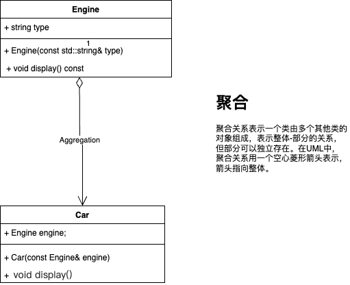
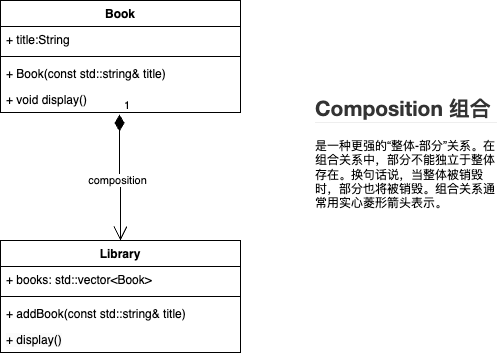
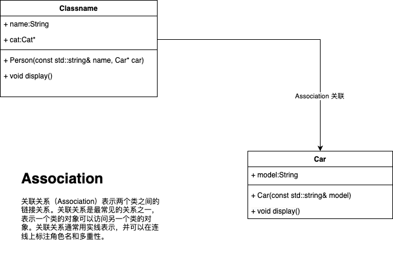

## aggregation 聚合

是的，聚合关系的关键点在于一个类（整体）包含另一个类（部分），但部分可以独立于整体存在。这意味着，整体和部分之间的关系是松散的，部分在整体不存在时仍然可以独立存在。

具体来说，聚合关系表示一个类作为另一个类的成员（通常是成员变量），但该成员对象可以独立创建和销毁，不依赖于包含它的类。

**C++代码示例**

让我们用另一个简单的例子来进一步解释聚合关系：

```cpp
#include <iostream>
#include <vector>
#include <string>

class Engine {
public:
    std::string type;

    Engine(const std::string& type) : type(type) {}

    void display() const {
        std::cout << "Engine type: " << type << std::endl;
    }
};

class Car {
public:
    Engine engine;

    Car(const Engine& engine) : engine(engine) {}

    void display() const {
        std::cout << "Car with ";
        engine.display();
    }
};

int main() {
    // 创建引擎对象
    Engine engine("V8");

    // 创建汽车对象，并将引擎对象传递给它
    Car car(engine);

    // 显示汽车及其引擎类型
    car.display();

    return 0;
}
```





**解释**

1. **Engine类**：代表一个引擎。包含一个成员变量`type`，表示引擎类型。
2. **Car类**：代表一辆汽车。包含一个`Engine`成员，表示汽车的引擎。

在这个示例中，`Engine`类和`Car`类之间是聚合关系，因为引擎对象可以独立存在，即使汽车对象不存在，引擎对象仍然可以存在和使用。`Car`类只是简单地包含了一个`Engine`成员，用于表示汽车的引擎。

通过这个示例，我们可以看到一个类包含另一个类的成员，但该成员对象可以独立于包含它的类存在和使用，这就是聚合关系的本质。

如果你有更多问题或需要进一步的解释，请告诉我！


## Composition 组合

组合关系（Composition）是一种更强的“整体-部分”关系。在组合关系中，部分不能独立于整体存在。换句话说，当整体被销毁时，部分也将被销毁。组合关系通常用实心菱形箭头表示。

**C++代码示例**

让我们用一个例子来展示组合关系。在这个例子中，我们将定义一个`Library`类和一个`Book`类，表示图书馆和图书之间的组合关系。

```cpp
#include <iostream>
#include <vector>
#include <string>

class Book {
public:
    std::string title;

    Book(const std::string& title) : title(title) {}

    void display() const {
        std::cout << "Book title: " << title << std::endl;
    }
};

class Library {
public:
    std::vector<Book> books;

    void addBook(const std::string& title) {
        books.emplace_back(title);
    }

    void display() const {
        std::cout << "Library contains the following books:" << std::endl;
        for (const auto& book : books) {
            book.display();
        }
    }
};

int main() {
    // 创建图书馆对象
    Library library;

    // 向图书馆添加图书
    library.addBook("The Great Gatsby");
    library.addBook("1984");
    library.addBook("To Kill a Mockingbird");

    // 显示图书馆及其图书
    library.display();

    return 0;
}
```



**解释**

1. **Book类**：代表一本书。包含一个成员变量`title`，表示书的标题。
2. **Library类**：代表一个图书馆。包含一个`std::vector<Book>`，表示图书馆包含的图书。

在这个示例中，`Book`类和`Library`类之间是组合关系，因为图书对象的生命周期完全依赖于图书馆对象。当图书馆对象被销毁时，图书对象也会被销毁。图书馆负责创建和销毁图书对象，这种关系是强依赖的。

**关键点**

- **组合关系**：部分完全依赖于整体存在。当整体被销毁时，部分也将被销毁。
- **代码示例**：在`Library`类中，`books`成员是一个`std::vector<Book>`，图书对象由图书馆对象管理和销毁。

希望这个示例清晰地展示了组合关系的概念。如果你有任何问题或需要进一步的解释，请告诉我！


## Association 关联

关联关系（Association）表示两个类之间的链接关系。关联关系是最常见的关系之一，表示一个类的对象可以访问另一个类的对象。关联关系通常用实线表示，并可以在连线上标注角色名和多重性。

**C++代码示例**

让我们用一个例子来展示关联关系。在这个例子中，我们将定义一个`Person`类和一个`Car`类，表示人和车之间的关联关系。

```cpp
#include <iostream>
#include <string>

class Car {
public:
    std::string model;

    Car(const std::string& model) : model(model) {}

    void display() const {
        std::cout << "Car model: " << model << std::endl;
    }
};

class Person {
public:
    std::string name;
    Car* car;  // 关联关系，Person拥有一个Car对象的指针

    Person(const std::string& name, Car* car) : name(name), car(car) {}

    void display() const {
        std::cout << "Person name: " << name << std::endl;
        if (car != nullptr) {
            car->display();
        } else {
            std::cout << "No car" << std::endl;
        }
    }
};

int main() {
    // 创建Car对象
    Car car("Toyota");

    // 创建Person对象，并将Car对象的指针传递给它
    Person person("John", &car);

    // 显示Person及其Car 
    person.display();

    return 0;
}
```




**解释**

1. **Car类**：代表一辆车。包含一个成员变量`model`，表示车的型号。
2. **Person类**：代表一个人。包含一个`Car*`成员，表示人与车之间的关联关系。

在这个示例中，`Person`类和`Car`类之间是关联关系，因为一个`Person`对象可以访问一个`Car`对象，但这种关系是松散的。`Person`对象通过一个指针（`Car* car`）来关联一个`Car`对象。

**关键点**

- **关联关系**：表示两个类之间的链接，一个类的对象可以访问另一个类的对象。
- **代码示例**：在`Person`类中，`car`成员是一个`Car`类的指针，表示人与车之间的关联。

希望这个示例清晰地展示了关联关系的概念。如果你有任何问题或需要进一步的解释，请告诉我！

<?xml version="1.0" encoding="UTF-8"?>
<!-- Do not edit this file with editors other than draw.io -->


## 如何区分三种关系

确实，聚合、组合和关联关系在表面上看起来有些相似，但它们在语义上有重要的区别。以下是一些概念和例子，可以帮助你更好地理解和记忆这些关系。

### 1. 关联关系（Association）
**概念**：关联关系是两个类之间的基本关系，一个类的对象可以访问另一个类的对象。关联关系是松散的，没有严格的生命周期依赖。

**记忆方法**：想象一下朋友关系。你和你的朋友是关联关系，朋友可以互相访问对方，但你们的存在不依赖于对方。

**示例**：一个人（Person）和他拥有的车（Car）。

### 2. 聚合关系（Aggregation）
**概念**：聚合关系表示一个类由多个其他类的对象组成，表示整体-部分的关系，但部分可以独立存在。整体和部分之间的关系是松散的。

**记忆方法**：想象一下大学和教授的关系。大学由多个教授组成，但教授可以在不同的大学工作，教授的存在不依赖于大学。

**示例**：一个大学（University）包含多个教授（Professor）。

### 3. 组合关系（Composition）
**概念**：组合关系是聚合关系的一种特殊形式，表示部分完全依赖于整体的存在。当整体被销毁时，部分也将被销毁。整体和部分之间的关系是紧密的。

**记忆方法**：想象一下身体和器官的关系。身体由多个器官组成，器官的存在依赖于身体，身体被销毁时，器官也不能独立存在。

**示例**：一本书（Book）包含多个章节（Chapter）。

### 代码示例总结

#### 关联关系示例
```cpp
class Car {
public:
    std::string model;
    Car(const std::string& model) : model(model) {}
};

class Person {
public:
    std::string name;
    Car* car;
    Person(const std::string& name, Car* car) : name(name), car(car) {}
};
```

#### 聚合关系示例
```cpp
#include <vector>
class Professor {
public:
    std::string name;
    Professor(const std::string& name) : name(name) {}
};

class University {
public:
    std::vector<Professor> professors;
    void addProfessor(const Professor& professor) {
        professors.push_back(professor);
    }
};
```

#### 组合关系示例
```cpp
#include <vector>
class Chapter {
public:
    std::string title;
    Chapter(const std::string& title) : title(title) {}
};

class Book {
public:
    std::vector<Chapter> chapters;
    void addChapter(const std::string& title) {
        chapters.emplace_back(title);
    }
};
```

通过这些概念和示例，希望能帮助你更好地理解和记忆关联、聚合和组合关系。如果你有任何问题或需要进一步的解释，请告诉我！
