### A

## QAction

所有的QAction 应该有主窗口管理

```c++
//是否可以勾选
    Q_PROPERTY(bool checkable READ isCheckable WRITE setCheckable NOTIFY checkableChanged FINAL)
//已经勾选
    Q_PROPERTY(bool checked READ isChecked WRITE setChecked NOTIFY toggled)
//显示
    Q_PROPERTY(bool enabled READ isEnabled WRITE setEnabled NOTIFY enabledChanged
               RESET resetEnabled FINAL) 
 //icon
    Q_PROPERTY(QIcon icon READ icon WRITE setIcon NOTIFY changed)
 //显示的文字
    Q_PROPERTY(QString text READ text WRITE setText NOTIFY changed)
//按钮显示的文字 会自动等于TEXT 
    Q_PROPERTY(QString iconText READ iconText WRITE setIconText NOTIFY changed)
      
//工具提醒，鼠标移动到这 短站提醒
    Q_PROPERTY(QString toolTip READ toolTip WRITE setToolTip NOTIFY changed)
//快捷键的范围 默认为WindowShortCut当前子组件有效，
//ApplicationShortuct 表示只要应用程序有窗口显示，快捷键就有效 
      Q_PROPERTY(Qt::ShortcutContext shortcutContext READ shortcutContext WRITE setShortcutContext
                 NOTIFY changed)
//在statusTip 状态栏显示的文字
    Q_PROPERTY(QString statusTip READ statusTip WRITE setStatusTip NOTIFY changed)
      
    Q_PROPERTY(QString whatsThis READ whatsThis WRITE setWhatsThis NOTIFY changed)
    Q_PROPERTY(QFont font READ font WRITE setFont NOTIFY changed)

   
//表示快捷键被一直按下的时候，ACtion是否自动重复执行
    Q_PROPERTY(bool autoRepeat READ autoRepeat WRITE setAutoRepeat NOTIFY changed)

    Q_PROPERTY(bool visible READ isVisible WRITE setVisible NOTIFY visibleChanged FINAL)
    Q_PROPERTY(MenuRole menuRole READ menuRole WRITE setMenuRole NOTIFY changed)
 //表示在菜单上是否显示action图标
    Q_PROPERTY(bool iconVisibleInMenu READ isIconVisibleInMenu WRITE setIconVisibleInMenu
               NOTIFY changed)
    Q_PROPERTY(bool shortcutVisibleInContextMenu READ isShortcutVisibleInContextMenu
               WRITE setShortcutVisibleInContextMenu NOTIFY changed)
  //表示Action在Ui上的优先级
    Q_PROPERTY(Priority priority READ priority WRITE setPriority)
```

```c++
Q_SIGNALS:
//Action的text,ToolTip,font等属性发生变化的时候
    void changed();
//enablef
    void enabledChanged(bool enabled);
//checkable属性值发生变化的时
    void checkableChanged(bool checkable);
//visible 可见物
    void visibleChanged();
//checked属性值发生变化的时候  a. 触发的；起动的；有扳机的
    void triggered(bool checked = false);
//鼠标移动到用此Action创建的菜单项目或者工具按钮上时
    void hovered();
//反转 triggered
    void toggled(bool);
```

```c++
public Q_SLOTS:
//触发void triggered()信号
    void trigger() { activate(Trigger); 
//触发hovered()
    void hover() { activate(Hover); }
//反转checked属性
    void toggle();
                    
    void setEnabled(bool);
    inline void setDisabled(bool b) { setEnabled(!b); }
    void setVisible(bool);
    void setChecked(bool);
 //设置enable为默认值                   
    void resetEnabled();

```

## QActionGroup

用于action间实现互相排斥

```c++
actionGroup=new QActionGroup(this);
actionGroup->addAction(ui->actLang_CN); //加入其他action
actionGroup->addAction(ui->acttLang_En); //加入其他action
actionGroup->setExclusive(true);			//设置互相排斥
ui->actLang_CN->setChecked(true);     //只能设置一个被checked 
```


## QAbstractItemModel

所有模型类的直接或者间接父类，定义了模型的通用接口函数，插入行，删除行，设置数据的函数，不能直接用于创建实例

```c++
//操作行术和列
Q_INVOKABLE virtual int rowCount(const QModelIndex &parent = QModelIndex()) const = 0;
Q_INVOKABLE virtual int columnCount(const QModelIndex &parent = QModelIndex()) const = 0;


//插入和删除行
   virtual bool insertRows(int row, int count, const QModelIndex &parent = QModelIndex());
  virtual bool insertColumns(int column, int count, const QModelIndex &parent = QModelIndex());
  inline bool insertRow(int row, const QModelIndex &parent = QModelIndex());
  inline bool insertColumn(int column, const QModelIndex &parent = QModelIndex());
  virtual bool removeRows(int row, int count, const QModelIndex &parent = QModelIndex());
  virtual bool removeColumns(int column, int count, const QModelIndex &parent = QModelIndex());

//移动行
  virtual bool moveRows(const QModelIndex &sourceParent, int sourceRow, int count,
                        const QModelIndex &destinationParent, int destinationChild);
  virtual bool moveColumns(const QModelIndex &sourceParent, int sourceColumn, int count,
                           const QModelIndex &destinationParent, int destinationChild);

//排序
virtual void sort(int column, Qt::SortOrder order = Qt::AscendingOrder); //默认顺序

//设置和读取数据
Q_INVOKABLE virtual QVariant data(const QModelIndex &index, int role = Qt::DisplayRole) const = 0;
Q_INVOKABLE virtual bool setData(const QModelIndex &index, const QVariant &value, int role = Qt::EditRole);


//清除一个Item的所有数据
virtual bool clearItemData(const QModelIndex &index);

```


## QAbstractItemView

QAbstractItemView 是一下View的基类

- QListView:显示单列的列表数据用于意味数据的操作 #QListView
- QTreeView ：用于显示梳妆结构的数据，适用于梳妆数据结构的操作
- QTableView ： 用于显示表格数据，用于而为表格数据的操作
- QColumnView：用于多个QListView显示树状的结构数据，树形结构的一层用一个QListView
- QUndoView：用于显示undo 指令站内数据的师徒结构，是QListView的子类

```c++
//关联和选择模型
  virtual void setModel(QAbstractItemModel *model);
  QAbstractItemModel *model() const;

//常用属性 EditTriggers属性

    void setEditTriggers(EditTriggers triggers);
    EditTriggers editTriggers() const;
		 enum EditTrigger {
        NoEditTriggers = 0,   //不允许编辑
        CurrentChanged = 1,		//当前项目变化时进入编辑状态
        DoubleClicked = 2,		//双击一个像进入编辑状态
        SelectedClicked = 4,	//点击一个已经选择的项进入编辑状态
        EditKeyPressed = 8，		//当平台的编辑案件被按下时进入编辑状态
        AnyKeyPressed = 16,			//任何按键进入编辑状态
        AllEditTriggers = 31			//发生年以上任何动作的时候进入编辑状态
    };

// 选择模式
	Q_PROPERTY(SelectionMode selectionMode READ selectionMode WRITE setSelectionMode)
    enum SelectionMode {
        NoSelection,					//不允许选择
        SingleSelection,				//单选
        MultiSelection,					//多选
        ExtendedSelection,				//扩展选择 按住ctrl 可以选择连续多个不连续的单元格
        ContiguousSelection				//连续选择 shift键选择多个连续单元格
    };

//选择行为  点击的时候可以选择单个元素或者元素所在的行
Q_PROPERTY(SelectionBehavior selectionBehavior READ selectionBehavior
               WRITE setSelectionBehavior)    
  enum SelectionBehavior {
        SelectItems, //鼠标选择单个item
        SelectRows,		//鼠标点击选择该行
        SelectColumns	//鼠标点击选择该列
    };


//常用接口函数
 QModelIndex currentIndex() const;	//返回当前像的模型索引
void setCurrentIndex(const QModelIndex &index);	//设置模型索引为index的项目为当前项
virtual void selectAll();		//选择视图中的所有项
void clearSelection();			//清除所有选择


//SIGNAL
    void pressed(const QModelIndex &index); //鼠标左或者右键被按下的时候
    void clicked(const QModelIndex &index);	//点击某个项的时候
    void doubleClicked(const QModelIndex &index);	//双击的时候

    void activated(const QModelIndex &index);
    void entered(const QModelIndex &index);
    void viewportEntered();

    void iconSizeChanged(const QSize &size);

```

**拖拽功能**
```c++
//设置拖放功能
void setDragDropMode(DragDropMode behavior);

//默认是 QAbstractItemView::NoDragDrop
DragDropMode dragDropMode() const;  

void setDefaultDropAction(Qt::DropAction dropAction);

Qt::DropAction defaultDropAction() const;


 enum DragDropMode {
        NoDragDrop, //不允许拖放
        DragOnly,	// 只允许拖
        DropOnly,	// 只允许放
        DragDrop,		//允许拖放
        InternalMove	//只允许内部移动
};


    
    
    enum DropAction {
        CopyAction = 0x1,			//拷贝
        MoveAction = 0x2,				//move the data from source to the target
        LinkAction = 0x4, 			//Create a link to target 
        ActionMask = 0xff,
        TargetMoveAction = 0x8002,
        IgnoreAction = 0x0
    };


```

```
    Q_PROPERTY(bool autoScroll READ hasAutoScroll WRITE setAutoScroll)
    Q_PROPERTY(int autoScrollMargin READ autoScrollMargin WRITE setAutoScrollMargin)
    Q_PROPERTY(EditTriggers editTriggers READ editTriggers WRITE setEditTriggers)
    Q_PROPERTY(bool tabKeyNavigation READ tabKeyNavigation WRITE setTabKeyNavigation)
#if QT_CONFIG(draganddrop)
    Q_PROPERTY(bool showDropIndicator READ showDropIndicator WRITE setDropIndicatorShown)
    Q_PROPERTY(bool dragEnabled READ dragEnabled WRITE setDragEnabled)
    Q_PROPERTY(bool dragDropOverwriteMode READ dragDropOverwriteMode WRITE setDragDropOverwriteMode)
    Q_PROPERTY(DragDropMode dragDropMode READ dragDropMode WRITE setDragDropMode)
    Q_PROPERTY(Qt::DropAction defaultDropAction READ defaultDropAction WRITE setDefaultDropAction)
#endif
    Q_PROPERTY(bool alternatingRowColors READ alternatingRowColors WRITE setAlternatingRowColors)
    Q_PROPERTY(SelectionMode selectionMode READ selectionMode WRITE setSelectionMode)
    Q_PROPERTY(SelectionBehavior selectionBehavior READ selectionBehavior
               WRITE setSelectionBehavior)
    Q_PROPERTY(QSize iconSize READ iconSize WRITE setIconSize NOTIFY iconSizeChanged)
    Q_PROPERTY(Qt::TextElideMode textElideMode READ textElideMode WRITE setTextElideMode)
    Q_PROPERTY(ScrollMode verticalScrollMode READ verticalScrollMode WRITE setVerticalScrollMode
               RESET resetVerticalScrollMode)
    Q_PROPERTY(ScrollMode horizontalScrollMode READ horizontalScrollMode
               WRITE setHorizontalScrollMode RESET resetHorizontalScrollMode)
```


# B

## QButton 

**包含 `QPushbutton` ,`QRadioButton`,`QCheckBox`,`QToolButton`**

```C++
 //按钮显示的文字
 Q_PROPERTY(QString text READ text WRITE setText)
 
//按钮显示的图标
    Q_PROPERTY(QIcon icon READ icon WRITE setIcon)
   
//图标大小
    Q_PROPERTY(QSize iconSize READ iconSize WRITE setIconSize)
//快捷键
    Q_PROPERTY(QKeySequence shortcut READ shortcut WRITE setShortcut)

//按钮是否可以复选
    Q_PROPERTY(bool checkable READ isCheckable WRITE setCheckable)
   
//按钮是否互相斥
//在同一个组件或者容器内，多个只能选一个
    Q_PROPERTY(bool autoExclusive READ autoExclusive WRITE setAutoExclusive)
   
 //是否被勾选
    Q_PROPERTY(bool checked READ isChecked WRITE setChecked NOTIFY toggled USER true)
 
 // 自动重复
    Q_PROPERTY(bool autoRepeat READ autoRepeat WRITE setAutoRepeat)

//重复延迟时间，单位是毫秒
    Q_PROPERTY(int autoRepeatDelay READ autoRepeatDelay WRITE setAutoRepeatDelay)
   
 //QPushButton
 //不要边框 True为没有边框 False有 
 Q_PROPERTY(bool flat READ isFlat WRITE setFlat)
   
   
    Q_PROPERTY(int autoRepeatInterval READ autoRepeatInterval WRITE setAutoRepeatInterval)
    Q_PROPERTY(bool down READ isDown WRITE setDown DESIGNABLE false)
   
```

```c++
Qpushbutton 的checkable的默认值为False 只能作为一般按钮使用
QRadioButton 和 QChckbutton的 checkable 的默认值被设置为True 可以被复选
QCheckButton 的autoExclusive 的默认值被设置为False 不互相排斥
QRadioButton 的 autoExclusiv 的默认值被设置为True 互相排斥 (在同一个容器内，或者widget里面）
```

#### QAbstractButton 的SIGNAL

```c++
void clicked(bool checked=false);		//点击按钮的时候
void pressed();											//按下Space或者鼠标左键的时候
void released();										//按下Space或者鼠标右键的时候
void toggled(bool checked);					//当checked属性值发生变化的时候

```


# C

## QCursor

n. 游标, 光标

```c++
QCursor::pos();	//静态函数 返回当前鼠标的位置
QMenu *menu=new QMenu;
menu->exec(QCursor::pos());//菜单在当前鼠标位置右键盘的地方执行
```


## QComboBox

`QComboBox` 下拉列表框组件，下拉列表的数据实际存储在QStandardItemModel 模型里面

```c++
//是否可以编辑的  默认false
		Q_PROPERTY(bool editable READ isEditable WRITE setEditable)
    Q_PROPERTY(int count READ count)
      
 //当前的文字
    Q_PROPERTY(QString currentText READ currentText WRITE setCurrentText NOTIFY currentTextChanged
               USER true)
      
//当前索引
    Q_PROPERTY(int currentIndex READ currentIndex WRITE setCurrentIndex NOTIFY currentIndexChanged)
    
  //当前万能变量 并不是ComboBox显示的字符串！！！
    Q_PROPERTY(QVariant currentData READ currentData)
      
  //列表显示项的最大条数，默认为10条，如果超过这个值，会出现会滚条
    Q_PROPERTY(int maxVisibleItems READ maxVisibleItems WRITE setMaxVisibleItems)
  //最大可以插入的条目数量
    Q_PROPERTY(int maxCount READ maxCount WRITE setMaxCount)
   //插入方式 枚举类型，插到最后，还是插到前面，或者不允许插入
    Q_PROPERTY(InsertPolicy insertPolicy READ insertPolicy WRITE setInsertPolicy)
    Q_PROPERTY(SizeAdjustPolicy sizeAdjustPolicy READ sizeAdjustPolicy WRITE setSizeAdjustPolicy)
  //最小显示条目数量
    Q_PROPERTY(int minimumContentsLength READ minimumContentsLength WRITE setMinimumContentsLength)
    Q_PROPERTY(QSize iconSize READ iconSize WRITE setIconSize)
      //占位符
    Q_PROPERTY(QString placeholderText READ placeholderText WRITE setPlaceholderText)
      //是否可以重复显示
    Q_PROPERTY(bool duplicatesEnabled READ duplicatesEnabled WRITE setDuplicatesEnabled)
      
    Q_PROPERTY(bool frame READ hasFrame WRITE setFrame)
      
    Q_PROPERTY(int modelColumn READ modelColumn WRITE setModelColumn)
      
Q_SIGNALS:
    void editTextChanged(const QString &);    //在编辑框中修改这个文字
    void activated(int index);  							//如果下拉一个列表的时候，即使选择的项目没有发生变化也会发射这个信号
    void textActivated(const QString &);			//如果下拉一个列表的时候，即使选择的项目没有发生变化也会发射这个信号
    void highlighted(int index);  						//移动鼠标下拉列表被高亮显示还没有完成选择的时候，就会发出这这个信号
    void textHighlighted(const QString &);		//移动鼠标下拉列表被高亮显示还没有完成选择的时候，就会发出这这个信号
    void currentIndexChanged(int index);  		//currentIndex 属性发生变化的时候就会发这个信号
    void currentTextChanged(const QString &); //currentText 属性发生变化的时候就会发这个信号


Function:
	void currentIndex();												//当前索引
	void currentText();     										//当前当前显示的字符串
	void currentData(int role=Qt::UserRole);    //当前数据,role是用户，第二个用户可以用 1+Qt::UserRole;
		

NOTICE:
	QVariant currentData(int role = Qt::UserRole) const;
	QVariant itemData(int index, int role = Qt::UserRole) const;

	Qt::UserRole 是一个枚举值 enum{UserRole=UserRole = 0x0100} 
	Qt::UserRole 表示用户数据，当表示2号用户的时候，可以 1+ Qt::UserRole 
```


## QColorDialog

```c++
 enum ColorDialogOption {
        ShowAlphaChannel    = 0x00000001, //选择用户选择颜色的alpha值
        NoButtons           = 0x00000002, //不显示Ok 和 Cancel 按钮，通过对话框的信号与槽函数获取颜色
        DontUseNativeDialog = 0x00000004 //不使用操作系统提供的颜色对话框，使用Qt自带的
    };


//选择选择颜色对话框
static QColor getColor(const QColor &initial = Qt::white,
                           QWidget *parent = nullptr,
                           const QString &title = QString(),
                           ColorDialogOptions options = ColorDialogOptions());

//TODO 如果需要使用 QColorDialog里面的信号函数,不应该和静态函数搭配


//
class Widget{
  private:
  
  	QColorDialog *colorDialog;
  public:
  	Widget():colorDialog(new QColorDialog;){
      colorDialog = new QColorDialog(this);
      colorDialog->setOpotion(QColorDialog::NoButtons); //设置没有确定和Calcel按钮
      connect(colorDialog,&QColorDialog::currentColorChanged,this,currenColorChanget);
    }
  	void SomeButtonClicked(){
      //QColorDialog 执行；
      QColorDialog->exec();
    }
  
  public Slots:
  	do currenColorChanget(const QColor &color){
      qDebug() << QVariant(color).toString() << "is changed"
    }
  
  
}
```


# D

## QDialog

标准对话框

```c++
//是否可以调整dialog的的图形大小,默认为false
	Q_PROPERTY(bool sizeGripEnabled READ isSizeGripEnabled WRITE setSizeGripEnabled)
//是否以模态的方式显示对话框，
//当modal = true 的时候,函数show() 会阻塞运行
//当modal =false的时候,以非模态的方式显示对话框,show函数会立刻退出，对话框显示完后 用户可以忍让使用操作应用程序的其他窗口
  Q_PROPERTY(bool modal READ isModal WRITE setModal)
    

对话框显示
    QWidget::show();//根据modal的属性，对话框以模态或者非模态的方式显示，Show()函数没有返回值，无法获取对话框的操作结果
		QDialog::exec(); //函数总是以模态的方式显示，并且有返回值 返回值 = QDialog::Accepted 表示对话框的OK 或者yes等按钮
											//返回返回DialogCode::Rejected 表示通常点击对话框 Cancel NO 等按钮
		QDialog::open(); //使用open显示对框框会模态的方式显示，然后这个函数会立刻退出，open() 时候以为模态方式显示对话框，但是无需获取对话框的操作结果
 		enum DialogCode { Rejected, Accepted };


对话框的返回值
  //exec() 返回一个值r，促发finished()信号
  virtual void done(int); 

//使用exec()返回Dialog::Accepted 促发accept信号;
  virtual void accept(); 

//使用exec()返回Dialog::Rejected Rejected;
  virtual void reject();  

//信号
    void finished(int result);
    void accepted();  //运行accept() 函数时触发的新号
    void rejected();	//运行reject() 的时候促发的信号
	
```


## QDataStream

写入的数据和[QtextStream](#QTextStream)一样，不过QDataStream是二进制的


## QDockWidget

```c++
//设置浮动    
    Q_PROPERTY(bool floating READ isFloating WRITE setFloating)
//停靠组件
    Q_PROPERTY(DockWidgetFeatures features READ features WRITE setFeatures NOTIFY featuresChanged)
 //停靠区域
    Q_PROPERTY(Qt::DockWidgetAreas allowedAreas READ allowedAreas
               WRITE setAllowedAreas NOTIFY allowedAreasChanged)
    Q_PROPERTY(QString windowTitle READ windowTitle WRITE setWindowTitle DESIGNABLE true)
```


# E

## QEvent

**QCorelicantion**会在Ui画完图之后 exe()函数会一直等待Event事件的发生

**QEvent有三种类型**，自生事件(Spontaneous Event) 和 发布事件(posted Event) 是异步处理的，发送事件(sent Event):是同步的，对象处理完事件后退出

- **自生事件(Spontaneous Event)**:窗口系统产生的事件 如QKeyEvent，QmouseEvent 
  - 滋生事件会背进入系统队列，然后由应用程序的事件循环逐个处理
  
- **发布事件(posted Event)**:由Qt或者应用程序产生的事件，比如Qtimer定时器发生定时溢出的时候，Qt会自动发布QtimerEvent事件,应用程序使用静态函数QCoreApplication::postEvent发布事件，发布事件会进入Qt事件队列，然后由应用程序事件循环逐个处理

- **发送事件(sent Event)**:是由Qt或者应用程序发送给某个对象的事件，由于QCoreApplication::sentEvent产生发送事件，有对象的event()函数直接处理


发布事件函数 `static void postEvent(QObject *receiver, QEvent *event, int priority = Qt::NormalEventPriority);`priority是优先级

发送事件函数` static bool sendEvent(QObject *receiver, QEvent *event);`


```c++
int main(int argc, char *argv[])
{
    QApplication a(argc, argv);
    Widget w;
    w.show();
  /*	exec()函数循环处理处理自生事件和发布事件
  		zi shen
  */
    return a.exec();  
}
```

**继承关系**




常用的事件类型

```c++
class QEvent{
	enum Type{
 
    //QMouseEvent
        MouseButtonPress = 2,                   // mouse button pressed鼠标被按下 左右键都可以
        MouseButtonRelease = 3,                 // mouse button released鼠标被释放 左右键都可以
        MouseButtonDblClick = 4,                // mouse button double click 鼠标被双击
    		MouseMove = 5,                          // mouse move鼠标移动
  	//QWheelEvent
  			Wheel = 31,                             // wheel event 鼠标滚轮滚动
    //QHoverEvent
    		//鼠标光标移动到组建上方，并且悬停
    		HoverEnter = 127,                       // mouse cursor enters a hover widget
        HoverLeave = 128,                       // mouse cursor leaves a hover widget
        HoverMove = 129,                        // mouse cursor move inside a hover widget   
   //QEnterEvent
    		//鼠标进入组建或者串口边界的范围内
    		Enter = 10,                             // mouse enters widget
   //QEvent
    		Leave = 11,                             // mouse leaves widget
  	//QKeyEvent
    		KeyPress = 6,                           // key pressed
        KeyRelease = 7,                         // key released  
    //QFocusEvent
        FocusIn = 8,                            // keyboard focus received 组件或者键盘获得键盘的输入焦点
        FocusOut = 9,                           // keyboard focus lost
        FocusAboutToChange = 23,                // keyboard focus is about to be lost
    //ShowEvent
    		 Show = 17,                              // widget is shown
    //QHideEvent
    		Hide = 18,                              // widget is hidden
    //QCloseEvent
    		Close = 19,                             // request to close widget
    //QPaintEvent
    		Paint = 12,                             // paint widget 
    //QResizeEvent
    		Resize = 14,                            // resize widget
    //QStatusTipEvent
    	StatusTip = 112,								//请求组建的StatusTip信息
    //QHelpEvent
    	  ToolTip = 110,
        WhatsThis = 111,
    //QDragEnterEvent
     		DragEnter = 60,                         // drag moves into widget
    //QDragMoveEvent
        DragMove = 61,                          // drag moves in widget
    //QDragLeaveEvent
        DragLeave = 62,                         // drag leaves or is cancelled
    //QDropEvent
    		Drop = 63,                              // actual drop
    //QTouchEvent	触屏事件
        TouchBegin = 194,
        TouchUpdate = 195,
        TouchEnd = 196,
    		TouchCancel = 209,
    //QGesture			手势事件，能识别的手势有有轻触 放大 扫描等
    		Gesture = 198,
    //QNativeGestureEvent
    		NativeGesture = 197, 
    //QActionEvet	
    	  ActionChanged = 113,			//运行QWidget::addAction函数会产生这种事件
        ActionAdded = 114,				//Action改变时粗发的事件
        ActionRemoved = 115,			//移除Action适粗发的事件
  }
  
}
```


```c++
//接受事件  
inline void accept() { m_accept = true; }
//忽略事件
inline void ignore() { m_accept = false; } 

//是否接受事件
inline bool isAccepted() const { return m_accept; }

//是否是QInputa或者其派生类的实例
inline bool isInputaEvent();

//是否是QInputEvent或者其派生类的实例
bool isPointerEvent()
  
//是否是SinglePointEvent或者其派生类的实例
bool isSinglePointEvent()
  
//是否是自生事件，也就是窗口系统的事件
bool spontaneous();

//接受文件操作
//dragEnterEvent()接受文件操作了 才可以drogEvent
void acceptProposedAction()；

//事件的类型
inline Type type() const { return static_cast<Type>(t); }


Q_ENUM(Type)

    explicit QEvent(Type type);
    virtual ~QEvent();
    inline Type type() const { return static_cast<Type>(t); }
    inline bool spontaneous() const { return m_spont; }

    inline virtual void setAccepted(bool accepted) { m_accept = accepted; }


    inline bool isInputaEvent() const noexcept { return m_inputEvent; }
    inline bool isPointerEvent() const noexcept { return m_pointerEvent; }
    inline bool isSinglePointEvent() const noexcept { return m_singlePointEvent; }

    static int registerEventType(int hint = -1) noexcept;

    virtual QEvent *clone() const;
```


# F

## QFile

文件类

```c++
QFile(QString)  ;;//构造一个文件对象


bool open(OpenMode flags) override; //OpenMode 是QFile的基类QIODeviceBase的枚举类型,可以加一个判断如示范代码


enum OpenModeFlag {
        NotOpen = 0x0000,
        ReadOnly = 0x0001,
        WriteOnly = 0x0002,
        ReadWrite = ReadOnly | WriteOnly,
        Append = 0x0004,
        Truncate = 0x0008,
        Text = 0x0010,
        Unbuffered = 0x0020,
        NewOnly = 0x0040,
        ExistingOnly = 0x0080
};

```

**示范代码**

```C++
QFile afile(filename);                                                   //创建一个文件对象

    if(afile.open(QIODeviceBase::ReadOnly | QIODeviceBase::Text)){           //打开文件(只读 + 文本)
        ui->plainTextEdit->clear();
        QTextStream astream(&afile);                                         //创建一个文本流
        while(!astream.atEnd()){                                             //文本流不在最后
            QString str=astream.readLine();                                  //一行一行的读
            ui->plainTextEdit->appendPlainText(str);                         //添加到文本框
        }
        afile.close();                                                      //关闭文件

        QFileInfo fileInfo(filename);                                       //创建一个文件INFo对象
        QString title=fileInfo.fileName();                                   //得到后缀名称
        this->setWindowTitle(title);
        emit titleChanged(title);


    }
```


## QFileDialog 

打开一个dailog 获取文件路径或者内容,return QString or QStringList or something else;

```c++
enum Option
{
    ShowDirsOnly                = 0x00000001,  //只显示目录，默认显示目录和文件
    DontResolveSymlinks         = 0x00000002,
    DontConfirmOverwrite        = 0x00000004,  //覆盖一个已经存在的文件不提示，默认会提示
    DontUseNativeDialog         = 0x00000008,
    ReadOnly                    = 0x00000010,		//对话框的文件属性是只读
    HideNameFilterDetails       = 0x00000020,
    DontUseCustomDirectoryIcons = 0x00000040
};


//打开文件
QFileDialog::getOpenFileNames(this,"选择文件","~","Image(*.png)");

//打开一个目录
static QString getExistingDirectory(QWidget *parent = nullptr,
                                        const QString &caption = QString(),
                                        const QString &dir = QString(),
                                        Options options = ShowDirsOnly);

//打开多个文件
static QStringList getOpenFileNames(QWidget *parent = nullptr,
                                        const QString &caption = QString(),
                                        const QString &dir = QString(),
                                        const QString &filter = QString(),
                                        QString *selectedFilter = nullptr,
                                        Options options = Options());

//打开一个文件 
static QString getOpenFileName(QWidget *parent = nullptr,
                               const QString &caption = QString(), //对话框标题
                               const QString &dir = QString(),//start dir ::QDir::currentPath()当前标题		
                               const QString &filter = QString(),  //文件过滤 格式如："文本文件(*.txt);;图片文件(*.jpg,*.png,*.gif);;所有文件(*.*)";
                               QString *selectedFilter = nullptr, //表示文件使用时候的过滤器
                               Options options = Options());

//保存呢一个文件
static QString getSaveFileName(QWidget *parent = nullptr,
                                   const QString &caption = QString(),
                                   const QString &dir = QString(),
                                   const QString &filter = QString(),
                                   QString *selectedFilter = nullptr,
                                   Options options = Options());
```


# I

## QIcon

```c++
//声明一个icon
QIcon icon;

//添加文件
icon.addFile(QString::fromUtf8(":/vscode.ico"), QSize(), QIcon::Normal, QIcon::Off);

//QAction 设置ICOn
actEdit_Cut->setIcon(icon);
```


## QItemSelectionModel类

一个试图组件需要设置一个数据模型，还可以设置一个选择模型，选择模型的功能是跟中试图组件上的选择操作给出选择的范围

在QTableView组件上选择多个单元格的时候，通过选择模型就可以得到所有被选单元个字的模型索引

```c++
//为选择模型设置数据模型
    Q_PROPERTY(QAbstractItemModel *model READ model WRITE setModel NOTIFY modelChanged  BINDABLE bindableModel)
//是否有被选择的项目
    Q_PROPERTY(bool hasSelection READ hasSelection NOTIFY selectionChanged STORED false  DESIGNABLE false)
 //返回当前想的模型索引
    Q_PROPERTY(QModelIndex currentIndex READ currentIndex NOTIFY currentChanged STORED false  DESIGNABLE false)
 //QItemSelection 是QModelIndex的类 indexes 返回 QModelIndexList
    Q_PROPERTY(QItemSelection selection READ selection NOTIFY selectionChanged STORED false DESIGNABLE false)
//返回索引的列表
    Q_PROPERTY(QModelIndexList selectedIndexes READ selectedIndexes NOTIFY selectionChanged STORED false DESIGNABLE false)	
 //清除模型
   clear();
	clearCurrentIndex();	//清除当前index,会触发currentChanged()信号
	
```

## QInputDialog

QInputDialog 有单行文字输入，整数输入，浮点数输入，和下啦列表选择输入，多航文本输入等多种输入方式


```c++
static QString getText(QWidget *parent, 
                       const QString &title, 			//title
                       const QString &label,			//提示
                       QLineEdit::EchoMode echo = QLineEdit::Normal,
                       const QString &text = QString(),		//default text
                       bool *ok = nullptr,							//is Ok???
                       Qt::WindowFlags flags = Qt::WindowFlags(),
                       Qt::InputMethodHints inputMethodHints = Qt::ImhNone);

//会返回QString带换行的 可以用.split("\n");
static QString getMultiLineText(QWidget *parent, 
                                const QString &title,
                                const QString &label,
                                const QString &text = QString(), 
                                bool *ok = nullptr,
                                Qt::WindowFlags flags = Qt::WindowFlags(),
                                Qt::InputMethodHints inputMethodHints = Qt::ImhNone);

static QString getItem(QWidget *parent, 
                       const QString &title, 
                       const QString &label,
                       const QStringList &items, 
                       int current = 0,
                       bool editable = true,
                       bool *ok = nullptr, 
                       Qt::WindowFlags flags = Qt::WindowFlags(),
                       Qt::InputMethodHints inputMethodHints = Qt::ImhNone);

static int getInt(QWidget *parent, const QString &title, const QString &label, int value = 0,
                  int minValue = -2147483647, int maxValue = 2147483647,
                  int step = 1, bool *ok = nullptr, Qt::WindowFlags flags = Qt::WindowFlags());

static double getDouble(QWidget *parent, 
                        const QString &title,
                        const QString &label,
                        double value = 0,
                        double minValue = -2147483647,
                        double maxValue = 2147483647,
                        int decimals = 1,
                        bool *ok = nullptr, 
                        Qt::WindowFlags flags = Qt::WindowFlags(),
                        double step = 1);
```


#  L 

## QLabel

可以放文字，也可以放图片

```c++
//设置图片自动适应大小
void setScaledContents(bool);

//设置为本
void setText(const QString &);
//设置图片
void setPixmap(const QPixmap &);

//未使用过
void setPicture(const QPicture &);
```


##  QListView

继承自QAbstractITemView

## QListWidget

每一个元素都是QListWidgetItem,继承自QListView

```c++
//元素个数
	Q_PROPERTY(int count READ count)
//当前行
  Q_PROPERTY(int currentRow READ currentRow WRITE setCurrentRow NOTIFY currentRowChanged  USER true)
//排序
  Q_PROPERTY(bool sortingEnabled READ isSortingEnabled WRITE setSortingEnabled)
    
Q_SIGNALS:
//槽函数,基本上每个只发出操作的item信号
    void itemPressed(QListWidgetItem *item);
    void itemClicked(QListWidgetItem *item);
    void itemDoubleClicked(QListWidgetItem *item);
    void itemActivated(QListWidgetItem *item);
    void itemEntered(QListWidgetItem *item);
    void itemChanged(QListWidgetItem *item);
//BUG 指针有时候会为空，需要使用前先判空
    void currentItemChanged(QListWidgetItem *current, QListWidgetItem *previous);
    void currentTextChanged(const QString &currentText);
    void currentRowChanged(int currentRow);

    void itemSelectionChanged();
```


## QListWidgetItem

QListQidget的元素,每个Item都可以设置ICO,checkable,checked,font,text,alignment,**没有继承QOBject 无法使用槽函数**

```

```


# M

## QMainWindow

QMainWindow 有菜单栏`QMenuBar` ，工具栏`QToolBar`，状态栏`QStatus`

一个QMainWindow 可以有多个QToolbar，使用右键快捷菜单可以添加菜单栏，工具栏和状态栏，一个主窗口只能有一个菜单栏和工具栏，可以有多个工具栏

```c++
void setupUi(QMainWindow *MainWindow) 主窗口
{
  if (MainWindow->objectName().isEmpty())
    主窗口 设置标题 窗口大小等
    
  MainWindow->setObjectName(QString::fromUtf8("MainWindow"));
  MainWindow->resize(800, 600);
  MainWindow->setToolButtonStyle(Qt::ToolButtonTextUnderIcon);
  MainWindow->setTabShape(QTabWidget::Rounded);
  MainWindow->setUnifiedTitleAndToolBarOnMac(false);
  

  menubar = new QMenuBar(MainWindow); //主窗口管理menubar
   menu_F = new QMenu(menubar);				//menubar 管理menu
   menu_E = new QMenu(menubar);
   statusbar = new QStatusBar(MainWindow);
 
  //主窗口设置三个部件
  MainWindow->setStatusBar(statusbar);
  MainWindow->setCentralWidget(centralwidget);
  MainWindow->setMenuBar(menubar);
  
  //添加第二个toolbar
 MainWindow->addToolBar(Qt::BottomToolBarArea, toolBar_2);
  
  //menubar 添加一个menu menu转换成action类型的指针
  menubar->addAction(menu_F->menuAction());
  
  // menu添加action 
  menu_F->addAction(actFile_Save);
  
  //toolbar 添加分割符
  toolBar_2->addSeparator();
  
}
```


## QMenu

菜单其实是一种窗口

菜单列表 可以被多个QToolbutton 使用

```c++
addAction() ;;      			//添加action
addMenu(QMenu *menu) ; 			//添加子菜单
addSeparator()；							//添加分割条
insertSection(args);					//切段 ，也是添加分割条
```

## QMessageBox

提供一下简单的对话框用于提示，警告，错误信息等等 由于几个静态函数来实现

```c++
static StandardButton information(QWidget *parent, const QString &title,
 																	const QString &text, StandardButtons buttons = Ok,
         													StandardButton defaultButton = NoButton);


```


## QModeIndex

是很多种view的索引

```c++
QModeIndex index;			//默认构造函数row=col=-1; 
QModeIndex index2=index.siblingAtRow(2);			//row=2,col=-1
QModeIndex index3=index.sibling(5,6);					//row=5,col=6
```

## QMimeData

最初是邮件的附件


## QMdiaArea

QMdiArea类是Qt提供的一个用于管理多文档界面（Multiple Document Interface，MDI）的组件。MDI界面通常用于应用程序中同时显示和管理多个文档窗口的情况，例如在一个图像编辑器中可以同时打开多个图片。

QMdiArea类继承自QWidget类，并提供了一些额外的功能来管理和操作子窗口。下面是一些QMdiArea类的主要特点和功能

1. 多文档布局：QMdiArea可以自动为子窗口提供各种类型的布局，例如平铺（Tile）布局、层叠（Cascade）布局、一个窗口覆盖另一个窗口等。开发人员可以根据需要选择合适的布局方式。
2. 子窗口管理：QMdiArea提供了一组方法，用于创建、关闭、切换和激活子窗口。开发人员可以通过这些方法来管理和操作子窗口的显示和行为。
3. 子窗口排列：QMdiArea还提供了一些方法，用于调整和排列子窗口的位置和大小。开发人员可以使用这些方法来自定义子窗口的排列方式，以满足特定的需求。

```c++
//设置窗口模式
  void setViewMode(ViewMode mode);
    enum ViewMode {
        SubWindowView, //子窗口
        TabbedView	//多页模式
    };

//添加子窗口 添加的子窗口会放到新建的QMdiSubWindow里面，返回新建的子窗口指针
QMdiSubWindow *addSubWindow(QWidget *widget, Qt::WindowFlags flags = Qt::WindowFlags());


```


# O

QObject

```c++
//设置属性 某些自定义的类比如QLabel的派生类，有一些属性没用的时候，如某些Event不好使需要单独激活一下属性
//setAttribute(Qt::WA_Hover,true); 
void setAttribute(Qt::WidgetAttribute, bool on = true);
  
```


# P

## QPainTextEdit

普通文本

```c++
    Q_PROPERTY(bool tabChangesFocus READ tabChangesFocus WRITE setTabChangesFocus)
    Q_PROPERTY(QString documentTitle READ documentTitle WRITE setDocumentTitle)
    Q_PROPERTY(bool undoRedoEnabled READ isUndoRedoEnabled WRITE setUndoRedoEnabled)
    Q_PROPERTY(LineWrapMode lineWrapMode READ lineWrapMode WRITE setLineWrapMode)
    QDOC_PROPERTY(QTextOption::WrapMode wordWrapMode READ wordWrapMode WRITE setWordWrapMode)
    Q_PROPERTY(bool readOnly READ isReadOnly WRITE setReadOnly)
    Q_PROPERTY(QString plainText READ toPlainText WRITE setPlainText NOTIFY textChanged USER true)
    Q_PROPERTY(bool overwriteMode READ overwriteMode WRITE setOverwriteMode)
    Q_PROPERTY(qreal tabStopDistance READ tabStopDistance WRITE setTabStopDistance)
    Q_PROPERTY(int cursorWidth READ cursorWidth WRITE setCursorWidth)
    Q_PROPERTY(Qt::TextInteractionFlags textInteractionFlags READ textInteractionFlags
               WRITE setTextInteractionFlags)
    Q_PROPERTY(int blockCount READ blockCount)
    Q_PROPERTY(int maximumBlockCount READ maximumBlockCount WRITE setMaximumBlockCount)
    Q_PROPERTY(bool backgroundVisible READ backgroundVisible WRITE setBackgroundVisible)
    Q_PROPERTY(bool centerOnScroll READ centerOnScroll WRITE setCenterOnScroll)
    Q_PROPERTY(QString placeholderText READ placeholderText WRITE setPlaceholderText)
      
      
Q_SIGNALS:
//文档内容发生变化的时候
    void textChanged();
//undo操作变化的时候
    void undoAvailable(bool b);
//redo操作变化的时候
    void redoAvailable(bool b);
//有文字被选择或者取消选择的时候
    void copyAvailable(bool b);
//选择内容发生变化的时候
    void selectionChanged();
//光标位置发生变化的时候
    void cursorPositionChanged();
//需要更新显示的时候
    void updateRequest(const QRect &rect, int dy);
//段落数量发生变化的时候
    void blockCountChanged(int newBlockCount);
//文档被修改状态变化时候
    void modificationChanged(bool);

public Q_SLOTS:
    void setPlainText(const QString &text);
    void cut();
    void copy();
    void paste();
    void undo();
    void redo();
    void clear();
    void selectAll();
    void insertPlainText(const QString &text);
    void appendPlainText(const QString &text);
    void appendHtml(const QString &html);
    void centerCursor();
    void zoomIn(int range = 1);
    void zoomOut(int range = 1);  
      
```

##	QPixmap

QT QPixmap 是 Qt 框架中的一个类，用于表示图像数据。它提供了加载、显示和操作图像的功能

```c++
QPixmap pixmap("path/to/image.png"); 	  //构造
pinxmapPointer->load("imagePath");

if (pixmap.isNull()) {
    // 图像加载失败，处理错误情况
} else {
    // 图像加载成功，可以进行后续操作
}

显示图像
  QLabel *label = new QLabel();
  label->setPixmap(pixmap);
  label->show();
```

## QPainter

画Ui的背景要在paintEvent的函数下,函数属于Application的自身事件

```c++
void Widget::paintEvent(QPaintEvent *event)
{
    QPainter painter(this);
    painter.drawPixmap(0,0,width(),height(),QPixmap(":/library2.jpg"));
  
}
```


## QProcessDialog

QProcessDialog 创建进度条

```c++
QProcessDialog

//当前进度条的纸达到最大的时候 将自动调用函数reset();
void setAutoReset(bool reset);

//当设置为true，运行reset()的时候将自动隐藏
void setAutoClose(bool close);

//SLot函数 设置一个Value，进度条会自动刷新显示
void setValue(int progress);

//使对话框取消，并且粗发canceled信号，并且wasCanceled()函数返回True
void cancel();

//如果调用了函数 cancel()或者点击了对话框上的取消按钮，则此函数返回true 对话框被取消;
bool wasCanceled();


    QProgressDialog dlgProcess(labText,CancelText,minV,maxV);
    dlgProcess.setWindowTitle("复制文件");
    dlgProcess.setWindowModality(Qt::WindowModal);
    dlgProcess.setAutoReset(true);
    dlgProcess.setAutoClose(true);


    QElapsedTimer msCounter;
    for(int i=minV;i<maxV;i++){
        dlgProcess.setValue(i);
        dlgProcess.setLabelText(QString::asprintf("正在复制第%d个文件",i));
        msCounter.start();
        while(true){
            if(msCounter.elapsed() > 300)
                break;
        }

        if(dlgProcess.wasCanceled())
            break;


    }

```


# S

## QString

```c++
//构造
	QString s1 ="hello";
	QString s2= "kitty";
//字符串拼接
	QString S3=s1+s2;
//添加字符串
	S1.propend(s1); //在前面添加 out :"kitty hello"
	s1.append(s2);// 在后天添加 out:"hello,kitty"
//字符串截取
	QString Str1="Hello,北京"
  QChar ch1=str1.front();  //ch1='H'
	QChar ch2=str1.back();   //ch2 ='京'
//提取左边或者右边的字符
	QString str1=“G://Qtbook/Qtsample/qw.cpp”;
	QString str2=str1.left(2);		//str2="G:"
	str2=str1.right(3);						//str2="cpp"
// 切片
  section("分隔符",position,end) ;//分隔符，第几个，要几个字符 position 和 end  都是从0开始的
                                  //有点类似python 切片  str.split("分隔符")[start:end];
  str1 ="G://hello//kitty//fuck.cpp";
  str2= str1.section("//",0,1);//			str2= G://hello

//判🈳️
	isEmpty();
	isNull();			//只有QString未被初始化或者clear() 之后才会返回 True

//返回字符串个数
	count();   //有重载 返回QChar 或者字符串出现的个数		str.count("\");
	size();
	length()
    
//清空
   clear();

//resize
resize(int length);	 //重新设置的QStr的长度 设置为length 填充的字符是不确定的
resize(int length,QChar c);//重新设置的QStr的长度 设置为length,用指定的c 填充

//fill 填充
fill(QChar ); 

//indexOf 判断字符串出现的位置
str.indexOf("Qt");//Qt在字符串出现的位置
str.lastIndexOf("qt");//qt在字符串中最后一次出现的位置

//contains 判断是否包含
str.contains(QString st) ->Bool ;// st是否出现在str中

//是否以某字符串开头
str.startsWith(QStringst); ->Bool ;//str是否意味st开始			
str.endsWith(QString s)//str是否意味st结束		

//转换大小写
toUpper();
toLower();

//去除空格
str.trimmed(); //去除首位的空格
simplified() ;  //去除首位的空格 并且还会把中间多个空格替换成一个
st3  =  " Hello   Kirry.      Fuck1 you       bittt ";
st3.trimmed()  =  "Hello   Kirry.      Fuck1 you       bittt";
st3.simplified()  =  "Hello Kirry. Fuck1 you bittt";
  
//replace 插入或者替换
// 都有一个 Qt::CaseSensitivity 区分大小写 QT::CaseInsensitive 不区分大小写
	
QString str="hello my name is xigua";
QString st2="banana";
int n=str.lastIndexOf(" "); //最后一个出现 空格的位置
int s=st2.size();
str.replace(n+1,s,st2);
str="hello my name is banana";

//remove 
str.remove(int positive,int count); //从positive 位置开始删除count个字符
str.remove(QChar c);								//字符串中删除所有c


//转换成数字
QString mynum="15";
int a=mynum.toInt(*bool=nullptr,base=10); //可以指定一个bool指针  先*bool 进行判断
int b=mynum.toUint(*bool=nullptr,base=10);
mynum="oxF"
bool b;
int c=mynum.toULong(&b,16);  //out c=16了


//转换成浮点数
QString strf="3.1513456";
bool b;
double d=strf.toDouble(&b); //转换转成功 *b=true
float f=strf.toFloat(&b);

//数字生成字符串
    QString mystr;
    mystr.setNum(n); //默认为10 out:"22"
    mystr.setNum(n,2); //2进制 out:10110   ->ob10110
    mystr.setNum(n,8); //8进制 out ： 26   ->0o26
    mystr.setNum(n,16); //16进制 out:16   ->0x16


    double num=1245.2783;
    QString mystr2;
    mystr2.setNum(num,/* 格式化format=*/'f',5); //out :"1245.27830"
    mystr2.setNum(num,'E',5); //out :"1.24528E+03"
    mystr2.setNum(num,'g',5);  //out :"1245.3"
    mystr2.setNum(num,'g',3);  //out :"1.25e+03"

//静态函数number 直接生成QString
    static QString number(int, int base=10);
    static QString number(uint, int base=10);
    static QString number(long, int base=10);
    static QString number(ulong, int base=10);
    static QString number(qlonglong, int base=10);
    static QString number(qulonglong, int base=10);
    static QString number(double, char format='g', int precision=6);


    QString::number(12,10)  =  "12"		 
    QString::number(-12,16)  =  "-c"
    QString::number(-0x55555,16)  =  "-55555"
    QString::number(fnum,'f',5)  =  "3.14159"
      
//静态函数 asprintf 
    QString::asprintf("d1 = %.2f,n1=%d,fuck=%s",d1,n1,"hello kitty")  =  "d1 = 4.33,n1=987,fuck=hello kitty";
		QString::asprintf("d1 = %f,n1=%d,fuck=%1",d1,n1).arg("hello")  =  "d1 = 4.330000,n1=987,fuck=hello";


//arg() 占位符
		//用%1 %2表示第几个arg()参数
		QString("name:%1 age:%2 sex:%3").arg("xigua").arg(13).arg("UltraMan")  =  "name:xigua age:13 sex:UltraMan";
    int y=2022,m=2,d=8;
    int base=10;
    QChar ch('0');
    //arg的参数为(1.参数，2.最小位数量 3.进制，4.不够的填充制/QChar类型））  
		//多个参数
    	QString("%1/%2/%3").arg(d,2,base,ch).arg(m,2,base,QChar('0')).arg(y)  =  "08/02/2022"
		//整数
			QString("this menu is $:%1").arg(y,7,10,QChar(' '))  =  "this menu is $:   2022"
    //字符串
    	QString("name=%1").arg("minliang",13)  =  "name=     minliang"  
    //浮点数
      QString("float number PI = %1").arg(num,10,'f')  =  "float number PI =   3.141593"
```


## QStringListModel

数据模型 要个一个listView关联起来,他们自动数据和视图联合在一起

```c++
QStringListModel *m_listMode;
 m_listMode=new QStringListModel(this);			//new 一个
m_listMode->setStringList(DT::data);			//模型设置数据
 ui->listView->setModel(m_listMode);			//ui 设置模型
```


## QSpinBox 和 QDoubleSpinBox

```c++
//前缀 QString类型
Q_PROPERTY(QString prefix READ prefix WRITE setPrefix)
  
  //后缀
Q_PROPERTY(QString suffix READ suffix WRITE setSuffix)
  

  //button_symbol
  enum ButtonSymbols { UpDownArrows, PlusMinus, NoButtons }; QAbstractSpinBoxClass 里面
  Q_PROPERTY(QString suffix READ suffix WRITE setSuffix)

  //text 文本 包括前缀和后缀
  Q_PROPERTY(QString text READ text)
  
  //minimum maximum 数值范围的最小值和最大值
  Q_PROPERTY(int minimum READ minimum WRITE setMinimum)
  Q_PROPERTY(int maximum READ maximum WRITE setMaximum)
  
  
  //singleStep 单步步长
  Q_PROPERTY(int singleStep READ singleStep WRITE setSingleStep)
  
  //stepType  单一步长或者自动适应步长  
      enum StepType {DefaultStepType,AdaptiveDecimalStepType/*QPinBox100以上每次步长为10*/};
   Q_PROPERTY(StepType stepType READ stepType WRITE setStepType)
     
  
  //value
  Q_PROPERTY(int value READ value WRITE setValue NOTIFY valueChanged USER true)
  
  //displayIntegerBase 
  //显示什么进制 2 8 10 16
  Q_PROPERTY(int displayIntegerBase READ displayIntegerBase WRITE setDisplayIntegerBase)
  
  //decimals 
  显示小数点多少位
  Q_PROPERTY(int decimals READ decimals WRITE setDecimals)
  
```


## QSlider 和 QProcessBar

`QSlider` 滚动条

`QProcessBar` 

`QDial`

```c++
//最小值
  Q_PROPERTY(int minimum READ minimum WRITE setMinimum)
    
//最大值
  Q_PROPERTY(int maximum READ maximum WRITE setMaximum)
    
// 按下滚圈条变化的最小值 默认为1
  Q_PROPERTY(int singleStep READ singleStep WRITE setSingleStep)
    
//按下键盘PageUp 或者PageDn键的变化值，默认是10
  Q_PROPERTY(int pageStep READ pageStep WRITE setPageStep)
    
//组件的当前值
  Q_PROPERTY(int value READ value WRITE setValue NOTIFY valueChanged USER true)
    
//滑块的位置，当tracking=True时候，sliderPosition=value
  Q_PROPERTY(int sliderPosition READ sliderPosition WRITE setSliderPosition NOTIFY sliderMoved)
    
//当tracking为true时候,当tracking=True时候，sliderPosition=value
  Q_PROPERTY(bool tracking READ hasTracking WRITE setTracking)
    
//滑动条滚动的方向 
  Q_PROPERTY(Qt::Orientation orientation READ orientation WRITE setOrientation)
    
//是否显示相反方向 默认为false
  Q_PROPERTY(bool invertedAppearance READ invertedAppearance WRITE setInvertedAppearance)

//反向控制 按下PageDn value +10，PageUp value-10
  Q_PROPERTY(bool invertedControls READ invertedControls WRITE setInvertedControls)
  Q_PROPERTY(bool sliderDown READ isSliderDown WRITE setSliderDown DESIGNABLE false)
```

#### QAbstractSlider Signal

```c++
//值发生变化的时候 鼠标释放的时候才发射 而且需要tracking=True的时候 position刻度=Value
void valueChanged(int value);

//在滑块上释放鼠标的时候
void sliderPressed();

//在滑块上移动的时候
void sliderMoved(int position);

//在滑块上松开鼠标的时候
void sliderReleased();
//Minimum 或者Maximun发生便话的时候
void rangeChanged(int min, int max);
//滑动条粗发一些动作的时候
void actionTriggered(int action);
```


## QStandardItemmodel

QStandardItemmodel的父类是[QAbstractItemModel](#QAbstractItemModel)

QStandardItemmodel可以存储三种模型 

- list模型
- tree模型 在存储中指定父项 
- table模型，多行多列的二维模型

```c++
// 如果列数大于1 就是表格模型，要不然就是列表模型
  int rowCount(const QModelIndex &parent = QModelIndex()) const override;
  int columnCount(const QModelIndex &parent = QModelIndex()) const override;

//设置项
	  void setItem(int row, int column, QStandardItem *item);
    inline void setItem(int row, QStandardItem *item);
//获取项目
	QStandardItem *item(int row, int column = 0) const;
	QStandardItem *itemFromIndex(const QModelIndex &index) const;
	QModelIndex indexFromItem(const QStandardItem *item) const;
//添加行或者列
    void appendRow(const QList<QStandardItem*> &items);
    void appendColumn(const QList<QStandardItem*> &items); //添加列
    inline void appendRow(QStandardItem *item);  //用于列表模型
//插入行或者列
	  void insertRow(int row, const QList<QStandardItem*> &items);			//表格模型
    void insertColumn(int column, const QList<QStandardItem*> &items);		//表格模型
    inline void insertRow(int row, QStandardItem *item);				//列表模型
    inline bool insertRow(int row, const QModelIndex &parent = QModelIndex());		//列表模型
    inline bool insertColumn(int column, const QModelIndex &parent = QModelIndex());  //列表模型
//移除项目 需要delete
		QStandardItem *takeItem(int row, int column = 0);			//移除一个项 用于表格模型
    QList<QStandardItem*> takeRow(int row);					//移除一行
    QList<QStandardItem*> takeColumn(int column);		//移除一列
//表头
    QStandardItem *horizontalHeaderItem(int column) const;
    QStandardItem *verticalHeaderItem(int row) const;

    void setHorizontalHeaderItem(int column, QStandardItem *item);
    void setVerticalHeaderItem(int row, QStandardItem *item);

//设置表头符号
	  void setHorizontalHeaderLabels(const QStringList &labels);
    void setVerticalHeaderLabels(const QStringList &labels);
//清除
	void clear();  //清除所有内容，包裹所有的项目,rows and coloumns will reset to 0
//SIGNAL
	void itemChanged(QStandardItem *item); //任何一个项的内容发生变化的时候，该信号就会被发射
```


## QStandardItem

QStandardItem 可以添加QStandardItem的子项（child QStandardItem）

```c++
//text 
	setText();
//toolTip	鼠标提示
	setToolTip();
//staticTip 
	setStatusTip();
//icon
	setIcon();
//font
	setFont();
//textAlignment
	setTextAlignment();
//foreground
	setForeground()
//background
  setbackground();
//isEnable()
	setEnable();
//isEditable
	setEditable();
//isSelectable
	setSelectable();
//isCheckable
	setCheckable
//checkStatus()
  setCheckStatus();
//isAutotristate()
	setAutoTristate();
//isUserTristates();
	setuserTristate()
//flags  项目的三种标志
  setFlags()  
//row 返回自身在父项中的行
  row();
//column 返回自身在父项中的列
	column();
//设置data,默认角色是UserRole+1
setData(const Variant&value,int role=Qt::UserRole +1);
//data 返回数据
Variant QStandardItem::data(int role=Qt::userRole+1);
//clearData 清除data的所有数据
clearData();
```

### 管理子项

//TODO::不知道怎么用 使用过了不好使 不会在Ui中显示出来

QStandardItemModel管理的是顶层节点，只有顶层节点在ui中显示;

```c++
    inline void appendRow(QStandardItem *item);
    inline void appendRow(const QList<QStandardItem*> &items);
    inline void appendRows(const QList<QStandardItem*> &items);
    inline void appendColumn(const QList<QStandardItem*> &items);
    inline void insertRow(int row, QStandardItem *item);
    inline void appendRow(QStandardItem *item);
    QStandardItem *takeChild(int row, int column = 0);
    QList<QStandardItem*> takeRow(int row);
    QList<QStandardItem*> takeColumn(int column);
 		QStandardItem *parent() const;
```


## QStyledItemDelegate

试图组件进入编辑状态某个项时候，提供一个临时编机器用于数据编辑,编辑完成后再把数据交给数据模型 
自定义代理功能,自定义的类要继承 QStyledItemDelegate 类

并且以下4个类需要重新写

```c++
//从数据model取到value 设置自定义的Widget中
QWidget *createEditor(QWidget *parent,
                      const QStyleOptionViewItem &option,
                      const QModelIndex &index) const override;

//从数据model取到value 设置自定义的Widget中
void setEditorData(QWidget *editor, const QModelIndex &index) const override;

//从自定义的Wiget中把设置好的value,还给数据模型
void setModelData(QWidget *editor,
                  QAbstractItemModel *model,
                  const QModelIndex &index) const override;

//设置Widget的坐标
void updateEditorGeometry(QWidget *editor,
                          const QStyleOptionViewItem &option,
                          const QModelIndex &index) const override;
```

###  一下是一个自定义的代理
-	需要new 一个代理出来
	`doubleDelegate = new TDoubleSpinBoxDelegate(this);`
    `ui->tableView->setItemDelegate(doubleDelegate);`.  view的所有列都设置doubleDelegate为代理
    `ui->tableView->setItemDelegateForColumn(1,doubleDelegate);` 设置指定列尾doubleDelegate为代理
```c++
//自定义一个编辑的widget 小部件
QWidget *TDoubleSpinBoxDelegate::createEditor(QWidget *parent, const QStyleOptionViewItem &option, const QModelIndex &index) const
{
    QDoubleSpinBox *dSpinbox=new QDoubleSpinBox(parent);  //new 一个widget出来
    dSpinbox->setRange(0,99999999.99);											//设置widget的一些属性
    dSpinbox->setDecimals(2);
    dSpinbox->setStepType(QAbstractSpinBox::AdaptiveDecimalStepType);
    return dSpinbox;

}

//从数据model取到value 设置自定义的Widget中 editor为自定义的模型的基类指针
void TDoubleSpinBoxDelegate::setEditorData(QWidget *editor, const QModelIndex &index) const
{
    //通过索引获取模型的类型 -> data(QVariant类型) -> toDouble 值
    double value=index.model()->data(index,Qt::EditRole).toDouble();
    QDoubleSpinBox *dSpinbox=static_cast<QDoubleSpinBox *>(editor);
    dSpinbox->setValue(value);
}

//从自定义的Wiget中把设置好的value,还给数据模型 editor为自定义的模型的基类指针
void TDoubleSpinBoxDelegate::setModelData(QWidget *editor, QAbstractItemModel *model, const QModelIndex &index) const
{
    double value=static_cast<QDoubleSpinBox *>(editor)->value();
    model->setData(index,value,Qt::EditRole);
}


//设置Widget的坐标
void TDoubleSpinBoxDelegate::updateEditorGeometry(QWidget *editor, const QStyleOptionViewItem &option, const QModelIndex &index) const
{
    Q_UNUSED(index);
    editor->setGeometry(option.rect);
}
```


# T

## QTextStream

文本流 构造函数是一个QFile的对象的地址,还有个写入二进制的[QDataStream](#QDataStream)

```c++
																					//构造函数，需要一个指向QIODevice
explicit QTextStream(QIODevice *device);  //QFile是QIODevice的派生类
bool atEnd() const; //判断是不是到了文件尾 
QString readLine(qint64 maxlen = 0);  //读取一行


QString aFileName=QFileDialog::getOpenFileName(this,"打开一个文件","/Users/min122218/Downloads/csv","csv文件(*.csv);;所有文件(*)");

QFile aFile(aFileName);

QTextStream textStream(&aFile); //构造函数 需要一个指向QFile

while(!textStream.atEnd()){
    QString str=textStream.readLine();
    strList << str;
    ui->plainTextEdit->appendPlainText(str);
}

  QString readLine(qint64 maxlen = 0);
  bool readLineInto(QString *line, qint64 maxlen = 0);
  QString readAll();
  QString read(qint64 maxlen);
```


## QTime

`QTime`

```c++
//静态函数返回当前系统时间
	QTime::currentTime(); ->QTme
//小时
	int hour();
//分钟
	int minute();
//秒
	int second();
//毫米
	int msec();

//设置时间
	bool setHMS(int H,int M,int S,int ms=0);

//距离00:00:00的秒
	int secsSinceOfDay();

//添加多少秒
	QTime addSecs(int s);

//与另外一个时间相差多少秒
	int secsTo(QTime t) 

QString toString(const QString& format); //格式化时间


```


## QTimer

`QTimer`定时器 到时间了会发出一个timeout() 的SIGNAL

```c++
public Q_SLOTS:
    void start(int msec);
    void start();
    void stop();

Q_SIGNALS:
    void timeout(QPrivateSignal);
    
 //设置精度   
setTimerType()

//设置单次触发 还是多次触发
void setSingleShot(bool singleShot);

//周期 毫秒 一个周期是多少毫秒 多次触发就是每隔一个周期就粗发一次
Q_PROPERTY(int interval READ interval WRITE setInterval BINDABLE bindableInterval)


```

## QToolbar
`一个mainwindow`只能有一有一个菜单栏和状态栏，但是可以有多个工具栏`QToolbar`

```c++
//是否可以移动    
Q_PROPERTY(bool movable READ isMovable WRITE setMovable NOTIFY movableChanged)
  
//工具栏可以防止的窗口区域
    Q_PROPERTY(Qt::ToolBarAreas allowedAreas READ allowedAreas WRITE setAllowedAreas
               NOTIFY allowedAreasChanged)
//工具栏的方向，水平和垂直两种
    Q_PROPERTY(Qt::Orientation orientation READ orientation WRITE setOrientation
               NOTIFY orientationChanged)
//ico大小
    Q_PROPERTY(QSize iconSize READ iconSize WRITE setIconSize NOTIFY iconSizeChanged)
//按钮央视
    Q_PROPERTY(Qt::ToolButtonStyle toolButtonStyle READ toolButtonStyle WRITE setToolButtonStyle
               NOTIFY toolButtonStyleChanged)
 //是否可以移动
    Q_PROPERTY(bool floating READ isFloating)
    Q_PROPERTY(bool floatable READ isFloatable WRITE setFloatable)
```


## QToolButton

可以绑定action动作

绑定多个动作需要使用 QMenu （Qmenu add 多个动作之后）

```c++
//设置默认绑定action
void setDefaultAction(QAction *);

//设置QMenu
void setMenu(QMenu* menu);
QMenu* menu() const;

//弹出样式 绑定Qmenu之后
 Q_PROPERTY(ToolButtonPopupMode popupMode READ popupMode WRITE setPopupMode)

//设置上下左右的箭头
 Q_PROPERTY(Qt::ArrowType arrowType READ arrowType WRITE setArrowType)
```


## QToolBox

可以包含多个Widget 每个Widget都有索引,可以支持插入Widget 或者不显示Widget


## QTreeWidget

结构图 是个树的结构，每个节点都是一样的,需要先设置header

然后在addTopLevelItem 加入第一层节点


分表头和item,表头和item都是QTreeWidgetItem类型

```c++
//几列
 Q_PROPERTY(int columnCount READ columnCount WRITE setColumnCount)
  Q_PROPERTY(int topLevelItemCount READ topLevelItemCount)
   
//设置表头  和返回表头类型
   QTreeWidgetItem *headerItem() const;
    void setHeaderItem(QTreeWidgetItem *item);
    void setHeaderLabels(const QStringList &labels);
//顶层节点
  //顶层节点的个数
  	int topLevelItemCount() const;  
  //添加到顶层节点
  	void addTopLevelItem(QTreeWidgetItem *item);
	//插入一个和一群顶层节点
   void insertTopLevelItem(int index, QTreeWidgetItem *item);
    void insertTopLevelItems(int index, const QList<QTreeWidgetItem*> &items);
	//返回一个顶层节点的索引
		int indexOfTopLevelItem(QTreeWidgetItem *item) const;
	//根据索引号返回顶层节点的索引号
		QTreeWidgetItem *topLevelItem(int index) const;
	//移除某个顶层节点但是不删除
		QTreeWidgetItem *takeTopLevelItem(int index);

//次节点
		次节点都是挂靠在某个顶层节点下面，顶层节点和次级节点都是QTreeWidgetITem类的对象，一个节点可以访问她的所有自节点，可以通过递归的方法便利七所有的直接和间接自节点，所以从顶层节点开始就可以便利整个目录树
      
//隐藏节的根节点
      目录树中还有一个隐藏的根节点，七可以看作所有顶层节点的父节点
      QTreeWidgetItem *invisibleRootItem() const;
//其他接口
		//表头的列数
    int columnCount() const;
		//设置表头的列书
    void setColumnCount(int columns);
		//目录树按照某一列排序   
		int sortColumn() const;
    void sortItems(int column, Qt::SortOrder order);

		//返回当前节点
		QTreeWidgetItem *currentItem() const;

		//返回选择的节点的列表
		QList<QTreeWidgetItem*> selectedItems() const;
		
//SLOTS
		//确保节点item可用,必要的时候自动移动属性组件的滚卷条
		void scrollToItem(const QTreeWidgetItem *item,QAbstractItemView::ScrollHint hint = EnsureVisible);
    //展开节点
		void expandItem(const QTreeWidgetItem *item);
		//折叠节点
    void collapseItem(const QTreeWidgetItem *item);
		//清空整个目录树
    void clear();


Q_SIGNALS:
    void itemPressed(QTreeWidgetItem *item, int column);
//点击节点的时候
    void itemClicked(QTreeWidgetItem *item, int column);
//双击节点的时候
    void itemDoubleClicked(QTreeWidgetItem *item, int column);
//单机或者双击节点的时候
    void itemActivated(QTreeWidgetItem *item, int column);
//鼠标光标移动到节点的时候
    void itemEntered(QTreeWidgetItem *item, int column);
//属性发生变化的时候
    void itemChanged(QTreeWidgetItem *item, int column);
//展开节点的时候
    void itemExpanded(QTreeWidgetItem *item);
//折叠节点的时候
    void itemCollapsed(QTreeWidgetItem *item);
    void currentItemChanged(QTreeWidgetItem *current, QTreeWidgetItem *previous);
//用户在选择的节点发生变化的时候，节点切换或者选择多个节点的时候
    void itemSelectionChanged();
```


## QTreeWidgetItem

QTreeWidget的表头和目录树都是节点类的对象

```c++
//创建QtreeWidgetItem对象
	    enum ItemType { Type = 0, UserType = 1000 };
    explicit QTreeWidgetItem(int type = Type);

//创建节点还可以 用QStringList创建
	explicit QTreeWidgetItem(const QStringList &strings, int type = Type);  //UserType为自定义
//可以直接在某个节点下创建自节点
	explicit QTreeWidgetItem(QTreeWidgetItem *parent, int type = Type);
//还可以直接在某个节点上添加父亲节点
explicit QTreeWidgetItem(QTreeWidget *treeview, int type = Type);

//设置背景色和前景
void setBackground(int column, const QBrush &brush)；
void setForeground(int column, const QBrush &brush)
  
inline QString text(int column) const；//设置文本
inline void setTextAlignment(int column, int alignment);//对齐方式
inline void setToolTip(int column, const QString &toolTip);
inline void setStatusTip(int column, const QString &statusTip);
inline void setIcon(int column, const QIcon &icon);
inline void setCheckState(int column, Qt::CheckState state)
inline void setFont(int column, const QFont &font);

//设置用户数据比如用户的文本
virtual QVariant data(int column, int role) const;
virtual void setData(int column, int role, const QVariant &value);    


//flag
    enum ItemFlag {
        NoItemFlags = 0,				//没有任何标志
        ItemIsSelectable = 1,		//节点可以被选中
        ItemIsEditable = 2,				//节点可以被编辑
        ItemIsDragEnabled = 4,		//节点可以被拖动
        ItemIsDropEnabled = 8,		//节点可以接受拖来的对象
        ItemIsUserCheckable = 16,	//节点可以被复选择 会出现复选框
        ItemIsEnabled = 32；					//节点可以用
        ItemIsAutoTristate = 64,		//自动决定三种状态
        ItemNeverHasChildren = 128,	//不允许有自节点
        ItemIsUserTristate = 256		//用户决定三种复选状态
    };
 Qt::ItemFlags flags() const;
void setFlags(Qt::ItemFlags flags);

///子节点操作自节点的接口函数
void addChild(QTreeWidgetItem *child);  //添加自节点
QTreeWidgetItem *child(int index) const;//返回索引的孩子节点
void insertChild(int index, QTreeWidgetItem *child);//插入孩子节点
void removeChild(QTreeWidgetItem *child);//移除一个自节点  不回从内存中自动删除
QTreeWidgetItem *takeChild(int index);//移除自节点，并且返回指针

//父亲节点
inline QTreeWidgetItem *parent(); 返回父亲节点

```


## QTextCharFormat

当前选中的文本,并非全部文本 ->有可能

```c++
比如abcdef 为ui->plainTextEdit()的text
	右键只选中了ab， 然后把ab设为绿色或者其他宽体下划线之后
  mergeCurrentCharFormat(format);合并ab为绿色宽体下划线，其他字符正常


QTextCharFormat format=ui->plainTextEdit->currentCharFormat();
format.setFontUnderline(checked);
ui->plainTextEdit->mergeCurrentCharFormat(format);
```

## QTableView

```c++

//自动适应指定行行高
    void resizeRowToContents(int row);
//自动适应行高
    void resizeRowsToContents();
//自动适应指定行列高
    void resizeColumnToContents(int column);
//自动适应列高
    void resizeColumnsToContents();
// 设置代理 在编辑的时候 选择一个widget部件 从widget输入
		void setItemDelegate();
		void setItemDelegateFromColumn() ;//指定一列为代理
		void setItemDelegateFromRow() ;//指定一行为代理 


```


## QTableWidget

继承自[QTableView](#icon)

```c++
Q_PROPERTY(int rowCount READ rowCount WRITE setRowCount)
Q_PROPERTY(int columnCount READ columnCount WRITE setColumnCount)

//插入数据
  void setItem(int row, int column, QTableWidgetItem *item);
//take数据,不用需要delete
 QTableWidgetItem *takeItem(int row, int column);

public Q_SLOTS:
    void scrollToItem(const QTableWidgetItem *item, QAbstractItemView::ScrollHint hint = EnsureVisible);
//在行号为row的位置插入一个空行
		void insertRow(int row);
//在列号为row的位置插入一个空列
    void insertColumn(int column);
//删除某个行
    void removeRow(int row);
//删除某列
    void removeColumn(int column);
//移除表头和数据区域的所有项目
    void clear();				
//清除数据去的所有项目
    void clearContents();


    int currentRow() const;
    int currentColumn() const;
//通过行好和列好设置当前单元格
    void setCurrentCell(int row,innt column);
//得到当前单元格
    QTableWidgetItem *currentItem() const;
//设置单元格为指定的，改变当前单元格的位置
    void setCurrentItem(QTableWidgetItem *item);
    void setCurrentItem(QTableWidgetItem *item, QItemSelectionModel::SelectionFlags command);
    void setCurrentCell(int row, int column);
    void setCurrentCell(int row, int column, QItemSelectionModel::SelectionFlags command);


//当前单元格做在的行和列
    int row(const QTableWidgetItem *item) const;
    int column(const QTableWidgetItem *item) const;


//设置列表头
    QTableWidgetItem *verticalHeaderItem(int row) const;
    void setVerticalHeaderItem(int row, QTableWidgetItem *item);
    QTableWidgetItem *takeVerticalHeaderItem(int row);

//设置水平表头
    QTableWidgetItem *horizontalHeaderItem(int column) const;
    void setHorizontalHeaderItem(int column, QTableWidgetItem *item);
    QTableWidgetItem *takeHorizontalHeaderItem(int column);

//列表头和水平表都都可以用QStringList
    void setVerticalHeaderLabels(const QStringList &labels);
    void setHorizontalHeaderLabels(const QStringList &labels);


Q_SIGNALS:
    void itemPressed(QTableWidgetItem *item);  		//在单元格下按下鼠标左键或者右键的时候
    void itemClicked(QTableWidgetItem *item);			//单机鼠标
    void itemDoubleClicked(QTableWidgetItem *item);	//双击单元格

    void itemActivated(QTableWidgetItem *item);				//被激活的时候
    void itemEntered(QTableWidgetItem *item);					//鼠标移动到一个单元格上的时
    void itemChanged(QTableWidgetItem *item);					//数据被改变的时候

    void currentItemChanged(QTableWidgetItem *current, QTableWidgetItem *previous);
    void itemSelectionChanged();												//选择的项发生改变的时候

    void cellPressed(int row, int column);
    void cellClicked(int row, int column);
    void cellDoubleClicked(int row, int column);

    void cellActivated(int row, int column);
    void cellEntered(int row, int column);
    void cellChanged(int row, int column);

    void currentCellChanged(int currentRow, int currentColumn, int previousRow, int previousColumn);   //单元格子发生切换的时候


```


## QTableWidgetItem

QTableWidget 每一个单元格都是QTableWidgetItem类型

```c++
//构造函数 都需要type
 enum ItemType { Type = 0, UserType = 1000 }; 
 最好从UserType开始加
explicit QTableWidgetItem(int type = Type);
explicit QTableWidgetItem(const QString &text, int type = Type);
explicit QTableWidgetItem(const QIcon &icon, const QString &text, int type = Type);


inline void setText(QString);
inline void setFont(const QFont &font);

void setIcon(const QIcon &icon)
void setTextAlignment(int alignment);
void setFlags(Qt::ItemFlags flags);
void setForeground(const QBrush &brush)；
void setBackground(const QBrush &brush)；

void setToolTip(const QString &toolTip);
void setStatusTip(const QString &statusTip);
void setCheckState(Qt::CheckState state)； 

QVariant data(int role) const ;
void setData(int role, const QVariant &value);


//返回当前的表
inline QTableWidget *tableWidget() const { return view; }
bool isSelected();

//    
void resizeRowToContents(int row);
void resizeRowsToContents();
void resizeColumnToContents(int column);
void resizeColumnsToContents();

```


# W

## QWidget

大部分的基类

```c++
//设置样式
//设置背景
//ui->labDc->setStyleSheet("background-color:rgb(85,255,127);");
void setStyleSheet(const QString& styleSheet);

```


```c++
//右键菜单；
     enum ContextMenuPolicy {
          NoContextMenu,			//组件没有快捷菜单，由其父组件处理快捷菜单
          DefaultContextMenu,	//默认的快捷菜单
          ActionsContextMenu,	//根据QWidget::actions() 返回actions 列表，并且创建快捷菜单
          CustomContextMenu,	//组件发射customCountentRequested信号，由于用户变成实现创建，并且显示快捷菜单
          PreventContextMenu   //阻止快捷菜单，
      };
void setContextMenuPolicy(Qt::ContextMenuPolicy policy);

//两个部件都设置右键菜单 右键两个组件的时候，都回复发射 customCountentRequested
ui->listWidget->setContextMenuPolicy(Qt::CustomContextMenu);
ui->lineEdit->setContextMenuPolicy(Qt::CustomContextMenu);

//槽函数，哪个Widget用，connect一下就行
void MainWindow::on_lineEdit_customContextMenuRequested(const QPoint &pos)
{
    Q_UNUSED(pos);                      //鼠标右键时候的坐标
    QMenu * menulist=new QMenu(this);   //新建一个menu parent 是this

    menulist->addAction(ui->actListIni);        //可以添加多个action
    menulist->addAction(ui->actListInsert);
    menulist->addSeparator();                       //加入分隔符
    menulist->addAction(ui->actSelAll);          //全选


    menulist->exec(QCursor::pos());     //menu 在鼠标光标的位置显示快捷菜单
    delete menulist;                    //菜单显示完后要删除对象
}

```
**属性 **

 **void setAttribute(Qt::WidgetAttribute, bool on = true);**

```c++
 enum WidgetAttribute {
//允许窗口接受拖动来的组
        WA_AcceptDrops = 78,
//总是显示toolTip提示信息
   			WA_AlwaysShowToolTips = 84,
//允许鼠标跟踪功能
		WA_MouseTracking = 2,
//窗口关闭的时候删除自己，释放内存
    WA_DeleteOnClose = 55,
//允许鼠标光标移动或者一处窗口的时候产生paint事件
   WA_Hover
//允许触摸
   WA_AcceptTouchEvents = 121,
   
    };

```

**void setWindowFlag(Qt::WindowType, bool on = true);**

```c++
 enum WindowType {
   //Widget组建的默认类型，如果有父容器 他就作为一个洁面组建，如果没有父亲容器，他就是一个独立窗口
        Widget = 0x00000000,
   //表明组建呢是一个窗口，通常具有边框和标题栏，无论他是否有父亲容器组建呢
        Window = 0x00000001,
   //表明这个组建是一个窗口，并且显示为对话框，例如标题栏没有最大化和最小花按钮，这是一个QDialog的默认类型
        Dialog = 0x00000002 | Window,
        Sheet = 0x00000004 | Window,
        Drawer = Sheet | Dialog,
   //表明这个组建是弹出式菜单的窗口
        Popup = 0x00000008 | Window,
   //表明这个组件是工具串口，具有更小的标题栏和关闭按钮，通常作为工具栏的窗口
        Tool = Popup | Dialog,
   //表明这个是用于显示toolTip提示信息的组建
        ToolTip = Popup | Sheet,
   //表明这个是Splash窗口，SplashScreen类的默认类型
        SplashScreen = ToolTip | Dialog,
        Desktop = 0x00000010 | Window,
   //表明这个组建是自窗口，如果QMidsubWindow就是这种类型
        SubWindow = 0x00000012,
        ForeignWindow = 0x00000020 | Window,
        CoverWindow = 0x00000040 | Window,

        WindowType_Mask = 0x000000ff,
   //在Windows平台上 是窗口具有更窄的裱框，用于固定大小的对话框
        MSWindowsFixedSizeDialogHint = 0x00000100,
        MSWindowsOwnDC = 0x00000200,
        BypassWindowManagerHint = 0x00000400,
        X11BypassWindowManagerHint = BypassWindowManagerHint,
   //窗口没有边框
        FramelessWindowHint = 0x00000800,
   
//窗口有标题栏
        WindowTitleHint = 0x00001000,
//窗口有系统菜单
        WindowSystemMenuHint = 0x00002000,
//窗口有最小化按钮
        WindowMinimizeButtonHint = 0x00004000,
 //窗口有最大化按钮
        WindowMaximizeButtonHint = 0x00008000,
 //窗口有最大化最小化按钮
        WindowMinMaxButtonsHint = WindowMinimizeButtonHint | WindowMaximizeButtonHint,
   
        WindowContextHelpButtonHint = 0x00010000,
        WindowShadeButtonHint = 0x00020000,
   //总是处于最上层
        WindowStaysOnTopHint = 0x00040000,
   //窗口制作为输出，不接受输入
        WindowTransparentForInput = 0x00080000,
        WindowOverridesSystemGestures = 0x00100000,
        WindowDoesNotAcceptFocus = 0x00200000,
        MaximizeUsingFullscreenGeometryHint = 0x00400000,
//关闭默认的窗口标题栏，是用户可以自己定制窗口的标题蓝
        CustomizeWindowHint = 0x02000000,
   //窗口总是处于最下层
        WindowStaysOnBottomHint = 0x04000000,
   //窗口有最关闭按钮
        WindowCloseButtonHint = 0x08000000,
        MacWindowToolBarButtonHint = 0x10000000,
        BypassGraphicsProxyWidget = 0x20000000,
        NoDropShadowWindowHint = 0x40000000,
   //全屏
          WindowFullscreenButtonHint = 0x80000000
    };

```

**窗口状态**

**void setWindowState(Qt::WindowStates state);**

```c++
    enum WindowState {
      //窗口是正常状态
        WindowNoState    = 0x00000000,
      //最小化
        WindowMinimized  = 0x00000001,
      //最大化
        WindowMaximized  = 0x00000002,
      //窗口填充整个边框，没有标题蓝
          WindowFullScreen = 0x00000004,
      //窗口变为活动窗口，可以接受键盘输入输出
        WindowActive     = 0x00000008
    };
```

**窗口模态**

**void setWindowModality(Qt::WindowModality windowModality);**

```c++
    enum WindowModality {
        NonModal,  //无模态，不会阻止其他窗口的输入
        WindowModal,	//窗口对于其父窗口，所有上级副窗口都是模态的
        ApplicationModal //窗口对于整个饮用程序是模态的，阻止所有窗口的输入
    };
```

**窗口透明度**

void setWindowOpacity(qreal level);

```c++
0.0 -1.0之间 1.0表示不透明
```


## Events

```c++
protect:
//拖动进入 在这个函数里面event被接受了 dropEvent才好使
//通过event->QmineData()->urls() 返回QStringList 循环判断是什么类型 
virtual void dragEnterEvent(QDragEnterEvent *event);

virtual void dropEvent(QDropEvent *event);

//窗口变动大小了
virtual void resizeEvent(QResizeEvent *event);

//关闭窗口
void closeEvent(QCloseEvent *event);
```


# delete

```
label 
void setPixmap(const QPixmap &);

setPixmap

static QPixmap fromImage(const QImage &image, Qt::ImageConversionFlags flags = Qt::AutoColor);


QImage
explicit QImage(const QString &fileName, const char *format = nullptr);
```

